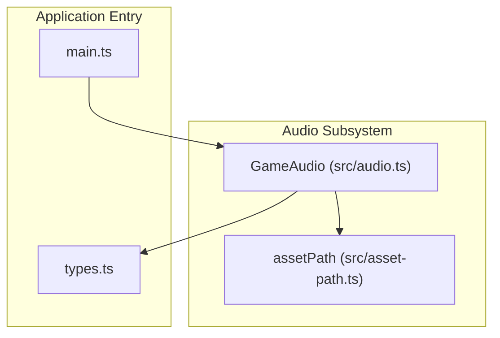
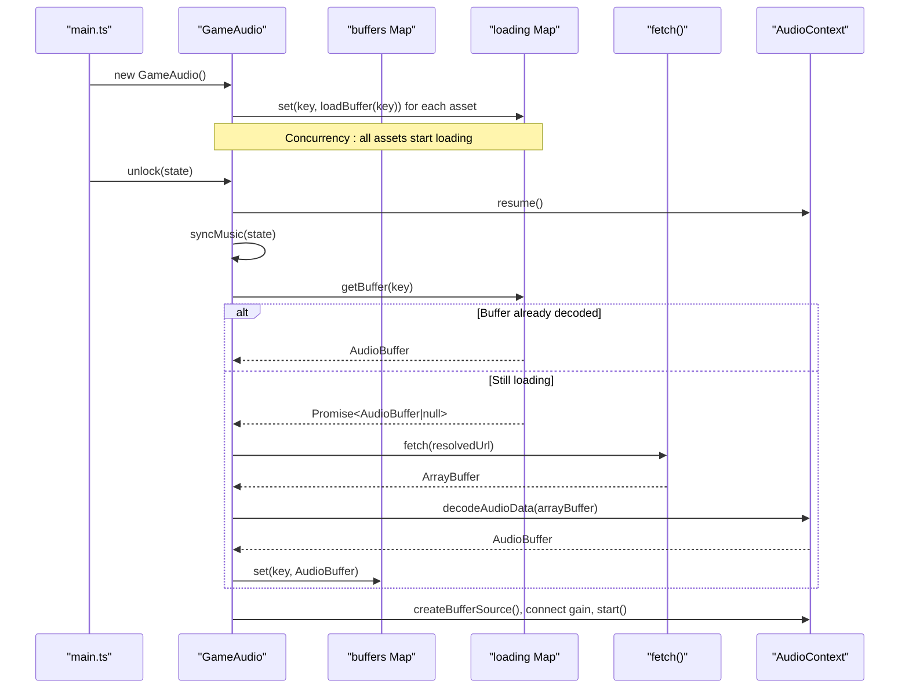
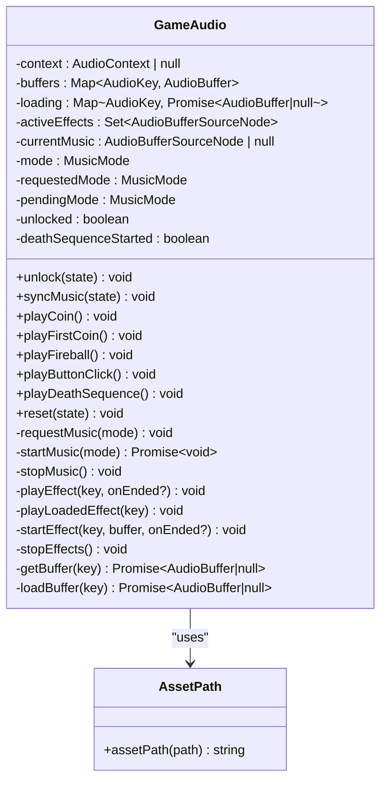
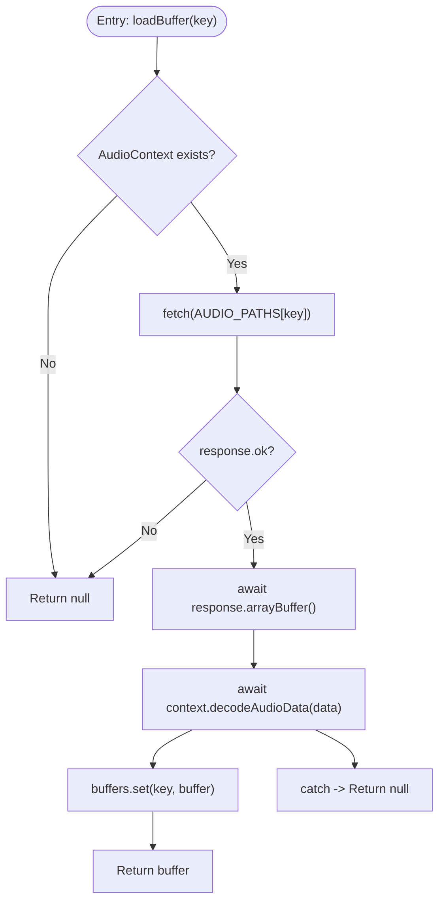
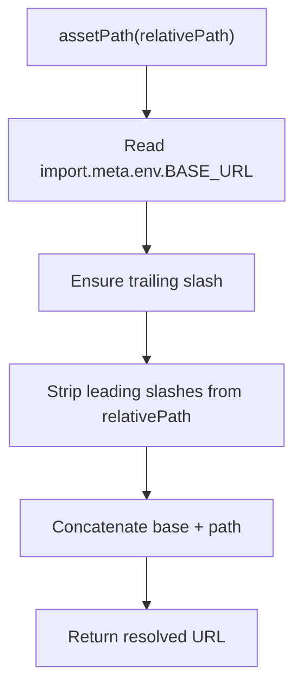
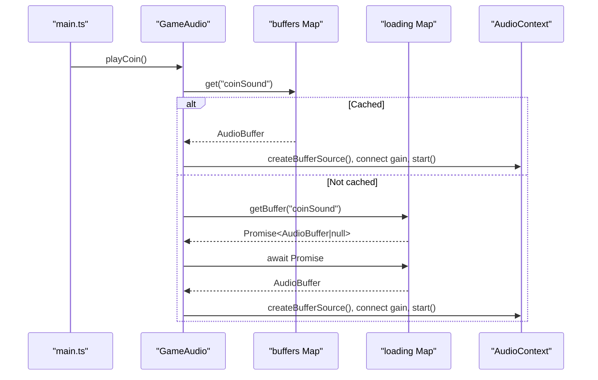
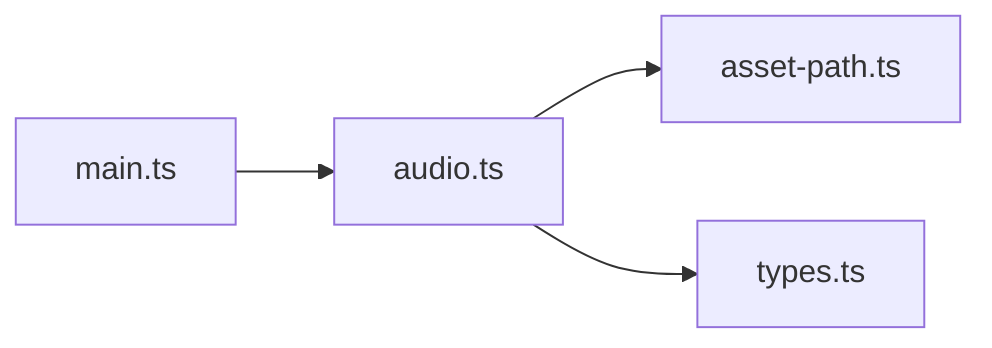

# Asset Loading System

<cite>
**Referenced Files in This Document**
- [audio.ts](file://src/audio.ts)
- [asset-path.ts](file://src/asset-path.ts)
- [main.ts](file://src/main.ts)
- [types.ts](file://src/types.ts)
</cite>

## Table of Contents
1. [Introduction](#introduction)
2. [Project Structure](#project-structure)
3. [Core Components](#core-components)
4. [Architecture Overview](#architecture-overview)
5. [Detailed Component Analysis](#detailed-component-analysis)
6. [Dependency Analysis](#dependency-analysis)
7. [Performance Considerations](#performance-considerations)
8. [Troubleshooting Guide](#troubleshooting-guide)
9. [Conclusion](#conclusion)

## Introduction
This document explains the asynchronous audio asset loading system used by the game. It focuses on the Promise-based architecture that concurrently fetches and decodes audio assets, caches decoded buffers for reuse, and integrates with the Web Audio API to play music and sound effects. It also covers error handling strategies for missing or corrupted files, asset path resolution integration, performance optimization techniques, and memory management considerations for loaded buffers and cleanup procedures.

## Project Structure
The audio subsystem is implemented primarily in two modules:
- The audio manager class that encapsulates loading, caching, playback, and lifecycle control.
- A small utility for resolving asset paths using the build-time base URL.

**Diagram sources**
- [audio.ts:1-57](file://src/audio.ts#L1-L57)
- [asset-path.ts:1-5](file://src/asset-path.ts#L1-L5)
- [main.ts:1-10](file://src/main.ts#L1-L10)
- [types.ts:1-10](file://src/types.ts#L1-L10)

**Section sources**
- [audio.ts:1-57](file://src/audio.ts#L1-L57)
- [asset-path.ts:1-5](file://src/asset-path.ts#L1-L5)
- [main.ts:1-10](file://src/main.ts#L1-L10)
- [types.ts:1-10](file://src/types.ts#L1-L10)

## Core Components
- GameAudio: Manages the Web Audio context, concurrent loading of all audio assets into a cache, playback of looping background music, and one-shot sound effects. It exposes methods to unlock audio, synchronize music based on game state, and play various effects.
- assetPath: Resolves absolute URLs for assets by combining the build-time base URL with relative paths.

Key responsibilities:
- Concurrent initialization: All audio assets are queued for loading immediately after construction if an AudioContext is available.
- Caching: Decoded AudioBuffer instances are stored in a Map keyed by asset identifiers.
- Playback: Background music loops; sound effects are short-lived nodes managed in a Set.
- State synchronization: Music mode changes based on game status and score.

**Section sources**
- [audio.ts:37-57](file://src/audio.ts#L37-L57)
- [asset-path.ts:1-5](file://src/asset-path.ts#L1-L5)

## Architecture Overview
The system uses a Promise-based pipeline per asset:
- Each asset has a unique key mapped to a resolved URL via assetPath.
- On construction, each asset’s loadBuffer method is invoked concurrently and its Promise is cached in a loading map.
- When playback is requested, getBuffer returns either the already-decoded buffer or the existing loading Promise, ensuring only one network request per asset.
- After decoding, the buffer is stored in the buffers cache for subsequent instant access.

**Diagram sources**
- [audio.ts:49-57](file://src/audio.ts#L49-L57)
- [audio.ts:248-276](file://src/audio.ts#L248-L276)
- [audio.ts:143-176](file://src/audio.ts#L143-L176)
- [asset-path.ts:1-5](file://src/asset-path.ts#L1-L5)

## Detailed Component Analysis

### GameAudio Class
Responsibilities:
- Initialize AudioContext and start concurrent loading of all assets.
- Provide public APIs to unlock audio, play effects, and manage background music modes.
- Maintain caches for decoded buffers and active effect nodes.
- Handle transitions between music modes and ensure only one instance of background music plays at a time.

Important implementation details:
- Concurrency: In the constructor, every asset is enqueued for loading by invoking loadBuffer and storing the resulting Promise in the loading map. This ensures parallel downloads and decoding without redundant requests.
- Caching: Decoded buffers are stored in a Map keyed by asset identifier. getBuffer checks the cache first and falls back to the in-flight loading Promise if present.
- Playback:
  - Background music uses a single looping source connected through a gain node. Mode transitions stop the current source before starting a new one.
  - Sound effects create short-lived sources, track them in a Set, and remove them upon completion.
- Error handling: Network failures, non-OK responses, and decoding errors result in null promises. Play attempts gracefully handle missing buffers.

**Diagram sources**
- [audio.ts:37-276](file://src/audio.ts#L37-L276)
- [asset-path.ts:1-5](file://src/asset-path.ts#L1-L5)

**Section sources**
- [audio.ts:37-276](file://src/audio.ts#L37-L276)

### loadBuffer Method: Fetch, ArrayBuffer Processing, and Decoding
Behavior:
- If no AudioContext is available, returns null immediately.
- Performs a fetch for the resolved asset URL.
- Checks response.ok; if false, returns null.
- Reads the response body as an ArrayBuffer.
- Decodes the ArrayBuffer into an AudioBuffer using the AudioContext.
- Stores the decoded buffer in the buffers cache and returns it.
- Any exception during this process results in returning null.

**Diagram sources**
- [audio.ts:258-276](file://src/audio.ts#L258-L276)

**Section sources**
- [audio.ts:258-276](file://src/audio.ts#L258-L276)

### Asset Path Resolution Integration
The assetPath function normalizes the base URL and concatenates it with the provided relative path. This ensures correct resolution regardless of deployment base path configuration.

Usage patterns:
- Static mapping of audio keys to resolved URLs is created at module load time.
- The same pattern can be used for other static assets like images.

**Diagram sources**
- [asset-path.ts:1-5](file://src/asset-path.ts#L1-L5)

**Section sources**
- [asset-path.ts:1-5](file://src/asset-path.ts#L1-L5)

### Playback Flow: Effects and Music
- Effects:
  - If a buffer is already cached, a new source is created immediately.
  - Otherwise, the system waits for the in-flight loadPromise and plays once ready.
  - Active sources are tracked in a Set and removed when they finish playing.
- Music:
  - Modes are requested and synchronized based on game state.
  - Only one music source is active at any time; transitions stop the current source before starting a new one.
  - Volume levels are applied via a gain node.

**Diagram sources**
- [audio.ts:78-108](file://src/audio.ts#L78-L108)
- [audio.ts:191-234](file://src/audio.ts#L191-L234)
- [audio.ts:248-256](file://src/audio.ts#L248-L256)

**Section sources**
- [audio.ts:78-108](file://src/audio.ts#L78-L108)
- [audio.ts:191-234](file://src/audio.ts#L191-L234)
- [audio.ts:248-256](file://src/audio.ts#L248-L256)

### Error Handling Strategies
- Missing or unreachable assets:
  - fetch returns a non-OK response; loadBuffer returns null.
  - Playback code checks for null buffers and avoids creating sources.
- Corrupted or unsupported formats:
  - decodeAudioData may throw; the catch block returns null.
- Graceful degradation:
  - Effects and music continue to operate even if some assets fail to load.
  - No unhandled rejections bubble up; failed loads resolve to null.

**Section sources**
- [audio.ts:258-276](file://src/audio.ts#L258-L276)
- [audio.ts:191-208](file://src/audio.ts#L191-L208)

### Memory Management and Cleanup
- Buffers:
  - Decoded AudioBuffer objects are retained in a Map indefinitely while the GameAudio instance exists.
  - There is no explicit eviction policy; consider implementing size limits or LRU eviction if memory usage becomes a concern.
- Active effects:
  - Short-lived AudioBufferSourceNode instances are tracked in a Set and removed automatically when they emit an ended event.
  - stopEffects iterates and stops all active sources, then clears the Set.
- Music source:
  - stopMusic stops the currently playing looped source and resets internal state.
- Context lifecycle:
  - The AudioContext is created once and resumed on user interaction. There is no explicit close or teardown in the current code.

Recommendations:
- Add a dispose method to clear caches and stop all sources if the application needs to unload audio resources.
- Implement optional buffer cache pruning for large libraries.

**Section sources**
- [audio.ts:236-246](file://src/audio.ts#L236-L246)
- [audio.ts:178-189](file://src/audio.ts#L178-L189)
- [audio.ts:37-47](file://src/audio.ts#L37-L47)

## Dependency Analysis
The audio subsystem depends on:
- assetPath for URL resolution.
- types for GameState shape used by unlock and syncMusic.
- main.ts for orchestration: constructing GameAudio, unlocking on user interactions, and triggering playback events.

**Diagram sources**
- [main.ts:1-10](file://src/main.ts#L1-L10)
- [audio.ts:1-10](file://src/audio.ts#L1-L10)
- [asset-path.ts:1-5](file://src/asset-path.ts#L1-L5)
- [types.ts:1-10](file://src/types.ts#L1-L10)

**Section sources**
- [main.ts:1-10](file://src/main.ts#L1-L10)
- [audio.ts:1-10](file://src/audio.ts#L1-L10)
- [asset-path.ts:1-5](file://src/asset-path.ts#L1-L5)
- [types.ts:1-10](file://src/types.ts#L1-L10)

## Performance Considerations
- Concurrency:
  - All assets are queued for loading at startup, maximizing throughput and minimizing total load time.
- Deduplication:
  - The loading map prevents duplicate fetches for the same asset while a request is in flight.
- Immediate playback:
  - Effects check the cache first and fall back to the in-flight promise, avoiding redundant work.
- Looping music:
  - A single looping source reduces overhead compared to restarting tracks.
- Gain nodes:
  - Using a gain node per source allows efficient volume control without re-decoding.

Optimization opportunities:
- Preload strategy:
  - Keep preloading but add a priority queue for critical assets (e.g., coin and death sounds).
- Cache sizing:
  - Introduce a maximum cache size and evict least-recently-used buffers if needed.
- Format selection:
  - Serve multiple formats (e.g., mp3 and ogg) and choose the best supported format to reduce decoding errors and improve compatibility.
- Streaming:
  - For very long tracks, consider streaming via MediaElementSource or MediaStreamSource instead of full decode to reduce initial latency.

[No sources needed since this section provides general guidance]

## Troubleshooting Guide
Common issues and resolutions:
- No sound on first interaction:
  - Ensure unlock is called on user gestures (click, pointerdown, keypress). The code resumes the AudioContext and synchronizes music on unlock.
- Silent effects:
  - Verify that the corresponding asset exists and responds with OK. Failed loads return null and do not play.
- Unexpected silence during mode transitions:
  - Confirm that requestedMode and pendingMode logic does not cancel the intended transition due to rapid state changes.
- High memory usage:
  - Review the number and size of loaded buffers. Consider implementing cache eviction or disposing unused assets.

Relevant code areas:
- Unlock and resume behavior.
- Effect playback fallback to in-flight loading.
- Music mode transitions and stopping current sources.

**Section sources**
- [audio.ts:59-76](file://src/audio.ts#L59-L76)
- [audio.ts:191-208](file://src/audio.ts#L191-L208)
- [audio.ts:143-176](file://src/audio.ts#L143-L176)

## Conclusion
The audio asset loading system employs a robust, Promise-based design that concurrently fetches and decodes assets, caches results, and supports both looping music and one-shot effects. It integrates cleanly with the application entry point and handles missing or corrupted assets gracefully. While effective for typical game sizes, additional optimizations such as cache eviction, prioritized preloading, and format negotiation can further enhance performance and reliability.