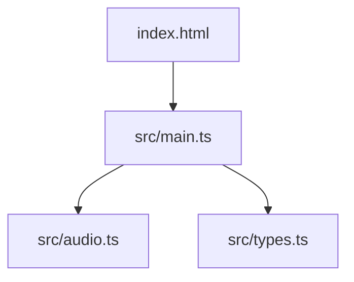
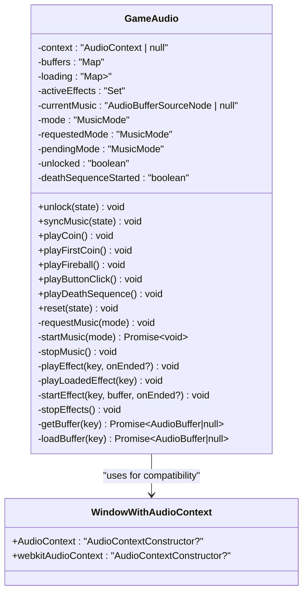
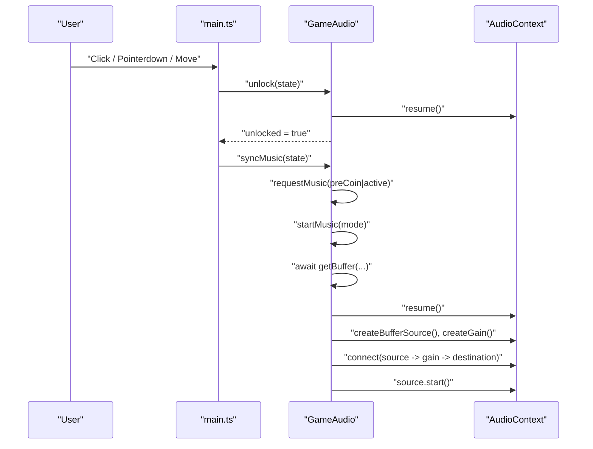
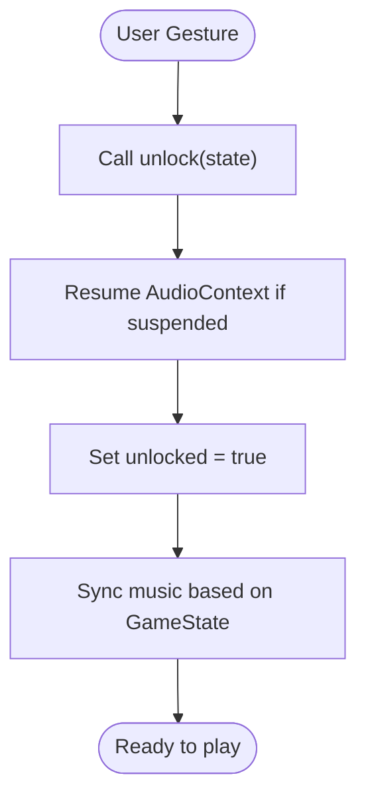
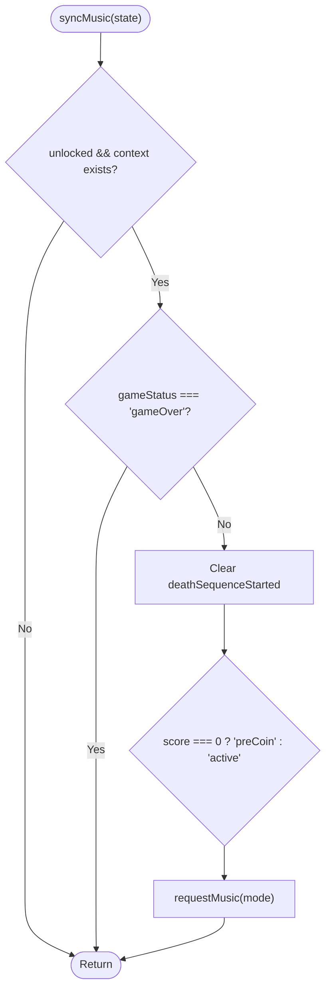
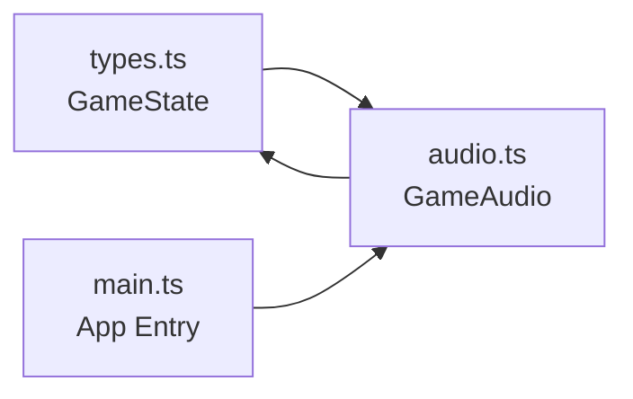

# Audio Context Management

<cite>
**Referenced Files in This Document**
- [audio.ts](file://src/audio.ts)
- [main.ts](file://src/main.ts)
- [types.ts](file://src/types.ts)
- [index.html](file://index.html)
</cite>

## Table of Contents
1. [Introduction](#introduction)
2. [Project Structure](#project-structure)
3. [Core Components](#core-components)
4. [Architecture Overview](#architecture-overview)
5. [Detailed Component Analysis](#detailed-component-analysis)
6. [Dependency Analysis](#dependency-analysis)
7. [Performance Considerations](#performance-considerations)
8. [Troubleshooting Guide](#troubleshooting-guide)
9. [Conclusion](#conclusion)

## Introduction
This document explains the Web Audio API context management system used by the game, focusing on:
- Browser compatibility for AudioContext and webkitAudioContext constructors
- The audio context lifecycle (creation, suspension, resumption)
- Autoplay policy compliance and user interaction requirements to unlock audio
- Proper initialization patterns, error handling for unsupported browsers, and memory management
- Synchronization between audio context state and game state

The implementation is designed to be resilient across modern browsers while adhering to autoplay restrictions that require a user gesture before any sound can play.

## Project Structure
The audio subsystem is implemented in a dedicated module and integrated into the application entry point. The HTML shell provides the interactive elements that trigger unlocking.

**Diagram sources**
- [index.html:19-19](file://index.html#L19-L19)
- [main.ts:1-10](file://src/main.ts#L1-L10)
- [audio.ts:1-10](file://src/audio.ts#L1-L10)
- [types.ts:1-10](file://src/types.ts#L1-L10)

**Section sources**
- [index.html:10-21](file://index.html#L10-L21)
- [main.ts:1-44](file://src/main.ts#L1-L44)
- [audio.ts:1-57](file://src/audio.ts#L1-L57)
- [types.ts:1-10](file://src/types.ts#L1-L10)

## Core Components
- GameAudio class encapsulates all audio behavior: context creation, buffer loading, music modes, effect playback, and cleanup.
- createAudioContext function handles browser compatibility by selecting the appropriate constructor.
- Integration points in main.ts call unlock and syncMusic at user interactions and game updates.

Key responsibilities:
- Create an AudioContext safely with fallbacks
- Preload audio buffers asynchronously
- Enforce autoplay policy via unlock()
- Manage looping background music transitions
- Play short effects with proper resource cleanup
- Keep audio state synchronized with GameState

**Section sources**
- [audio.ts:30-57](file://src/audio.ts#L30-L57)
- [audio.ts:59-76](file://src/audio.ts#L59-L76)
- [audio.ts:134-176](file://src/audio.ts#L134-L176)
- [audio.ts:191-246](file://src/audio.ts#L191-L246)
- [audio.ts:279-283](file://src/audio.ts#L279-L283)
- [main.ts:39-105](file://src/main.ts#L39-L105)

## Architecture Overview
The audio architecture separates concerns:
- Compatibility layer: createAudioContext selects the correct constructor
- Lifecycle manager: GameAudio orchestrates unlocking, buffering, and playback
- State synchronization: syncMusic aligns music mode with game status and score
- Resource management: activeEffects set ensures nodes are cleaned up after use

**Diagram sources**
- [audio.ts:30-57](file://src/audio.ts#L30-L57)
- [audio.ts:59-76](file://src/audio.ts#L59-L76)
- [audio.ts:134-176](file://src/audio.ts#L134-L176)
- [audio.ts:191-246](file://src/audio.ts#L191-L246)
- [audio.ts:279-283](file://src/audio.ts#L279-L283)

## Detailed Component Analysis

### Browser Compatibility Handling
- The compatibility layer checks for the standard AudioContext constructor first, then falls back to webkitAudioContext for older or vendor-prefixed environments.
- If neither is available, the context remains null, and audio features gracefully degrade.

Implementation highlights:
- Type augmentation for window to include optional AudioContext and webkitAudioContext constructors
- Safe instantiation using nullish coalescing and optional chaining

**Section sources**
- [audio.ts:30-35](file://src/audio.ts#L30-L35)
- [audio.ts:279-283](file://src/audio.ts#L279-L283)

### Audio Context Lifecycle
- Creation: The GameAudio constructor attempts to create an AudioContext and preloads all audio buffers asynchronously.
- Suspension/Resumption: Modern browsers may suspend the context until a user gesture occurs. The unlock method sets an internal unlocked flag and resumes the context if needed.
- Music start flow: When starting music, the code awaits buffer availability, resumes the context again if necessary, and only then creates and connects nodes.

Lifecycle sequence:

**Diagram sources**
- [main.ts:97-105](file://src/main.ts#L97-L105)
- [audio.ts:59-76](file://src/audio.ts#L59-L76)
- [audio.ts:134-176](file://src/audio.ts#L134-L176)

**Section sources**
- [audio.ts:49-57](file://src/audio.ts#L49-L57)
- [audio.ts:59-76](file://src/audio.ts#L59-L76)
- [audio.ts:143-176](file://src/audio.ts#L143-L176)

### Autoplay Policy Compliance and Unlock Flow
Modern browsers block automatic audio playback without a user gesture. The implementation enforces this by:
- Calling unlock on every user-initiated event (click, pointerdown, move, restart, toggle pause)
- Resuming the context inside unlock and during music start
- Guarding all playback methods behind an unlocked flag

Unlock triggers in the app:
- Restart button click
- Pause button click
- Canvas pointerdown and click
- Player movement dispatch

**Diagram sources**
- [main.ts:97-105](file://src/main.ts#L97-L105)
- [audio.ts:59-76](file://src/audio.ts#L59-L76)

**Section sources**
- [main.ts:97-105](file://src/main.ts#L97-L105)
- [audio.ts:59-76](file://src/audio.ts#L59-L76)

### Audio Context State and Game State Synchronization
The audio system mirrors key aspects of the game state:
- Music mode selection depends on gameStatus and score
- Death sequence interrupts music and plays a one-shot effect, then transitions to game over music
- Reset clears pending states and re-syncs music according to current state

Synchronization logic:
- syncMusic prevents changes when gameStatus is gameOver
- requestMusic avoids redundant transitions by comparing requested/pending/current modes
- reset clears death sequence flags and stops both music and effects

**Diagram sources**
- [audio.ts:65-76](file://src/audio.ts#L65-L76)
- [audio.ts:134-141](file://src/audio.ts#L134-L141)

**Section sources**
- [audio.ts:65-76](file://src/audio.ts#L65-L76)
- [audio.ts:125-132](file://src/audio.ts#L125-L132)
- [audio.ts:134-141](file://src/audio.ts#L134-L141)

### Error Handling for Unsupported Browsers
- If no AudioContext constructor is available, context remains null.
- All playback paths guard against null context and do not throw; they simply return early.
- Buffer loading uses try/catch around fetch and decode operations, returning null on failure.

Practical implications:
- UI continues to work even if audio is unavailable
- No unhandled promise rejections from failed loads
- Graceful degradation preserves gameplay experience

**Section sources**
- [audio.ts:279-283](file://src/audio.ts#L279-L283)
- [audio.ts:258-276](file://src/audio.ts#L258-L276)
- [audio.ts:191-208](file://src/audio.ts#L191-L208)

### Memory Management Considerations
- Active effects are tracked in a Set and removed upon their ended event, preventing leaks.
- stopEffects iterates active sources and calls stop with try/catch to handle already-stopped nodes.
- stopMusic stops the currently playing looped source and resets references.
- Buffers are cached in a Map keyed by asset name, avoiding repeated network requests and decoding.

Best practices demonstrated:
- Always disconnect and stop nodes when done
- Use ended listeners to clean up transient nodes
- Avoid creating new nodes without stopping previous ones

**Section sources**
- [audio.ts:218-246](file://src/audio.ts#L218-L246)
- [audio.ts:178-189](file://src/audio.ts#L178-L189)
- [audio.ts:248-276](file://src/audio.ts#L248-L276)

## Dependency Analysis
The audio module depends on:
- Asset path resolution utility (imported but not analyzed here)
- GameState type for synchronization
- The application entry point for integration and unlock triggers

**Diagram sources**
- [audio.ts:1-2](file://src/audio.ts#L1-L2)
- [main.ts:1-10](file://src/main.ts#L1-L10)
- [types.ts:28-43](file://src/types.ts#L28-L43)

**Section sources**
- [audio.ts:1-2](file://src/audio.ts#L1-L2)
- [main.ts:1-10](file://src/main.ts#L1-L10)
- [types.ts:28-43](file://src/types.ts#L28-L43)

## Performance Considerations
- Asynchronous buffer loading: All assets are fetched and decoded concurrently at startup, reducing latency on first playback.
- Mode deduplication: requestMusic avoids unnecessary transitions by checking requested/pending/current modes.
- Efficient node creation: Only create Gain and BufferSource nodes when needed, and reuse cached buffers.
- Minimal overhead in hot paths: unlock and syncMusic are lightweight and called frequently without heavy allocations.

[No sources needed since this section provides general guidance]

## Troubleshooting Guide
Common issues and resolutions:
- No sound on load: Ensure a user gesture has occurred to trigger unlock. The app calls unlock on click, pointerdown, move, restart, and pause toggles.
- Music does not change: Verify syncMusic is called after state changes and that gameStatus is not "gameOver".
- Stuttering or clicks: Confirm stopMusic and stopEffects are invoked during transitions and resets.
- Missing sounds in some browsers: Check that AudioContext or webkitAudioContext is available; otherwise, audio will be disabled gracefully.

Operational tips:
- Always call unlock before attempting to play audio
- Prefer playLoadedEffect for effects already buffered
- Use reset to clear pending modes and stop all playback during game restarts

**Section sources**
- [main.ts:97-105](file://src/main.ts#L97-L105)
- [audio.ts:59-76](file://src/audio.ts#L59-L76)
- [audio.ts:125-132](file://src/audio.ts#L125-L132)

## Conclusion
The audio context management system is robust, compatible, and aligned with modern browser autoplay policies. It leverages a compatibility layer for constructor selection, enforces user-gesture-based unlocking, synchronizes music with game state, and manages resources carefully to avoid leaks. The design ensures graceful degradation when audio is unavailable and maintains a responsive, consistent user experience across platforms.