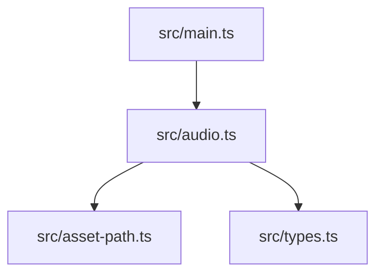
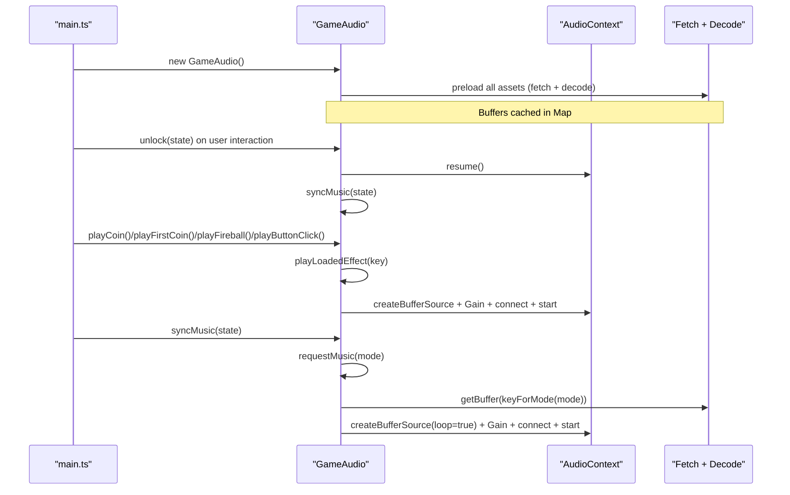
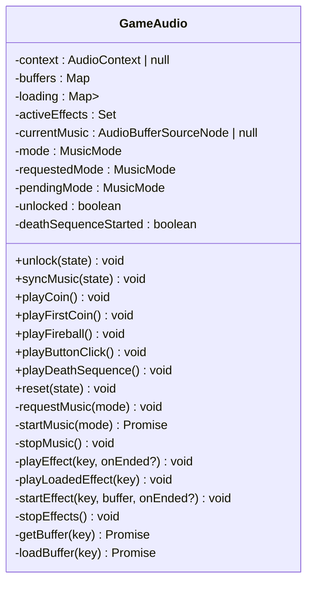
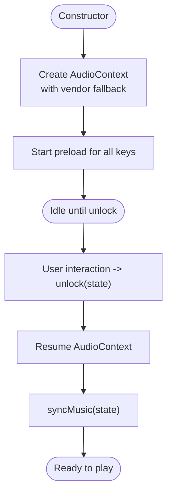
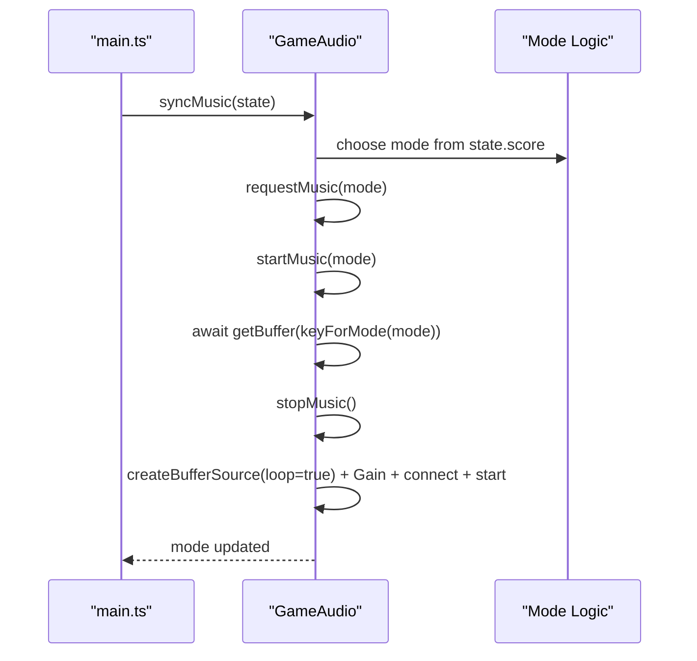
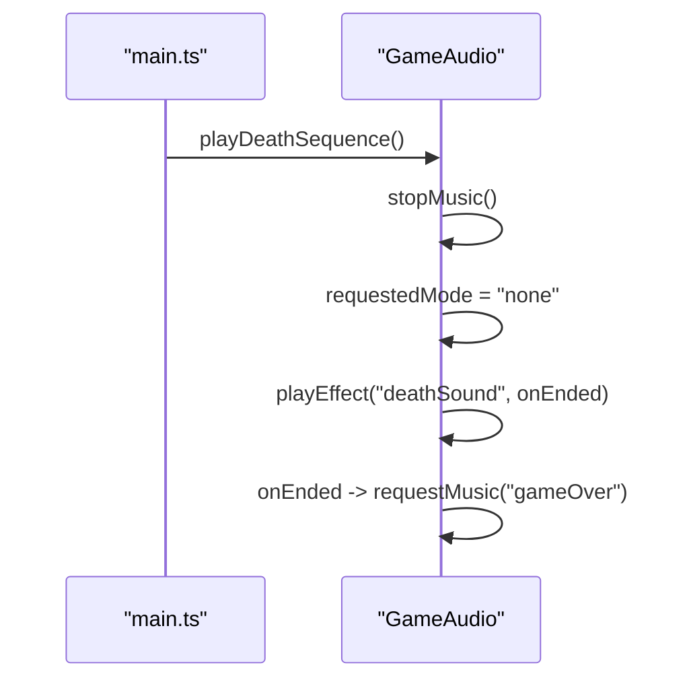
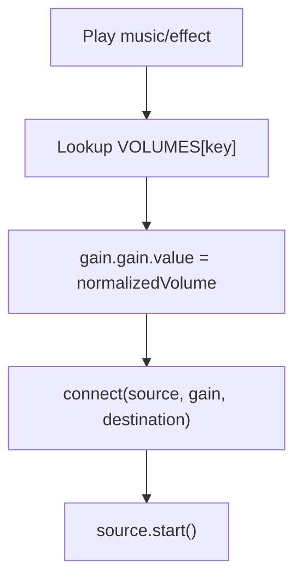
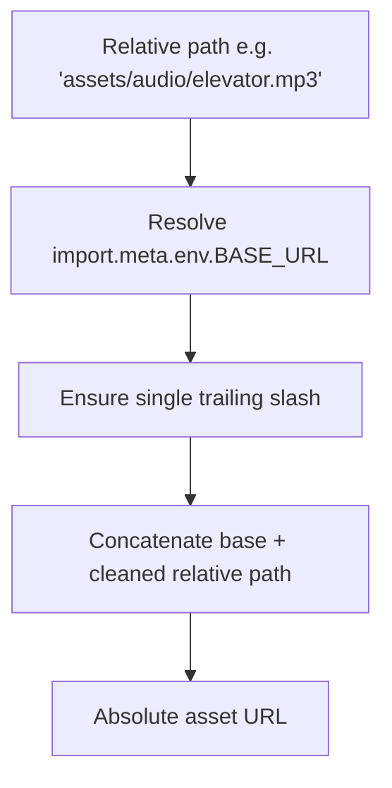
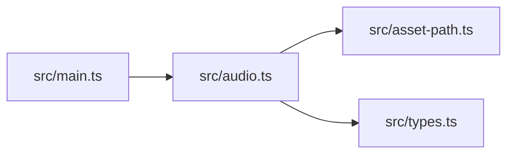

# Audio System

<cite>
**Referenced Files in This Document**
- [audio.ts](file://src/audio.ts)
- [asset-path.ts](file://src/asset-path.ts)
- [main.ts](file://src/main.ts)
- [types.ts](file://src/types.ts)
</cite>

## Table of Contents
1. [Introduction](#introduction)
2. [Project Structure](#project-structure)
3. [Core Components](#core-components)
4. [Architecture Overview](#architecture-overview)
5. [Detailed Component Analysis](#detailed-component-analysis)
6. [Dependency Analysis](#dependency-analysis)
7. [Performance Considerations](#performance-considerations)
8. [Troubleshooting Guide](#troubleshooting-guide)
9. [Conclusion](#conclusion)

## Introduction
This document explains the Web Audio API integration used by the game, focusing on:
- Asynchronous audio buffer loading and caching
- Browser autoplay policy compliance and user interaction unlock flow
- State-aware music switching across game states
- Sound effect queuing and volume normalization
- Asset path resolution for flexible deployment
- Error handling for missing or failed assets
- Performance considerations for real-time audio processing and memory management

The system is implemented as a single class that encapsulates the AudioContext lifecycle, asset loading, and playback orchestration. It integrates with the main game loop to respond to state changes and user interactions.

## Project Structure
The audio subsystem spans three primary files:
- src/audio.ts: Core GameAudio class, context creation, buffering, playback, and state-driven music switching
- src/asset-path.ts: Base URL–aware asset path resolver
- src/main.ts: Entry point that initializes audio, handles user interactions, and drives the game loop
- src/types.ts: Shared types including GameState used by audio for mode selection



**Diagram sources**
- [main.ts:1-160](file://src/main.ts#L1-L160)
- [audio.ts:1-296](file://src/audio.ts#L1-L296)
- [asset-path.ts:1-5](file://src/asset-path.ts#L1-L5)
- [types.ts:1-54](file://src/types.ts#L1-L54)

**Section sources**
- [audio.ts:1-296](file://src/audio.ts#L1-L296)
- [asset-path.ts:1-5](file://src/asset-path.ts#L1-L5)
- [main.ts:1-160](file://src/main.ts#L1-L160)
- [types.ts:1-54](file://src/types.ts#L1-L54)

## Core Components
- GameAudio (src/audio.ts): Encapsulates the entire audio pipeline:
  - Creates and manages an AudioContext instance
  - Preloads all audio buffers asynchronously at construction time
  - Provides methods to play sound effects and switch background music based on game state
  - Normalizes volumes per asset via a central configuration map
  - Tracks active effect nodes to stop them when needed
  - Implements a state machine for music modes with safe transitions
- assetPath (src/asset-path.ts): Resolves asset URLs relative to the application’s base URL, ensuring correct paths under different deployment roots (e.g., GitHub Pages subpath).

Key responsibilities:
- Autoplay unlock: resume context on first user interaction
- Music switching: preCoin, active, gameOver modes mapped to specific tracks
- Effect playback: immediate start if buffered; otherwise wait for load
- Volume normalization: per-asset gain values applied uniformly

**Section sources**
- [audio.ts:37-277](file://src/audio.ts#L37-L277)
- [asset-path.ts:1-5](file://src/asset-path.ts#L1-L5)

## Architecture Overview
High-level flow:
- On initialization, GameAudio creates an AudioContext and starts asynchronous loading of all audio assets using fetch and decodeAudioData.
- User interactions trigger unlock, which resumes the context and synchronizes music to current game state.
- The main loop updates game state and calls into GameAudio to play effects and sync music.
- Music switching uses a request/pending/state triple to avoid race conditions and redundant restarts.



**Diagram sources**
- [main.ts:40-105](file://src/main.ts#L40-L105)
- [audio.ts:49-176](file://src/audio.ts#L49-L176)
- [audio.ts:248-276](file://src/audio.ts#L248-L276)

## Detailed Component Analysis

### GameAudio Class
Responsibilities:
- Context lifecycle: creation, unlocking, resuming
- Asset loading: concurrent async fetch and decode, caching
- Playback: looping background music and one-shot sound effects
- State-aware music: maps score-based logic to music modes
- Cleanup: stopping music and effects safely

Key design patterns:
- Promise-based concurrency: each asset has a loading promise reused across callers
- Guarded playback: unlocked flag prevents playback before user interaction
- Mode transition safety: requestedMode vs pendingMode vs current mode avoids overlapping starts
- Centralized volume control: VOLUMES map normalizes levels across assets



**Diagram sources**
- [audio.ts:37-277](file://src/audio.ts#L37-L277)

#### Audio Context Lifecycle and Unlock Flow
- Creation: constructor attempts to instantiate AudioContext with vendor-prefixed fallback.
- Unlock: on user gesture, resume context and sync music to current state.
- Resume: ensure context is running before starting any source.



**Diagram sources**
- [audio.ts:49-63](file://src/audio.ts#L49-L63)
- [audio.ts:65-76](file://src/audio.ts#L65-L76)

#### State-Aware Music Switching
- Modes: preCoin, active, gameOver, none
- Mapping: preCoin when score is zero; active when score > 0; gameOver during death sequence
- Transition safety: requestMusic sets requestedMode; startMusic checks against requestedMode and pendingMode to prevent races
- Looping: background music sources are looped



**Diagram sources**
- [audio.ts:65-76](file://src/audio.ts#L65-L76)
- [audio.ts:134-176](file://src/audio.ts#L134-L176)

#### Sound Effects Queuing and Playback
- Immediate playback if buffer is already loaded; otherwise, play after load completes
- Each effect creates a new BufferSource and Gain node, connected to destination
- Active effects tracked in a Set to allow centralized stopping
- Optional callback on ended event supports sequenced playback (used for death sequence)

```mermaid
flowchart TD
Enter([playEffect(key, onEnded?)]) --> CheckUnlocked{"unlocked?"}
CheckUnlocked --> |No| Exit([Return])
CheckUnlocked --> |Yes| HasBuf{"buffer cached?"}
HasBuf --> |Yes| StartNow["createBufferSource + Gain + connect + start"]
HasBuf --> |No| WaitLoad["await getBuffer(key)"]
WaitLoad --> Loaded{"buffer && unlocked?"}
Loaded --> |Yes| StartNow
Loaded --> |No| Exit
StartNow --> Track["add to activeEffects"]
Track --> OnEnd["on 'ended' -> remove from set + call onEnded?"]
OnEnd --> Exit
```

**Diagram sources**
- [audio.ts:191-234](file://src/audio.ts#L191-L234)

#### Death Sequence Integration
- Stops current music and clears pending requests
- Plays death sound once; on completion, switches to gameOver music
- Prevents re-entry via a guard flag



**Diagram sources**
- [audio.ts:110-123](file://src/audio.ts#L110-L123)
- [audio.ts:134-176](file://src/audio.ts#L134-L176)

#### Volume Normalization
- A central VOLUMES map assigns normalized gain values per asset key
- Both music and effects apply their respective gain before connecting to destination
- Ensures consistent perceived loudness across assets



**Diagram sources**
- [audio.ts:19-28](file://src/audio.ts#L19-L28)
- [audio.ts:165-171](file://src/audio.ts#L165-L171)
- [audio.ts:223-228](file://src/audio.ts#L223-L228)

#### Asset Path Resolution
- assetPath builds absolute paths by combining BASE_URL with the provided relative path
- Handles trailing slash normalization and leading slash stripping
- Used to define AUDIO_PATHS so assets resolve correctly under different deployment roots



**Diagram sources**
- [asset-path.ts:1-5](file://src/asset-path.ts#L1-L5)

**Section sources**
- [audio.ts:37-277](file://src/audio.ts#L37-L277)
- [asset-path.ts:1-5](file://src/asset-path.ts#L1-L5)

## Dependency Analysis
- main.ts depends on GameAudio for audio operations and passes GameState to unlock/sync/reset
- GameAudio depends on asset-path for constructing asset URLs
- GameAudio depends on types.GameState for mode selection logic
- No circular dependencies observed between these modules



**Diagram sources**
- [main.ts:1-160](file://src/main.ts#L1-L160)
- [audio.ts:1-296](file://src/audio.ts#L1-L296)
- [asset-path.ts:1-5](file://src/asset-path.ts#L1-L5)
- [types.ts:1-54](file://src/types.ts#L1-L54)

**Section sources**
- [main.ts:1-160](file://src/main.ts#L1-L160)
- [audio.ts:1-296](file://src/audio.ts#L1-L296)
- [asset-path.ts:1-5](file://src/asset-path.ts#L1-L5)
- [types.ts:1-54](file://src/types.ts#L1-L54)

## Performance Considerations
- Asynchronous preloading: All assets are fetched and decoded concurrently at construction time, minimizing latency on first use.
- Buffer reuse: Decoded AudioBuffer instances are cached in a Map to avoid repeated decoding overhead.
- Source node lifecycle: Each effect creates a new BufferSource; completed sources are removed from the active set to free resources.
- Avoid redundant starts: requestMusic guards against duplicate starts by comparing requestedMode, pendingMode, and current mode.
- Minimal allocations: Background music uses a single looping source; effects are short-lived and cleaned up promptly.
- Memory management: Stopping and clearing active effects ensures no lingering references.

Recommendations:
- Keep asset sizes small and prefer compressed formats supported by browsers (e.g., MP3, Ogg, WebM where applicable).
- Monitor active effect count in complex scenes; consider pooling strategies only if profiling shows contention.
- Use requestAnimationFrame timing to avoid excessive audio scheduling outside the audio thread.

[No sources needed since this section provides general guidance]

## Troubleshooting Guide
Common issues and resolutions:
- No sound on first interaction: Ensure unlock is called on user gestures (click, pointerdown, keypress). The implementation resumes the context and syncs music upon unlock.
- Missing or broken audio files: Fetch failures return null; playback is skipped gracefully. Verify asset paths and server availability.
- Autoplay blocked: Modern browsers require user interaction before playing audio. The code resumes the context on unlock and defers playback until unlocked.
- Overlapping music transitions: The mode transition logic prevents race conditions by checking requestedMode and pendingMode before starting a new track.
- Effects not stopping: stopEffects iterates active sources and stops them safely, catching exceptions for already-stopped nodes.

Operational tips:
- Confirm BASE_URL resolves correctly for your deployment environment (e.g., GitHub Pages subpath).
- Validate that all referenced audio files exist and are accessible at runtime.
- If integrating additional assets, add entries to both AUDIO_PATHS and VOLUMES to maintain consistency.

**Section sources**
- [audio.ts:59-76](file://src/audio.ts#L59-L76)
- [audio.ts:248-276](file://src/audio.ts#L248-L276)
- [audio.ts:178-189](file://src/audio.ts#L178-L189)
- [audio.ts:236-246](file://src/audio.ts#L236-L246)
- [asset-path.ts:1-5](file://src/asset-path.ts#L1-L5)

## Conclusion
The audio system provides a robust, state-aware foundation for background music and sound effects in the game. It adheres to browser autoplay policies through explicit unlock flows, leverages asynchronous preloading for responsive playback, and applies normalized volumes for consistent user experience. The modular design separates concerns between context management, asset resolution, and game integration, making it straightforward to extend with new assets and behaviors while maintaining performance and reliability.