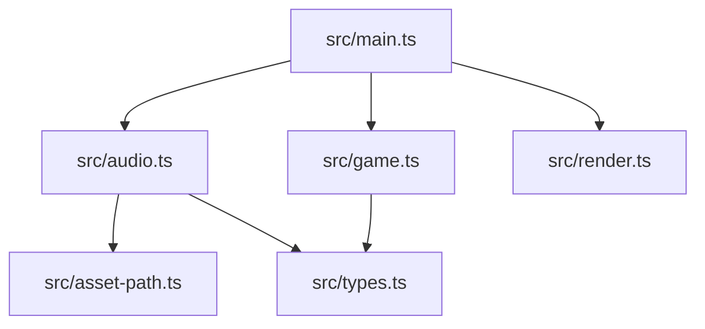
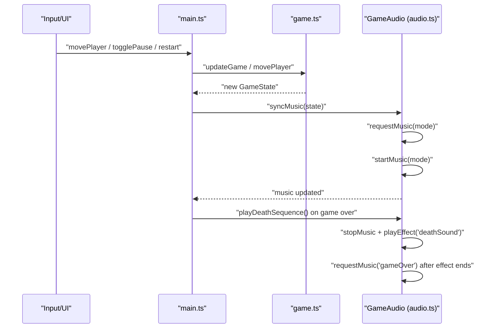
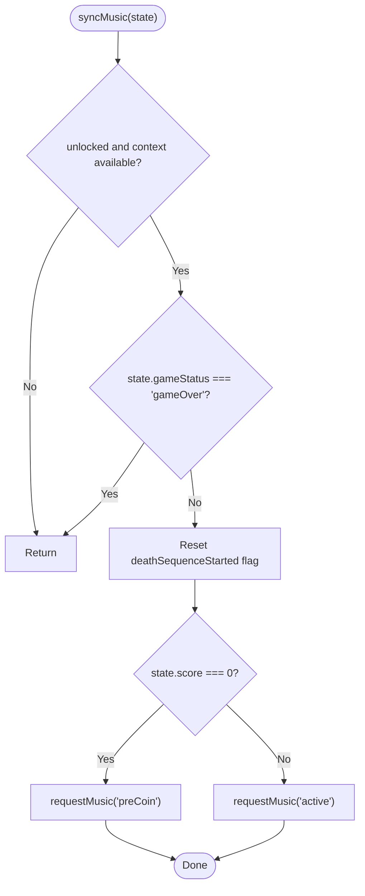
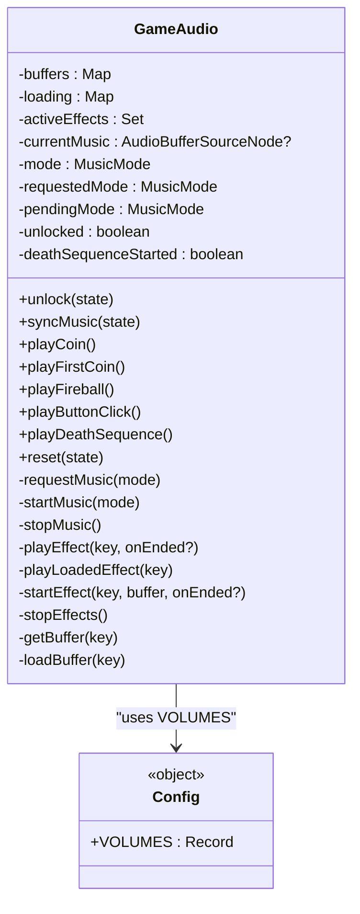
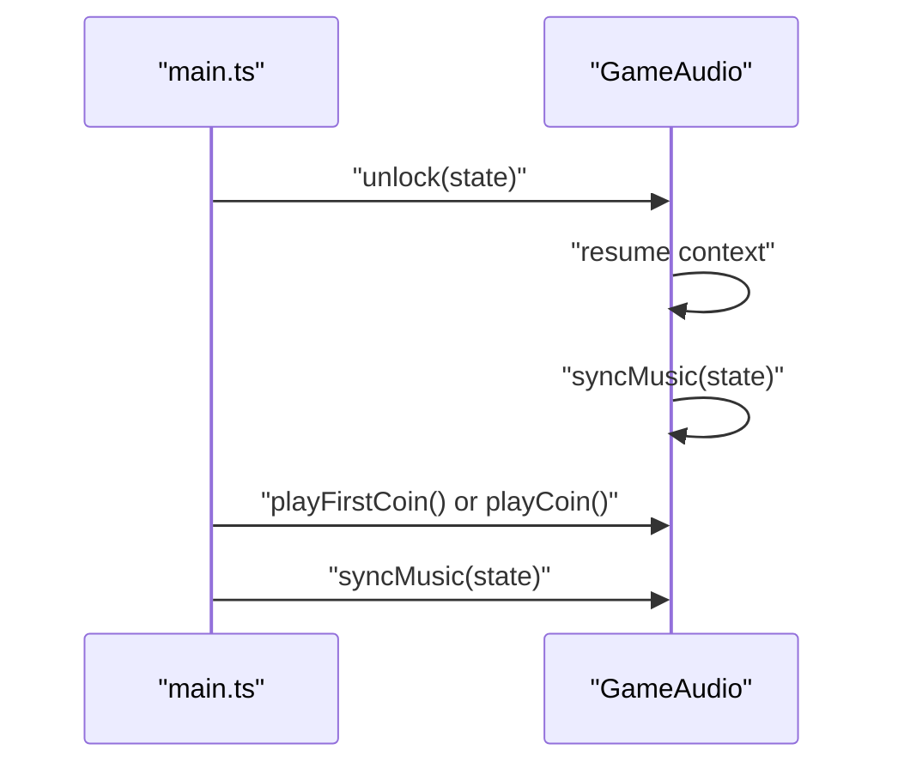
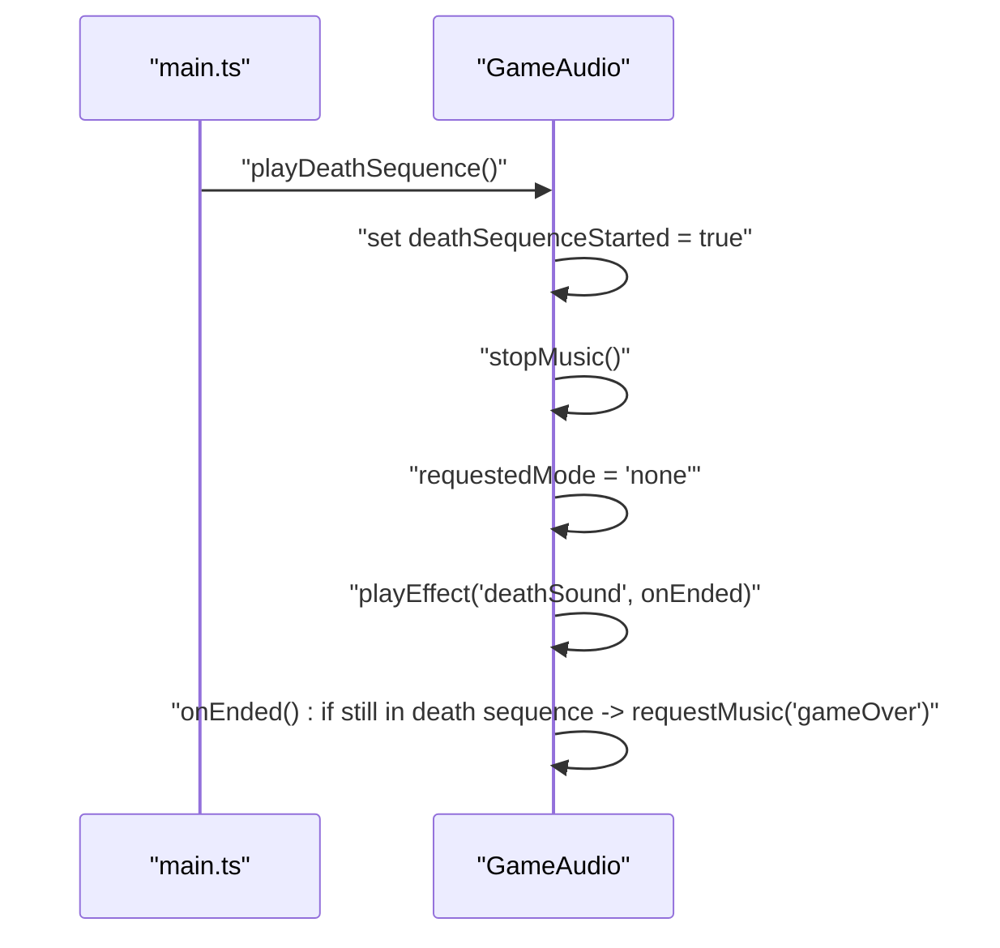
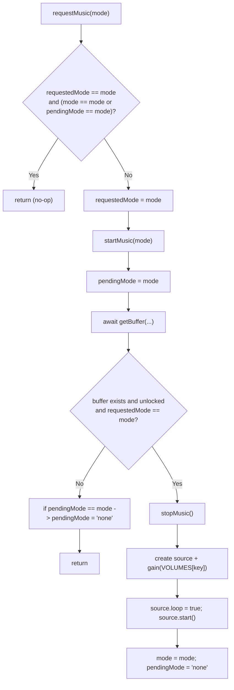
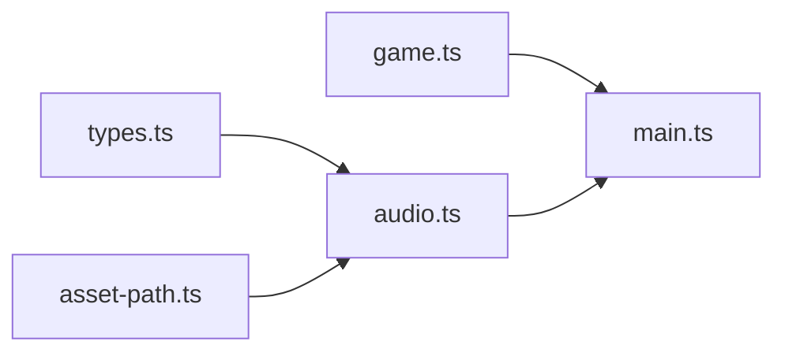

# Music State Management

<cite>
**Referenced Files in This Document**
- [audio.ts](file://src/audio.ts)
- [game.ts](file://src/game.ts)
- [main.ts](file://src/main.ts)
- [types.ts](file://src/types.ts)
- [asset-path.ts](file://src/asset-path.ts)
</cite>

## Table of Contents
1. [Introduction](#introduction)
2. [Project Structure](#project-structure)
3. [Core Components](#core-components)
4. [Architecture Overview](#architecture-overview)
5. [Detailed Component Analysis](#detailed-component-analysis)
6. [Dependency Analysis](#dependency-analysis)
7. [Performance Considerations](#performance-considerations)
8. [Troubleshooting Guide](#troubleshooting-guide)
9. [Conclusion](#conclusion)

## Introduction
This document explains the state-aware music switching system used by the game. It focuses on how the audio subsystem maps game states to music modes, manages transitions without conflicts, normalizes volumes across assets, and synchronizes music with gameplay events such as coin collection and death sequences. It also details the pending mode mechanism that prevents race conditions during rapid state changes.

## Project Structure
The music system is implemented primarily in the audio module and integrated into the main loop and input handlers. The relevant files are:
- Audio management and state machine: src/audio.ts
- Game logic and state transitions: src/game.ts
- Main loop and event dispatching: src/main.ts
- Shared types for game state: src/types.ts
- Asset path resolution helper: src/asset-path.ts



**Diagram sources**
- [main.ts:1-160](file://src/main.ts#L1-L160)
- [audio.ts:1-296](file://src/audio.ts#L1-L296)
- [game.ts:1-426](file://src/game.ts#L1-L426)
- [asset-path.ts:1-5](file://src/asset-path.ts#L1-L5)
- [types.ts:1-54](file://src/types.ts#L1-L54)

**Section sources**
- [main.ts:1-160](file://src/main.ts#L1-L160)
- [audio.ts:1-296](file://src/audio.ts#L1-L296)
- [game.ts:1-426](file://src/game.ts#L1-L426)
- [types.ts:1-54](file://src/types.ts#L1-L54)
- [asset-path.ts:1-5](file://src/asset-path.ts#L1-L5)

## Core Components
- GameAudio class encapsulates all audio behavior:
  - Tracks current music mode, requested mode, and pending mode to avoid conflicts.
  - Manages asynchronous loading and playback of music and sound effects.
  - Normalizes volume levels using a configuration object.
  - Synchronizes music with game state via syncMusic.
  - Handles death sequence interruption and transition to game over music.

Key responsibilities:
- Mode mapping: preCoin, active, gameOver, none
- Request/start lifecycle: requestMusic, startMusic
- Volume normalization: VOLUMES configuration
- Effect playback: coin, first coin, fireball, button click, death
- Race condition prevention: requestedMode and pendingMode fields

**Section sources**
- [audio.ts:37-277](file://src/audio.ts#L37-L277)

## Architecture Overview
The audio system integrates with the main loop and input handling to ensure music reflects the current game state. The flow is:
- Input or game tick updates GameState.
- main.ts calls audio.syncMusic(state) after state changes.
- GameAudio decides which music mode to play based on score and status.
- If needed, it requests a new mode and starts playback asynchronously.
- During death, the system interrupts current music, plays a death effect, then switches to game over music.



**Diagram sources**
- [main.ts:69-144](file://src/main.ts#L69-L144)
- [audio.ts:65-176](file://src/audio.ts#L65-L176)
- [game.ts:83-101](file://src/game.ts#L83-L101)

## Detailed Component Analysis

### MusicMode Enum and State Mapping
- MusicMode values:
  - preCoin: played while score is zero before the first coin is collected.
  - active: played once the player has scored at least one coin.
  - gameOver: played after the death sequence completes.
  - none: no music playing (e.g., during death effect).
- Mapping from game state:
  - syncMusic checks if the game is not in gameOver and sets mode to preCoin when score equals zero; otherwise active.
  - keyForMode maps each non-none mode to an audio asset key.



**Diagram sources**
- [audio.ts:65-76](file://src/audio.ts#L65-L76)
- [audio.ts:285-295](file://src/audio.ts#L285-L295)

**Section sources**
- [audio.ts:65-76](file://src/audio.ts#L65-L76)
- [audio.ts:285-295](file://src/audio.ts#L285-L295)
- [types.ts:28-43](file://src/types.ts#L28-L43)

### requestMusic and startMusic: Mode Transitions and Conflict Prevention
- requestMusic:
  - Guards against redundant requests when the same mode is already requested or pending.
  - Sets requestedMode and triggers startMusic.
- startMusic:
  - Asynchronously loads the buffer for the target mode.
  - Uses pendingMode to track in-flight transitions.
  - Validates that the request is still current before starting playback.
  - Stops any currently playing music, creates a looping source, applies normalized volume, and updates mode and pending flags.

```mermaid
sequenceDiagram
participant Caller as "Caller"
participant Audio as "GameAudio"
Caller->>Audio : "requestMusic(mode)"
Audio->>Audio : "guard duplicate request"
Audio->>Audio : "requestedMode = mode"
Audio->>Audio : "startMusic(mode)"
Audio->>Audio : "pendingMode = mode"
Audio->>Audio : "await getBuffer(keyForMode(mode))"
alt Buffer ready and request still valid
Audio->>Audio : "context.resume()"
Audio->>Audio : "stopMusic()"
Audio->>Audio : "createBufferSource + gain(VOLUMES[key])"
Audio->>Audio : "source.loop = true; source.start()"
Audio->>Audio : "mode = mode; pendingMode = 'none'"
else Invalidated or missing buffer
Audio->>Audio : "pendingMode = 'none' (if still pending)"
Audio-->>Caller : "no-op"
end
```

**Diagram sources**
- [audio.ts:134-176](file://src/audio.ts#L134-L176)
- [audio.ts:248-276](file://src/audio.ts#L248-L276)

**Section sources**
- [audio.ts:134-176](file://src/audio.ts#L134-L176)

### Volume Normalization System (VOLUMES)
- VOLUMES is a configuration object mapping each audio key to a normalized gain value.
- Applied consistently to both music and sound effects to maintain balanced audio levels.
- Music sources use VOLUMES[keyForMode(mode)] to set gain.
- Effects use VOLUMES[key] directly.



**Diagram sources**
- [audio.ts:19-28](file://src/audio.ts#L19-L28)
- [audio.ts:37-277](file://src/audio.ts#L37-L277)

**Section sources**
- [audio.ts:19-28](file://src/audio.ts#L19-L28)
- [audio.ts:165-176](file://src/audio.ts#L165-L176)
- [audio.ts:218-234](file://src/audio.ts#L218-L234)

### Music Synchronization with Game State Changes
- On unlock (first user interaction), audio unlocks the context and syncs music to the initial state.
- After each move or update, main.ts calls syncMusic(state) so music reflects whether the player has scored.
- When the first coin is collected, the first coin sound plays; subsequent coins play the standard coin sound.



**Diagram sources**
- [main.ts:45-87](file://src/main.ts#L45-L87)
- [audio.ts:59-76](file://src/audio.ts#L59-L76)

**Section sources**
- [main.ts:45-87](file://src/main.ts#L45-L87)
- [audio.ts:59-76](file://src/audio.ts#L59-L76)

### Death Sequence Interruption Logic
- When the game transitions to game over, main.ts invokes playDeathSequence().
- GameAudio:
  - Prevents re-entry via deathSequenceStarted flag.
  - Stops current music and clears any pending mode.
  - Plays the death effect and, upon completion, requests game over music if still in the death sequence.



**Diagram sources**
- [main.ts:138-144](file://src/main.ts#L138-L144)
- [audio.ts:110-123](file://src/audio.ts#L110-L123)

**Section sources**
- [main.ts:138-144](file://src/main.ts#L138-L144)
- [audio.ts:110-123](file://src/audio.ts#L110-L123)

### Pending Mode System and Race Condition Prevention
- Three-mode tracking:
  - mode: currently playing music mode.
  - requestedMode: latest desired mode.
  - pendingMode: in-flight transition awaiting buffer load.
- Guard clauses:
  - requestMusic ignores duplicates if requestedMode matches current or pending mode.
  - startMusic validates requestedMode before applying changes.
  - reset clears pending and requested modes and resyncs.



**Diagram sources**
- [audio.ts:134-176](file://src/audio.ts#L134-L176)

**Section sources**
- [audio.ts:134-176](file://src/audio.ts#L134-L176)

## Dependency Analysis
- audio.ts depends on:
  - asset-path.ts for resolving audio file URLs.
  - types.ts for GameState type used in synchronization.
- main.ts orchestrates:
  - Game state updates via game.ts.
  - Audio interactions via GameAudio.
- game.ts defines state transitions that drive audio sync points.



**Diagram sources**
- [audio.ts:1-2](file://src/audio.ts#L1-L2)
- [main.ts:1-10](file://src/main.ts#L1-L10)
- [game.ts:1-2](file://src/game.ts#L1-L2)
- [asset-path.ts:1-5](file://src/asset-path.ts#L1-L5)
- [types.ts:1-54](file://src/types.ts#L1-L54)

**Section sources**
- [audio.ts:1-2](file://src/audio.ts#L1-L2)
- [main.ts:1-10](file://src/main.ts#L1-L10)
- [game.ts:1-2](file://src/game.ts#L1-L2)
- [asset-path.ts:1-5](file://src/asset-path.ts#L1-L5)
- [types.ts:1-54](file://src/types.ts#L1-L54)

## Performance Considerations
- Asynchronous buffer loading:
  - Buffers are loaded eagerly at construction time to minimize latency during playback.
  - getBuffer returns either a cached buffer or a loading promise to avoid duplicate fetches.
- Context resume:
  - AudioContext is resumed lazily on unlock and before playback to comply with browser autoplay policies.
- Looping music:
  - Music sources loop continuously, avoiding repeated start/stop overhead.
- Effect cleanup:
  - Active effects are tracked and stopped together during reset to prevent resource leaks.

[No sources needed since this section provides general guidance]

## Troubleshooting Guide
Common issues and resolutions:
- No audio on first interaction:
  - Ensure unlock is called on user gestures (click, pointerdown, keypress). The code handles this in multiple places.
- Conflicting music during rapid state changes:
  - The pending and requested mode guards prevent overlapping transitions. If music does not switch as expected, verify that syncMusic is called after state updates.
- Death music not playing:
  - Confirm that playDeathSequence is invoked when transitioning to game over and that the death effect completes.
- Stuttering or delayed music start:
  - Verify buffers are loaded; check that getBuffer resolves successfully and that the context is resumed before playback.

**Section sources**
- [main.ts:99-103](file://src/main.ts#L99-L103)
- [audio.ts:134-176](file://src/audio.ts#L134-L176)
- [audio.ts:110-123](file://src/audio.ts#L110-L123)
- [audio.ts:248-276](file://src/audio.ts#L248-L276)

## Conclusion
The state-aware music system cleanly separates concerns between game state and audio behavior. It uses a robust three-state tracking mechanism (mode, requestedMode, pendingMode) to ensure smooth, conflict-free transitions even under rapid state changes. Volume normalization ensures consistent audio balance across music and effects, while integration points in the main loop keep music synchronized with gameplay events like coin collection and death sequences.