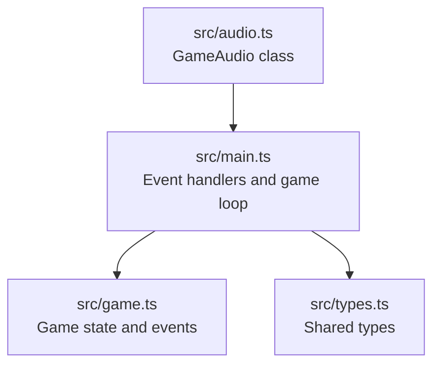
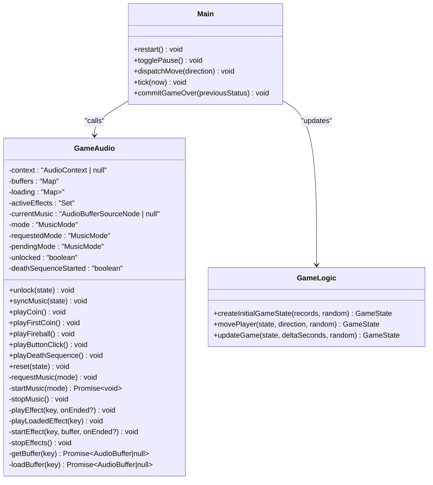
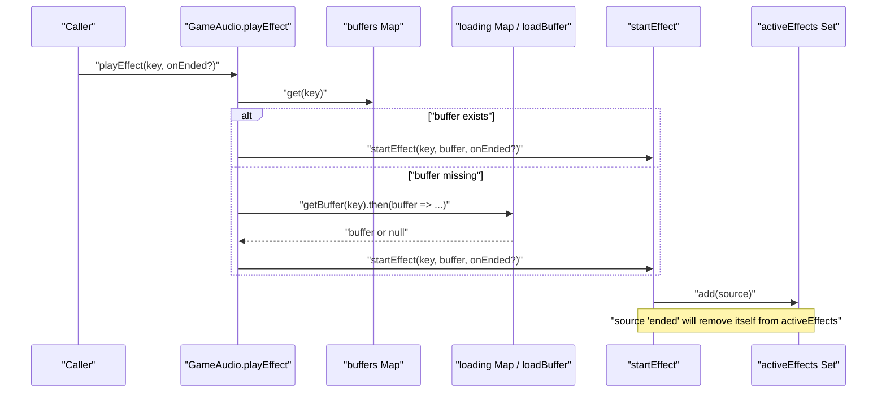
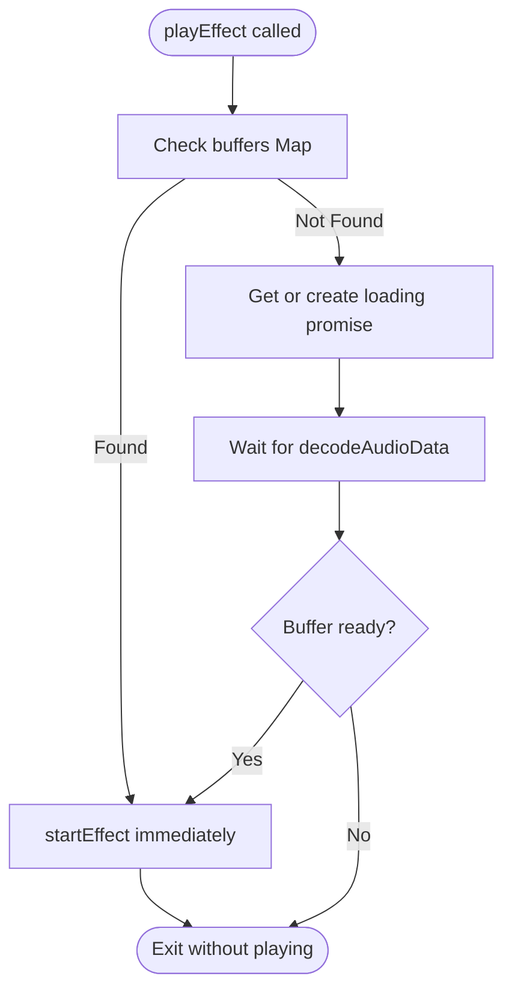
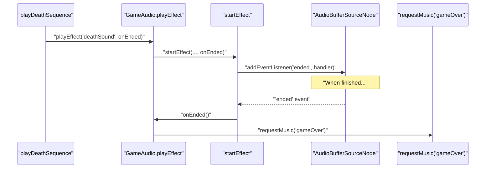
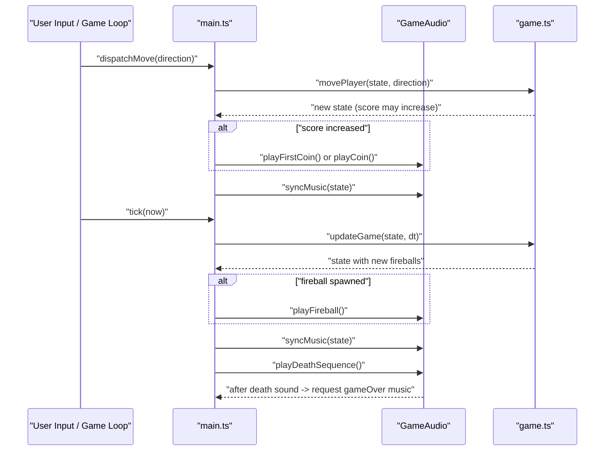
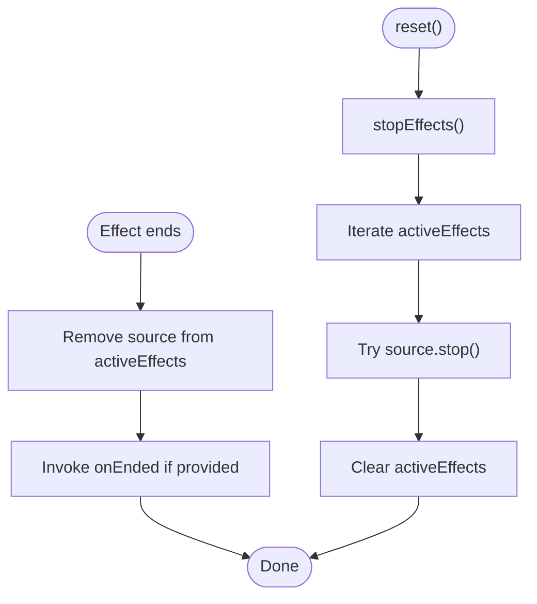
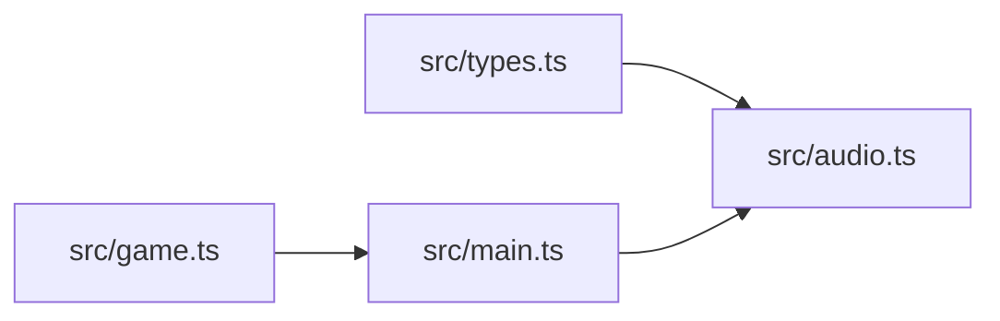

# Sound Effects Engine

<cite>
**Referenced Files in This Document**
- [audio.ts](file://src/audio.ts)
- [main.ts](file://src/main.ts)
- [game.ts](file://src/game.ts)
- [types.ts](file://src/types.ts)
</cite>

## Table of Contents
1. [Introduction](#introduction)
2. [Project Structure](#project-structure)
3. [Core Components](#core-components)
4. [Architecture Overview](#architecture-overview)
5. [Detailed Component Analysis](#detailed-component-analysis)
6. [Dependency Analysis](#dependency-analysis)
7. [Performance Considerations](#performance-considerations)
8. [Troubleshooting Guide](#troubleshooting-guide)
9. [Conclusion](#conclusion)

## Introduction
This document explains the sound effects playback system used by the game. It focuses on how short sound effects are queued and played concurrently, how deferred loading works when audio assets are not yet available, and how callbacks are handled for effect completion. It also clarifies the difference between immediate playback of already-loaded sounds versus deferred playback that waits for loading to finish. Finally, it covers memory cleanup of completed effects and performance considerations for frequent sound playback.

## Project Structure
The sound system is implemented as a dedicated module and integrated into the main game loop and UI interactions. The key files involved are:
- Audio engine and effect/music management
- Main entry point wiring user actions and game events to audio calls
- Game logic that drives state transitions and event triggers
- Shared types used across modules

**Diagram sources**
- [audio.ts:37-277](file://src/audio.ts#L37-L277)
- [main.ts:39-105](file://src/main.ts#L39-L105)
- [game.ts:29-101](file://src/game.ts#L29-L101)
- [types.ts:28-43](file://src/types.ts#L28-L43)

**Section sources**
- [audio.ts:37-277](file://src/audio.ts#L37-L277)
- [main.ts:39-105](file://src/main.ts#L39-L105)
- [game.ts:29-101](file://src/game.ts#L29-L101)
- [types.ts:28-43](file://src/types.ts#L28-L43)

## Core Components
- GameAudio class encapsulates:
  - AudioContext lifecycle and unlocking
  - Background music control (modes and looping)
  - Short sound effect playback with concurrent support
  - Asset loading and caching
  - Memory cleanup for active effects

Key responsibilities:
- Maintain a Set of currently playing effect sources to allow multiple overlapping plays
- Provide both immediate and deferred playback APIs
- Manage volume per effect type
- Handle completion callbacks for sequencing (e.g., death sequence)

**Section sources**
- [audio.ts:37-277](file://src/audio.ts#L37-L277)

## Architecture Overview
The audio engine exposes simple public methods for gameplay events and manages internal queues and resources. The main entry point wires these methods to user input and game updates.

**Diagram sources**
- [audio.ts:37-277](file://src/audio.ts#L37-L277)
- [main.ts:45-144](file://src/main.ts#L45-L144)
- [game.ts:29-101](file://src/game.ts#L29-L101)

## Detailed Component Analysis

### Effect Queuing and Concurrent Playback
- Concurrency model:
  - Each effect creates a new AudioBufferSourceNode and connects it to a Gain node before connecting to the destination.
  - All active sources are tracked in a Set to enable stopping them collectively and to avoid duplicates.
- Completion handling:
  - An "ended" event listener removes the source from the Set and invokes any provided callback.
- Immediate vs deferred:
  - playLoadedEffect requires the buffer to be present; if missing, it does nothing.
  - playEffect checks for a cached buffer; if absent, it defers playback until the asset finishes loading.

**Diagram sources**
- [audio.ts:191-234](file://src/audio.ts#L191-L234)

**Section sources**
- [audio.ts:191-234](file://src/audio.ts#L191-L234)

### Deferred Loading Mechanism
- On construction, all audio assets are preloaded into a loading map using promises.
- getBuffer returns either an already-cached buffer or the existing loading promise for that key.
- playEffect uses this mechanism to ensure playback occurs after the asset is ready without blocking the caller.

**Diagram sources**
- [audio.ts:248-276](file://src/audio.ts#L248-L276)
- [audio.ts:191-208](file://src/audio.ts#L191-L208)

**Section sources**
- [audio.ts:248-276](file://src/audio.ts#L248-L276)
- [audio.ts:191-208](file://src/audio.ts#L191-L208)

### Immediate Playback vs Deferred Playback
- Immediate playback:
  - playLoadedEffect attempts to start an effect only if the buffer is already loaded.
  - Used for frequently triggered sounds where latency must be minimal.
- Deferred playback:
  - playEffect handles both cases: immediate if cached, otherwise waits for loading.
  - Used for critical sequences where the effect must eventually play even if assets are still loading.

Practical implications:
- For high-frequency effects (coin, fireball), prefer immediate paths to avoid missed triggers during early load.
- For one-off narrative effects (death), use deferred path to guarantee eventual playback.

**Section sources**
- [audio.ts:210-216](file://src/audio.ts#L210-L216)
- [audio.ts:191-208](file://src/audio.ts#L191-L208)

### Callback Handling for Effect Completion
- startEffect attaches an "ended" listener that:
  - Removes the source from activeEffects
  - Invokes the optional onEnded callback
- This enables chaining of audio events, such as transitioning from a death sound to game-over music.

**Diagram sources**
- [audio.ts:110-123](file://src/audio.ts#L110-L123)
- [audio.ts:218-234](file://src/audio.ts#L218-L234)

**Section sources**
- [audio.ts:110-123](file://src/audio.ts#L110-L123)
- [audio.ts:218-234](file://src/audio.ts#L218-L234)

### Integration Points: Game Events and UI Actions
- Coin collection:
  - When score increases, the main loop plays either first coin or regular coin sound based on previous score.
- Fireball spawning:
  - Each time a new fireball ID increments, a fireball sound is played.
- Button clicks:
  - Restart and pause toggles trigger button click sounds.
- Death sequence:
  - On game over, the death sequence stops background music, plays the death sound, then requests game-over music upon completion.

**Diagram sources**
- [main.ts:69-87](file://src/main.ts#L69-L87)
- [main.ts:107-136](file://src/main.ts#L107-L136)
- [main.ts:138-144](file://src/main.ts#L138-L144)
- [audio.ts:78-123](file://src/audio.ts#L78-L123)

**Section sources**
- [main.ts:69-87](file://src/main.ts#L69-L87)
- [main.ts:107-136](file://src/main.ts#L107-L136)
- [main.ts:138-144](file://src/main.ts#L138-L144)
- [audio.ts:78-123](file://src/audio.ts#L78-L123)

### Memory Cleanup of Completed Effects
- Automatic cleanup:
  - Each effect’s "ended" listener removes its source from activeEffects, preventing leaks.
- Explicit cleanup:
  - stopEffects iterates activeEffects, attempts to stop each source, and clears the Set.
  - reset calls stopEffects to ensure no lingering effects remain across sessions.

**Diagram sources**
- [audio.ts:218-234](file://src/audio.ts#L218-L234)
- [audio.ts:236-246](file://src/audio.ts#L236-L246)
- [audio.ts:125-132](file://src/audio.ts#L125-L132)

**Section sources**
- [audio.ts:218-234](file://src/audio.ts#L218-L234)
- [audio.ts:236-246](file://src/audio.ts#L236-L246)
- [audio.ts:125-132](file://src/audio.ts#L125-L132)

## Dependency Analysis
- Internal dependencies:
  - GameAudio depends on shared types for GameState.
  - main.ts imports GameAudio and orchestrates calls based on user input and game updates.
  - game.ts provides state transitions that drive audio triggers.
- External dependencies:
  - Web Audio API via AudioContext, AudioBuffer, AudioBufferSourceNode, and Gain nodes.

**Diagram sources**
- [types.ts:28-43](file://src/types.ts#L28-L43)
- [audio.ts:37-277](file://src/audio.ts#L37-L277)
- [game.ts:29-101](file://src/game.ts#L29-L101)
- [main.ts:39-105](file://src/main.ts#L39-L105)

**Section sources**
- [types.ts:28-43](file://src/types.ts#L28-L43)
- [audio.ts:37-277](file://src/audio.ts#L37-L277)
- [game.ts:29-101](file://src/game.ts#L29-L101)
- [main.ts:39-105](file://src/main.ts#L39-L105)

## Performance Considerations
- Preloading strategy:
  - All audio assets are fetched and decoded at startup, minimizing latency for subsequent plays.
- Immediate vs deferred:
  - Use immediate playback for high-frequency effects to avoid missed triggers during early frames.
  - Use deferred playback for rare events to ensure they play even if assets are still loading.
- Concurrency:
  - The Set-based tracking allows many overlapping effects without contention.
- Volume and gain:
  - Per-effect volumes are applied via Gain nodes; keep values reasonable to avoid clipping.
- Cleanup:
  - Rely on "ended" listeners for automatic removal; call stopEffects during resets to prevent accumulation.
- Browser constraints:
  - Ensure AudioContext is unlocked before playing; unlock is invoked on user interactions.

[No sources needed since this section provides general guidance]

## Troubleshooting Guide
- No sound on first interaction:
  - Confirm unlock is called on user gestures (click/pointerdown) and that context.resume is attempted.
- Missing sound on first few seconds:
  - If using immediate playback, verify the asset is already loaded; otherwise switch to deferred playback.
- Overlapping sounds not playing:
  - Verify activeEffects Set is being updated and that multiple sources can be created concurrently.
- Stuttering or lag:
  - Avoid excessive synchronous operations around audio; rely on async loading and event-driven callbacks.
- Unexpected silence after restart:
  - Ensure reset calls stopEffects and syncMusic to reinitialize audio state.

**Section sources**
- [audio.ts:59-63](file://src/audio.ts#L59-L63)
- [audio.ts:125-132](file://src/audio.ts#L125-L132)
- [main.ts:97-103](file://src/main.ts#L97-L103)

## Conclusion
The sound effects engine provides robust, low-latency playback for frequent game events while supporting deferred loading for reliability. Its design leverages a Set of active sources to manage concurrency and cleanup, and uses callbacks to sequence longer audio flows like the death sequence. By choosing the appropriate playback method (immediate vs deferred) and ensuring proper unlocking and cleanup, the system delivers responsive and consistent audio feedback throughout gameplay.