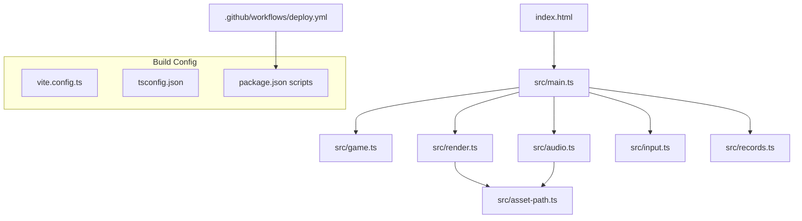
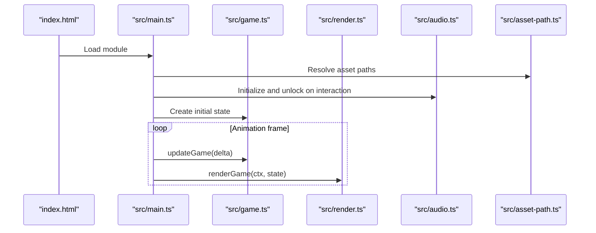
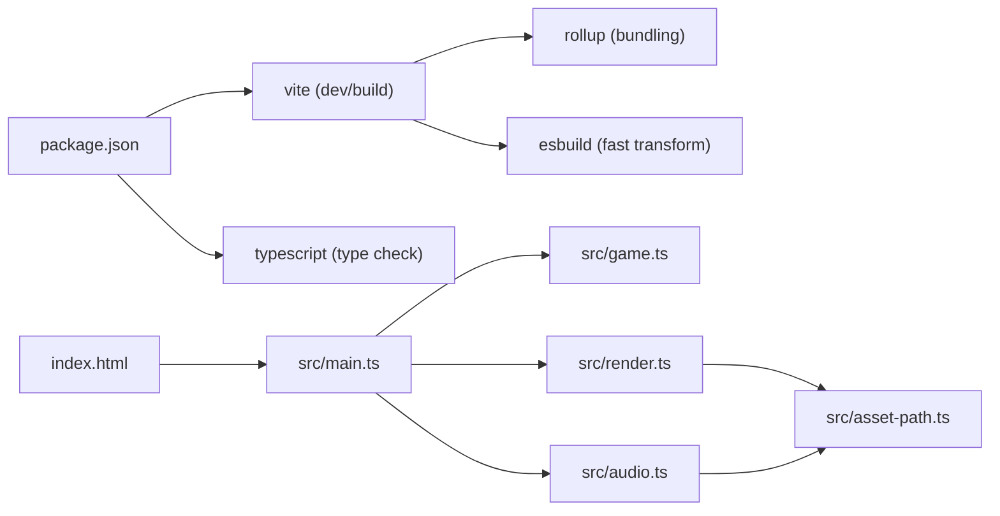

# Build Optimization

<cite>
**Referenced Files in This Document**
- [vite.config.ts](file://vite.config.ts)
- [package.json](file://package.json)
- [tsconfig.json](file://tsconfig.json)
- [index.html](file://index.html)
- [src/main.ts](file://src/main.ts)
- [src/render.ts](file://src/render.ts)
- [src/audio.ts](file://src/audio.ts)
- [src/asset-path.ts](file://src/asset-path.ts)
- [.github/workflows/deploy.yml](file://.github/workflows/deploy.yml)
</cite>

## Table of Contents
1. [Introduction](#introduction)
2. [Project Structure](#project-structure)
3. [Core Components](#core-components)
4. [Architecture Overview](#architecture-overview)
5. [Detailed Component Analysis](#detailed-component-analysis)
6. [Dependency Analysis](#dependency-analysis)
7. [Performance Considerations](#performance-considerations)
8. [Troubleshooting Guide](#troubleshooting-guide)
9. [Conclusion](#conclusion)
10. [Appendices](#appendices)

## Introduction
This document explains build optimization techniques and performance tuning strategies for the project, focusing on Vite-based code splitting, asset compression, tree shaking, caching, CDN integration, bundle analysis, performance monitoring, production verification, memory usage optimization, parallel processing, incremental builds, and benchmarking guidance. It maps these practices to the current repository configuration and source structure.

## Project Structure
The project is a small browser game built with Vite and TypeScript. The entry point is an HTML file that loads a single ES module, which bootstraps the game loop, rendering, audio, input, and state management. Assets (images and audio) are referenced via a helper that resolves paths using Vite’s base URL.

**Diagram sources**
- [index.html:19-19](file://index.html#L19-L19)
- [src/main.ts:1-10](file://src/main.ts#L1-L10)
- [src/render.ts:1-3](file://src/render.ts#L1-L3)
- [src/audio.ts:1-2](file://src/audio.ts#L1-L2)
- [src/asset-path.ts:1-5](file://src/asset-path.ts#L1-L5)
- [vite.config.ts:1-6](file://vite.config.ts#L1-L6)
- [tsconfig.json:1-20](file://tsconfig.json#L1-L20)
- [package.json:6-11](file://package.json#L6-L11)
- [.github/workflows/deploy.yml:37-38](file://.github/workflows/deploy.yml#L37-L38)

**Section sources**
- [index.html:1-22](file://index.html#L1-L22)
- [vite.config.ts:1-6](file://vite.config.ts#L1-L6)
- [package.json:6-11](file://package.json#L6-L11)
- [tsconfig.json:1-20](file://tsconfig.json#L1-L20)
- [.github/workflows/deploy.yml:17-49](file://.github/workflows/deploy.yml#L17-L49)

## Core Components
- Build toolchain: Vite for dev server and production builds; esbuild for fast bundling; Rollup under the hood for final output.
- TypeScript compilation: tsconfig targets ES2020 with ESNext modules and Bundler resolution; noEmit ensures Vite handles emit.
- Entry point: index.html imports src/main.ts as a module.
- Asset handling: images and audio are loaded at runtime via fetch or Image APIs; paths are resolved through assetPath using import.meta.env.BASE_URL.

Key implications for optimization:
- Single-module entry enables Vite’s default code splitting on dynamic imports if added later.
- Static assets are served from dist during production; they can be compressed by the hosting platform or configured via Vite plugins.
- Tree shaking benefits from pure functions and static imports; avoid side effects in utility modules.

**Section sources**
- [vite.config.ts:1-6](file://vite.config.ts#L1-L6)
- [tsconfig.json:1-20](file://tsconfig.json#L1-L20)
- [index.html:19-19](file://index.html#L19-L19)
- [src/asset-path.ts:1-5](file://src/asset-path.ts#L1-L5)

## Architecture Overview
The runtime architecture centers around a main bootstrap that initializes the canvas, binds input, manages game state, and drives a fixed-step update loop with requestAnimationFrame. Rendering and audio are decoupled into separate modules.

**Diagram sources**
- [index.html:19-19](file://index.html#L19-L19)
- [src/main.ts:1-10](file://src/main.ts#L1-L10)
- [src/main.ts:107-136](file://src/main.ts#L107-L136)
- [src/game.ts:83-101](file://src/game.ts#L83-L101)
- [src/render.ts:166-185](file://src/render.ts#L166-L185)
- [src/audio.ts:37-57](file://src/audio.ts#L37-L57)
- [src/asset-path.ts:1-5](file://src/asset-path.ts#L1-L5)

## Detailed Component Analysis

### Build Configuration and Production Settings
- Base path: Vite base is set to "./", suitable for GitHub Pages root deployment.
- Scripts: build runs TypeScript then Vite build; dev server exposes host binding.
- CI: GitHub Actions installs dependencies, tests, builds, and uploads dist for Pages.

Optimization opportunities:
- Enable minification and sourcemaps explicitly if needed.
- Configure chunking and rollup options for better cacheability.
- Add a visualizer plugin to analyze bundle composition.

**Section sources**
- [vite.config.ts:3-5](file://vite.config.ts#L3-L5)
- [package.json:6-11](file://package.json#L6-L11)
- [.github/workflows/deploy.yml:31-46](file://.github/workflows/deploy.yml#L31-L46)

### Code Splitting Strategy
Current state:
- Single entry module (main.ts) with static imports. No dynamic imports present.

Recommended approach:
- Use dynamic imports for heavy subsystems (e.g., audio engine, large sprite sets, or optional features).
- Ensure feature flags or user interactions trigger lazy loading to reduce initial payload.
- Keep core loop and minimal renderer synchronous; defer non-critical assets.

Impact:
- Smaller initial JS bundle and faster Time to Interactive.
- Better cache granularity for infrequently used features.

[No sources needed since this section provides general guidance]

### Asset Compression and Delivery
Current state:
- Images and audio are fetched at runtime; audio uses fetch + decodeAudioData; images use Image elements.
- Paths are resolved via BASE_URL.

Recommendations:
- Compress images (WebP/AVIF where supported) and preconvert sprites to optimal sizes.
- Serve audio in efficient formats (e.g., Opus or optimized MP3) and consider streaming or progressive decoding.
- Configure CDN and HTTP caching headers for long-lived asset URLs (Vite already fingerprints assets).
- Enable Brotli/Gzip on the hosting platform (GitHub Pages supports gzip; Brotli may require custom setup).

**Section sources**
- [src/audio.ts:258-276](file://src/audio.ts#L258-L276)
- [src/render.ts:133-139](file://src/render.ts#L133-L139)
- [src/asset-path.ts:1-5](file://src/asset-path.ts#L1-L5)

### Tree Shaking and Dead Code Elimination
Current state:
- Pure functions and static imports facilitate dead code elimination.
- No obvious unused exports remain in hot paths.

Recommendations:
- Prefer named exports and avoid side-effectful top-level statements in libraries.
- Keep third-party dependencies minimal and prefer lightweight alternatives.
- Validate with bundle analysis to confirm removal of unused code.

[No sources needed since this section provides general guidance]

### Caching Strategies and CDN Integration
Current state:
- Vite outputs content-hashed filenames in production, enabling strong caching.
- Deployment target is GitHub Pages.

Recommendations:
- Use a CDN in front of GitHub Pages or switch to a CDN-enabled host for global edge caching.
- Set Cache-Control headers for immutable assets; leverage fingerprinted filenames.
- Preload critical resources (e.g., first-frame sprites) using link rel="preload".

**Section sources**
- [.github/workflows/deploy.yml:40-49](file://.github/workflows/deploy.yml#L40-L49)
- [vite.config.ts:3-5](file://vite.config.ts#L3-L5)

### Bundle Analysis
Current state:
- No bundle analyzer configured.

Recommendations:
- Integrate a Vite plugin for bundle visualization to identify large chunks and dependencies.
- Run analysis after each major change to track regressions.

[No sources needed since this section provides general guidance]

### Performance Monitoring
Current state:
- No runtime metrics collection.

Recommendations:
- Instrument key timings: first paint, time to interactive, audio unlock latency, and frame pacing.
- Capture Web Vitals-like metrics and send anonymized telemetry in production.
- Use browser DevTools Performance panel and Lighthouse for periodic audits.

[No sources needed since this section provides general guidance]

### Production Build Verification
Current state:
- CI builds and deploys to GitHub Pages.

Recommendations:
- Add automated checks: bundle size thresholds, accessibility scans, and performance budgets.
- Snapshot and compare artifacts across PRs to detect regressions.

**Section sources**
- [.github/workflows/deploy.yml:34-46](file://.github/workflows/deploy.yml#L34-L46)

### Memory Usage Optimization
Observations:
- Audio buffers are cached per sound; active sources are tracked and stopped when done.
- Sprite frames are created once and reused.

Recommendations:
- Implement audio pool reuse and stop unused sources promptly.
- Avoid creating temporary objects inside the hot loop; reuse arrays/buffers where possible.
- Monitor memory snapshots in DevTools during extended play sessions.

**Section sources**
- [src/audio.ts:37-57](file://src/audio.ts#L37-L57)
- [src/audio.ts:218-246](file://src/audio.ts#L218-L246)
- [src/render.ts:104-164](file://src/render.ts#L104-L164)

### Parallel Processing and Incremental Builds
Current state:
- Vite leverages esbuild and Rollup internally for parallelism.
- TypeScript is run before Vite build.

Recommendations:
- Consider running type checking in parallel with build steps in CI.
- Use Vite’s native incremental capabilities in development; keep node_modules cached in CI.

**Section sources**
- [package.json:6-11](file://package.json#L6-L11)
- [.github/workflows/deploy.yml:25-32](file://.github/workflows/deploy.yml#L25-L32)

### Benchmarks and Performance Metrics
Guidance:
- Measure TTFB, First Contentful Paint, Largest Contentful Paint, Total Blocking Time, and Cumulative Layout Shift.
- Track FPS stability and frame time variance during gameplay.
- Compare baseline vs. optimized builds after applying changes (code splitting, asset recompression, CDN).

[No sources needed since this section provides general guidance]

## Dependency Analysis
High-level dependency relationships relevant to build and performance:

**Diagram sources**
- [package.json:12-17](file://package.json#L12-L17)
- [index.html:19-19](file://index.html#L19-L19)
- [src/main.ts:1-10](file://src/main.ts#L1-L10)
- [src/render.ts:1-3](file://src/render.ts#L1-L3)
- [src/audio.ts:1-2](file://src/audio.ts#L1-L2)
- [src/asset-path.ts:1-5](file://src/asset-path.ts#L1-L5)

**Section sources**
- [package.json:12-17](file://package.json#L12-L17)
- [index.html:19-19](file://index.html#L19-L19)
- [src/main.ts:1-10](file://src/main.ts#L1-L10)
- [src/render.ts:1-3](file://src/render.ts#L1-L3)
- [src/audio.ts:1-2](file://src/audio.ts#L1-L2)
- [src/asset-path.ts:1-5](file://src/asset-path.ts#L1-L5)

## Performance Considerations
- Minimize initial payload: defer non-critical assets and features.
- Prefer vectorized or procedural fallbacks when assets are not ready to avoid layout thrash.
- Reduce GC pressure by reusing objects and avoiding allocations in the animation loop.
- Leverage browser caching and CDN distribution for static assets.
- Profile both CPU and GPU: Canvas operations should minimize overdraw and context state changes.

[No sources needed since this section provides general guidance]

## Troubleshooting Guide
Common issues and remedies:
- Assets not found in production: ensure BASE_URL and asset paths align with deployment path.
- Audio autoplay blocked: unlock AudioContext on user gesture before playing.
- Slow initial load: add preload hints for critical sprites and fonts; split heavy modules.
- Large bundles: run bundle analysis and remove unused dependencies.

**Section sources**
- [src/asset-path.ts:1-5](file://src/asset-path.ts#L1-L5)
- [src/audio.ts:59-63](file://src/audio.ts#L59-L63)
- [src/main.ts:18-20](file://src/main.ts#L18-L20)

## Conclusion
The project uses a straightforward Vite setup with a single entry module and runtime-loaded assets. To improve performance, introduce code splitting for heavy features, compress and distribute assets via CDN, enable bundle analysis, and instrument runtime metrics. These steps will reduce initial load times, improve interactivity, and provide ongoing visibility into build and runtime performance.

## Appendices

### Build Commands and CI Flow
- Local development: npm run dev
- Type check and production build: npm run build
- CI pipeline: install, test, build, configure Pages, upload dist, deploy

**Section sources**
- [package.json:6-11](file://package.json#L6-L11)
- [.github/workflows/deploy.yml:17-49](file://.github/workflows/deploy.yml#L17-L49)