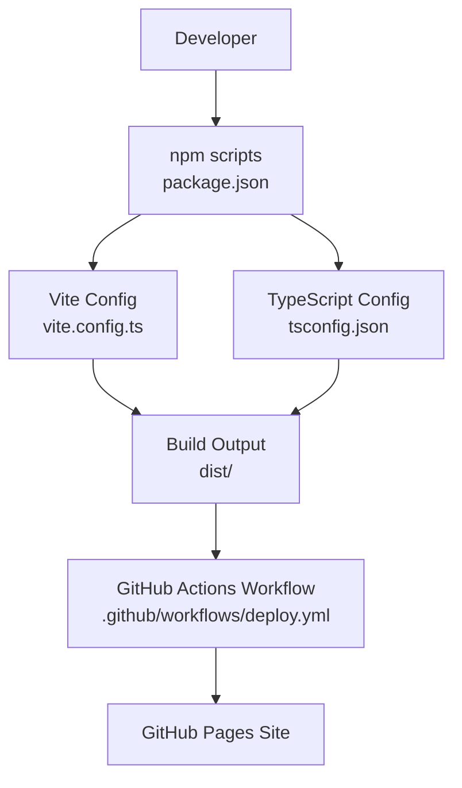
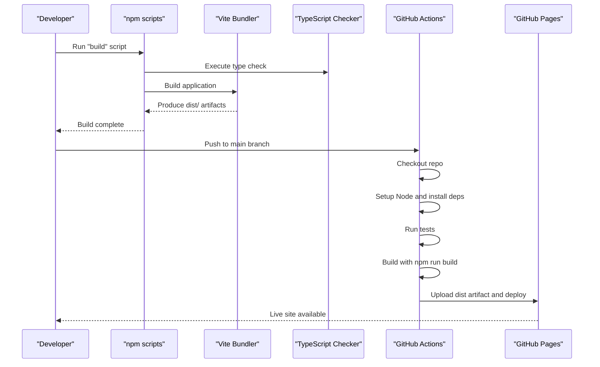
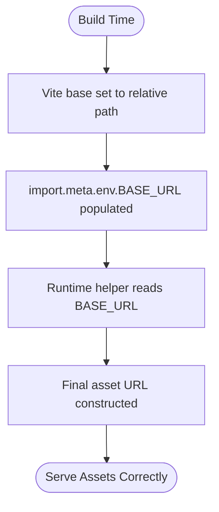
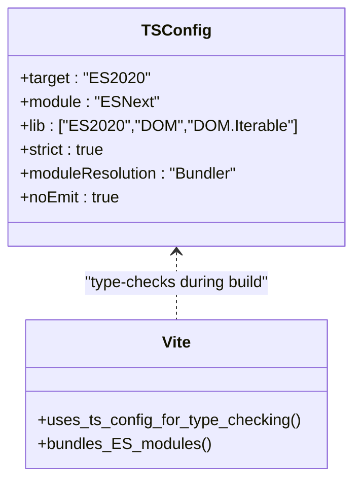
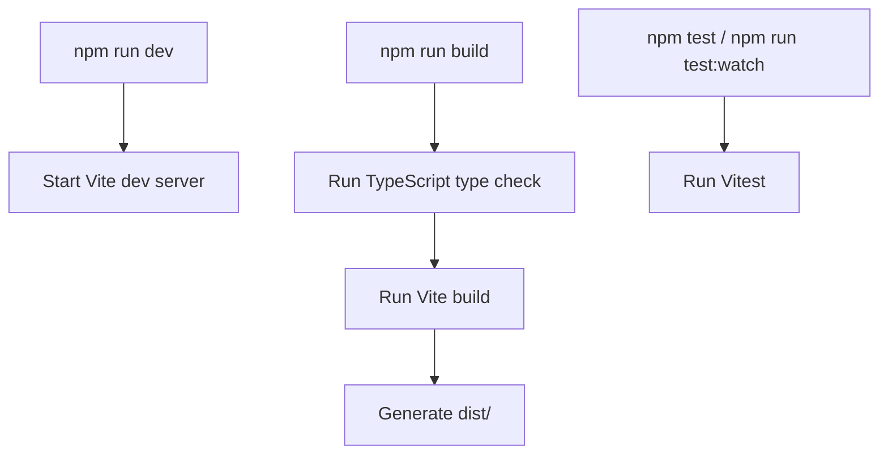
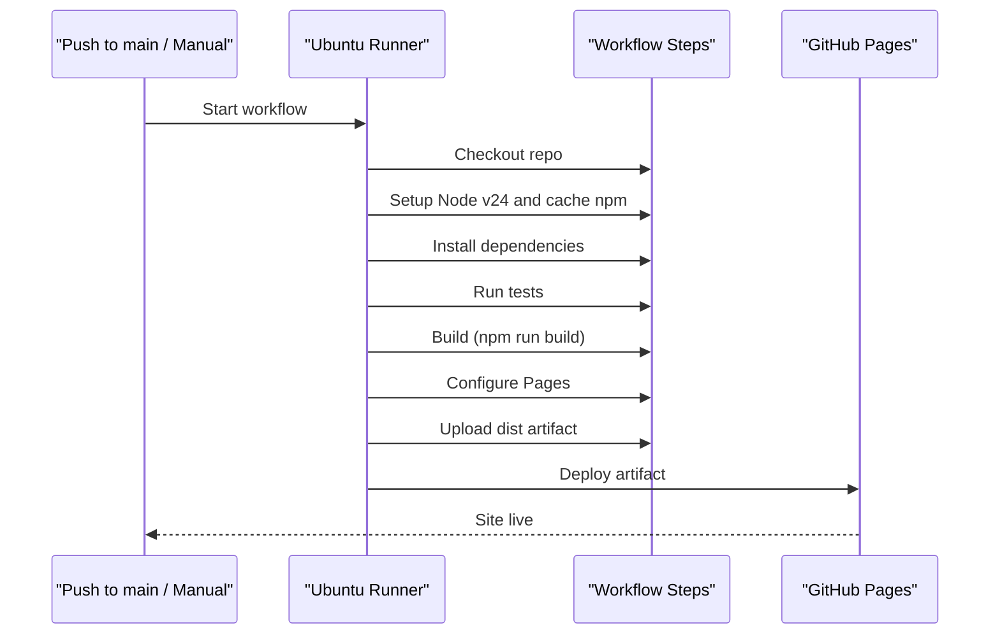
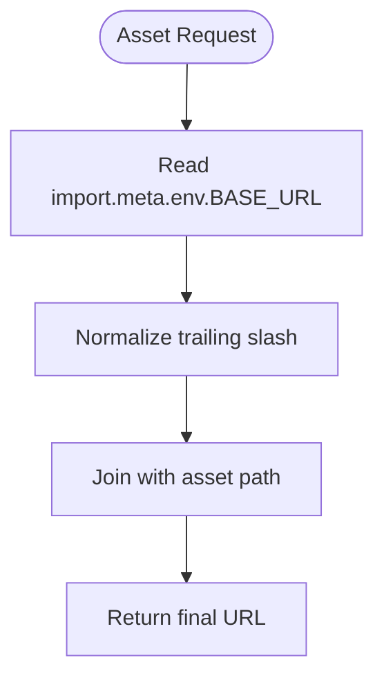
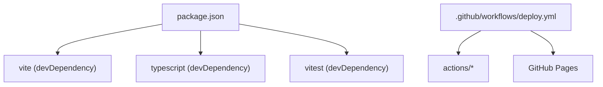

# Build and Deployment

<cite>
**Referenced Files in This Document**
- [vite.config.ts](file://vite.config.ts)
- [tsconfig.json](file://tsconfig.json)
- [package.json](file://package.json)
- [.github/workflows/deploy.yml](file://.github/workflows/deploy.yml)
- [index.html](file://index.html)
- [src/asset-path.ts](file://src/asset-path.ts)
- [README.md](file://README.md)
</cite>

## Table of Contents
1. [Introduction](#introduction)
2. [Project Structure](#project-structure)
3. [Core Components](#core-components)
4. [Architecture Overview](#architecture-overview)
5. [Detailed Component Analysis](#detailed-component-analysis)
6. [Dependency Analysis](#dependency-analysis)
7. [Performance Considerations](#performance-considerations)
8. [Troubleshooting Guide](#troubleshooting-guide)
9. [Conclusion](#conclusion)
10. [Appendices](#appendices)

## Introduction
This document explains the build system and deployment process for the project, focusing on:
- Vite configuration with a relative base path to support flexible deployments across environments
- TypeScript compilation settings and how they interact with the bundler
- GitHub Actions workflow that automates building and deploying to GitHub Pages
- Environment-specific configuration patterns and custom build scripts
- Performance optimization techniques such as code splitting, asset compression, and caching strategies
- Deployment verification, rollback procedures, and guidance for custom domains and SSL certificates

The goal is to provide both high-level understanding and actionable details for developers and operators.

## Project Structure
At a high level, the build and deployment pipeline involves:
- Source code under src/
- A minimal HTML entry point at index.html
- Vite configuration for bundling and asset handling
- TypeScript configuration for type checking and module resolution
- npm scripts to run development, testing, and production builds
- A GitHub Actions workflow that builds and deploys to GitHub Pages

**Diagram sources**
- [package.json:6-11](file://package.json#L6-L11)
- [vite.config.ts:1-6](file://vite.config.ts#L1-L6)
- [tsconfig.json:1-20](file://tsconfig.json#L1-L20)
- [.github/workflows/deploy.yml:17-49](file://.github/workflows/deploy.yml#L17-L49)

**Section sources**
- [README.md:1-30](file://README.md#L1-L30)
- [package.json:1-19](file://package.json#L1-L19)

## Core Components
- Vite configuration sets a relative base path to ensure assets resolve correctly when deployed under subpaths (e.g., GitHub Pages).
- TypeScript configuration enforces strict checks, modern ES targets, and integrates with Vite’s bundler via module resolution.
- npm scripts orchestrate development, testing, and production builds.
- The GitHub Actions workflow triggers on pushes to main and manual dispatch, installs dependencies, runs tests, builds the app, and deploys to GitHub Pages.

Key responsibilities:
- Relative base path handling for flexible deployment
- Type-safe asset path construction at runtime
- Automated CI/CD pipeline for consistent builds and deployments

**Section sources**
- [vite.config.ts:1-6](file://vite.config.ts#L1-L6)
- [tsconfig.json:1-20](file://tsconfig.json#L1-L20)
- [package.json:6-11](file://package.json#L6-L11)
- [.github/workflows/deploy.yml:17-49](file://.github/workflows/deploy.yml#L17-L49)

## Architecture Overview
The end-to-end flow from source to production site:

**Diagram sources**
- [package.json:6-11](file://package.json#L6-L11)
- [.github/workflows/deploy.yml:21-49](file://.github/workflows/deploy.yml#L21-L49)

## Detailed Component Analysis

### Vite Configuration and Relative Base Path
- The Vite config sets a relative base path so that all generated asset URLs are resolved relative to the current page location. This is essential for GitHub Pages or any subpath deployment.
- At runtime, the application constructs asset paths using an environment variable provided by Vite, ensuring consistency between build-time and runtime base paths.

**Diagram sources**
- [vite.config.ts:3-5](file://vite.config.ts#L3-L5)
- [src/asset-path.ts:1-5](file://src/asset-path.ts#L1-L5)

**Section sources**
- [vite.config.ts:1-6](file://vite.config.ts#L1-L6)
- [src/asset-path.ts:1-5](file://src/asset-path.ts#L1-L5)

### TypeScript Compilation Settings
- Target and modules are configured for modern browsers and bundler integration.
- Strict mode and module resolution options ensure reliable type checking and compatibility with Vite.
- NoEmit indicates TypeScript only performs type-checking; bundling is handled by Vite.

**Diagram sources**
- [tsconfig.json:1-20](file://tsconfig.json#L1-L20)

**Section sources**
- [tsconfig.json:1-20](file://tsconfig.json#L1-L20)

### npm Scripts and Custom Build Flow
- Development server starts with host binding for local network access.
- Production build first runs TypeScript checks, then invokes Vite to produce optimized output.
- Test commands use Vitest for unit tests.

**Diagram sources**
- [package.json:6-11](file://package.json#L6-L11)

**Section sources**
- [package.json:6-11](file://package.json#L6-L11)

### GitHub Actions Workflow for GitHub Pages
- Triggers: push to main and manual dispatch.
- Steps: checkout, setup Node, install dependencies, run tests, build, configure Pages, upload artifact, deploy.
- Permissions include pages write and id-token write for secure deployment.

**Diagram sources**
- [.github/workflows/deploy.yml:1-49](file://.github/workflows/deploy.yml#L1-L49)

**Section sources**
- [.github/workflows/deploy.yml:1-49](file://.github/workflows/deploy.yml#L1-L49)

### Runtime Asset Path Resolution
- The application uses a helper function to construct asset URLs based on the base URL provided by Vite.
- This ensures correct loading of images and other static assets regardless of deployment subpath.

**Diagram sources**
- [src/asset-path.ts:1-5](file://src/asset-path.ts#L1-L5)

**Section sources**
- [src/asset-path.ts:1-5](file://src/asset-path.ts#L1-L5)

### HTML Entry Point
- The HTML file references the main TypeScript module via a module script tag.
- During development, Vite serves this entry and resolves imports. In production, Vite generates hashed filenames and updates references accordingly.

**Diagram sources**
- [index.html:19-19](file://index.html#L19-L19)

**Section sources**
- [index.html:1-22](file://index.html#L1-L22)

## Dependency Analysis
The build and deployment depend on:
- Vite for bundling and development server
- TypeScript for type checking
- Vitest for testing
- GitHub Actions for CI/CD and deployment to Pages

**Diagram sources**
- [package.json:12-17](file://package.json#L12-L17)
- [.github/workflows/deploy.yml:21-49](file://.github/workflows/deploy.yml#L21-L49)

**Section sources**
- [package.json:12-17](file://package.json#L12-L17)
- [.github/workflows/deploy.yml:1-49](file://.github/workflows/deploy.yml#L1-L49)

## Performance Considerations
- Code splitting: Vite automatically splits code based on dynamic imports and shared dependencies. Ensure large modules are imported dynamically where appropriate to reduce initial load.
- Asset compression: Vite compresses JavaScript and CSS by default in production builds. For images and audio, consider pre-compressing assets (e.g., WebP for images, Ogg/MP3 for audio) and using efficient formats.
- Caching strategies: Vite outputs files with content hashes, enabling long-term browser caching. Keep versioned assets immutable and rely on HTML referencing updated filenames.
- Tree-shaking: Use ES modules and avoid side effects to allow dead code elimination.
- Minification: Terser is used by default for JS minification; no additional configuration is required unless customizing options.
- Network optimizations: Enable gzip or Brotli on your hosting platform if applicable. GitHub Pages serves over HTTPS and supports HTTP/2, which helps performance.

[No sources needed since this section provides general guidance]

## Troubleshooting Guide
Common issues and resolutions:
- Assets not loading after deployment:
  - Verify the base path is relative and runtime helpers read the correct BASE_URL.
  - Confirm that asset paths do not start with absolute roots that bypass the base path.
- Build fails due to TypeScript errors:
  - Run the type check locally before pushing to catch issues early.
  - Ensure strict mode aligns with your codebase conventions.
- Tests failing in CI:
  - Check that environment variables required by tests are present or mocked appropriately.
- Pages deployment not updating:
  - Ensure the workflow has permissions to write Pages and that the artifact path points to the correct directory.
- Local development asset paths:
  - When running the dev server, ensure the HTML entry references the correct module path and that Vite resolves it properly.

**Section sources**
- [vite.config.ts:3-5](file://vite.config.ts#L3-L5)
- [src/asset-path.ts:1-5](file://src/asset-path.ts#L1-L5)
- [tsconfig.json:1-20](file://tsconfig.json#L1-L20)
- [.github/workflows/deploy.yml:8-15](file://.github/workflows/deploy.yml#L8-L15)

## Conclusion
The project uses a streamlined build and deployment pipeline:
- Vite with a relative base path ensures flexible deployment across subpaths.
- TypeScript provides strong type safety without emitting files.
- npm scripts unify development, testing, and production workflows.
- GitHub Actions automates testing, building, and deployment to GitHub Pages.
Adhering to the recommended practices for asset handling, performance, and CI/CD will keep the project maintainable and performant.

[No sources needed since this section summarizes without analyzing specific files]

## Appendices

### Environment-Specific Configuration Examples
- Development:
  - Use the development server script to run locally with network access enabled.
- Staging:
  - Create a separate branch and workflow trigger to build and preview changes before merging to main.
- Production:
  - Rely on the main branch workflow to build and deploy to GitHub Pages.

**Section sources**
- [package.json:6-11](file://package.json#L6-L11)
- [.github/workflows/deploy.yml:3-6](file://.github/workflows/deploy.yml#L3-L6)

### Custom Build Scripts
- Add new scripts to package.json for specialized tasks (e.g., linting, asset processing) and integrate them into the build sequence.
- Example pattern:
  - Pre-build step: generate or transform assets
  - Main build: type check and bundle
  - Post-build step: analyze bundle size or copy additional files

**Section sources**
- [package.json:6-11](file://package.json#L6-L11)

### Deployment Verification Process
- After pushing to main, verify the workflow completes successfully in the Actions tab.
- Confirm the Pages site reflects the latest build.
- Validate critical assets and routes by opening the published URL and performing basic interactions.

**Section sources**
- [.github/workflows/deploy.yml:17-49](file://.github/workflows/deploy.yml#L17-L49)
- [README.md:27-30](file://README.md#L27-L30)

### Rollback Procedures
- To roll back to a previous commit:
  - Revert the commit or reset to the desired revision.
  - Push the change to main to trigger a rebuild and redeploy.
- Alternatively, use GitHub Pages’ built-in rollback feature if available in repository settings.

**Section sources**
- [.github/workflows/deploy.yml:3-6](file://.github/workflows/deploy.yml#L3-L6)

### Custom Domains and SSL Certificates
- GitHub Pages supports custom domains with automatic HTTPS provisioning.
- Configure the custom domain in repository settings and add the required DNS records as instructed by GitHub.
- SSL certificates are managed automatically by GitHub Pages.

**Section sources**
- [README.md:27-30](file://README.md#L27-L30)