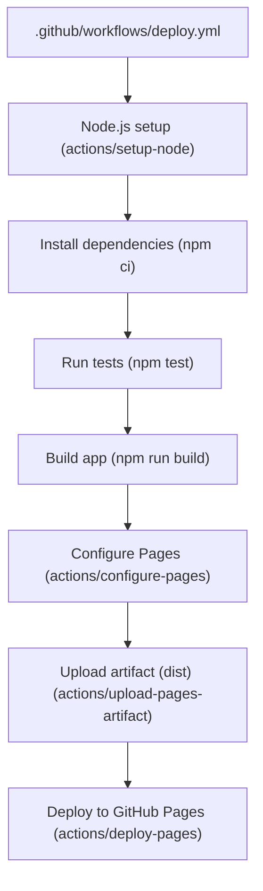
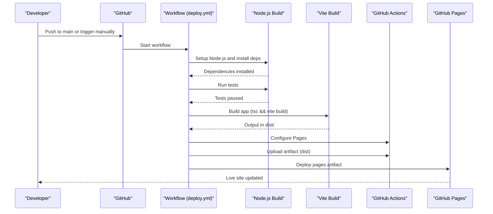
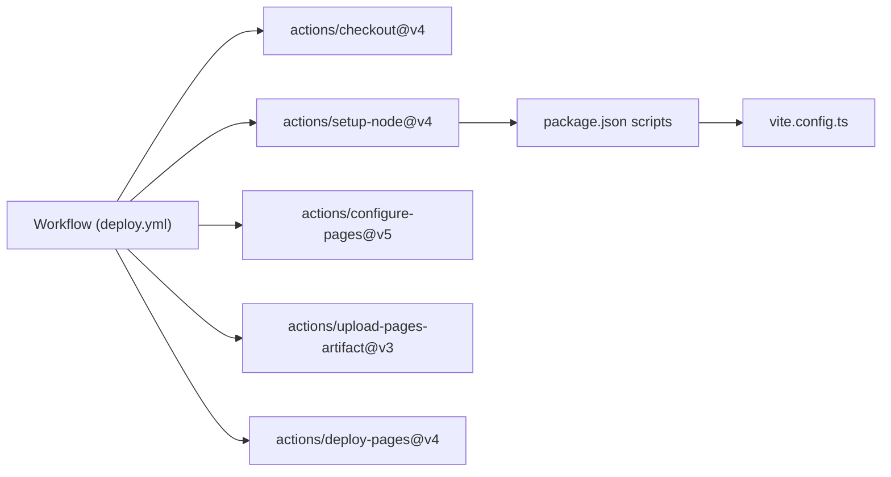

# GitHub Actions Deployment

<cite>
**Referenced Files in This Document**
- [deploy.yml](file://.github/workflows/deploy.yml)
- [package.json](file://package.json)
- [vite.config.ts](file://vite.config.ts)
- [index.html](file://index.html)
- [README.md](file://README.md)
- [asset-path.ts](file://src/asset-path.ts)
</cite>

## Table of Contents
1. [Introduction](#introduction)
2. [Project Structure](#project-structure)
3. [Core Components](#core-components)
4. [Architecture Overview](#architecture-overview)
5. [Detailed Component Analysis](#detailed-component-analysis)
6. [Dependency Analysis](#dependency-analysis)
7. [Performance Considerations](#performance-considerations)
8. [Troubleshooting Guide](#troubleshooting-guide)
9. [Conclusion](#conclusion)
10. [Appendices](#appendices)

## Introduction
This document explains the automated CI/CD pipeline that builds and deploys the game to GitHub Pages using GitHub Actions. It covers branch triggers, build artifacts, deployment targets, environment variables, caching strategies, build optimizations, manual triggers, deployment verification, rollback procedures, and troubleshooting guidance for common issues.

## Project Structure
The repository is a Vite + TypeScript project with a single GitHub Actions workflow file that orchestrates the entire build-and-deploy process. The key files involved in deployment are:
- Workflow definition and job steps
- Build scripts and toolchain configuration
- Vite base path configuration for relative paths
- HTML entry point for the application

**Diagram sources**
- [deploy.yml:1-50](file://.github/workflows/deploy.yml#L1-L50)

**Section sources**
- [deploy.yml:1-50](file://.github/workflows/deploy.yml#L1-L50)
- [package.json:1-19](file://package.json#L1-L19)
- [vite.config.ts:1-6](file://vite.config.ts#L1-L6)
- [index.html:1-22](file://index.html#L1-L22)

## Core Components
- Workflow trigger and permissions:
  - Triggers on push to main and manual dispatch.
  - Grants read access to contents, write access to Pages, and OIDC token write for secure deployments.
- Concurrency control:
  - Ensures only one Pages deployment runs at a time per group without canceling in-progress jobs.
- Build job:
  - Runs on ubuntu-latest.
  - Checks out code, sets up Node.js with npm cache enabled, installs dependencies, runs tests, builds the app, configures Pages, uploads the dist artifact, and deploys.

Key behaviors:
- Branch trigger: main
- Manual trigger: workflow_dispatch
- Artifact directory: dist
- Target: GitHub Pages via actions/deploy-pages

**Section sources**
- [deploy.yml:1-50](file://.github/workflows/deploy.yml#L1-L50)

## Architecture Overview
The end-to-end flow from source change to live site:

**Diagram sources**
- [deploy.yml:1-50](file://.github/workflows/deploy.yml#L1-L50)
- [package.json:6-11](file://package.json#L6-L11)
- [vite.config.ts:1-6](file://vite.config.ts#L1-L6)

## Detailed Component Analysis

### Workflow Definition and Triggers
- Name: Deploy to GitHub Pages
- Triggers:
  - push to main
  - workflow_dispatch (manual)
- Permissions:
  - contents: read
  - pages: write
  - id-token: write
- Concurrency:
  - Group: pages
  - Cancel-in-progress: false

These settings ensure safe, predictable deployments to GitHub Pages.

**Section sources**
- [deploy.yml:1-16](file://.github/workflows/deploy.yml#L1-L16)

### Build Job Steps
- Checkout: retrieves repository code
- Setup Node: uses Node 24 with npm cache enabled
- Install dependencies: uses npm ci for deterministic installs
- Test: runs unit tests before building
- Build: executes tsc then vite build
- Configure Pages: prepares Pages deployment context
- Upload artifact: publishes dist folder
- Deploy: pushes artifact to GitHub Pages

**Section sources**
- [deploy.yml:17-50](file://.github/workflows/deploy.yml#L17-L50)
- [package.json:6-11](file://package.json#L6-L11)

### Build Configuration and Asset Paths
- Vite base path is set to "./", ensuring assets resolve correctly when served from a subpath on GitHub Pages.
- Application code constructs asset URLs using BASE_URL, which Vite injects at build time.

Implications:
- Relative base ensures correct resource loading under repository root or custom subpaths.
- Asset path helper normalizes trailing slashes and leading slashes for robust URL composition.

**Section sources**
- [vite.config.ts:1-6](file://vite.config.ts#L1-L6)
- [asset-path.ts:1-4](file://src/asset-path.ts#L1-L4)

### Entry Point and Runtime Behavior
- index.html defines the canvas and UI controls and loads the application module.
- The runtime initializes the game loop, input bindings, audio, and records store.

Note: These files do not affect the CI/CD pipeline directly but confirm the expected output structure consumed by the Pages deployer.

**Section sources**
- [index.html:1-22](file://index.html#L1-L22)

## Dependency Analysis
The workflow depends on:
- actions/checkout@v4
- actions/setup-node@v4
- actions/configure-pages@v5
- actions/upload-pages-artifact@v3
- actions/deploy-pages@v4

Internal dependencies:
- package.json scripts define the build chain: TypeScript compilation followed by Vite bundling.
- Vite reads vite.config.ts for base path configuration.

**Diagram sources**
- [deploy.yml:1-50](file://.github/workflows/deploy.yml#L1-L50)
- [package.json:6-11](file://package.json#L6-L11)
- [vite.config.ts:1-6](file://vite.config.ts#L1-L6)

**Section sources**
- [deploy.yml:1-50](file://.github/workflows/deploy.yml#L1-L50)
- [package.json:1-19](file://package.json#L1-L19)
- [vite.config.ts:1-6](file://vite.config.ts#L1-L6)

## Performance Considerations
- Caching:
  - npm cache is enabled via actions/setup-node, reducing dependency download times across runs.
- Deterministic installs:
  - npm ci ensures fast, reproducible installs based on lockfile.
- Build optimization:
  - Vite’s production build performs minification and tree-shaking automatically.
  - TypeScript is compiled with noEmit; Vite handles bundling and emits optimized assets.
- Concurrency:
  - Concurrency group prevents overlapping Pages deployments, avoiding race conditions and wasted compute.

Recommendations:
- Keep Node version pinned (already configured).
- Avoid unnecessary large assets in src; prefer lazy-loading if needed.
- Monitor artifact size; consider splitting large bundles if growth becomes an issue.

[No sources needed since this section provides general guidance]

## Troubleshooting Guide

Common issues and resolutions:
- Build fails due to missing dependencies:
  - Ensure package-lock.json is committed and up to date.
  - Verify Node version matches the configured version.
- Tests fail:
  - Fix failing tests locally before pushing; the workflow runs tests prior to build.
- Assets not loading on GitHub Pages:
  - Confirm Vite base is set to "./" and asset paths are constructed using BASE_URL.
  - Check that built files exist under dist after build step.
- Deployment does not appear:
  - Verify repository Pages source is set to GitHub Actions.
  - Check workflow status and logs for errors.
- Permission errors during deploy:
  - Ensure workflow has pages: write and id-token: write permissions.
- Stale cache causing inconsistent builds:
  - Clear npm cache or force rebuild by updating lockfile or bumping Node minor version temporarily.

Manual trigger usage:
- Use workflow_dispatch to run the pipeline on demand without pushing changes.

Deployment verification:
- After successful workflow completion, open the published site URL and verify the game loads and assets render correctly.

Rollback procedures:
- Revert the commit that introduced the issue and push to main to redeploy a previous known-good state.
- Alternatively, use GitHub Pages’ “Previous versions” feature to restore an earlier artifact if available.

Environment variables:
- No secrets or custom environment variables are used in the current workflow. If future features require them, add them in repository Settings > Secrets and Variables > Actions and reference them in the workflow.

**Section sources**
- [deploy.yml:1-50](file://.github/workflows/deploy.yml#L1-L50)
- [vite.config.ts:1-6](file://vite.config.ts#L1-L6)
- [asset-path.ts:1-4](file://src/asset-path.ts#L1-L4)
- [README.md:27-30](file://README.md#L27-L30)

## Conclusion
The repository implements a streamlined, reliable CI/CD pipeline that builds the game with TypeScript and Vite and deploys it to GitHub Pages. With caching, concurrency controls, and strict permissions, the workflow balances speed and safety. The provided troubleshooting guidance helps diagnose and resolve common issues quickly.

[No sources needed since this section summarizes without analyzing specific files]

## Appendices

### Build Artifacts and Targets
- Artifact directory: dist
- Deployment target: GitHub Pages via actions/deploy-pages
- Base path: "./" for correct asset resolution under repository root

**Section sources**
- [deploy.yml:40-49](file://.github/workflows/deploy.yml#L40-L49)
- [vite.config.ts:1-6](file://vite.config.ts#L1-L6)

### Manual Trigger Workflow
- Trigger type: workflow_dispatch
- Usage: Manually run the pipeline from the Actions tab without pushing changes

**Section sources**
- [deploy.yml:3-6](file://.github/workflows/deploy.yml#L3-L6)