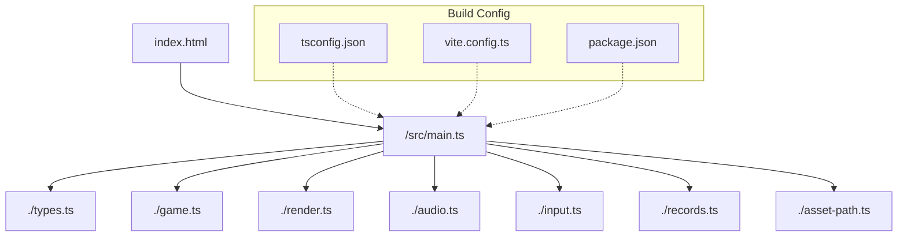
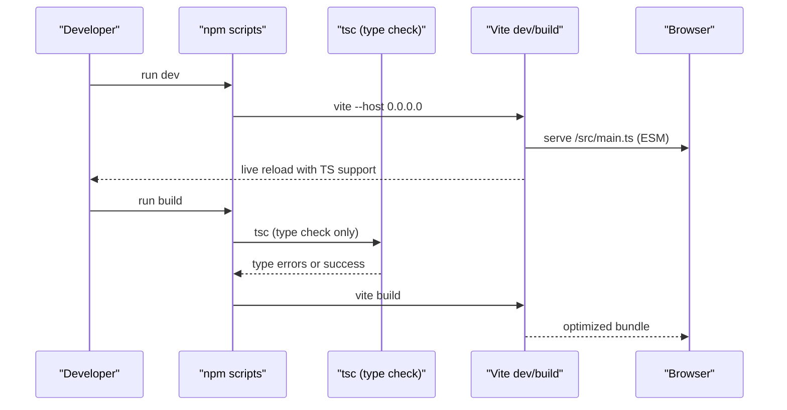
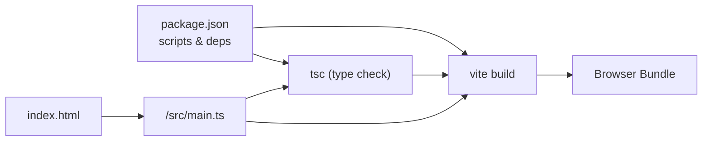

# TypeScript Compilation

<cite>
**Referenced Files in This Document**
- [tsconfig.json](file://tsconfig.json)
- [vite.config.ts](file://vite.config.ts)
- [package.json](file://package.json)
- [src/vite-env.d.ts](file://src/vite-env.d.ts)
- [src/types.ts](file://src/types.ts)
- [src/main.ts](file://src/main.ts)
- [index.html](file://index.html)
</cite>

## Table of Contents
1. [Introduction](#introduction)
2. [Project Structure](#project-structure)
3. [Core Components](#core-components)
4. [Architecture Overview](#architecture-overview)
5. [Detailed Component Analysis](#detailed-component-analysis)
6. [Dependency Analysis](#dependency-analysis)
7. [Performance Considerations](#performance-considerations)
8. [Troubleshooting Guide](#troubleshooting-guide)
9. [Conclusion](#conclusion)

## Introduction
This document explains the TypeScript compilation setup and configuration for this project, focusing on target browser compatibility, module resolution strategies, strict type checking, and integration with Vite’s build pipeline. It also covers type definitions, declaration files, debugging support, common configuration scenarios (polyfills, decorators, third-party libraries), and best practices to maintain type safety and catch errors during development.

## Project Structure
The project is a small browser game built with Vite and TypeScript. The key files related to TypeScript compilation are:
- tsconfig.json: TypeScript compiler options
- vite.config.ts: Vite configuration
- package.json: Scripts and dependencies
- src/vite-env.d.ts: Vite client types reference
- index.html: Entry point that loads the app as an ES module
- src/main.ts: Application entrypoint importing typed modules

**Diagram sources**
- [index.html:19-19](file://index.html#L19-L19)
- [src/main.ts:1-9](file://src/main.ts#L1-L9)
- [tsconfig.json:1-19](file://tsconfig.json#L1-L19)
- [vite.config.ts:1-6](file://vite.config.ts#L1-L6)
- [package.json:6-10](file://package.json#L6-L10)

**Section sources**
- [index.html:19-19](file://index.html#L19-L19)
- [src/main.ts:1-9](file://src/main.ts#L1-L9)
- [tsconfig.json:1-19](file://tsconfig.json#L1-L19)
- [vite.config.ts:1-6](file://vite.config.ts#L1-L6)
- [package.json:6-10](file://package.json#L6-L10)

## Core Components
- TypeScript Compiler Options (tsconfig.json):
  - Target: ES2020
  - Module: ESNext
  - Lib: ES2020, DOM, DOM.Iterable
  - Strict mode enabled
  - Module Resolution: Bundler
  - JSON imports enabled
  - Isolated Modules enabled
  - No emit (Vite handles output)
- Vite Integration:
  - Minimal config; base path set to "./"
  - Development server runs via npm script
  - Build pipeline uses tsc for type-checking then vite build
- Type Declarations:
  - Vite client types referenced via src/vite-env.d.ts
  - Custom domain types defined in src/types.ts
- Entry Points:
  - HTML loads /src/main.ts as a module
  - main.ts imports typed modules and initializes the game

**Section sources**
- [tsconfig.json:1-19](file://tsconfig.json#L1-L19)
- [vite.config.ts:1-6](file://vite.config.ts#L1-L6)
- [package.json:6-10](file://package.json#L6-L10)
- [src/vite-env.d.ts:1-2](file://src/vite-env.d.ts#L1-L2)
- [src/types.ts:1-54](file://src/types.ts#L1-L54)
- [src/main.ts:1-9](file://src/main.ts#L1-L9)
- [index.html:19-19](file://index.html#L19-L19)

## Architecture Overview
TypeScript and Vite collaborate to provide fast development and optimized production builds:
- During development, Vite serves TypeScript source directly and performs on-demand transpilation.
- During build, the npm script first runs tsc purely for type-checking, then vite build compiles and bundles assets.
- The “noEmit” option ensures TypeScript does not produce JS; Vite handles all emission.

**Diagram sources**
- [package.json:6-10](file://package.json#L6-L10)
- [tsconfig.json:15-16](file://tsconfig.json#L15-L16)
- [index.html:19-19](file://index.html#L19-L19)

## Detailed Component Analysis

### TypeScript Configuration (tsconfig.json)
Key settings and their implications:
- target: ES2020
  - Ensures emitted code targets modern browsers supporting ES2020 features.
  - Since noEmit is true, this primarily affects type-checking behavior and library availability.
- useDefineForClassFields: true
  - Aligns class field semantics with modern standards.
- module: ESNext
  - Enables latest ECMAScript module syntax for type-checking and IDE tooling.
- lib: ["ES2020", "DOM", "DOM.Iterable"]
  - Provides DOM APIs and ES2020 runtime types for type-checking.
- allowJs: false
  - Disables JavaScript files from being included in the program.
- skipLibCheck: true
  - Skips type-checking of declaration files in node_modules for faster checks.
- esModuleInterop: true and allowSyntheticDefaultImports: true
  - Improves interoperability with CommonJS libraries and default imports.
- strict: true
  - Enables comprehensive type safety (strictNullChecks, strictFunctionTypes, etc.).
- forceConsistentCasingInFileNames: true
  - Prevents cross-platform import issues due to casing differences.
- moduleResolution: Bundler
  - Optimized resolution strategy for bundlers like Vite.
- resolveJsonModule: true
  - Allows importing JSON files with types.
- isolatedModules: true
  - Ensures each file can be compiled independently, improving performance and compatibility with tools like Vite.
- noEmit: true
  - TypeScript only type-checks; Vite produces output.

Practical effects:
- Modern browser targeting via ES2020 target and DOM libs.
- Fast incremental checks with isolatedModules and skipLibCheck.
- Safe interop with third-party packages using esModuleInterop and allowSyntheticDefaultImports.
- JSON imports supported out-of-the-box.

**Section sources**
- [tsconfig.json:1-19](file://tsconfig.json#L1-L19)

### Vite Integration (vite.config.ts and package.json)
- Vite configuration is minimal; base path is set to "./".
- Development script runs Vite with host binding for network access.
- Build script chains tsc (type-check) before vite build.

Implications:
- Vite natively understands TypeScript and ES modules.
- Using tsc solely for type-checking avoids redundant work and leverages its strictness.
- Vite’s bundling and asset handling remain independent of TypeScript emission.

**Section sources**
- [vite.config.ts:1-6](file://vite.config.ts#L1-L6)
- [package.json:6-10](file://package.json#L6-L10)

### Entry Point and Module Loading (index.html and src/main.ts)
- index.html loads /src/main.ts as a native ES module.
- main.ts imports typed modules and initializes the application.
- The combination enables Vite to process TypeScript on demand during development and bundle it for production.

**Section sources**
- [index.html:19-19](file://index.html#L19-L19)
- [src/main.ts:1-9](file://src/main.ts#L1-L9)

### Type Definitions and Declaration Files
- src/vite-env.d.ts references Vite’s client types, enabling Vite-specific globals and asset imports to be typed.
- src/types.ts defines core domain types used across the application (e.g., Direction, Cell, GameState).

Benefits:
- Centralized type contracts improve consistency and reduce duplication.
- Vite client types enable safe usage of environment variables and asset imports.

**Section sources**
- [src/vite-env.d.ts:1-2](file://src/vite-env.d.ts#L1-L2)
- [src/types.ts:1-54](file://src/types.ts#L1-L54)

### Third-Party Library Integration
- @types/node is present for Node-related types (useful for tooling and tests).
- esModuleInterop and allowSyntheticDefaultImports facilitate importing CommonJS libraries with default imports.
- skipLibCheck speeds up checks by skipping deep validation of external declarations.

Guidance:
- Prefer libraries with built-in TypeScript support.
- If a library lacks types, add a minimal .d.ts file or use @types if available.
- Keep skipLibCheck enabled for speed unless you need to inspect third-party types closely.

**Section sources**
- [package.json:12-17](file://package.json#L12-L17)
- [tsconfig.json:8-10](file://tsconfig.json#L8-L10)

### Debugging Support
- Source maps: Vite generates source maps by default in development and supports them in production builds.
- TypeScript mapping: With noEmit, Vite maps back to original .ts files, enabling breakpoints in VS Code or browser devtools.
- Recommended editor setup: Use the TypeScript language service provided by your editor (VS Code recommended) to leverage diagnostics and IntelliSense powered by tsconfig.json.

[No sources needed since this section provides general guidance]

### Common Configuration Scenarios

#### Polyfills
- Current target is ES2020 with DOM libs. Most modern browsers support ES2020 features without polyfills.
- If you must support older environments, consider adding a polyfill strategy at the application boundary (e.g., conditional imports or feature detection) rather than changing the TS target.

[No sources needed since this section provides general guidance]

#### Decorators
- Not configured in tsconfig.json. To enable experimental decorators, you would typically add the appropriate flags and ensure your bundler/toolchain supports them. For now, avoid decorators unless explicitly required.

[No sources needed since this section provides general guidance]

#### JSON Imports
- Enabled via resolveJsonModule: true. You can import JSON files with proper typing.

**Section sources**
- [tsconfig.json:14-14](file://tsconfig.json#L14-L14)

#### Strict Mode and Error Prevention
- strict: true enforces null checks, function parameter checks, and more.
- isolatedModules: true improves compile-time isolation and performance.
- forceConsistentCasingInFileNames: true prevents platform-specific import bugs.

**Section sources**
- [tsconfig.json:11-16](file://tsconfig.json#L11-L16)

## Dependency Analysis
The following diagram shows how the build and type-checking steps depend on each other and how the browser consumes the final output.

**Diagram sources**
- [package.json:6-10](file://package.json#L6-L10)
- [index.html:19-19](file://index.html#L19-L19)
- [src/main.ts:1-9](file://src/main.ts#L1-L9)

**Section sources**
- [package.json:6-10](file://package.json#L6-L10)
- [index.html:19-19](file://index.html#L19-L19)
- [src/main.ts:1-9](file://src/main.ts#L1-L9)

## Performance Considerations
- isolatedModules: true allows parallelization and faster checks.
- skipLibCheck: true reduces overhead from validating third-party declarations.
- noEmit: true avoids redundant JS generation; Vite handles emission efficiently.
- moduleResolution: Bundler aligns with Vite’s resolution algorithm, reducing mismatches and extra work.

[No sources needed since this section provides general guidance]

## Troubleshooting Guide
Common issues and resolutions:
- Import paths not resolving:
  - Ensure moduleResolution is set to Bundler and extensions are handled by Vite.
  - Verify include paths in tsconfig.json cover your source directory.
- Missing DOM types:
  - Confirm lib includes DOM and DOM.Iterable.
- JSON imports failing:
  - Enable resolveJsonModule.
- Third-party library import errors:
  - Enable esModuleInterop and allowSyntheticDefaultImports.
  - Add missing @types if necessary.
- Slow type checks:
  - Keep skipLibCheck and isolatedModules enabled.
- Build fails but dev works:
  - Remember that the build script runs tsc first; fix type errors reported by tsc.

**Section sources**
- [tsconfig.json:1-19](file://tsconfig.json#L1-L19)
- [package.json:6-10](file://package.json#L6-L10)

## Conclusion
This project uses a clean and efficient TypeScript setup tailored for Vite:
- Modern target (ES2020) and strict type checking ensure correctness and future-proof code.
- Vite integrates seamlessly with TypeScript for fast development and optimized builds.
- Type definitions are centralized and well-scoped, improving maintainability.
- The configuration balances safety and performance through isolatedModules, skipLibCheck, and noEmit.

Adhering to these patterns will help you maintain strong type safety, catch errors early, and keep the build pipeline performant.