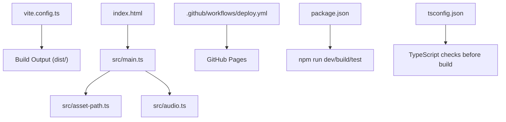
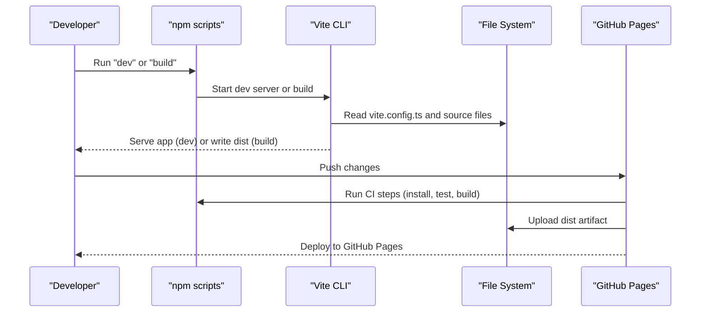
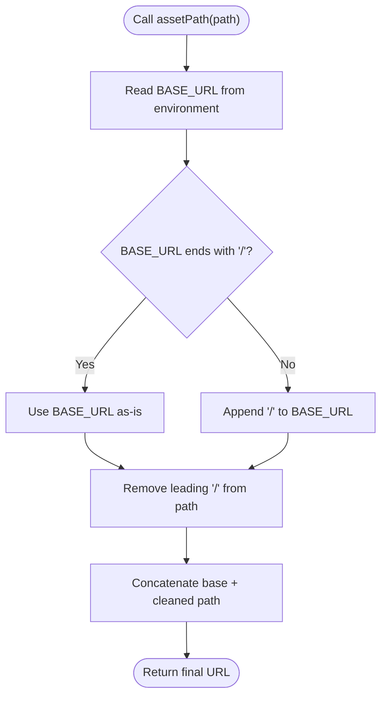
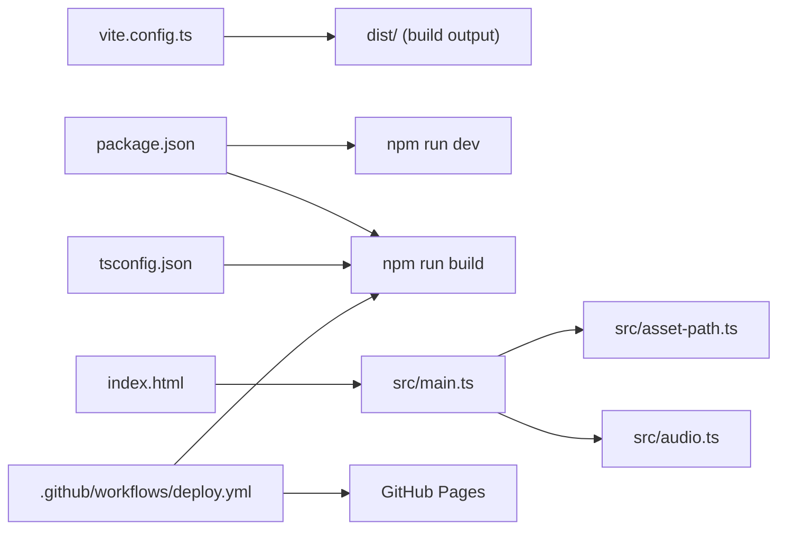

# Vite Configuration

<cite>
**Referenced Files in This Document**
- [vite.config.ts](file://vite.config.ts)
- [package.json](file://package.json)
- [index.html](file://index.html)
- [src/asset-path.ts](file://src/asset-path.ts)
- [src/audio.ts](file://src/audio.ts)
- [src/main.ts](file://src/main.ts)
- [.github/workflows/deploy.yml](file://.github/workflows/deploy.yml)
- [tsconfig.json](file://tsconfig.json)
</cite>

## Table of Contents
1. [Introduction](#introduction)
2. [Project Structure](#project-structure)
3. [Core Components](#core-components)
4. [Architecture Overview](#architecture-overview)
5. [Detailed Component Analysis](#detailed-component-analysis)
6. [Dependency Analysis](#dependency-analysis)
7. [Performance Considerations](#performance-considerations)
8. [Troubleshooting Guide](#troubleshooting-guide)
9. [Conclusion](#conclusion)

## Introduction
This document explains the Vite build configuration for this project with a focus on flexible deployment using a relative base path. The configuration uses a relative base to ensure assets and modules resolve correctly across different environments, including GitHub Pages subdirectories, custom domains, and nested routes. It also covers development server settings, asset handling, module resolution, optimization options available in Vite, and troubleshooting guidance for common deployment issues related to asset paths and resource loading.

## Project Structure
The project is a small TypeScript-based game built with Vite. Key files relevant to build and deployment include:
- Build configuration file that sets the base path
- Package scripts for development, building, and testing
- HTML entry point referencing the application module
- A utility for constructing absolute asset URLs at runtime based on the environment’s base URL
- Audio module that loads media via fetch using constructed paths
- CI workflow that builds and deploys to GitHub Pages
- TypeScript configuration used by the build step

**Diagram sources**
- [vite.config.ts:1-6](file://vite.config.ts#L1-L6)
- [index.html:19-20](file://index.html#L19-L20)
- [src/main.ts:1-10](file://src/main.ts#L1-L10)
- [src/asset-path.ts:1-5](file://src/asset-path.ts#L1-L5)
- [src/audio.ts:1-17](file://src/audio.ts#L1-L17)
- [.github/workflows/deploy.yml:37-49](file://.github/workflows/deploy.yml#L37-L49)
- [package.json:6-11](file://package.json#L6-L11)
- [tsconfig.json:1-20](file://tsconfig.json#L1-L20)

**Section sources**
- [vite.config.ts:1-6](file://vite.config.ts#L1-L6)
- [package.json:6-11](file://package.json#L6-L11)
- [index.html:19-20](file://index.html#L19-L20)
- [src/asset-path.ts:1-5](file://src/asset-path.ts#L1-L5)
- [src/audio.ts:1-17](file://src/audio.ts#L1-L17)
- [.github/workflows/deploy.yml:37-49](file://.github/workflows/deploy.yml#L37-L49)
- [tsconfig.json:1-20](file://tsconfig.json#L1-L20)

## Core Components
- Base path configuration: The build is configured to use a relative base path so that all generated asset URLs are resolved relative to the current page location. This enables seamless deployment under any root path, including GitHub Pages user or organization repositories.
- Development server: The development script starts Vite with an option to bind to all network interfaces, allowing access from other devices on the local network.
- Asset URL construction: A runtime helper constructs asset URLs by combining the environment-provided base URL with a normalized path segment. This ensures correct resolution regardless of where the app is hosted.
- Module entry: The HTML entry references the main module using a path that works with Vite’s development server and production bundling.
- CI/CD integration: The GitHub Actions workflow installs dependencies, runs tests, builds the project, and deploys the dist folder to GitHub Pages.

**Section sources**
- [vite.config.ts:3-5](file://vite.config.ts#L3-L5)
- [package.json:7-8](file://package.json#L7-L8)
- [src/asset-path.ts:1-5](file://src/asset-path.ts#L1-L5)
- [index.html:19-20](file://index.html#L19-L20)
- [.github/workflows/deploy.yml:31-49](file://.github/workflows/deploy.yml#L31-L49)

## Architecture Overview
At a high level, the build pipeline and runtime behavior are as follows:
- Vite reads the configuration and sets the base path to a relative value.
- During development, the dev server serves modules and assets using the configured base.
- At build time, Vite generates static assets and updates references according to the base path.
- At runtime, the application constructs asset URLs using the environment’s base URL and a normalization helper.
- The CI workflow builds the project and publishes the output to GitHub Pages.

**Diagram sources**
- [package.json:7-8](file://package.json#L7-L8)
- [vite.config.ts:3-5](file://vite.config.ts#L3-L5)
- [.github/workflows/deploy.yml:31-49](file://.github/workflows/deploy.yml#L31-L49)

## Detailed Component Analysis

### Base Path Configuration and Deployment Flexibility
- Relative base path: The configuration sets the base to a relative path. This means all asset URLs are resolved relative to the current page’s directory, enabling deployment to:
  - GitHub Pages repository roots and subpaths
  - Custom domains behind any path prefix
  - Nested routes within a larger site
- Environment variable usage: The runtime helper uses the environment’s BASE_URL to construct absolute paths for assets. Because the base is relative, this resolves correctly in both development and production regardless of hosting location.

Practical implications:
- No need to change configuration when moving between environments.
- Works out-of-the-box with GitHub Pages workflows that publish to the dist folder.

**Section sources**
- [vite.config.ts:3-5](file://vite.config.ts#L3-L5)
- [src/asset-path.ts:1-5](file://src/asset-path.ts#L1-L5)
- [.github/workflows/deploy.yml:37-49](file://.github/workflows/deploy.yml#L37-L49)

### Development Server Settings
- The development script starts Vite with a host binding option that allows access from other machines on the same network. This is useful for testing on mobile devices or collaborating locally.
- The HTML entry references the main module using a path that Vite understands during development.

Notes:
- In production builds, the host binding is not applied; only the base path affects asset resolution.

**Section sources**
- [package.json:7-8](file://package.json#L7-L8)
- [index.html:19-20](file://index.html#L19-L20)

### Asset Handling and Runtime URL Construction
- Centralized asset path helper: The helper normalizes the environment’s base URL and concatenates it with a provided path segment. It ensures there is exactly one separator between the base and the path and strips leading slashes from the path segment.
- Usage in code: The main module and audio module use the helper to reference images and audio files. This guarantees consistent resolution across environments.

**Diagram sources**
- [src/asset-path.ts:1-5](file://src/asset-path.ts#L1-L5)

**Section sources**
- [src/asset-path.ts:1-5](file://src/asset-path.ts#L1-L5)
- [src/main.ts:29](file://src/main.ts#L29)
- [src/audio.ts:8-17](file://src/audio.ts#L8-L17)

### Module Resolution and Entry Point
- The HTML entry imports the main module using a path that Vite resolves during development and bundles appropriately for production.
- TypeScript configuration uses a bundler-aware module resolution strategy compatible with Vite.

**Section sources**
- [index.html:19-20](file://index.html#L19-L20)
- [tsconfig.json:13](file://tsconfig.json#L13)

### CI/CD Integration for GitHub Pages
- The workflow installs dependencies, runs tests, builds the project, configures GitHub Pages, uploads the dist artifact, and deploys.
- Because the base path is relative, the published site works correctly under GitHub Pages’ default domain structure without additional path adjustments.

**Section sources**
- [.github/workflows/deploy.yml:31-49](file://.github/workflows/deploy.yml#L31-L49)

## Dependency Analysis
The following diagram shows how key files depend on each other during development and build:

**Diagram sources**
- [vite.config.ts:3-5](file://vite.config.ts#L3-L5)
- [package.json:7-8](file://package.json#L7-L8)
- [index.html:19-20](file://index.html#L19-L20)
- [src/main.ts:1-10](file://src/main.ts#L1-L10)
- [src/asset-path.ts:1-5](file://src/asset-path.ts#L1-L5)
- [src/audio.ts:1-17](file://src/audio.ts#L1-L17)
- [tsconfig.json:13](file://tsconfig.json#L13)
- [.github/workflows/deploy.yml:37-49](file://.github/workflows/deploy.yml#L37-L49)

**Section sources**
- [vite.config.ts:3-5](file://vite.config.ts#L3-L5)
- [package.json:7-8](file://package.json#L7-L8)
- [index.html:19-20](file://index.html#L19-L20)
- [src/main.ts:1-10](file://src/main.ts#L1-L10)
- [src/asset-path.ts:1-5](file://src/asset-path.ts#L1-L5)
- [src/audio.ts:1-17](file://src/audio.ts#L1-L17)
- [tsconfig.json:13](file://tsconfig.json#L13)
- [.github/workflows/deploy.yml:37-49](file://.github/workflows/deploy.yml#L37-L49)

## Performance Considerations
- Asset size and format: Prefer optimized image formats and compressed audio to reduce load times.
- Lazy loading: For large assets, consider lazy-loading strategies to improve initial load performance.
- Caching: Static assets benefit from long-term caching headers; ensure your hosting provider configures appropriate cache policies.
- Bundle size: Keep the application bundle lean by avoiding unnecessary dependencies and tree-shaking unused code.

[No sources needed since this section provides general guidance]

## Troubleshooting Guide
Common deployment issues and resolutions related to asset paths and resource loading:

- Assets return 404 after deploying to a subdirectory:
  - Ensure the base path is set to a relative path so that asset URLs resolve correctly under any root.
  - Verify that the runtime helper uses the environment’s base URL and that paths passed to it do not have conflicting leading slashes.

- Images or audio do not play in production but work locally:
  - Confirm that the asset paths match the actual file locations in the dist output.
  - Check that the base URL is correctly resolved in the deployed environment.

- Development server cannot be accessed from other devices:
  - Ensure the development script binds to all network interfaces and that firewalls allow inbound connections.

- GitHub Pages deployment fails due to missing dist:
  - Confirm the CI workflow builds the project and uploads the dist artifact.

- Mixed content or CORS errors:
  - Host assets on the same origin or configure proper CORS headers if loading from external origins.

**Section sources**
- [vite.config.ts:3-5](file://vite.config.ts#L3-L5)
- [src/asset-path.ts:1-5](file://src/asset-path.ts#L1-L5)
- [src/audio.ts:258-276](file://src/audio.ts#L258-L276)
- [package.json:7-8](file://package.json#L7-L8)
- [.github/workflows/deploy.yml:37-49](file://.github/workflows/deploy.yml#L37-L49)

## Conclusion
By configuring a relative base path and using a runtime helper to construct asset URLs, this project achieves flexible deployment across multiple environments without changing configuration. The development server supports local network access, and the CI workflow automates building and publishing to GitHub Pages. Following the troubleshooting guidance will help resolve common issues related to asset paths and resource loading.