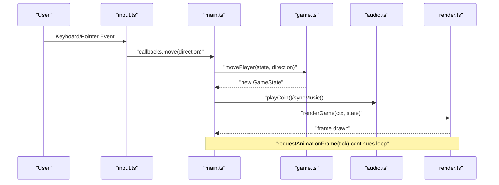
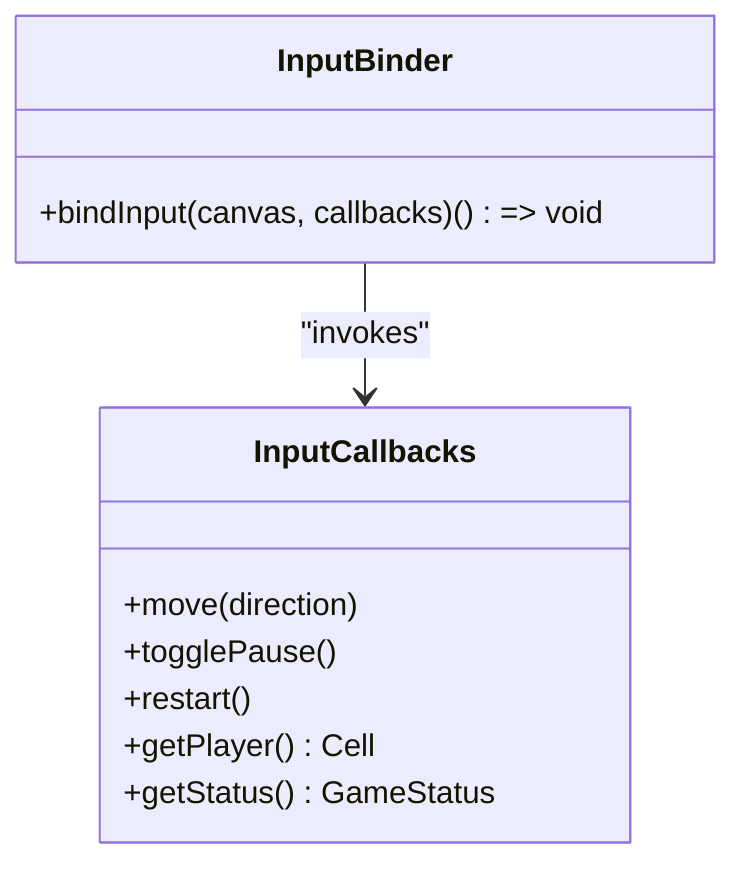
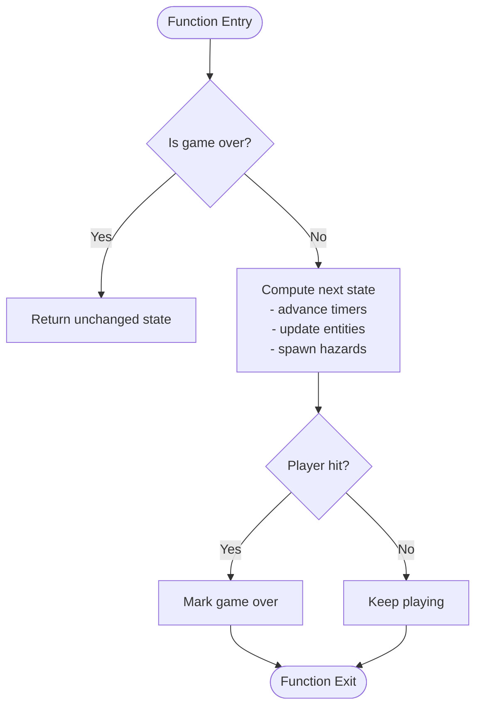
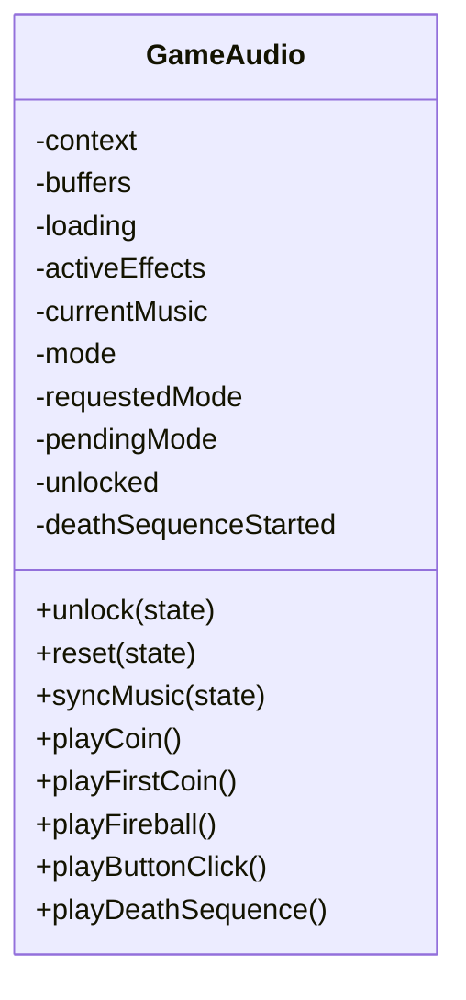
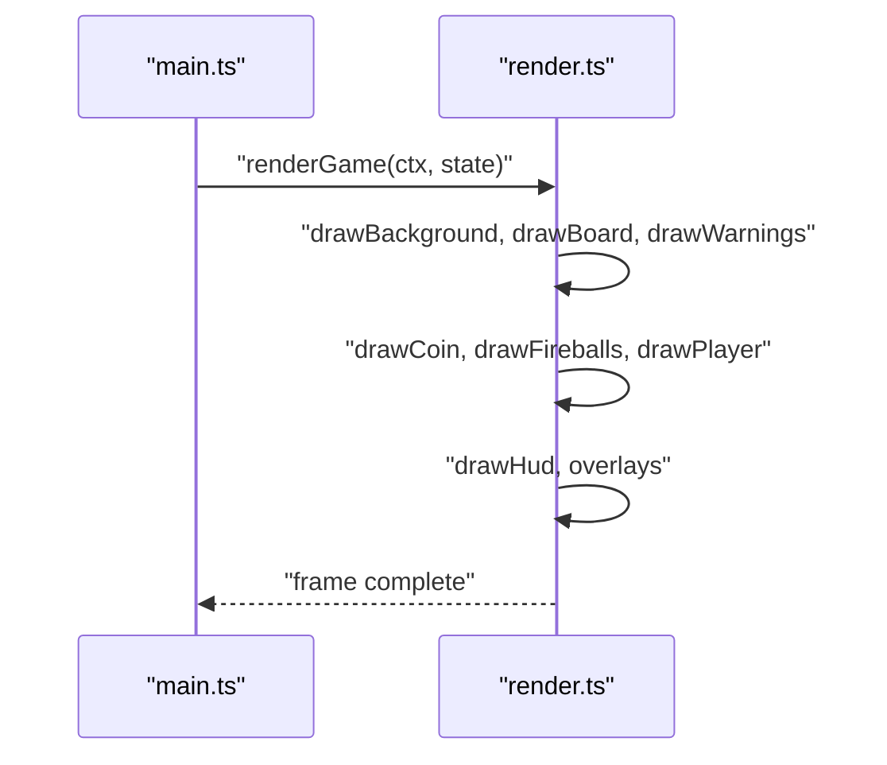
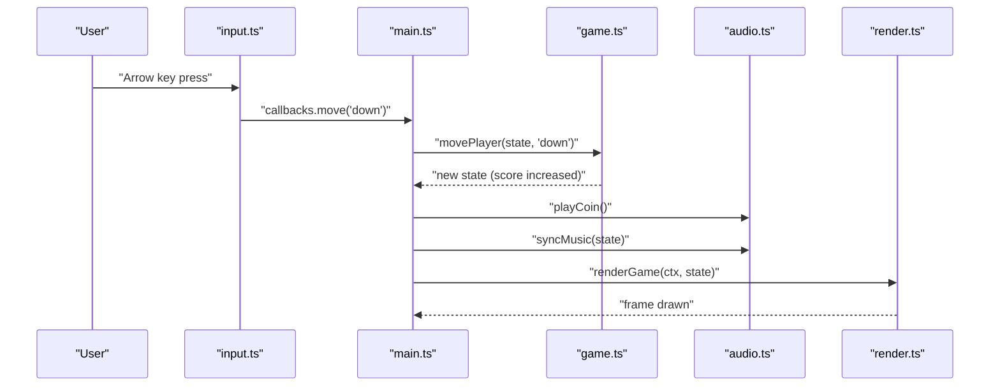
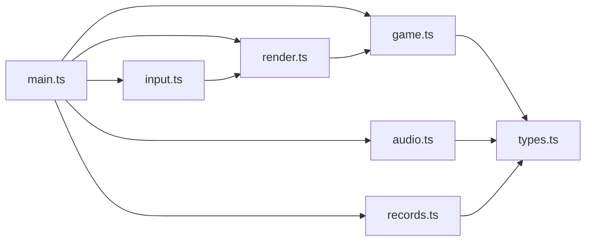

# Component Communication Patterns

<cite>
**Referenced Files in This Document**
- [main.ts](file://src/main.ts)
- [game.ts](file://src/game.ts)
- [input.ts](file://src/input.ts)
- [render.ts](file://src/render.ts)
- [audio.ts](file://src/audio.ts)
- [types.ts](file://src/types.ts)
- [records.ts](file://src/records.ts)
</cite>

## Table of Contents
1. [Introduction](#introduction)
2. [Project Structure](#project-structure)
3. [Core Components](#core-components)
4. [Architecture Overview](#architecture-overview)
5. [Detailed Component Analysis](#detailed-component-analysis)
6. [Dependency Analysis](#dependency-analysis)
7. [Performance Considerations](#performance-considerations)
8. [Troubleshooting Guide](#troubleshooting-guide)
9. [Conclusion](#conclusion)

## Introduction
This document explains how components communicate in Raid and Run’s modular architecture. The system is event-driven: user input events trigger game state updates, which then notify audio and rendering systems. Input handling uses an observer-like callback interface so multiple listeners can respond to user actions without tight coupling. The render system receives the current game state as a pure function argument, avoiding direct coupling to game logic. We trace data flow from user interaction through the entire system: input → game state update → audio feedback → visual rendering. Finally, we discuss how this decoupled design supports extensibility and makes individual components easier to test and maintain.

## Project Structure
The application is organized by responsibility:
- main.ts wires up the runtime loop, initializes subsystems, and coordinates high-level flows.
- input.ts captures keyboard and pointer events and dispatches them via callbacks.
- game.ts contains pure functions that compute new game state from previous state and inputs.
- render.ts draws the current state onto a Canvas.
- audio.ts manages Web Audio playback and music modes based on game state.
- types.ts defines shared interfaces and constants.
- records.ts persists best scores and world records.

```mermaid
graph TB
subgraph "Runtime"
Main["main.ts"]
end
subgraph "Input"
Input["input.ts"]
end
subgraph "Game Logic"
Game["game.ts"]
end
subgraph "Audio"
Audio["audio.ts"]
end
subgraph "Render"
Render["render.ts"]
end
subgraph "Persistence"
Records["records.ts"]
end
Input --> Main
Main --> Game
Main --> Audio
Main --> Render
Main --> Records
```

**Diagram sources**
- [main.ts:1-160](file://src/main.ts#L1-L160)
- [input.ts:1-255](file://src/input.ts#L1-L255)
- [game.ts:1-426](file://src/game.ts#L1-L426)
- [audio.ts:1-296](file://src/audio.ts#L1-L296)
- [render.ts:1-721](file://src/render.ts#L1-L721)
- [records.ts:1-52](file://src/records.ts#L1-L52)

**Section sources**
- [main.ts:1-160](file://src/main.ts#L1-L160)
- [input.ts:1-255](file://src/input.ts#L1-L255)
- [game.ts:1-426](file://src/game.ts#L1-L426)
- [audio.ts:1-296](file://src/audio.ts#L1-L296)
- [render.ts:1-721](file://src/render.ts#L1-L721)
- [records.ts:1-52](file://src/records.ts#L1-L52)

## Core Components
- Input layer (observer-like): Captures keyboard and pointer events and invokes provided callbacks for move, togglePause, restart, and queries for player position and status. It does not know about game logic or rendering.
- Game engine (pure functions): Computes next state deterministically from current state and inputs. No side effects; no DOM or media access.
- Audio manager: Encapsulates Web Audio context, buffers, and music mode transitions. Responds to explicit calls from the orchestrator.
- Renderer: Purely consumes the current state to draw frames. No knowledge of input or game rules.
- Persistence: Stores and loads score records with a simple interface.

Key responsibilities and contracts are defined in shared types.

**Section sources**
- [input.ts:1-255](file://src/input.ts#L1-L255)
- [game.ts:1-426](file://src/game.ts#L1-L426)
- [audio.ts:1-296](file://src/audio.ts#L1-L296)
- [render.ts:1-721](file://src/render.ts#L1-L721)
- [types.ts:1-54](file://src/types.ts#L1-L54)
- [records.ts:1-52](file://src/records.ts#L1-L52)

## Architecture Overview
At a high level, main.ts acts as the orchestrator:
- It binds input handlers that call into game logic.
- It runs a fixed-step game loop using requestAnimationFrame.
- After each state transition, it triggers audio cues and renders the frame.



**Diagram sources**
- [input.ts:28-214](file://src/input.ts#L28-L214)
- [main.ts:69-136](file://src/main.ts#L69-L136)
- [game.ts:58-101](file://src/game.ts#L58-L101)
- [audio.ts:65-132](file://src/audio.ts#L65-L132)
- [render.ts:166-185](file://src/render.ts#L166-L185)

## Detailed Component Analysis

### Input Handling and Observer Pattern
The input module exposes a single binding function that accepts a set of callbacks. This implements an observer-like pattern where the input layer notifies subscribers (the orchestrator) of user actions without knowing their implementation details. Multiple behaviors can be attached by passing different callbacks (e.g., move, pause, restart). The input layer also provides read-only queries (getPlayer, getStatus) to make decisions like swipe vs tap.



**Diagram sources**
- [input.ts:4-10](file://src/input.ts#L4-L10)
- [input.ts:28-214](file://src/input.ts#L28-L214)

**Section sources**
- [input.ts:1-255](file://src/input.ts#L1-L255)

### Game State Updates (Pure Functions)
Game logic is implemented as pure functions that take the current state and return a new immutable state. This eliminates hidden side effects and makes testing straightforward. Key functions include:
- createInitialGameState: builds a fresh state snapshot.
- movePlayer: applies directional movement, coin collection, collision checks, and game over transitions.
- updateGame: advances time, updates fireballs, spawns new threats, and checks collisions.



**Diagram sources**
- [game.ts:83-101](file://src/game.ts#L83-L101)
- [game.ts:58-81](file://src/game.ts#L58-L81)

**Section sources**
- [game.ts:1-426](file://src/game.ts#L1-L426)

### Audio Feedback and Music Modes
The audio manager encapsulates Web Audio usage and exposes methods to play effects and synchronize music based on game state. It maintains internal state for music modes and effect playback, ensuring only one music track plays at a time and effects do not overlap undesirably.



**Diagram sources**
- [audio.ts:37-132](file://src/audio.ts#L37-L132)

**Section sources**
- [audio.ts:1-296](file://src/audio.ts#L1-L296)

### Rendering System (Stateless Drawing)
The renderer takes a CanvasRenderingContext2D and the current GameState and draws everything needed for the frame. It has no knowledge of input or game rules, making it easy to swap out or test with mock contexts and states.



**Diagram sources**
- [render.ts:166-185](file://src/render.ts#L166-L185)

**Section sources**
- [render.ts:1-721](file://src/render.ts#L1-L721)

### Data Flow Example: From Interaction to Frame
This sequence shows a typical path when the player collects a coin:



**Diagram sources**
- [input.ts:91-113](file://src/input.ts#L91-L113)
- [main.ts:69-87](file://src/main.ts#L69-L87)
- [game.ts:58-81](file://src/game.ts#L58-L81)
- [audio.ts:78-108](file://src/audio.ts#L78-L108)
- [render.ts:166-185](file://src/render.ts#L166-L185)

## Dependency Analysis
The following diagram maps imports and interactions between modules:



**Diagram sources**
- [main.ts:1-10](file://src/main.ts#L1-L10)
- [input.ts:1-2](file://src/input.ts#L1-L2)
- [render.ts:1-3](file://src/render.ts#L1-L3)
- [game.ts:1-2](file://src/game.ts#L1-L2)
- [audio.ts:1-2](file://src/audio.ts#L1-L2)
- [records.ts:1-1](file://src/records.ts#L1-L1)
- [types.ts:1-54](file://src/types.ts#L1-L54)

**Section sources**
- [main.ts:1-10](file://src/main.ts#L1-L10)
- [input.ts:1-2](file://src/input.ts#L1-L2)
- [render.ts:1-3](file://src/render.ts#L1-L3)
- [game.ts:1-2](file://src/game.ts#L1-L2)
- [audio.ts:1-2](file://src/audio.ts#L1-L2)
- [records.ts:1-1](file://src/records.ts#L1-L1)
- [types.ts:1-54](file://src/types.ts#L1-L54)

## Performance Considerations
- Fixed timestep game loop: main.ts accumulates elapsed time and steps the simulation at a constant rate, ensuring deterministic behavior across frame rates.
- Decoupled rendering: renderGame is called once per frame with the latest state, keeping drawing code simple and predictable.
- Audio buffering: audio.ts preloads audio buffers and reuses them, minimizing latency during gameplay.
- Avoiding unnecessary work: input.ts debounces repeated moves while holding keys, reducing redundant state updates.

[No sources needed since this section provides general guidance]

## Troubleshooting Guide
Common issues and where to look:
- Audio not playing: Ensure unlock is called after user interaction. The audio manager requires an unlocked context before playing.
- Input not responding: Verify bindInput is called with correct canvas and callbacks, and that the canvas is focused.
- Stuttering or inconsistent timing: Confirm the accumulator and fixed step logic in the main loop are intact and not interrupted by heavy synchronous operations.
- Rendering artifacts: Check that renderGame receives a valid CanvasRenderingContext2D and that image assets are loaded before first draw.

**Section sources**
- [audio.ts:59-76](file://src/audio.ts#L59-L76)
- [input.ts:28-214](file://src/input.ts#L28-L214)
- [main.ts:107-136](file://src/main.ts#L107-L136)
- [render.ts:166-185](file://src/render.ts#L166-L185)

## Conclusion
Raid and Run’s architecture separates concerns cleanly:
- Input is observer-like, notifying the orchestrator via callbacks.
- Game logic is pure and stateless, enabling reliable updates and tests.
- Audio and rendering consume state explicitly, avoiding hidden dependencies.
This design makes it easy to extend features (e.g., adding analytics or replay) by attaching additional observers or reacting to state changes without modifying core logic. Individual components are independently testable: input callbacks can be mocked, game functions can be unit-tested with snapshots, audio can be stubbed, and rendering can be validated against known state snapshots.