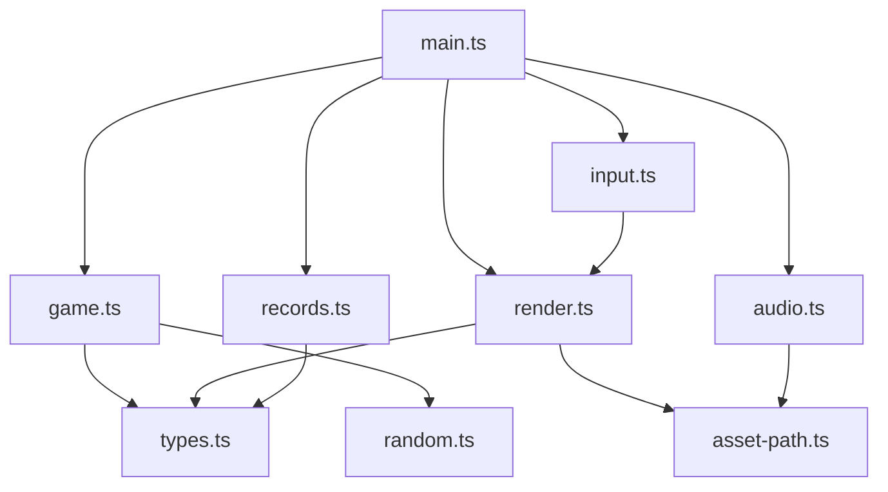
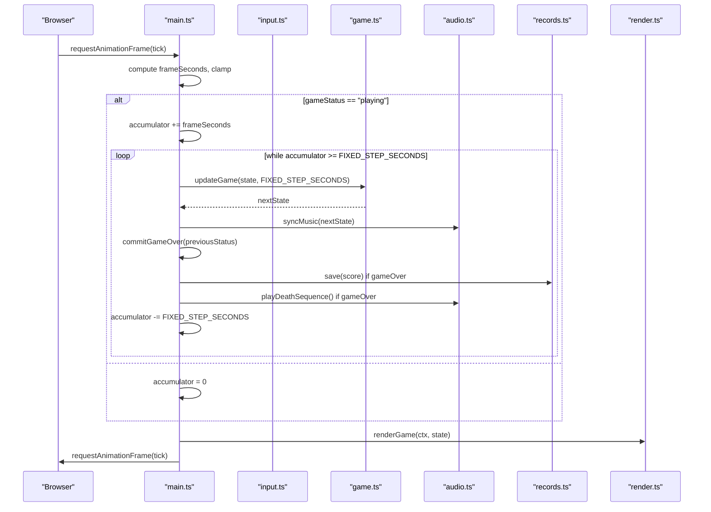
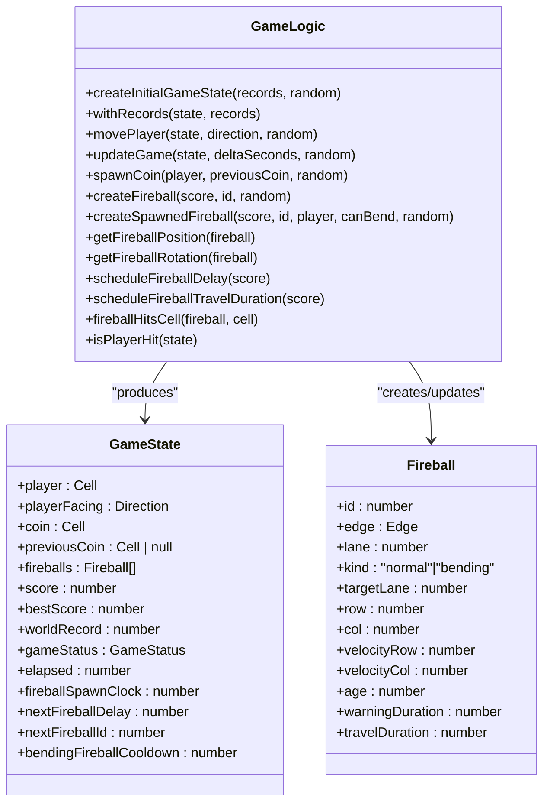
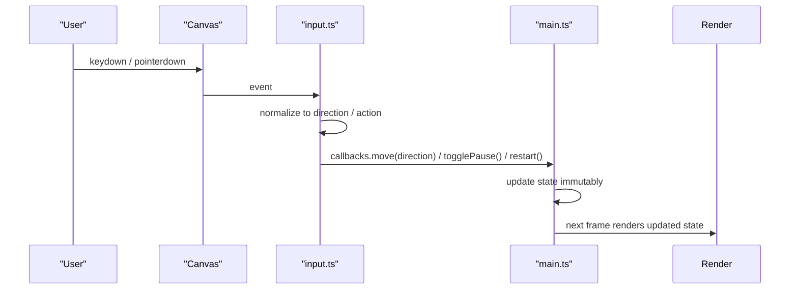
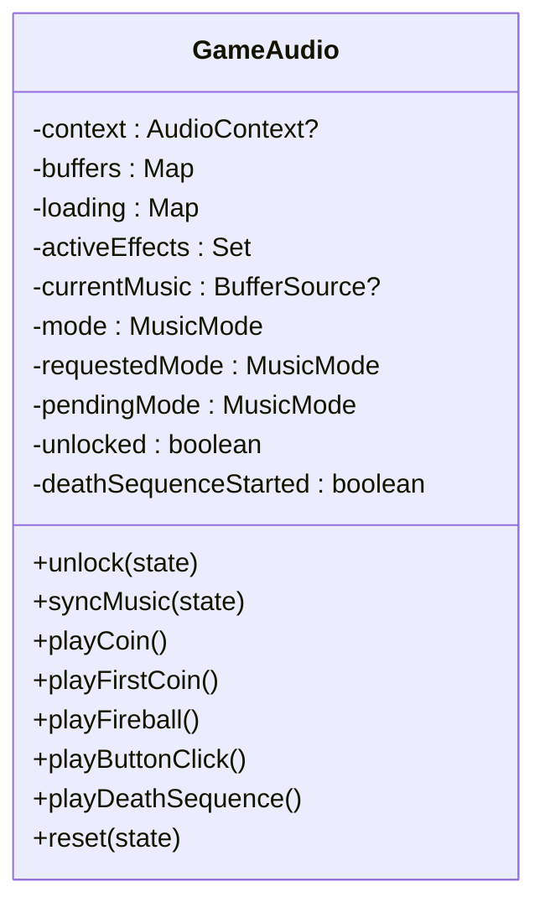
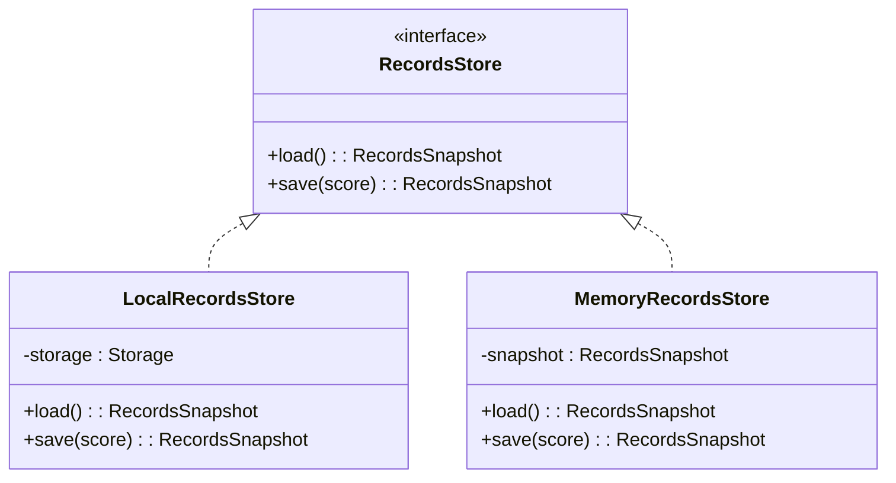
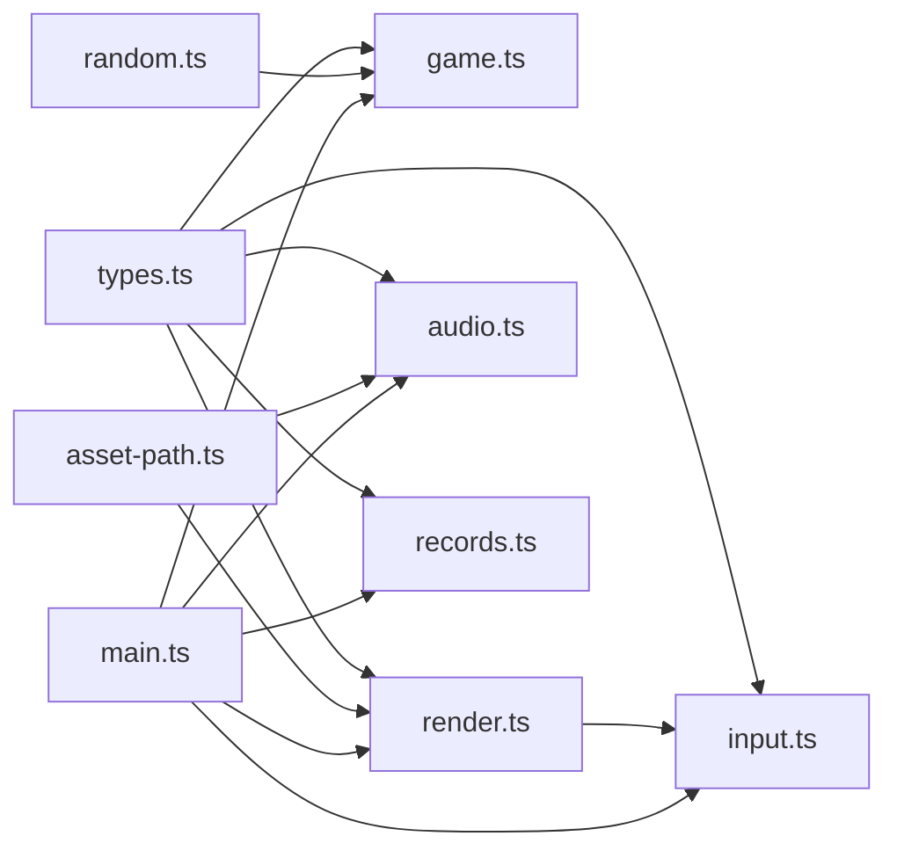

# Core Architecture

<cite>
**Referenced Files in This Document**
- [main.ts](file://src/main.ts)
- [game.ts](file://src/game.ts)
- [types.ts](file://src/types.ts)
- [input.ts](file://src/input.ts)
- [render.ts](file://src/render.ts)
- [audio.ts](file://src/audio.ts)
- [records.ts](file://src/records.ts)
- [random.ts](file://src/random.ts)
- [asset-path.ts](file://src/asset-path.ts)
- [README.md](file://README.md)
</cite>

## Table of Contents
1. [Introduction](#introduction)
2. [Project Structure](#project-structure)
3. [Core Components](#core-components)
4. [Architecture Overview](#architecture-overview)
5. [Detailed Component Analysis](#detailed-component-analysis)
6. [Dependency Analysis](#dependency-analysis)
7. [Performance Considerations](#performance-considerations)
8. [Troubleshooting Guide](#troubleshooting-guide)
9. [Conclusion](#conclusion)

## Introduction
This document describes the architecture of the Raid and Run game engine. It explains how the system is organized into modular, functional components with a fixed time step loop, immutable state transitions, and clear separation between game logic, rendering, input handling, audio, and persistence. The main entry point orchestrates subsystems using dependency injection to keep concerns isolated and testable.

## Project Structure
The project follows a small, focused structure:
- Entry and orchestration: main.ts
- Game logic (pure functions): game.ts
- Types and constants: types.ts
- Input handling: input.ts
- Rendering: render.ts
- Audio: audio.ts
- Persistence: records.ts
- Randomness abstraction: random.ts
- Asset path resolution: asset-path.ts
- Documentation and build configuration files at repository root



**Diagram sources**
- [main.ts:1-160](file://src/main.ts#L1-L160)
- [game.ts:1-426](file://src/game.ts#L1-L426)
- [types.ts:1-54](file://src/types.ts#L1-L54)
- [input.ts:1-255](file://src/input.ts#L1-L255)
- [render.ts:1-721](file://src/render.ts#L1-L721)
- [audio.ts:1-296](file://src/audio.ts#L1-L296)
- [records.ts:1-52](file://src/records.ts#L1-L52)
- [random.ts:1-18](file://src/random.ts#L1-L18)
- [asset-path.ts:1-5](file://src/asset-path.ts#L1-L5)

**Section sources**
- [README.md:1-30](file://README.md#L1-L30)

## Core Components
- Fixed-step game loop: accumulates elapsed time and advances simulation by a constant step size each frame.
- Immutable state: all game logic returns new state objects; no mutation of existing state.
- Pure functions: game updates are deterministic given inputs and randomness source.
- Dependency injection: main.ts wires together input, game logic, rendering, audio, and persistence.
- Separation of concerns:
  - Logic: game.ts
  - Rendering: render.ts
  - Input: input.ts
  - Audio: audio.ts
  - Persistence: records.ts
  - Types and constants: types.ts
  - Randomness: random.ts
  - Asset paths: asset-path.ts

Key responsibilities:
- main.ts: bootstraps subsystems, runs the loop, handles UI events, persists records on game over.
- game.ts: pure functions for state transitions, fireball spawning/movement/collision, coin collection, difficulty scaling.
- input.ts: keyboard and pointer/touch input mapped to directional moves, pause/restart actions.
- render.ts: draws background, grid, player, coins, warnings, fireballs, HUD, overlays.
- audio.ts: manages AudioContext, music modes, sound effects, volume control, unlock behavior.
- records.ts: interface and implementations for best score and world record storage.
- random.ts: seeded RNG abstraction for deterministic tests.
- asset-path.ts: resolves base URL for assets.

**Section sources**
- [main.ts:1-160](file://src/main.ts#L1-L160)
- [game.ts:1-426](file://src/game.ts#L1-L426)
- [input.ts:1-255](file://src/input.ts#L1-L255)
- [render.ts:1-721](file://src/render.ts#L1-L721)
- [audio.ts:1-296](file://src/audio.ts#L1-L296)
- [records.ts:1-52](file://src/records.ts#L1-L52)
- [random.ts:1-18](file://src/random.ts#L1-L18)
- [asset-path.ts:1-5](file://src/asset-path.ts#L1-L5)
- [types.ts:1-54](file://src/types.ts#L1-L54)

## Architecture Overview
The engine uses a classic fixed timestep loop with an accumulator. Each frame:
- Compute delta time and clamp it to a maximum to avoid spiral-of-death.
- If playing, add delta to accumulator and repeatedly advance simulation by FIXED_STEP_SECONDS until accumulator < FIXED_STEP_SECONDS.
- After each update, trigger side effects like audio cues and persisting records when transitioning to game over.
- Render once per frame from current state.

State is immutable: every update function returns a new GameState object. This ensures determinism and simplifies testing and debugging.



**Diagram sources**
- [main.ts:107-136](file://src/main.ts#L107-L136)
- [game.ts:83-101](file://src/game.ts#L83-L101)
- [audio.ts:65-76](file://src/audio.ts#L65-L76)
- [records.ts:20-29](file://src/records.ts#L20-L29)
- [render.ts:166-185](file://src/render.ts#L166-L185)

## Detailed Component Analysis

### Fixed Time Step Loop and Orchestration (main.ts)
Responsibilities:
- Initialize canvas, context, records store, audio, initial state.
- Bind input callbacks that read current state via getters and dispatch actions.
- Manage restart/pause flows and button visibility based on game status.
- Implement tick loop with accumulator and fixed step updates.
- Persist records and play death sequence on transition to game over.

Design highlights:
- Dependency injection: main.ts constructs RecordsStore, GameAudio, and passes them into initialization and event handlers.
- Side effects are centralized around state transitions to maintain purity in game.ts.
- Deterministic updates: movePlayer and updateGame accept optional RandomSource for reproducibility.

```mermaid
flowchart TD
Start([tick(now)]) --> Delta["frameSeconds = min(MAX_FRAME_SECONDS, now - lastFrameTime)"]
Delta --> UpdateLast["lastFrameTime = now"]
UpdateLast --> Status{"state.gameStatus == 'playing'?"}
Status --> |Yes| AccAdd["accumulator += frameSeconds"]
AccAdd --> CheckAcc{"accumulator >= FIXED_STEP_SECONDS?"}
CheckAcc --> |Yes| Update["state = updateGame(state, FIXED_STEP_SECONDS)"]
Update --> AudioSync["audio.syncMusic(state)"]
AudioSync --> Commit["commitGameOver(previousStatus)"]
Commit --> AccSub["accumulator -= FIXED_STEP_SECONDS"]
AccSub --> CheckAcc
CheckAcc --> |No| Render["renderGame(ctx, state)"]
Status --> |No| ResetAcc["accumulator = 0"]
ResetAcc --> Render
Render --> NextFrame["requestAnimationFrame(tick)"]
```

**Diagram sources**
- [main.ts:107-136](file://src/main.ts#L107-L136)

**Section sources**
- [main.ts:1-160](file://src/main.ts#L1-L160)

### Pure Functional State Management (game.ts)
Responsibilities:
- Define constants for gameplay tuning.
- Provide createInitialGameState and withRecords to construct and patch state.
- Implement movePlayer for discrete movement, coin collection, and collision checks.
- Implement updateGame for time-based updates: fireball aging, spawner advancement, and collision.
- Fireball utilities: creation, position/rotation computation, travel progress, hit detection.
- Difficulty scaling: spawn delay and travel duration depend on score.

Immutable patterns:
- All functions return new state or entity objects without mutating inputs.
- Spawning and movement use functional composition of small helpers.



**Diagram sources**
- [game.ts:29-101](file://src/game.ts#L29-L101)
- [game.ts:113-166](file://src/game.ts#L113-L166)
- [game.ts:168-223](file://src/game.ts#L168-L223)
- [game.ts:225-279](file://src/game.ts#L225-L279)
- [types.ts:28-43](file://src/types.ts#L28-L43)

**Section sources**
- [game.ts:1-426](file://src/game.ts#L1-L426)
- [types.ts:1-54](file://src/types.ts#L1-L54)

### Input Handling (input.ts)
Responsibilities:
- Map keyboard keys to directions and special actions (pause, restart).
- Support pointer/touch interactions: tap, swipe, hold-and-repeat.
- Provide callbacks to main.ts for move, togglePause, restart, and state queries.

Behavioral notes:
- Hold-and-repeat uses timers with configurable delays.
- Swipe threshold determines direction changes during pointer drag.
- Restart triggers on specific keys or taps when game over.



**Diagram sources**
- [input.ts:28-214](file://src/input.ts#L28-L214)
- [main.ts:89-98](file://src/main.ts#L89-L98)

**Section sources**
- [input.ts:1-255](file://src/input.ts#L1-L255)

### Rendering (render.ts)
Responsibilities:
- Draw background, procedural board, snow animation.
- Draw HUD elements: score, best, world record.
- Draw game entities: player, coin, warnings, fireballs.
- Overlay pause and game over screens.
- Convert canvas coordinates to grid cells for input mapping.

Design notes:
- Uses sprite frames with fallback procedural drawing when assets are not ready.
- Exposes CANVAS_WIDTH/HEIGHT and cell-to-pixel conversion used by input.ts.

```mermaid
flowchart TD
RStart([renderGame(ctx, state)]) --> Clear["clearRect"]
Clear --> BG["drawBackground(elapsed)"]
BG --> Board["drawBoard(elapsed)"]
Board --> Warnings["drawWarnings(fireballs, elapsed)"]
Warnings --> Coin["drawCoinInCell(coin, elapsed)"]
Coin --> Fireballs["drawFireballs(fireballs, elapsed)"]
Fireballs --> Player["drawPlayer(state, isGameOver)"]
Player --> HUD["drawHud(state)"]
HUD --> Overlays{"gameStatus"}
Overlays --> |paused| Pause["drawPauseOverlay"]
Overlays --> |gameOver| GO["drawGameOver(state)"]
Pause --> REnd([done])
GO --> REnd
Overlays --> |playing| REnd
```

**Diagram sources**
- [render.ts:166-185](file://src/render.ts#L166-L185)

**Section sources**
- [render.ts:1-721](file://src/render.ts#L1-L721)

### Audio System (audio.ts)
Responsibilities:
- Manage AudioContext lifecycle and unlocking after user interaction.
- Play looping music tracks with mode switching based on game state.
- Queue and play one-shot sound effects with volume control.
- Handle death sequence: stop music, play effect, then switch to game over music.

Integration points:
- main.ts calls unlock, syncMusic, and effect playback methods at appropriate times.
- Uses asset-path.ts to resolve audio file URLs.



**Diagram sources**
- [audio.ts:37-132](file://src/audio.ts#L37-L132)

**Section sources**
- [audio.ts:1-296](file://src/audio.ts#L1-L296)

### Persistence (records.ts)
Responsibilities:
- Define RecordsStore interface for loading/saving best score and world record.
- LocalRecordsStore implementation using Storage (e.g., localStorage).
- MemoryRecordsStore implementation for testing or environments without persistent storage.

Integration points:
- main.ts creates a RecordsStore instance and uses it to load initial records and save on game over.



**Diagram sources**
- [records.ts:11-51](file://src/records.ts#L11-L51)
- [types.ts:45-53](file://src/types.ts#L45-L53)

**Section sources**
- [records.ts:1-52](file://src/records.ts#L1-L52)

### Randomness Abstraction (random.ts)
Responsibilities:
- Provide randomInt(maxExclusive, random) to generate integers within range.
- Provide mulberry32(seed) to create a deterministic PRNG for tests.

Usage:
- game.ts accepts an optional RandomSource parameter to allow deterministic simulations and tests.

**Section sources**
- [random.ts:1-18](file://src/random.ts#L1-L18)

### Asset Path Resolution (asset-path.ts)
Responsibilities:
- Normalize BASE_URL and prepend it to asset paths consistently across modules.

Used by:
- render.ts and audio.ts to locate images and audio files.

**Section sources**
- [asset-path.ts:1-5](file://src/asset-path.ts#L1-L5)

## Dependency Analysis
High-level dependencies:
- main.ts depends on all subsystems and orchestrates their interactions.
- game.ts depends only on types.ts and random.ts, keeping logic pure and portable.
- render.ts depends on types.ts and asset-path.ts, plus game.ts for computed positions/rotations.
- input.ts depends on render.ts for coordinate conversion and types.ts for shared types.
- audio.ts depends on asset-path.ts and types.ts for state-driven music selection.
- records.ts depends on types.ts for snapshot shape.



**Diagram sources**
- [main.ts:1-10](file://src/main.ts#L1-L10)
- [game.ts:1-2](file://src/game.ts#L1-L2)
- [render.ts:1-3](file://src/render.ts#L1-L3)
- [input.ts:1-2](file://src/input.ts#L1-L2)
- [audio.ts:1-2](file://src/audio.ts#L1-L2)
- [records.ts:1](file://src/records.ts#L1-L1)
- [asset-path.ts:1](file://src/asset-path.ts#L1-L1)

**Section sources**
- [main.ts:1-160](file://src/main.ts#L1-L160)
- [game.ts:1-426](file://src/game.ts#L1-L426)
- [render.ts:1-721](file://src/render.ts#L1-L721)
- [input.ts:1-255](file://src/input.ts#L1-L255)
- [audio.ts:1-296](file://src/audio.ts#L1-L296)
- [records.ts:1-52](file://src/records.ts#L1-L52)
- [random.ts:1-18](file://src/random.ts#L1-L18)
- [asset-path.ts:1-5](file://src/asset-path.ts#L1-L5)
- [types.ts:1-54](file://src/types.ts#L1-L54)

## Performance Considerations
- Fixed timestep prevents physics drift and keeps simulation deterministic regardless of frame rate.
- Clamping max frame seconds avoids large accumulator spikes that could cause lag.
- Rendering uses sprite caching and falls back to procedural drawing when assets are not ready, reducing stalls.
- Audio buffers are preloaded and reused; music switching avoids unnecessary re-decoding.
- Input repeat timers are cleared on state changes to prevent stale actions.

[No sources needed since this section provides general guidance]

## Troubleshooting Guide
Common issues and resolutions:
- Canvas not supported: main.ts throws an error if getContext fails. Ensure browser supports CanvasRenderingContext2D.
- Audio not playing: browsers require user gesture to unlock AudioContext. main.ts calls unlock on pointerdown/click and button interactions.
- Assets missing: render.ts and audio.ts gracefully fall back to procedural visuals or silent audio when resources are unavailable.
- High CPU usage: ensure MAX_FRAME_SECONDS is reasonable and that updateGame remains O(n) with respect to active fireballs.

**Section sources**
- [main.ts:31-35](file://src/main.ts#L31-L35)
- [main.ts:99-103](file://src/main.ts#L99-L103)
- [render.ts:133-139](file://src/render.ts#L133-L139)
- [audio.ts:59-63](file://src/audio.ts#L59-L63)

## Conclusion
The Raid and Run engine demonstrates a clean, modular architecture centered on immutable state and pure functions. The fixed timestep loop guarantees consistent simulation, while dependency injection in main.ts cleanly wires subsystems. This design promotes extensibility (new mechanics integrate as pure functions), testability (seeded RNG and isolated modules), and maintainability (clear separation of concerns).

[No sources needed since this section summarizes without analyzing specific files]