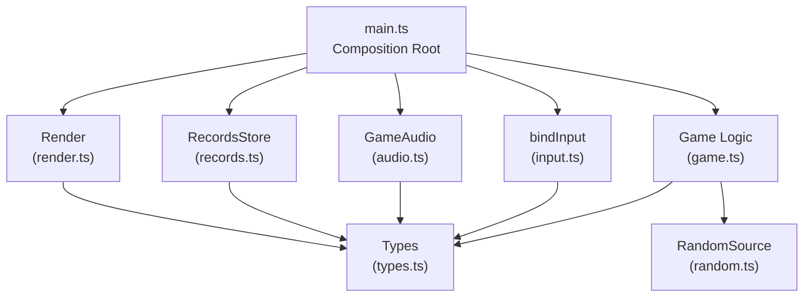
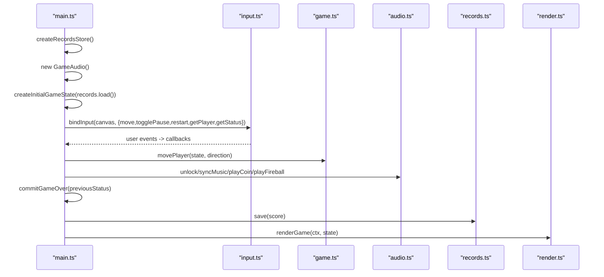
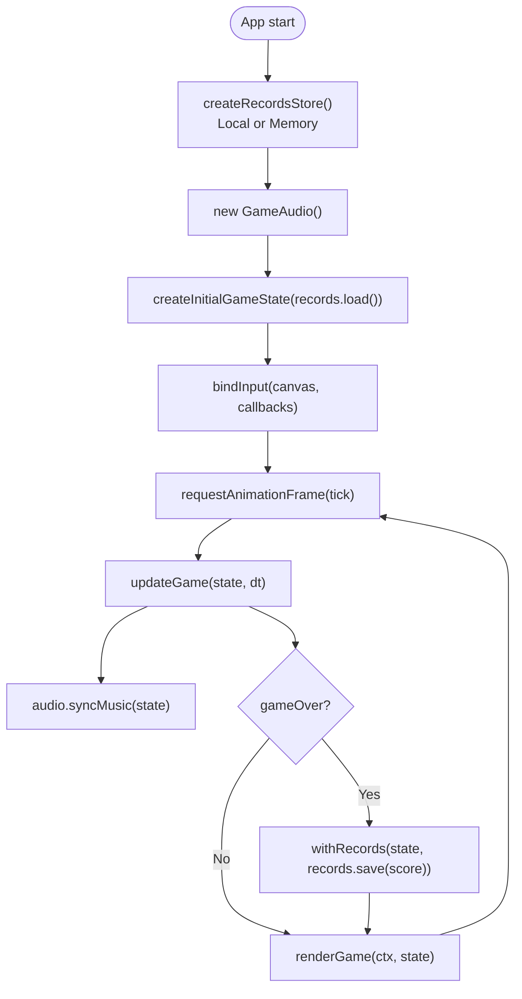
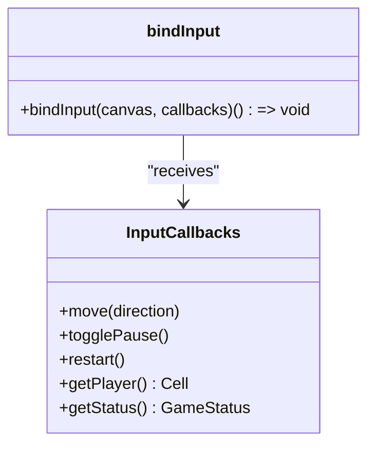
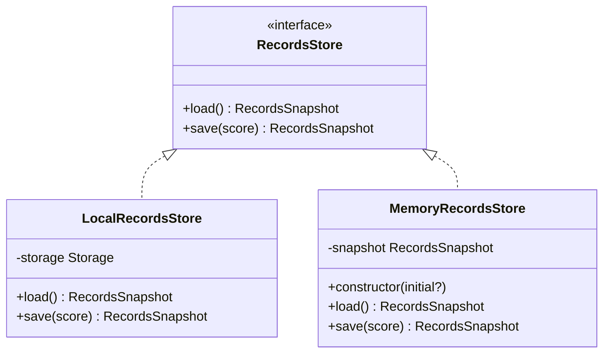
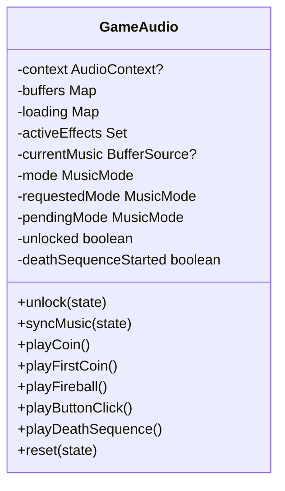
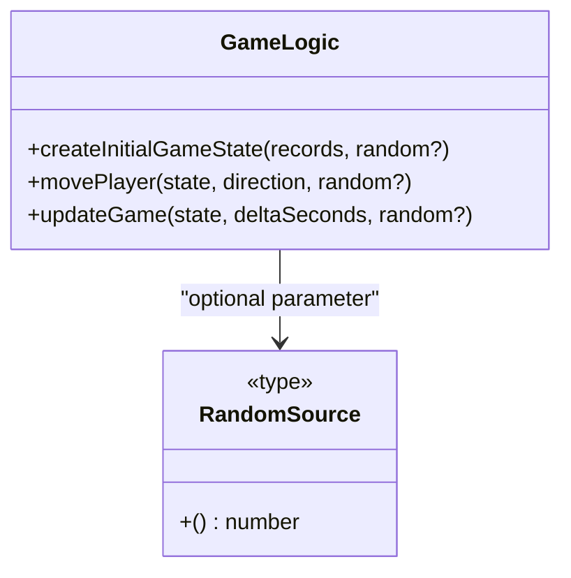
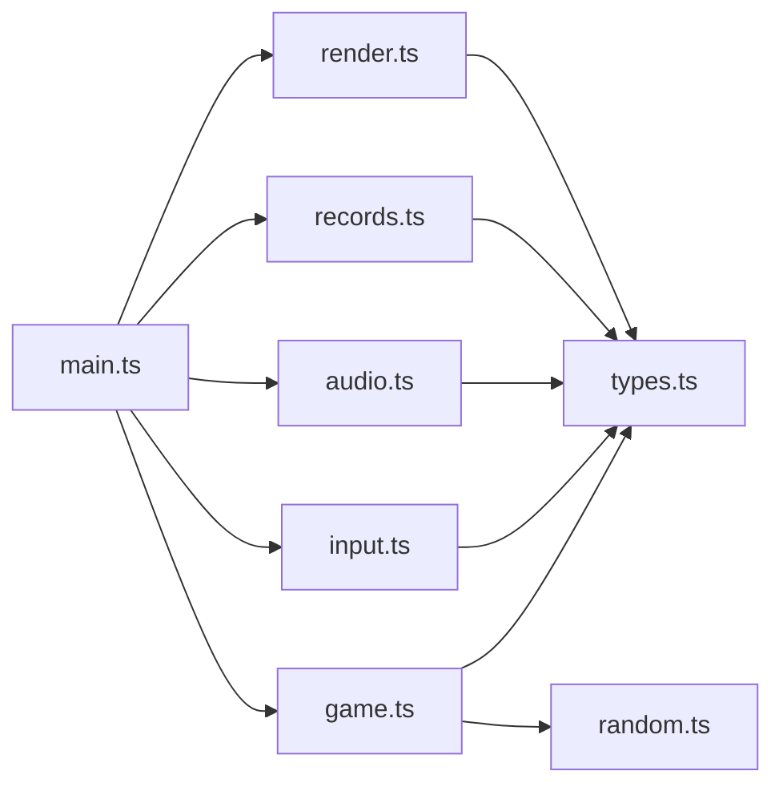

# Dependency Injection Pattern

<cite>
**Referenced Files in This Document**
- [main.ts](file://src/main.ts)
- [game.ts](file://src/game.ts)
- [audio.ts](file://src/audio.ts)
- [records.ts](file://src/records.ts)
- [input.ts](file://src/input.ts)
- [types.ts](file://src/types.ts)
- [render.ts](file://src/render.ts)
- [random.ts](file://src/random.ts)
</cite>

## Table of Contents
1. [Introduction](#introduction)
2. [Project Structure](#project-structure)
3. [Core Components](#core-components)
4. [Architecture Overview](#architecture-overview)
5. [Detailed Component Analysis](#detailed-component-analysis)
6. [Dependency Analysis](#dependency-analysis)
7. [Performance Considerations](#performance-considerations)
8. [Troubleshooting Guide](#troubleshooting-guide)
9. [Conclusion](#conclusion)

## Introduction
This document explains the dependency injection (DI) pattern used throughout Raid and Run. The application is composed around a clear composition root in main.ts that wires together subsystems such as GameAudio, RecordsStore implementations, input handlers, and game logic. Instead of relying on global state or singletons, components receive their dependencies through function parameters and callback interfaces. This design improves separation of concerns, makes behavior explicit, and enables straightforward unit testing by substituting mock implementations for records stores, audio systems, and random sources.

## Project Structure
The project follows a feature-oriented layout with thin orchestration at the top-level entry point:
- Composition root and runtime wiring: src/main.ts
- Game logic and pure functions: src/game.ts
- Audio system abstraction: src/audio.ts
- Records persistence abstraction and implementations: src/records.ts
- Input handling via callbacks: src/input.ts
- Rendering and canvas utilities: src/render.ts
- Shared types and interfaces: src/types.ts
- Random source abstraction: src/random.ts

**Diagram sources**
- [main.ts:1-160](file://src/main.ts#L1-L160)
- [audio.ts:37-296](file://src/audio.ts#L37-L296)
- [records.ts:11-52](file://src/records.ts#L11-L52)
- [input.ts:28-214](file://src/input.ts#L28-L214)
- [game.ts:29-101](file://src/game.ts#L29-L101)
- [render.ts:166-185](file://src/render.ts#L166-L185)
- [random.ts:1-18](file://src/random.ts#L1-L18)
- [types.ts:28-54](file://src/types.ts#L28-L54)

**Section sources**
- [main.ts:1-160](file://src/main.ts#L1-L160)
- [types.ts:1-54](file://src/types.ts#L1-L54)

## Core Components
- Composition root (main.ts): Creates concrete instances of GameAudio and RecordsStore, initializes the initial GameState, binds input handlers, and drives the game loop. It also exposes getter callbacks to input for current state.
- GameAudio (audio.ts): Encapsulates Web Audio context, music modes, and sound effects. It receives the current GameState to synchronize music and effects.
- RecordsStore (records.ts): An interface implemented by LocalRecordsStore and MemoryRecordsStore. Provides load/save of best score and world record.
- Input binding (input.ts): Registers DOM event listeners and invokes callbacks provided by the composition root. It queries current player position and status via getter callbacks.
- Game logic (game.ts): Pure functions operating on immutable GameState snapshots. Accepts optional RandomSource for deterministic behavior.
- Render (render.ts): Draws the current GameState to the canvas.
- Types (types.ts): Defines shared interfaces like GameState, RecordsSnapshot, RecordsStore, Cell, Direction, and GameStatus.
- Random source (random.ts): Abstraction over randomness to enable deterministic tests.

Key DI patterns observed:
- Constructor injection: GameAudio created directly; RecordsStore implementations constructed with injected storage.
- Parameter injection: Game logic functions accept dependencies (e.g., RandomSource) as arguments.
- Callback injection: bindInput receives an object of callbacks and getters for move, togglePause, restart, getPlayer, getStatus.

**Section sources**
- [main.ts:39-95](file://src/main.ts#L39-L95)
- [audio.ts:37-132](file://src/audio.ts#L37-L132)
- [records.ts:11-52](file://src/records.ts#L11-L52)
- [input.ts:28-113](file://src/input.ts#L28-L113)
- [game.ts:29-101](file://src/game.ts#L29-L101)
- [types.ts:45-54](file://src/types.ts#L45-L54)

## Architecture Overview
At runtime, main.ts constructs the system graph:
- Instantiates a RecordsStore implementation (LocalRecordsStore if available, otherwise MemoryRecordsStore).
- Creates a GameAudio instance.
- Initializes GameState using RecordsStore data.
- Binds input handlers that call into game logic and update state.
- Drives a fixed-step game loop, updating game state, playing audio cues, and rendering.

**Diagram sources**
- [main.ts:39-144](file://src/main.ts#L39-L144)
- [input.ts:28-113](file://src/input.ts#L28-L113)
- [game.ts:58-101](file://src/game.ts#L58-L101)
- [audio.ts:59-132](file://src/audio.ts#L59-L132)
- [records.ts:14-29](file://src/records.ts#L14-L29)
- [render.ts:166-185](file://src/render.ts#L166-L185)

## Detailed Component Analysis

### Composition Root: main.ts
Responsibilities:
- Create and wire dependencies: RecordsStore, GameAudio.
- Initialize and manage GameState snapshot lifecycle.
- Provide callback-based API to input handler: move, togglePause, restart, getPlayer, getStatus.
- Drive the fixed-step game loop, invoking game updates, audio sync, and rendering.
- Persist records on game over using withRecords to merge updated scores back into state.

Key DI points:
- RecordsStore selection via try/catch fallback from LocalRecordsStore to MemoryRecordsStore.
- GameAudio instantiated once and reused across actions.
- Input bound with a small adapter object exposing both action callbacks and state getters.

**Diagram sources**
- [main.ts:39-144](file://src/main.ts#L39-L144)
- [game.ts:83-101](file://src/game.ts#L83-L101)
- [audio.ts:65-76](file://src/audio.ts#L65-L76)
- [records.ts:20-29](file://src/records.ts#L20-L29)
- [render.ts:166-185](file://src/render.ts#L166-L185)

**Section sources**
- [main.ts:39-160](file://src/main.ts#L39-L160)

### Input Binding: bindInput
Responsibilities:
- Register keyboard and pointer event listeners.
- Translate inputs into directional moves, pause toggles, and restarts.
- Query current player and status via callbacks to avoid direct state access.
- Support held movement with repeat timers and swipe gestures.

Callback contract:
- move(direction): invoked when a move is requested.
- togglePause(): invoked to switch between paused and playing.
- restart(): invoked to reset the game.
- getPlayer(): returns current player cell for tap-to-move calculations.
- getStatus(): returns current game status to gate behaviors.

**Diagram sources**
- [input.ts:4-10](file://src/input.ts#L4-L10)
- [input.ts:28-113](file://src/input.ts#L28-L113)

**Section sources**
- [input.ts:28-113](file://src/input.ts#L28-L113)

### Records Store Abstraction
Interfaces and implementations:
- RecordsStore: defines load() and save(score) returning RecordsSnapshot.
- LocalRecordsStore: persists to a Storage backend (e.g., localStorage).
- MemoryRecordsStore: keeps state in memory for tests or environments without persistent storage.

**Diagram sources**
- [types.ts:45-54](file://src/types.ts#L45-L54)
- [records.ts:11-52](file://src/records.ts#L11-L52)

**Section sources**
- [records.ts:11-52](file://src/records.ts#L11-L52)
- [types.ts:45-54](file://src/types.ts#L45-L54)

### Game Audio System
Responsibilities:
- Manage AudioContext lifecycle and unlocking.
- Play background music modes based on GameState.
- Queue and play one-shot effects (coin, fireball, button click, death sequence).
- Synchronize music changes with game state transitions.

Integration points:
- Receives GameState to determine music mode and to unlock audio after user interaction.
- Called from main.ts during move, update, restart, and game over transitions.

**Diagram sources**
- [audio.ts:37-132](file://src/audio.ts#L37-L132)

**Section sources**
- [audio.ts:37-132](file://src/audio.ts#L37-L132)

### Game Logic and Randomness
Responsibilities:
- Pure functions to compute next GameState given current state and inputs.
- Deterministic randomness via injectable RandomSource.
- Collision detection, coin spawning, fireball scheduling, and bending logic.

Injection points:
- Functions accept RandomSource as an optional parameter, defaulting to Math.random.
- Tests can pass a seeded PRNG to reproduce scenarios.

**Diagram sources**
- [random.ts:1-18](file://src/random.ts#L1-L18)
- [game.ts:29-101](file://src/game.ts#L29-L101)

**Section sources**
- [game.ts:29-101](file://src/game.ts#L29-L101)
- [random.ts:1-18](file://src/random.ts#L1-L18)

## Dependency Analysis
The following diagram shows how modules depend on each other and where DI occurs:

**Diagram sources**
- [main.ts:1-10](file://src/main.ts#L1-L10)
- [game.ts:1-2](file://src/game.ts#L1-L2)
- [input.ts:1-2](file://src/input.ts#L1-L2)
- [audio.ts:1-2](file://src/audio.ts#L1-L2)
- [records.ts:1](file://src/records.ts#L1-L1)
- [render.ts:1-3](file://src/render.ts#L1-L3)
- [random.ts:1-18](file://src/random.ts#L1-L18)
- [types.ts:1-54](file://src/types.ts#L1-L54)

Observations:
- main.ts is the only place that instantiates concrete implementations (GameAudio, LocalRecordsStore/MemoryRecordsStore), keeping coupling low elsewhere.
- game.ts remains pure and testable by accepting RandomSource.
- input.ts depends only on the callback interface and types, not on global state.
- render.ts is a consumer of GameState and game helpers, with no side effects beyond drawing.

**Section sources**
- [main.ts:1-10](file://src/main.ts#L1-L10)
- [game.ts:1-2](file://src/game.ts#L1-L2)
- [input.ts:1-2](file://src/input.ts#L1-L2)
- [audio.ts:1-2](file://src/audio.ts#L1-L2)
- [records.ts:1](file://src/records.ts#L1-L1)
- [render.ts:1-3](file://src/render.ts#L1-L3)
- [random.ts:1-18](file://src/random.ts#L1-L18)
- [types.ts:1-54](file://src/types.ts#L1-L54)

## Performance Considerations
- Fixed timestep loop: main.ts uses a fixed step accumulator to ensure consistent physics-like updates regardless of frame rate.
- Minimal allocations: game functions return new state snapshots rather than mutating, which simplifies reasoning but may allocate arrays/objects per tick. Consider reusing buffers if profiling indicates pressure.
- Audio loading: GameAudio preloads all audio buffers asynchronously, avoiding startup latency spikes during gameplay.
- Input throttling: Held movement uses timers to limit repeated calls, preventing excessive state churn.

[No sources needed since this section provides general guidance]

## Troubleshooting Guide
Common issues and strategies:
- Canvas not supported: main.ts throws early if getContext fails. Ensure the environment supports CanvasRenderingContext2D.
- Audio unlock required: browsers require user gesture before playing audio. main.ts unlocks audio on pointerdown and click; verify these events are firing in your environment.
- Records persistence unavailable: If localStorage is disabled or throws, main.ts falls back to MemoryRecordsStore. Use MemoryRecordsStore explicitly in tests to avoid I/O.
- Determinism in tests: Pass a seeded RandomSource to game functions to make outcomes reproducible.

**Section sources**
- [main.ts:33-35](file://src/main.ts#L33-L35)
- [main.ts:99-103](file://src/main.ts#L99-L103)
- [main.ts:153-159](file://src/main.ts#L153-L159)
- [random.ts:7-17](file://src/random.ts#L7-L17)

## Conclusion
Raid and Run demonstrates a clean dependency injection strategy centered on a composition root. By passing dependencies through constructors, function parameters, and callback interfaces, the codebase achieves strong separation of concerns and high testability. Concrete implementations (localStorage-backed records, browser audio) are isolated behind simple contracts, enabling easy substitution with mocks or alternative implementations. This approach scales well as features grow and encourages predictable, test-driven development practices.