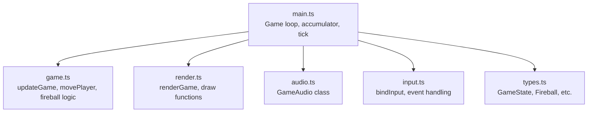
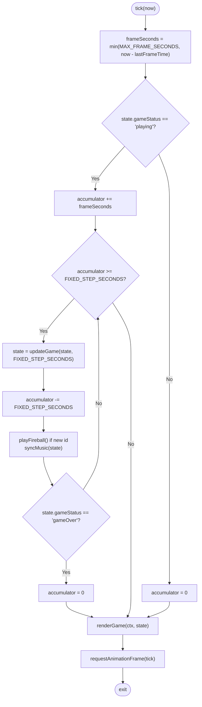
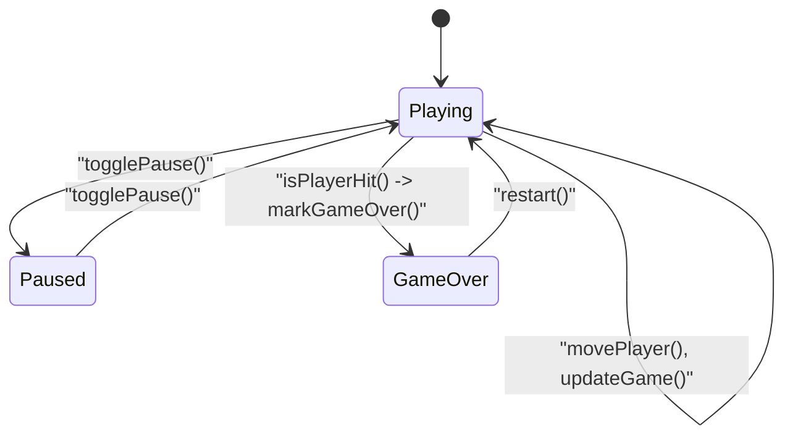
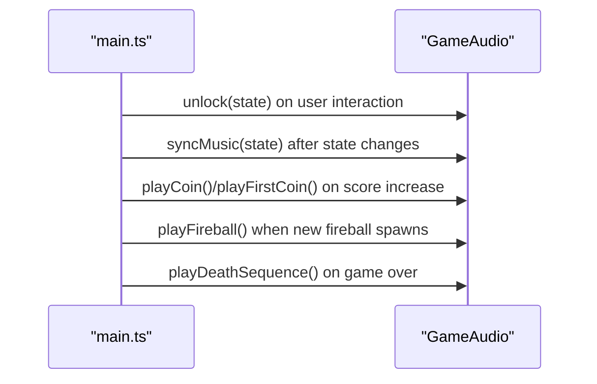
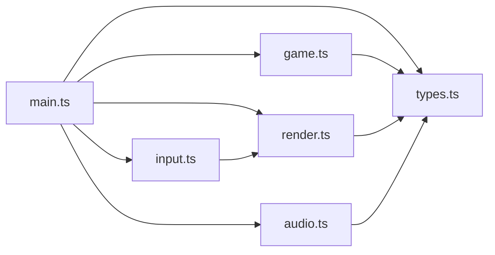

# Game Loop Implementation

<cite>
**Referenced Files in This Document**
- [main.ts](file://src/main.ts)
- [game.ts](file://src/game.ts)
- [render.ts](file://src/render.ts)
- [audio.ts](file://src/audio.ts)
- [input.ts](file://src/input.ts)
- [types.ts](file://src/types.ts)
</cite>

## Table of Contents
1. [Introduction](#introduction)
2. [Project Structure](#project-structure)
3. [Core Components](#core-components)
4. [Architecture Overview](#architecture-overview)
5. [Detailed Component Analysis](#detailed-component-analysis)
6. [Dependency Analysis](#dependency-analysis)
7. [Performance Considerations](#performance-considerations)
8. [Troubleshooting Guide](#troubleshooting-guide)
9. [Conclusion](#conclusion)

## Introduction
This document explains the fixed time step game loop used in Raid and Run. It focuses on how the accumulator pattern ensures consistent physics updates regardless of frame rate variations, how the tick function orchestrates state updates, audio synchronization, and rendering, and how different game states (playing, paused, gameOver) are handled. It also covers performance considerations and why this approach yields deterministic gameplay across devices and browsers.

## Project Structure
The game loop is implemented primarily in the main entry module, which coordinates:
- Fixed-step simulation via an accumulator
- State transitions between playing, paused, and gameOver
- Audio synchronization and effect triggering
- Rendering to a canvas each frame



**Diagram sources**
- [main.ts:107-136](file://src/main.ts#L107-L136)
- [game.ts:83-101](file://src/game.ts#L83-L101)
- [render.ts:166-185](file://src/render.ts#L166-L185)
- [audio.ts:37-132](file://src/audio.ts#L37-L132)
- [input.ts:28-113](file://src/input.ts#L28-L113)
- [types.ts:28-43](file://src/types.ts#L28-L43)

**Section sources**
- [main.ts:107-136](file://src/main.ts#L107-L136)
- [game.ts:83-101](file://src/game.ts#L83-L101)
- [render.ts:166-185](file://src/render.ts#L166-L185)
- [audio.ts:37-132](file://src/audio.ts#L37-L132)
- [input.ts:28-113](file://src/input.ts#L28-L113)
- [types.ts:28-43](file://src/types.ts#L28-L43)

## Core Components
- Fixed time step constants:
  - FIXED_STEP_SECONDS: The constant defines the fixed update interval for physics and game logic.
  - MAX_FRAME_SECONDS: The cap prevents spiral-of-death by limiting the maximum frame delta considered per tick.
- Accumulator:
  - Accumulates elapsed time while the game is playing.
  - Drives multiple fixed-step updates when enough time has accumulated.
- Tick function:
  - Computes frameSeconds using the capped delta.
  - Updates accumulator during playing state.
  - Performs fixed-step updates, audio sync, and game over commit.
  - Renders the current state every frame.
  - Schedules the next frame with requestAnimationFrame.

Key responsibilities:
- Deterministic updates: Each update receives exactly FIXED_STEP_SECONDS.
- Frame-rate independence: Large deltas are split into multiple steps; small deltas accumulate until a step completes.
- Spiral-of-death prevention: MAX_FRAME_SECONDS caps the maximum delta per frame.

**Section sources**
- [main.ts:11-12](file://src/main.ts#L11-L12)
- [main.ts:107-136](file://src/main.ts#L107-L136)

## Architecture Overview
The game loop integrates input-driven state changes, fixed-step simulation, audio synchronization, and rendering.

```mermaid
sequenceDiagram
participant RAF as "requestAnimationFrame"
participant Main as "tick(now)"
participant Acc as "accumulator"
participant Sim as "updateGame(state, FIXED_STEP_SECONDS)"
participant Aud as "GameAudio"
participant Rnd as "renderGame(ctx, state)"
RAF->>Main : call tick(now)
Main->>Main : compute frameSeconds = min(MAX_FRAME_SECONDS, now - lastFrameTime)
alt state.gameStatus === "playing"
Main->>Acc : accumulator += frameSeconds
loop while accumulator >= FIXED_STEP_SECONDS
Main->>Sim : updateGame(state, FIXED_STEP_SECONDS)
Sim-->>Main : nextState
Main->>Aud : playFireball() if new fireball spawned
Main->>Aud : syncMusic(nextState)
Main->>Main : commitGameOver(previousStatus)
alt nextState.gameStatus === "gameOver"
Main->>Acc : accumulator = 0
break
end
end
else
Main->>Acc : accumulator = 0
end
Main->>Rnd : renderGame(ctx, state)
Main->>RAF : requestAnimationFrame(tick)
```

**Diagram sources**
- [main.ts:107-136](file://src/main.ts#L107-L136)
- [game.ts:83-101](file://src/game.ts#L83-L101)
- [audio.ts:65-76](file://src/audio.ts#L65-L76)
- [render.ts:166-185](file://src/render.ts#L166-L185)

## Detailed Component Analysis

### Fixed Time Step and Accumulator Pattern
- FIXED_STEP_SECONDS defines the deterministic update interval.
- MAX_FRAME_SECONDS limits the maximum frame delta to avoid spiral-of-death.
- accumulator accumulates real time while playing; it is reset when not playing.
- While accumulator >= FIXED_STEP_SECONDS, the simulation advances by one fixed step, subtracting FIXED_STEP_SECONDS from accumulator.

Why this matters:
- Ensures physics and game logic run at a constant rate independent of display refresh rates.
- Prevents large jumps that could cause instability or unfair difficulty spikes.
- Guarantees determinism across devices and browsers given the same inputs.

**Section sources**
- [main.ts:11-12](file://src/main.ts#L11-L12)
- [main.ts:107-136](file://src/main.ts#L107-L136)

### Tick Function Orchestration
Responsibilities within tick:
- Compute frameSeconds safely with MAX_FRAME_SECONDS cap.
- Update accumulator only when gameStatus is "playing".
- Perform fixed-step updates via updateGame(state, FIXED_STEP_SECONDS).
- Trigger audio effects when new fireballs spawn.
- Sync music based on current score and status.
- Commit game over transitions and persist records.
- Render the scene every frame.
- Schedule next frame.



**Diagram sources**
- [main.ts:107-136](file://src/main.ts#L107-L136)
- [game.ts:83-101](file://src/game.ts#L83-L101)
- [audio.ts:94-100](file://src/audio.ts#L94-L100)
- [audio.ts:65-76](file://src/audio.ts#L65-L76)
- [render.ts:166-185](file://src/render.ts#L166-L185)

**Section sources**
- [main.ts:107-136](file://src/main.ts#L107-L136)

### Game States and Transitions
- Playing:
  - Accumulator drives fixed-step updates.
  - Input triggers movePlayer, which can change score and potentially trigger game over.
  - Audio syncs music based on score thresholds.
- Paused:
  - accumulator is zeroed; no fixed-step updates occur.
  - Rendering continues so the UI remains responsive.
- Game Over:
  - On transition from playing to gameOver, records are saved and death sequence audio plays.
  - accumulator is reset to prevent further updates.
  - Controls are synchronized to show restart and hide pause.



**Diagram sources**
- [main.ts:54-67](file://src/main.ts#L54-L67)
- [main.ts:138-144](file://src/main.ts#L138-L144)
- [game.ts:58-81](file://src/game.ts#L58-L81)
- [game.ts:83-101](file://src/game.ts#L83-L101)
- [game.ts:420-425](file://src/game.ts#L420-L425)

**Section sources**
- [main.ts:54-67](file://src/main.ts#L54-L67)
- [main.ts:138-144](file://src/main.ts#L138-L144)
- [game.ts:58-81](file://src/game.ts#L58-L81)
- [game.ts:83-101](file://src/game.ts#L83-L101)
- [game.ts:420-425](file://src/game.ts#L420-L425)

### Audio Synchronization Within the Loop
- Music mode selection depends on score and game status:
  - Pre-coin music before first coin.
  - Active music after first coin.
  - Death sequence and game over music upon game over.
- Effects:
  - Coin collected: plays coin sound (first coin vs regular).
  - New fireball spawned: plays fireball sound.
  - Button clicks: plays click sound.
- Audio context unlocking occurs on user interaction to comply with browser policies.



**Diagram sources**
- [main.ts:45-52](file://src/main.ts#L45-L52)
- [main.ts:69-87](file://src/main.ts#L69-L87)
- [main.ts:114-129](file://src/main.ts#L114-L129)
- [main.ts:138-144](file://src/main.ts#L138-L144)
- [audio.ts:59-76](file://src/audio.ts#L59-L76)
- [audio.ts:78-123](file://src/audio.ts#L78-L123)

**Section sources**
- [main.ts:45-52](file://src/main.ts#L45-L52)
- [main.ts:69-87](file://src/main.ts#L69-L87)
- [main.ts:114-129](file://src/main.ts#L114-L129)
- [main.ts:138-144](file://src/main.ts#L138-L144)
- [audio.ts:59-76](file://src/audio.ts#L59-L76)
- [audio.ts:78-123](file://src/audio.ts#L78-L123)

### Rendering Integration
- renderGame is called every frame with the latest GameState.
- Rendering uses elapsed time for animations but does not affect deterministic simulation.
- Visual overlays reflect paused and game over states.

**Section sources**
- [render.ts:166-185](file://src/render.ts#L166-L185)

### Input Handling and State Changes
- Keyboard and pointer events translate to moves, pause toggles, and restart actions.
- Only moves are processed when gameStatus is "playing".
- Restart resets state and audio, then reinitializes controls.

**Section sources**
- [input.ts:28-113](file://src/input.ts#L28-L113)
- [main.ts:89-98](file://src/main.ts#L89-L98)

## Dependency Analysis
The following diagram shows key dependencies among modules involved in the loop:



**Diagram sources**
- [main.ts:1-10](file://src/main.ts#L1-L10)
- [game.ts:1-2](file://src/game.ts#L1-L2)
- [render.ts:1-3](file://src/render.ts#L1-L3)
- [audio.ts:1-2](file://src/audio.ts#L1-L2)
- [input.ts:1-2](file://src/input.ts#L1-L2)
- [types.ts:1-6](file://src/types.ts#L1-L6)

**Section sources**
- [main.ts:1-10](file://src/main.ts#L1-L10)
- [game.ts:1-2](file://src/game.ts#L1-L2)
- [render.ts:1-3](file://src/render.ts#L1-L3)
- [audio.ts:1-2](file://src/audio.ts#L1-L2)
- [input.ts:1-2](file://src/input.ts#L1-L2)
- [types.ts:1-6](file://src/types.ts#L1-L6)

## Performance Considerations
- Fixed step size:
  - Using a constant step reduces jitter and makes collision and movement predictable.
  - Typical choice aligns with common display refresh rates to minimize missed steps.
- Cap on frame delta:
  - MAX_FRAME_SECONDS prevents spiral-of-death when the tab is inactive or the device stalls.
  - Without this cap, large accumulated deltas could cause many consecutive updates, starving rendering and causing long freezes.
- Accumulator behavior:
  - When paused or in game over, accumulator is zeroed to avoid unnecessary work.
  - During playing, multiple steps may be executed per frame if needed, ensuring catch-up without skipping logic.
- Determinism:
  - Because updates use FIXED_STEP_SECONDS and pure functions, the same sequence of inputs produces identical outcomes across devices and browsers.
- Rendering cost:
  - Rendering runs every frame and uses elapsed time for visuals only; it does not influence deterministic simulation.

[No sources needed since this section provides general guidance]

## Troubleshooting Guide
Common issues and resolutions:
- Audio not playing:
  - Ensure user interaction has occurred to unlock the audio context.
  - Check that unlock is called on pointerdown/click and button interactions.
- Game appears frozen:
  - Verify MAX_FRAME_SECONDS is set to prevent excessive accumulation.
  - Confirm accumulator is reset when transitioning to paused or game over.
- Inconsistent behavior across devices:
  - Validate that all updates use FIXED_STEP_SECONDS and that input events are correctly gated by gameStatus.
- High CPU usage:
  - Ensure render calls remain efficient and that heavy operations are avoided inside the update loop.

**Section sources**
- [main.ts:99-103](file://src/main.ts#L99-L103)
- [main.ts:107-136](file://src/main.ts#L107-L136)
- [audio.ts:59-63](file://src/audio.ts#L59-L63)

## Conclusion
The fixed time step game loop in Raid and Run uses an accumulator to decouple simulation from rendering, ensuring deterministic and stable gameplay across varying frame rates. The combination of FIXED_STEP_SECONDS and MAX_FRAME_SECONDS guarantees consistent physics updates and protects against spiral-of-death scenarios. The tick function orchestrates state updates, audio synchronization, and rendering, while cleanly managing transitions between playing, paused, and gameOver states. This design yields reliable, reproducible behavior on diverse devices and browsers.