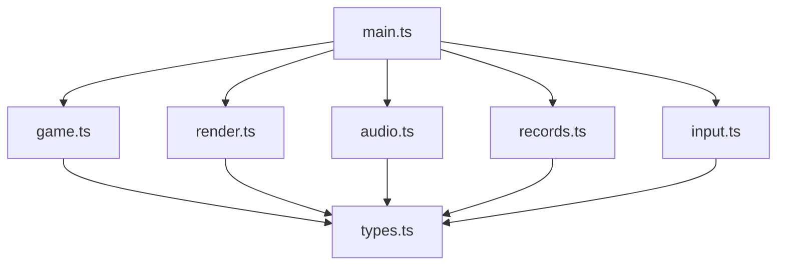
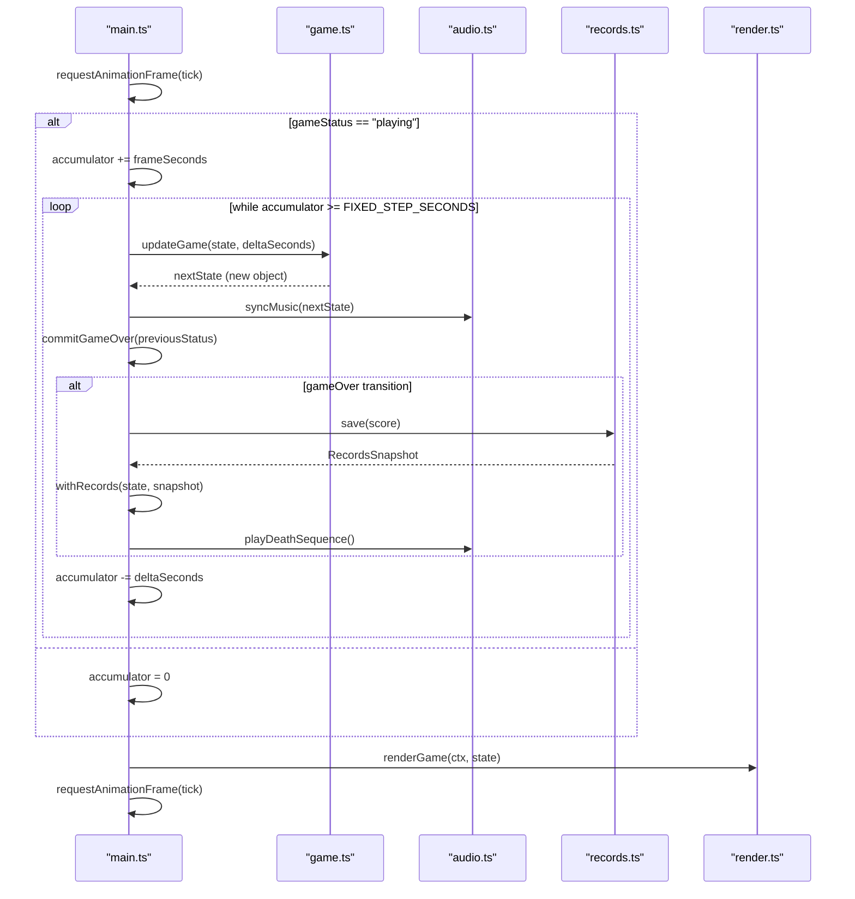
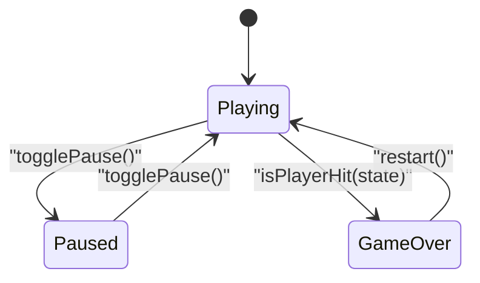
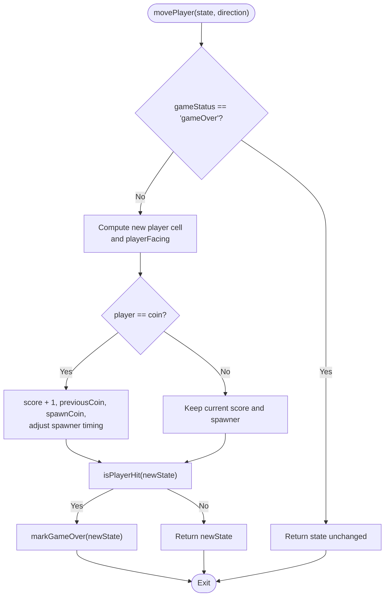
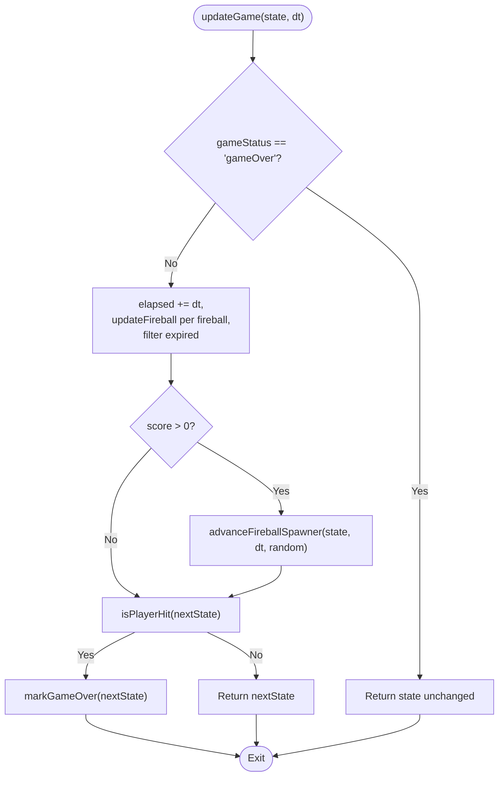
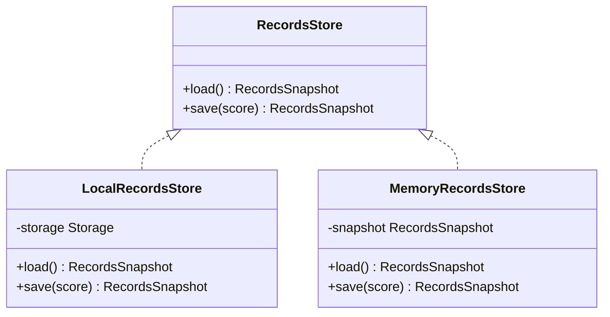
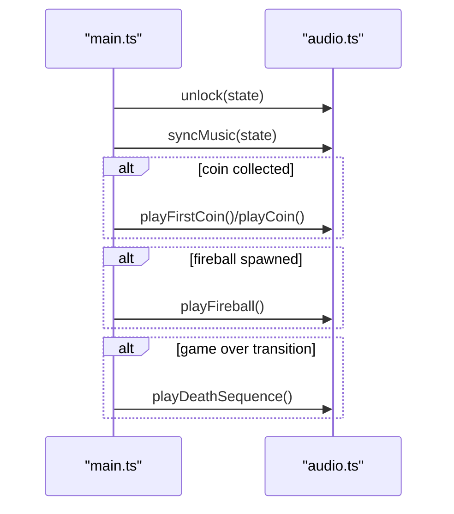
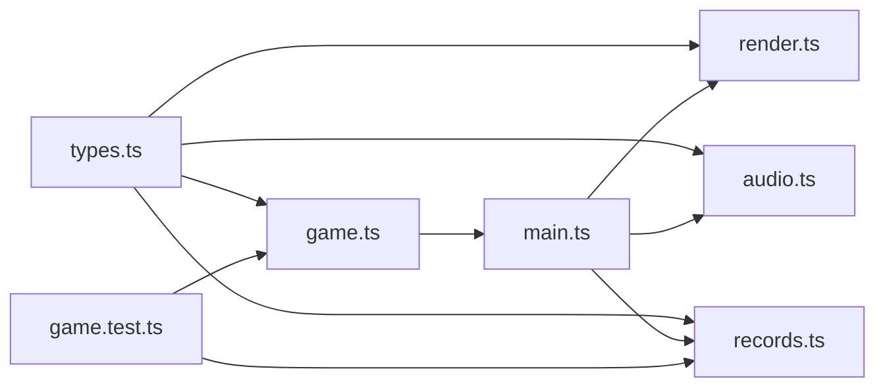

# Immutable State Management

<cite>
**Referenced Files in This Document**
- [game.ts](file://src/game.ts)
- [types.ts](file://src/types.ts)
- [main.ts](file://src/main.ts)
- [records.ts](file://src/records.ts)
- [audio.ts](file://src/audio.ts)
- [render.ts](file://src/render.ts)
- [input.ts](file://src/input.ts)
- [game.test.ts](file://src/game.test.ts)
</cite>

## Table of Contents
1. [Introduction](#introduction)
2. [Project Structure](#project-structure)
3. [Core Components](#core-components)
4. [Architecture Overview](#architecture-overview)
5. [Detailed Component Analysis](#detailed-component-analysis)
6. [Dependency Analysis](#dependency-analysis)
7. [Performance Considerations](#performance-considerations)
8. [Troubleshooting Guide](#troubleshooting-guide)
9. [Conclusion](#conclusion)
10. [Appendices](#appendices)

## Introduction
This document explains the immutable state management system used by Raid and Run. The game represents its entire runtime as a single, immutable GameState object. Pure functions transform this state into new objects without mutating existing ones. The main loop composes these pure updates with side effects such as audio playback and record persistence. Immutability makes state transitions predictable, simplifies debugging and testing, and enables features like undo and replay through snapshots.

## Project Structure
The project is organized around a small set of focused modules:
- types.ts defines the core data model including GameState and related types.
- game.ts implements pure functional logic for creating, updating, and querying state.
- main.ts orchestrates the game loop, input handling, rendering, audio, and records.
- render.ts reads the current state to draw frames.
- audio.ts reacts to state changes to play music and sound effects.
- records.ts persists best score and world record using an interface that can be swapped between local storage and memory.
- input.ts translates user actions into state updates via callbacks.
- game.test.ts validates pure behavior deterministically.

**Diagram sources**
- [main.ts:1-160](file://src/main.ts#L1-L160)
- [game.ts:1-426](file://src/game.ts#L1-L426)
- [render.ts:1-721](file://src/render.ts#L1-L721)
- [audio.ts:1-296](file://src/audio.ts#L1-L296)
- [records.ts:1-52](file://src/records.ts#L1-L52)
- [input.ts:1-255](file://src/input.ts#L1-L255)
- [types.ts:1-54](file://src/types.ts#L1-L54)

**Section sources**
- [types.ts:1-54](file://src/types.ts#L1-L54)
- [game.ts:1-426](file://src/game.ts#L1-L426)
- [main.ts:1-160](file://src/main.ts#L1-L160)
- [render.ts:1-721](file://src/render.ts#L1-L721)
- [audio.ts:1-296](file://src/audio.ts#L1-L296)
- [records.ts:1-52](file://src/records.ts#L1-L52)
- [input.ts:1-255](file://src/input.ts#L1-L255)
- [game.test.ts:1-373](file://src/game.test.ts#L1-L373)

## Core Components
- GameState: The complete application state, including player position and facing direction, coin positions, fireballs, score, best/world records, status, timing, and spawner counters. It is treated as an immutable snapshot at each frame or action.
- Pure update functions:
  - createInitialGameState: Builds a fresh GameState from persisted records and optional randomness.
  - movePlayer: Returns a new GameState reflecting movement, coin collection, and collision checks.
  - updateGame: Advances time, moves fireballs, spawns new threats, and checks collisions.
  - withRecords: Updates only record fields on an existing state snapshot.
- Side-effect-free helpers: Coin spawning, fireball creation, scheduling, and geometry utilities are pure and deterministic when provided a random source.

Key immutability patterns:
- Spread-based updates produce new objects rather than mutating existing ones.
- Functions accept the current state and return a new state; they never write to shared mutable variables.
- Randomness is injected via a function parameter, enabling deterministic tests.

**Section sources**
- [types.ts:28-48](file://src/types.ts#L28-L48)
- [game.ts:29-48](file://src/game.ts#L29-L48)
- [game.ts:58-81](file://src/game.ts#L58-L81)
- [game.ts:83-101](file://src/game.ts#L83-L101)
- [game.ts:50-56](file://src/game.ts#L50-L56)
- [game.ts:103-111](file://src/game.ts#L103-L111)
- [game.ts:113-166](file://src/game.ts#L113-L166)
- [game.ts:249-279](file://src/game.ts#L249-L279)

## Architecture Overview
The game loop drives a fixed timestep accumulator. Each tick:
- If playing, updateGame is called repeatedly until the accumulator drains below the fixed step size.
- After each update, side effects (audio sync, death sequence, record persistence) are applied based on the previous and next states.
- The renderer consumes the latest state snapshot to draw the frame.

**Diagram sources**
- [main.ts:107-144](file://src/main.ts#L107-L144)
- [game.ts:83-101](file://src/game.ts#L83-L101)
- [records.ts:20-29](file://src/records.ts#L20-L29)
- [audio.ts:125-132](file://src/audio.ts#L125-L132)
- [render.ts:166-185](file://src/render.ts#L166-L185)

## Detailed Component Analysis

### GameState Model and Status Transitions
- GameState includes all visible and hidden aspects of the game: entities, scores, timers, and spawner state.
- GameStatus is a discriminated union of "playing", "paused", and "gameOver".
- Transitions:
  - Playing → Paused: toggled by UI or keyboard; no game logic advances.
  - Playing → Game Over: occurs when any active fireball collides with the player during updateGame or movePlayer.
  - Paused → Playing: toggled back; accumulator resets to zero to avoid jumps.
  - Game Over → Playing: restart creates a fresh GameState.

**Diagram sources**
- [types.ts:6](file://src/types.ts#L6)
- [main.ts:54-67](file://src/main.ts#L54-L67)
- [game.ts:221-223](file://src/game.ts#L221-L223)
- [game.ts:420-425](file://src/game.ts#L420-L425)
- [main.ts:138-144](file://src/main.ts#L138-L144)

**Section sources**
- [types.ts:6](file://src/types.ts#L6)
- [types.ts:28-43](file://src/types.ts#L28-L43)
- [main.ts:54-67](file://src/main.ts#L54-L67)
- [main.ts:107-136](file://src/main.ts#L107-L136)
- [game.ts:221-223](file://src/game.ts#L221-L223)
- [game.ts:420-425](file://src/game.ts#L420-L425)

### Pure Movement: movePlayer
- Input-driven transformation: accepts current state and direction, returns a new state.
- Behavior:
  - Clamps movement within the grid.
  - Updates playerFacing for animation.
  - On coin collection: increments score, stores previousCoin, spawns a new coin, and adjusts fireball spawner timing.
  - Collision check: if hit, marks game over.

**Diagram sources**
- [game.ts:58-81](file://src/game.ts#L58-L81)
- [game.ts:221-223](file://src/game.ts#L221-L223)
- [game.ts:420-425](file://src/game.ts#L420-L425)

**Section sources**
- [game.ts:58-81](file://src/game.ts#L58-L81)
- [game.ts:103-111](file://src/game.ts#L103-L111)
- [game.ts:221-223](file://src/game.ts#L221-L223)
- [game.ts:420-425](file://src/game.ts#L420-L425)

### Pure Time Step: updateGame
- Advances elapsed time and updates all fireballs.
- Spawns new fireballs after the first coin is collected, using scheduled delays and cooldowns.
- Filters out expired fireballs.
- Checks for collision and transitions to game over if needed.

**Diagram sources**
- [game.ts:83-101](file://src/game.ts#L83-L101)
- [game.ts:249-279](file://src/game.ts#L249-L279)
- [game.ts:221-223](file://src/game.ts#L221-L223)
- [game.ts:420-425](file://src/game.ts#L420-L425)

**Section sources**
- [game.ts:83-101](file://src/game.ts#L83-L101)
- [game.ts:249-279](file://src/game.ts#L249-L279)
- [game.ts:221-223](file://src/game.ts#L221-L223)
- [game.ts:420-425](file://src/game.ts#L420-L425)

### Records Persistence Integration
- RecordsStore abstracts persistence. LocalRecordsStore uses browser storage; MemoryRecordsStore keeps in-memory snapshots.
- On game over, main saves the score and merges the returned snapshot back into state via withRecords.

**Diagram sources**
- [types.ts:50-53](file://src/types.ts#L50-L53)
- [records.ts:11-30](file://src/records.ts#L11-L30)
- [records.ts:32-51](file://src/records.ts#L32-L51)
- [main.ts:138-144](file://src/main.ts#L138-L144)
- [game.ts:50-56](file://src/game.ts#L50-L56)

**Section sources**
- [types.ts:50-53](file://src/types.ts#L50-L53)
- [records.ts:11-30](file://src/records.ts#L11-L30)
- [records.ts:32-51](file://src/records.ts#L32-L51)
- [main.ts:138-144](file://src/main.ts#L138-L144)
- [game.ts:50-56](file://src/game.ts#L50-L56)

### Audio Side Effects Driven by State
- GameAudio responds to state changes:
  - unlock and reset manage browser audio context and modes.
  - syncMusic selects pre-coin or active music based on score and status.
  - Death sequence plays once upon entering game over.
- These calls are triggered in main after state transitions, keeping side effects separate from pure logic.

**Diagram sources**
- [audio.ts:59-76](file://src/audio.ts#L59-L76)
- [audio.ts:78-123](file://src/audio.ts#L78-L123)
- [main.ts:69-87](file://src/main.ts#L69-L87)
- [main.ts:117-124](file://src/main.ts#L117-L124)
- [main.ts:138-144](file://src/main.ts#L138-L144)

**Section sources**
- [audio.ts:59-76](file://src/audio.ts#L59-L76)
- [audio.ts:78-123](file://src/audio.ts#L78-L123)
- [main.ts:69-87](file://src/main.ts#L69-L87)
- [main.ts:117-124](file://src/main.ts#L117-L124)
- [main.ts:138-144](file://src/main.ts#L138-L144)

### Rendering Consumes Immutable Snapshots
- renderGame takes the current GameState and draws everything based solely on it. No mutations occur here.
- Visuals reflect state fields like player position, facing direction, fireball arrays, and game status overlays.

**Section sources**
- [render.ts:166-185](file://src/render.ts#L166-L185)
- [render.ts:229-240](file://src/render.ts#L229-L240)
- [render.ts:316-357](file://src/render.ts#L316-L357)
- [render.ts:370-394](file://src/render.ts#L370-L394)
- [render.ts:487-537](file://src/render.ts#L487-L537)

### Input Produces Actions, Not Mutations
- bindInput maps keyboard and pointer events to callbacks: move, togglePause, restart.
- The callbacks in main read the current state and call pure functions to compute new states.

**Section sources**
- [input.ts:28-113](file://src/input.ts#L28-L113)
- [input.ts:123-192](file://src/input.ts#L123-L192)
- [main.ts:69-95](file://src/main.ts#L69-L95)

## Dependency Analysis
- Pure layer: game.ts depends only on types.ts and random.ts. It has no I/O.
- Orchestration layer: main.ts composes pure updates with side effects (audio, records, rendering).
- Rendering and audio depend on types.ts and consume state snapshots.
- Tests use MemoryRecordsStore and fixed random sources to validate pure behavior deterministically.

**Diagram sources**
- [types.ts:1-54](file://src/types.ts#L1-L54)
- [game.ts:1-426](file://src/game.ts#L1-L426)
- [main.ts:1-160](file://src/main.ts#L1-L160)
- [render.ts:1-721](file://src/render.ts#L1-L721)
- [audio.ts:1-296](file://src/audio.ts#L1-L296)
- [records.ts:1-52](file://src/records.ts#L1-L52)
- [game.test.ts:1-373](file://src/game.test.ts#L1-L373)

**Section sources**
- [game.ts:1-426](file://src/game.ts#L1-L426)
- [main.ts:1-160](file://src/main.ts#L1-L160)
- [render.ts:1-721](file://src/render.ts#L1-L721)
- [audio.ts:1-296](file://src/audio.ts#L1-L296)
- [records.ts:1-52](file://src/records.ts#L1-L52)
- [game.test.ts:1-373](file://src/game.test.ts#L1-L373)

## Performance Considerations
- Fixed timestep accumulation ensures deterministic physics-like updates regardless of frame rate.
- Fireball filtering removes expired entities each frame to keep arrays bounded.
- Pure functions allocate new objects; however, the state shape is small and updates are infrequent enough for modern browsers.
- Injecting a deterministic random source avoids non-deterministic branching in tests and allows reproducible runs.

[No sources needed since this section provides general guidance]

## Troubleshooting Guide
- Unexpected game over: verify collision detection paths and ensure fireball age and travel durations are correct.
- Fireballs not spawning: confirm score thresholds and spawner delay schedules; check bending cooldown logic.
- Audio not playing: ensure unlock is called on user interaction and that the audio context is resumed.
- Records not persisting: verify RecordsStore implementation and error fallback to memory store.

**Section sources**
- [game.ts:221-223](file://src/game.ts#L221-L223)
- [game.ts:249-279](file://src/game.ts#L249-L279)
- [audio.ts:59-76](file://src/audio.ts#L59-L76)
- [main.ts:153-159](file://src/main.ts#L153-L159)

## Conclusion
Raid and Run’s state management embraces immutability and pure functions to make gameplay logic predictable and testable. The central GameState snapshot is transformed by updateGame and movePlayer into new snapshots, while side effects like audio and persistence are cleanly separated. This design supports advanced features such as undo and replay by capturing snapshots before and after actions, and it simplifies debugging by making every change explicit and traceable.

[No sources needed since this section summarizes without analyzing specific files]

## Appendices

### Example: Capturing Snapshots for Undo/Replay
- Before each move or fixed-time step, serialize the current GameState into a history stack.
- For undo, restore the previous snapshot and re-render.
- For replay, feed recorded snapshots back into the renderer and audio synchronizer.

[No sources needed since this section describes conceptual usage]

### Deterministic Testing Patterns
- Use fixedRandom or sequenceRandom to control outcomes in tests.
- Assert on resulting GameState fields to verify pure behavior.

**Section sources**
- [game.test.ts:29-41](file://src/game.test.ts#L29-L41)
- [game.test.ts:43-45](file://src/game.test.ts#L43-L45)
- [game.test.ts:65-82](file://src/game.test.ts#L65-L82)
- [game.test.ts:84-125](file://src/game.test.ts#L84-L125)
- [game.test.ts:127-362](file://src/game.test.ts#L127-L362)