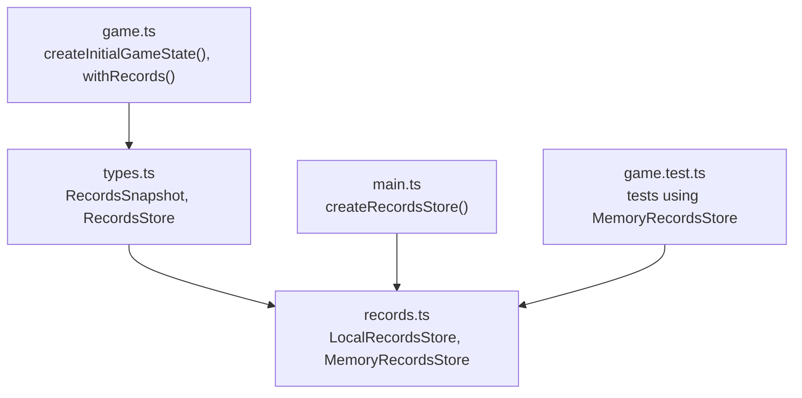
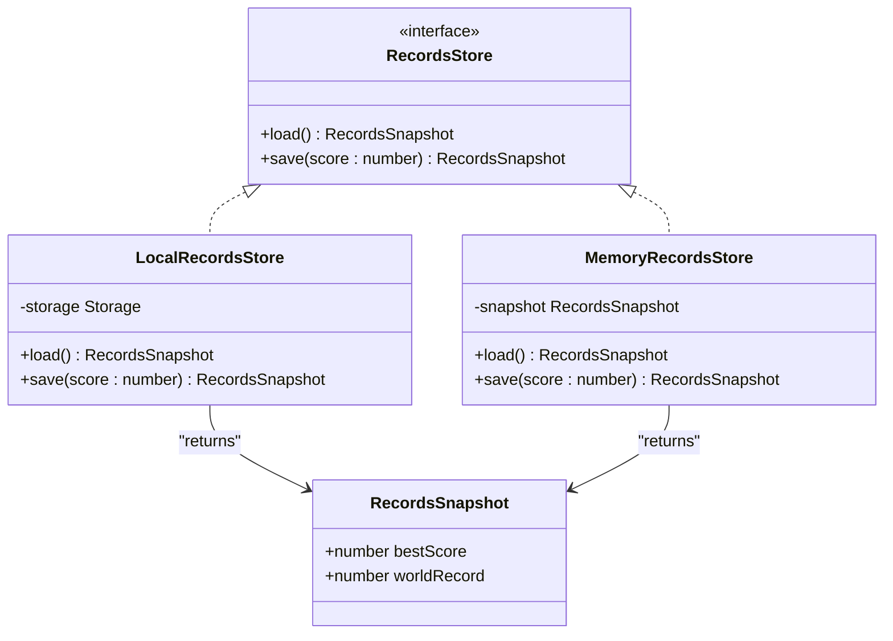
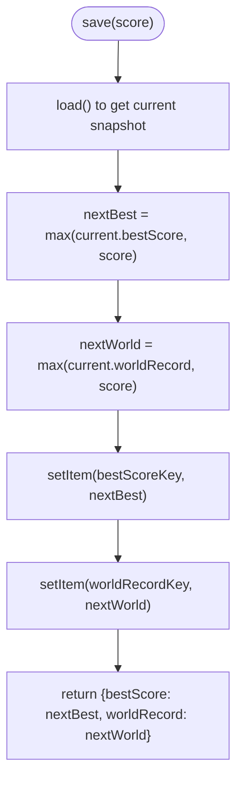
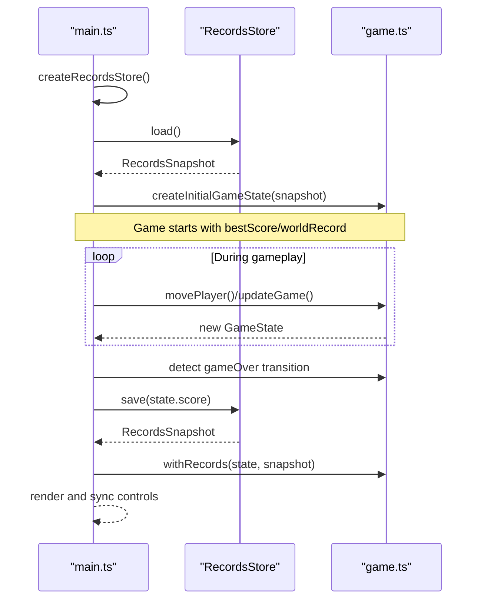
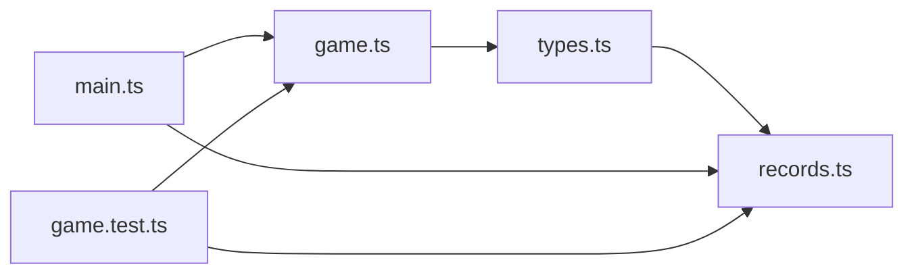

# Data Persistence

<cite>
**Referenced Files in This Document**
- [records.ts](file://src/records.ts)
- [types.ts](file://src/types.ts)
- [main.ts](file://src/main.ts)
- [game.ts](file://src/game.ts)
- [game.test.ts](file://src/game.test.ts)
</cite>

## Table of Contents
1. [Introduction](#introduction)
2. [Project Structure](#project-structure)
3. [Core Components](#core-components)
4. [Architecture Overview](#architecture-overview)
5. [Detailed Component Analysis](#detailed-component-analysis)
6. [Dependency Analysis](#dependency-analysis)
7. [Performance Considerations](#performance-considerations)
8. [Security and Privacy Considerations](#security-and-privacy-considerations)
9. [Testing Strategies](#testing-strategies)
10. [Extending the System with Custom Backends](#extending-the-system-with-custom-backends)
11. [Conclusion](#conclusion)

## Introduction
This document explains the records storage system used to persist high scores and world records for the game. It focuses on the pluggable storage backend architecture that implements the strategy pattern, enabling different persistence mechanisms (local browser storage and in-memory storage). The documentation covers data serialization, validation rules, testing strategies using mock implementations, and guidance for extending the system with custom backends. It also addresses security considerations for client-side data storage and privacy implications.

## Project Structure
The records system is implemented as a small, focused module with clear separation between interface definitions, concrete storage implementations, and integration points:

- Interface and data model definitions are centralized in the types file.
- Concrete storage backends implement the RecordsStore interface.
- The application entry point wires up the appropriate backend at runtime.
- Game logic consumes RecordsSnapshot values but remains decoupled from storage details.

**Diagram sources**
- [types.ts:45-53](file://src/types.ts#L45-L53)
- [records.ts:11-51](file://src/records.ts#L11-L51)
- [main.ts:153-159](file://src/main.ts#L153-L159)
- [game.ts:29-56](file://src/game.ts#L29-L56)
- [game.test.ts:364-372](file://src/game.test.ts#L364-L372)

**Section sources**
- [types.ts:45-53](file://src/types.ts#L45-L53)
- [records.ts:1-51](file://src/records.ts#L1-L51)
- [main.ts:153-159](file://src/main.ts#L153-L159)
- [game.ts:29-56](file://src/game.ts#L29-L56)
- [game.test.ts:364-372](file://src/game.test.ts#L364-L372)

## Core Components
- RecordsSnapshot: Immutable snapshot of persistent score data containing bestScore and worldRecord.
- RecordsStore: Strategy interface defining load() and save(score) operations.
- LocalRecordsStore: Browser localStorage-backed implementation.
- MemoryRecordsStore: In-memory implementation used for tests and fallback scenarios.

Key behaviors:
- Both backends maintain two metrics: bestScore (per-session or per-user local best) and worldRecord (global-like record within the same storage scope).
- On save, both metrics are updated to be at least the current score.
- On load, worldRecord is derived as the maximum of stored bestScore and worldRecord to ensure consistency.

**Section sources**
- [types.ts:45-53](file://src/types.ts#L45-L53)
- [records.ts:11-51](file://src/records.ts#L11-L51)

## Architecture Overview
The system uses the strategy pattern to abstract persistence behind a single interface. The application chooses a backend at startup and delegates all reads/writes through it.

**Diagram sources**
- [types.ts:45-53](file://src/types.ts#L45-L53)
- [records.ts:11-51](file://src/records.ts#L11-L51)

## Detailed Component Analysis

### RecordsSnapshot and RecordsStore
- RecordsSnapshot defines the persisted shape: bestScore and worldRecord.
- RecordsStore defines the contract for loading and saving records. Implementations must return consistent snapshots and update metrics appropriately.

Validation rules enforced by implementations:
- Scores are non-negative integers.
- bestScore and worldRecord are monotonically non-decreasing across saves.
- worldRecord is always at least as large as bestScore after load/save.

**Section sources**
- [types.ts:45-53](file://src/types.ts#L45-L53)
- [records.ts:14-29](file://src/records.ts#L14-L29)

### LocalRecordsStore (localStorage-backed)
Responsibilities:
- Reads numeric values from a provided Storage instance using well-known keys.
- Normalizes invalid or missing values to safe defaults.
- Persists integer strings for bestScore and worldRecord.

Data serialization:
- Values are stored as string representations of integers.
- Keys are namespaced to avoid collisions.

Version migration:
- No explicit version field is present; the loader normalizes values to integers and ensures non-negative results.
- If future schema changes occur, a version key can be added and handled during load to migrate legacy formats.

Error handling:
- readNumber returns zero for non-finite or non-positive values, preventing corruption.
- The caller wraps instantiation in try/catch to fall back to memory storage if localStorage is unavailable.

**Diagram sources**
- [records.ts:20-29](file://src/records.ts#L20-L29)

**Section sources**
- [records.ts:6-29](file://src/records.ts#L6-L29)
- [main.ts:153-159](file://src/main.ts#L153-L159)

### MemoryRecordsStore (in-memory)
Responsibilities:
- Maintains an internal snapshot initialized with optional seed values.
- Provides pure in-memory persistence suitable for unit tests and fallback usage.

Behavior:
- load() returns a copy of the snapshot to prevent external mutation.
- save() updates both bestScore and worldRecord to be at least the provided score.

Use cases:
- Unit tests asserting persistence behavior deterministically.
- Fallback when browser storage APIs are blocked or unavailable.

**Section sources**
- [records.ts:32-51](file://src/records.ts#L32-L51)
- [game.test.ts:364-372](file://src/game.test.ts#L364-L372)

### Integration Points
- Application bootstrap selects a backend via createRecordsStore():
  - Attempts LocalRecordsStore backed by window.localStorage.
  - Falls back to MemoryRecordsStore if initialization fails.
- Game state initialization injects RecordsSnapshot into GameState fields bestScore and worldRecord.
- On game over, the app persists the final score via records.save(state.score) and refreshes the UI state with updated records.

**Diagram sources**
- [main.ts:39-48](file://src/main.ts#L39-L48)
- [main.ts:138-144](file://src/main.ts#L138-L144)
- [game.ts:29-56](file://src/game.ts#L29-L56)
- [records.ts:14-29](file://src/records.ts#L14-L29)

**Section sources**
- [main.ts:39-48](file://src/main.ts#L39-L48)
- [main.ts:138-144](file://src/main.ts#L138-L144)
- [game.ts:29-56](file://src/game.ts#L29-L56)

## Dependency Analysis
- main.ts depends on records.ts for backend selection and on game.ts for state management.
- game.ts depends only on types.ts for RecordsSnapshot and does not import storage implementations.
- tests depend on records.ts to assert persistence semantics using MemoryRecordsStore.

**Diagram sources**
- [types.ts:45-53](file://src/types.ts#L45-L53)
- [records.ts:1-51](file://src/records.ts#L1-L51)
- [main.ts:1-10](file://src/main.ts#L1-L10)
- [game.ts:1-10](file://src/game.ts#L1-L10)
- [game.test.ts:1-25](file://src/game.test.ts#L1-L25)

**Section sources**
- [main.ts:1-10](file://src/main.ts#L1-L10)
- [game.ts:1-10](file://src/game.ts#L1-L10)
- [game.test.ts:1-25](file://src/game.test.ts#L1-L25)

## Performance Considerations
- LocalRecordsStore performs synchronous localStorage reads/writes. For this use case (two integer writes on game over), overhead is negligible.
- MemoryRecordsStore avoids I/O entirely, making it ideal for fast, deterministic tests.
- Avoid frequent save calls; batching updates around game over reduces storage churn.

[No sources needed since this section provides general guidance]

## Security and Privacy Considerations
- Client-side storage is user-controlled and untrusted. Treat stored values as potentially tampered.
- Never store sensitive personal information in localStorage.
- Use domain-scoped keys to minimize cross-site interference.
- Validate and sanitize inputs before writing; normalize to safe integers.
- Be aware of storage quotas and potential exceptions; provide graceful fallbacks.
- Consider privacy policies and user consent requirements if expanding to more extensive analytics or identifiers.

[No sources needed since this section provides general guidance]

## Testing Strategies
- Use MemoryRecordsStore to assert persistence behavior without side effects.
- Seed initial snapshots to verify monotonicity and boundary conditions.
- Verify that load returns copies to prevent accidental mutation.
- Confirm that worldRecord is always at least bestScore after save/load cycles.

Example test references:
- Verifying persistence semantics with MemoryRecordsStore.

**Section sources**
- [game.test.ts:364-372](file://src/game.test.ts#L364-L372)
- [records.ts:32-51](file://src/records.ts#L32-L51)

## Extending the System with Custom Backends
To add a new storage backend:
1. Implement RecordsStore with load() and save(score):
   - Ensure load() returns a valid RecordsSnapshot.
   - Ensure save(score) updates both bestScore and worldRecord to be at least score.
   - Normalize and validate inputs to guarantee non-negative integers.
2. Integrate the backend:
   - Update createRecordsStore() to instantiate your backend under desired conditions (e.g., feature flags, environment checks).
   - Optionally wrap instantiation in try/catch to fall back to MemoryRecordsStore.

Guidelines:
- Keep keys namespaced and stable.
- Provide robust error handling and fallbacks.
- Add tests for your backend similar to those for MemoryRecordsStore.

[No sources needed since this section provides general guidance]

## Conclusion
The records storage system cleanly separates concerns through a strategy-based interface, offering a reliable local storage backend and a test-friendly in-memory alternative. Its design emphasizes simplicity, correctness, and extensibility while maintaining strong validation and safety guarantees. By following the extension guidelines and testing patterns outlined here, you can confidently evolve the persistence layer to meet new requirements.