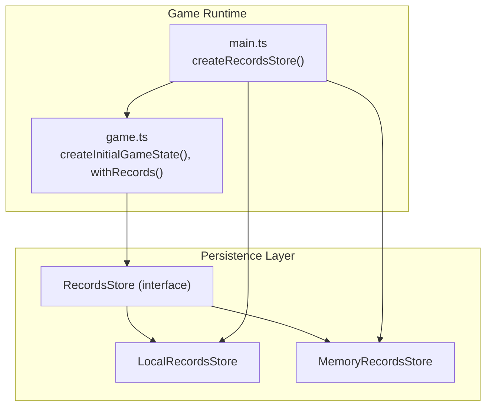
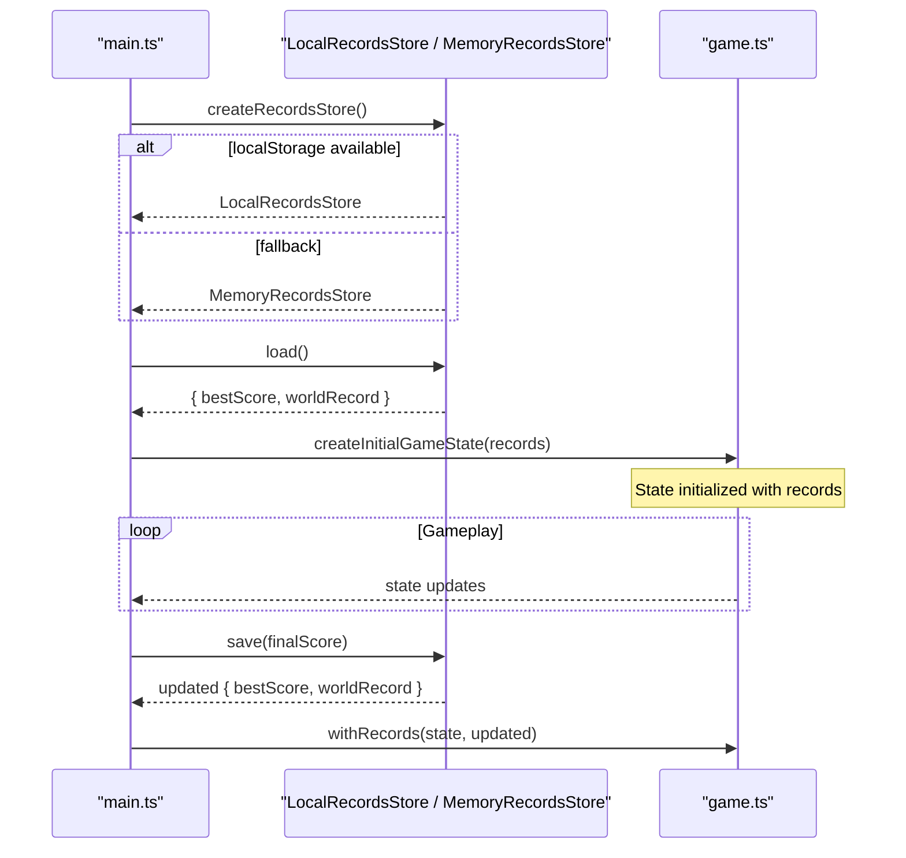
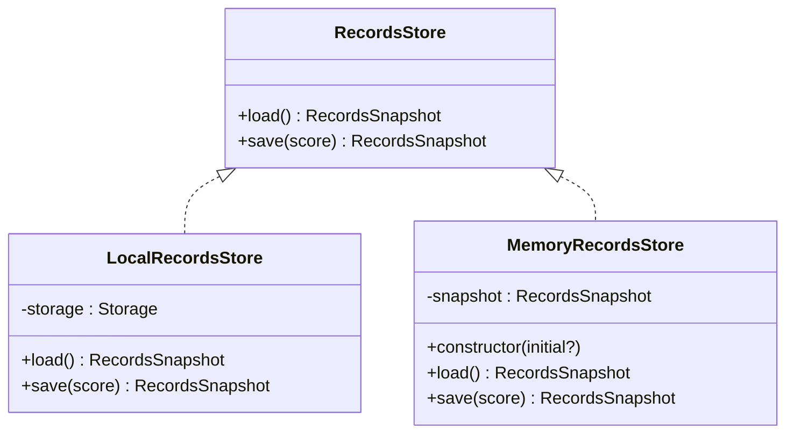
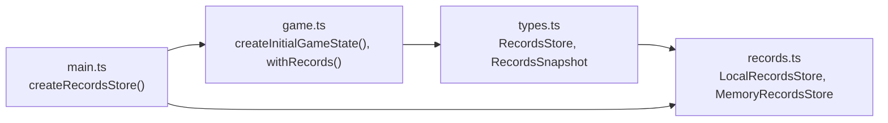

# Local Storage Implementation

<cite>
**Referenced Files in This Document**
- [records.ts](file://src/records.ts)
- [types.ts](file://src/types.ts)
- [main.ts](file://src/main.ts)
- [game.ts](file://src/game.ts)
</cite>

## Table of Contents
1. [Introduction](#introduction)
2. [Project Structure](#project-structure)
3. [Core Components](#core-components)
4. [Architecture Overview](#architecture-overview)
5. [Detailed Component Analysis](#detailed-component-analysis)
6. [Dependency Analysis](#dependency-analysis)
7. [Performance Considerations](#performance-considerations)
8. [Troubleshooting Guide](#troubleshooting-guide)
9. [Conclusion](#conclusion)

## Introduction
This document explains the LocalRecordsStore implementation used to persist high scores and world records in the game. It covers how data is serialized, the naming conventions for storage keys, safe number parsing with readNumber, score comparison logic that maintains both personal best and global world record, initialization strategies with different Storage implementations, and error handling considerations such as storage quota exceeded scenarios.

## Project Structure
The persistence layer is implemented in a small, focused module that defines:
- A RecordsStore interface describing load and save operations
- A LocalRecordsStore backed by browser localStorage
- A MemoryRecordsStore fallback for environments where localStorage is unavailable or restricted
- The main entry point wires up the appropriate store based on runtime availability

**Diagram sources**
- [records.ts:11-30](file://src/records.ts#L11-L30)
- [records.ts:32-51](file://src/records.ts#L32-L51)
- [main.ts:153-159](file://src/main.ts#L153-L159)
- [game.ts:29-48](file://src/game.ts#L29-L48)
- [game.ts:50-56](file://src/game.ts#L50-L56)

**Section sources**
- [records.ts:1-52](file://src/records.ts#L1-L52)
- [types.ts:45-53](file://src/types.ts#L45-L53)
- [main.ts:153-159](file://src/main.ts#L153-L159)
- [game.ts:29-56](file://src/game.ts#L29-L56)

## Core Components
- RecordsStore interface: Defines load() returning a snapshot and save(score) updating and returning a snapshot.
- LocalRecordsStore: Persists two numeric values using localStorage under stable keys.
- MemoryRecordsStore: In-memory fallback that mirrors the same behavior without persistence.
- readNumber helper: Safely parses stored strings into validated numbers.

Key responsibilities:
- Maintain two metrics:
  - Personal best score across sessions
  - Global world record across all players (as persisted locally)
- Ensure only non-negative integers are stored
- Provide deterministic comparisons to update records correctly

**Section sources**
- [types.ts:45-53](file://src/types.ts#L45-L53)
- [records.ts:6-9](file://src/records.ts#L6-L9)
- [records.ts:11-30](file://src/records.ts#L11-L30)
- [records.ts:32-51](file://src/records.ts#L32-L51)

## Architecture Overview
The application initializes a RecordsStore instance at startup. If localStorage is available, it uses LocalRecordsStore; otherwise, it falls back to MemoryRecordsStore. During gameplay, the current bestScore and worldRecord are injected into the game state. On game over, the final score is saved through the store, which updates both personal best and world record if applicable.

**Diagram sources**
- [main.ts:153-159](file://src/main.ts#L153-L159)
- [main.ts:39-41](file://src/main.ts#L39-L41)
- [main.ts:138-144](file://src/main.ts#L138-L144)
- [game.ts:29-48](file://src/game.ts#L29-L48)
- [game.ts:50-56](file://src/game.ts#L50-L56)
- [records.ts:11-30](file://src/records.ts#L11-L30)

## Detailed Component Analysis

### LocalRecordsStore
Responsibilities:
- Persist two integer values under fixed keys
- Load returns a consistent snapshot ensuring worldRecord >= bestScore
- Save computes nextBest and nextWorld using max comparisons and persists them

Naming convention:
- Personal best key: "raid-and-run.bestScore"
- World record key: "raid-and-run.worldRecord"

Data serialization strategy:
- Numbers are converted to strings when written via setItem
- Strings are parsed back to numbers via Number() during reads
- Only positive finite integers are accepted; invalid or missing values default to zero

Read path:
- Reads bestScore from its key
- Reads worldRecord from its key
- Ensures worldRecord is at least as large as bestScore

Write path:
- Loads current snapshot
- Computes nextBest = max(current.bestScore, newScore)
- Computes nextWorld = max(current.worldRecord, newScore)
- Persists both values as strings

Error handling:
- No explicit try/catch around storage calls; errors propagate to callers
- Initialization wraps construction in try/catch to fall back to in-memory store if localStorage is unavailable or throws

Complexity:
- O(1) time and space per load/save operation

**Diagram sources**
- [types.ts:45-53](file://src/types.ts#L45-L53)
- [records.ts:11-30](file://src/records.ts#L11-L30)
- [records.ts:32-51](file://src/records.ts#L32-L51)

**Section sources**
- [records.ts:3-9](file://src/records.ts#L3-L9)
- [records.ts:11-30](file://src/records.ts#L11-L30)

### readNumber Helper
Purpose:
- Safely parse a value from a Storage backend
- Validate that the result is a finite positive number
- Return an integer floor of the value if valid, otherwise return zero

Behavior:
- Converts any string or null to a number
- Rejects NaN, Infinity, negative values, and zero
- Returns Math.floor(value) for valid inputs to ensure integer storage

Use cases:
- Reading bestScore and worldRecord
- Preventing corrupted or unexpected values from breaking game logic

**Section sources**
- [records.ts:6-9](file://src/records.ts#L6-L9)

### Score Comparison Logic
Rules:
- Personal best (bestScore) tracks the highest score achieved by the player across sessions
- World record (worldRecord) tracks the highest score seen globally (as persisted locally)
- Both are maintained independently but consistently:
  - nextBest = max(current.bestScore, newScore)
  - nextWorld = max(current.worldRecord, newScore)
- On load, worldRecord is ensured to be at least as large as bestScore to maintain invariant

Implications:
- If a player beats their personal best but not the world record, only bestScore updates
- If a player beats the world record, both bestScore and worldRecord update
- If a player’s score does not exceed either, no changes occur

**Section sources**
- [records.ts:14-29](file://src/records.ts#L14-L29)

### Initialization with Different Storage Implementations
Runtime selection:
- Attempt to construct LocalRecordsStore with window.localStorage
- If that fails (e.g., storage disabled, blocked, or throws), fall back to MemoryRecordsStore

Examples of initialization patterns:
- Default production usage: LocalRecordsStore(window.localStorage)
- Testing or restricted environments: MemoryRecordsStore({ bestScore: 0, worldRecord: 0 })
- Custom Storage shim: LocalRecordsStore(customStorage) where customStorage implements the Storage interface

Integration points:
- main.ts creates the store once at startup and reuses it throughout the session
- game.ts injects records into GameState via createInitialGameState and updates via withRecords after game over

**Section sources**
- [main.ts:153-159](file://src/main.ts#L153-L159)
- [main.ts:39-41](file://src/main.ts#L39-L41)
- [main.ts:138-144](file://src/main.ts#L138-L144)
- [game.ts:29-48](file://src/game.ts#L29-L48)
- [game.ts:50-56](file://src/game.ts#L50-L56)
- [records.ts:32-51](file://src/records.ts#L32-L51)

### Error Handling and Quota Exceeded Scenarios
Current behavior:
- LocalRecordsStore does not wrap storage.setItem in try/catch; exceptions will bubble up
- main.ts wraps the creation of LocalRecordsStore in a try/catch block to avoid crashing if localStorage is inaccessible
- There is no explicit handling for quota exceeded errors within LocalRecordsStore.save

Recommended approach:
- Wrap storage.setItem calls in try/catch inside save
- On failure (including quota exceeded), log the error and optionally degrade gracefully (e.g., skip persistence or switch to in-memory mode)
- Consider exposing a status flag or callback to notify the UI about persistence failures

Note: These recommendations describe potential improvements; they are not currently implemented in the codebase.

**Section sources**
- [main.ts:153-159](file://src/main.ts#L153-L159)
- [records.ts:20-29](file://src/records.ts#L20-L29)

## Dependency Analysis
- LocalRecordsStore depends on:
  - The Storage interface (browser API)
  - Constants for key names
  - readNumber helper for safe parsing
- Main entrypoint depends on:
  - LocalRecordsStore and MemoryRecordsStore
  - Game functions that consume RecordsSnapshot
- Game logic depends on:
  - RecordsStore interface to obtain and update records

**Diagram sources**
- [types.ts:45-53](file://src/types.ts#L45-L53)
- [records.ts:11-30](file://src/records.ts#L11-L30)
- [records.ts:32-51](file://src/records.ts#L32-L51)
- [main.ts:153-159](file://src/main.ts#L153-L159)
- [game.ts:29-56](file://src/game.ts#L29-L56)

**Section sources**
- [types.ts:45-53](file://src/types.ts#L45-L53)
- [records.ts:11-30](file://src/records.ts#L11-L30)
- [records.ts:32-51](file://src/records.ts#L32-L51)
- [main.ts:153-159](file://src/main.ts#L153-L159)
- [game.ts:29-56](file://src/game.ts#L29-L56)

## Performance Considerations
- Persistence operations are constant-time and minimal in size (two short strings)
- Frequent saves are limited to game-over events, avoiding excessive I/O
- Using integers avoids floating-point precision issues and reduces storage size
- Fallback to in-memory store ensures robustness without performance penalties in restricted environments

[No sources needed since this section provides general guidance]

## Troubleshooting Guide
Common issues and resolutions:
- localStorage is disabled or blocked:
  - Behavior: Application falls back to MemoryRecordsStore automatically
  - Impact: Scores do not persist across sessions
  - Resolution: Enable localStorage or run in a supported environment
- Corrupted or unexpected stored values:
  - Behavior: readNumber rejects invalid entries and defaults to zero
  - Impact: Records reset to zero until a valid score is saved
  - Resolution: Clear storage or allow a new game to overwrite invalid values
- Storage quota exceeded:
  - Current behavior: Exceptions may propagate from storage.setItem
  - Recommended fix: Add try/catch around setItem and handle failures gracefully (e.g., log and skip persistence)

Operational tips:
- Verify key names in developer tools:
  - "raid-and-run.bestScore"
  - "raid-and-run.worldRecord"
- Confirm values are non-negative integers
- Use MemoryRecordsStore for unit tests or sandboxed environments

**Section sources**
- [records.ts:6-9](file://src/records.ts#L6-L9)
- [records.ts:3-4](file://src/records.ts#L3-L4)
- [main.ts:153-159](file://src/main.ts#L153-L159)

## Conclusion
LocalRecordsStore provides a simple, reliable mechanism for persisting personal best and world record scores using localStorage. Its design emphasizes safety through strict number validation, clear naming conventions, and resilient initialization with automatic fallback to an in-memory store. The score comparison logic ensures both personal and global records are maintained consistently. For enhanced robustness, consider adding explicit error handling for storage failures such as quota exceeded scenarios.