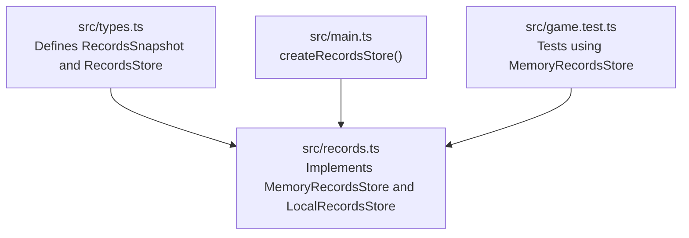
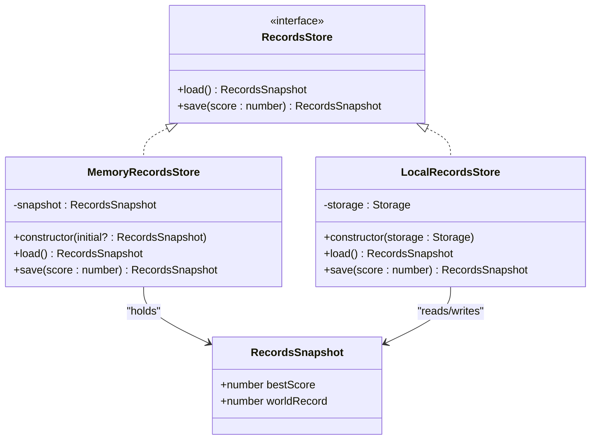
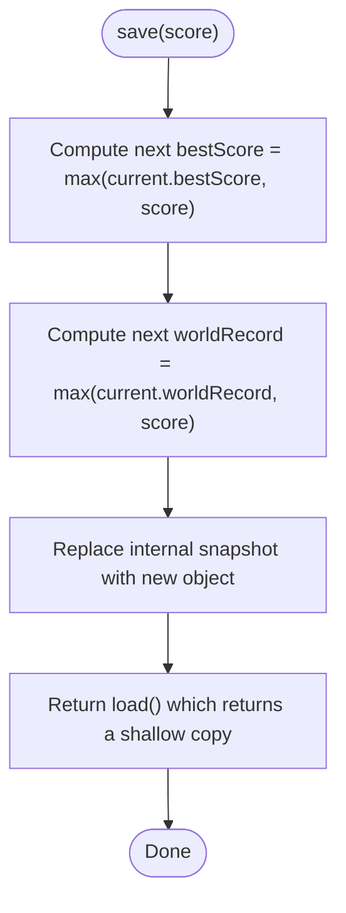
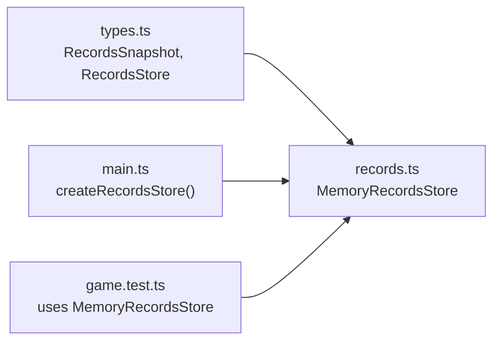

# Memory Storage Implementation

<cite>
**Referenced Files in This Document**
- [records.ts](file://src/records.ts)
- [types.ts](file://src/types.ts)
- [main.ts](file://src/main.ts)
- [game.test.ts](file://src/game.test.ts)
</cite>

## Table of Contents
1. [Introduction](#introduction)
2. [Project Structure](#project-structure)
3. [Core Components](#core-components)
4. [Architecture Overview](#architecture-overview)
5. [Detailed Component Analysis](#detailed-component-analysis)
6. [Dependency Analysis](#dependency-analysis)
7. [Performance Considerations](#performance-considerations)
8. [Troubleshooting Guide](#troubleshooting-guide)
9. [Conclusion](#conclusion)

## Introduction
This document explains the MemoryRecordsStore class, an in-memory implementation of the RecordsStore interface used primarily for testing and development. It provides a fast, isolated alternative to persistent storage by keeping records in process memory. The documentation covers:
- Constructor parameter for initial snapshot values
- Immutable snapshot pattern for load operations
- State mutation behavior in save while preserving test isolation
- Examples of configuring memory stores with different initial states
- How persistence behavior is verified in tests

## Project Structure
The relevant code resides in the following files:
- src/records.ts: Implements LocalRecordsStore and MemoryRecordsStore
- src/types.ts: Defines RecordsSnapshot and RecordsStore interfaces
- src/main.ts: Creates the active store at runtime (prefers local storage, falls back to memory)
- src/game.test.ts: Uses MemoryRecordsStore to verify persistence behavior in unit tests



**Diagram sources**
- [types.ts:45-53](file://src/types.ts#L45-L53)
- [records.ts:32-51](file://src/records.ts#L32-L51)
- [main.ts:153-159](file://src/main.ts#L153-L159)
- [game.test.ts:364-372](file://src/game.test.ts#L364-L372)

**Section sources**
- [records.ts:1-51](file://src/records.ts#L1-L51)
- [types.ts:45-53](file://src/types.ts#L45-L53)
- [main.ts:153-159](file://src/main.ts#L153-L159)
- [game.test.ts:364-372](file://src/game.test.ts#L364-L372)

## Core Components
- RecordsSnapshot: A plain object containing bestScore and worldRecord numbers.
- RecordsStore: An interface exposing load() and save(score).
- MemoryRecordsStore: In-memory implementation that holds a private snapshot and returns new snapshots on each operation.

Key behaviors:
- Constructor accepts an optional initial snapshot; defaults to zeroed scores when omitted.
- load() returns a shallow copy of the internal snapshot to prevent external mutation.
- save(score) computes new bestScore and worldRecord as the maximum of current values and the provided score, then updates the internal snapshot and returns a fresh snapshot via load().

**Section sources**
- [types.ts:45-53](file://src/types.ts#L45-L53)
- [records.ts:32-51](file://src/records.ts#L32-L51)

## Architecture Overview
MemoryRecordsStore fits into the application’s record persistence layer alongside LocalRecordsStore. At runtime, main.ts attempts to use LocalRecordsStore backed by browser storage; if unavailable, it falls back to MemoryRecordsStore. Tests explicitly construct MemoryRecordsStore instances to control initial state and assert persistence semantics deterministically.



**Diagram sources**
- [types.ts:45-53](file://src/types.ts#L45-L53)
- [records.ts:11-30](file://src/records.ts#L11-L30)
- [records.ts:32-51](file://src/records.ts#L32-L51)

## Detailed Component Analysis

### MemoryRecordsStore Class
Responsibilities:
- Maintain an in-memory snapshot of records
- Provide immutable reads via load()
- Update state immutably via save(score)

Constructor:
- Accepts an optional RecordsSnapshot. If not provided, defaults to bestScore: 0 and worldRecord: 0.
- Copies the initial snapshot to avoid sharing references with callers.

Load:
- Returns a shallow copy of the internal snapshot, ensuring consumers cannot mutate internal state.

Save:
- Computes next bestScore and worldRecord as the maximum of current values and the provided score.
- Replaces the internal snapshot with a new object reflecting updated values.
- Returns a fresh snapshot via load(), maintaining immutability guarantees.



**Diagram sources**
- [records.ts:43-50](file://src/records.ts#L43-L50)

**Section sources**
- [records.ts:32-51](file://src/records.ts#L32-L51)

### Integration Points
Runtime selection:
- createRecordsStore() tries LocalRecordsStore first; if unavailable, it instantiates MemoryRecordsStore without arguments.

Test usage:
- Tests instantiate MemoryRecordsStore with specific initial snapshots and assert save/load behavior.

```mermaid
sequenceDiagram
participant Test as "Test Case"
participant Store as "MemoryRecordsStore"
participant Game as "Game Logic"
Test->>Store : new MemoryRecordsStore({bestScore : X, worldRecord : Y})
Test->>Store : save(scoreA)
Store-->>Test : RecordsSnapshot{bestScore=max(X,scoreA), worldRecord=max(Y,scoreA)}
Test->>Store : save(scoreB)
Store-->>Test : RecordsSnapshot{bestScore=max(prevBest,scoreB), worldRecord=max(prevWorld,scoreB)}
Test->>Store : load()
Store-->>Test : RecordsSnapshot (immutable copy)
Note over Test,Store : Each call returns a new snapshot; no shared references
```

**Diagram sources**
- [main.ts:153-159](file://src/main.ts#L153-L159)
- [game.test.ts:364-372](file://src/game.test.ts#L364-L372)
- [records.ts:32-51](file://src/records.ts#L32-L51)

**Section sources**
- [main.ts:153-159](file://src/main.ts#L153-L159)
- [game.test.ts:364-372](file://src/game.test.ts#L364-L372)

### Usage Examples and Verification Patterns
Configuring with different initial states:
- Create a store with non-zero initial bestScore and worldRecord to simulate prior sessions or seeded data.
- Call save() multiple times with increasing scores and assert that both bestScore and worldRecord reflect the expected maxima.
- Call load() after mutations to confirm the latest snapshot is returned.

Verifying persistence behavior in tests:
- Instantiate a fresh MemoryRecordsStore per test to ensure isolation.
- Assert that save() returns a new snapshot object and does not mutate previously returned snapshots.
- Confirm that subsequent load() calls return the most recent snapshot.

These patterns are demonstrated in the existing test suite where a store is created with initial values and save/load assertions validate the expected progression of bestScore and worldRecord.

**Section sources**
- [game.test.ts:364-372](file://src/game.test.ts#L364-L372)
- [records.ts:32-51](file://src/records.ts#L32-L51)

## Dependency Analysis
- MemoryRecordsStore depends only on the RecordsSnapshot type and implements RecordsStore.
- No direct dependency on browser APIs; this makes it ideal for Node-based tests and deterministic scenarios.
- main.ts conditionally selects between LocalRecordsStore and MemoryRecordsStore based on environment availability.



**Diagram sources**
- [types.ts:45-53](file://src/types.ts#L45-L53)
- [records.ts:32-51](file://src/records.ts#L32-L51)
- [main.ts:153-159](file://src/main.ts#L153-L159)
- [game.test.ts:364-372](file://src/game.test.ts#L364-L372)

**Section sources**
- [types.ts:45-53](file://src/types.ts#L45-L53)
- [records.ts:32-51](file://src/records.ts#L32-L51)
- [main.ts:153-159](file://src/main.ts#L153-L159)
- [game.test.ts:364-372](file://src/game.test.ts#L364-L372)

## Performance Considerations
- Time complexity:
  - load(): O(1)
  - save(): O(1)
- Space complexity:
  - O(1) additional space per instance beyond the snapshot object.
- Immutability:
  - Returning new snapshots avoids accidental aliasing and simplifies reasoning in tests.
- Determinism:
  - No I/O or randomness; ideal for fast, repeatable unit tests.

[No sources needed since this section provides general guidance]

## Troubleshooting Guide
Common issues and resolutions:
- Unexpected shared state across tests:
  - Ensure each test creates its own MemoryRecordsStore instance so snapshots do not leak between tests.
- Mutating returned snapshots:
  - Treat snapshots as read-only; always call load() again to get the latest state rather than mutating previous results.
- Incorrect initial values:
  - Verify constructor arguments match the RecordsSnapshot shape and provide sensible defaults when unsure.

**Section sources**
- [records.ts:32-51](file://src/records.ts#L32-L51)
- [game.test.ts:364-372](file://src/game.test.ts#L364-L372)

## Conclusion
MemoryRecordsStore offers a simple, efficient, and test-friendly way to manage game records without side effects. By accepting an initial snapshot and returning immutable copies from load(), it ensures predictable behavior and strong test isolation. Its minimal dependencies and constant-time operations make it well-suited for unit tests and development workflows where deterministic persistence semantics are essential.