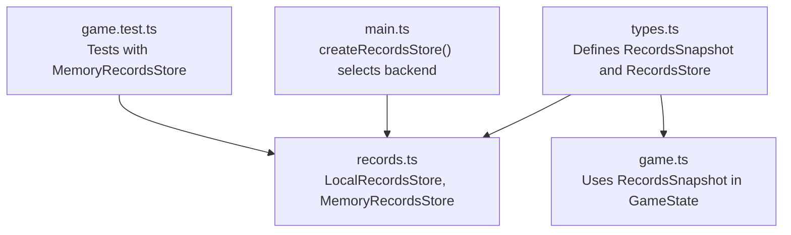
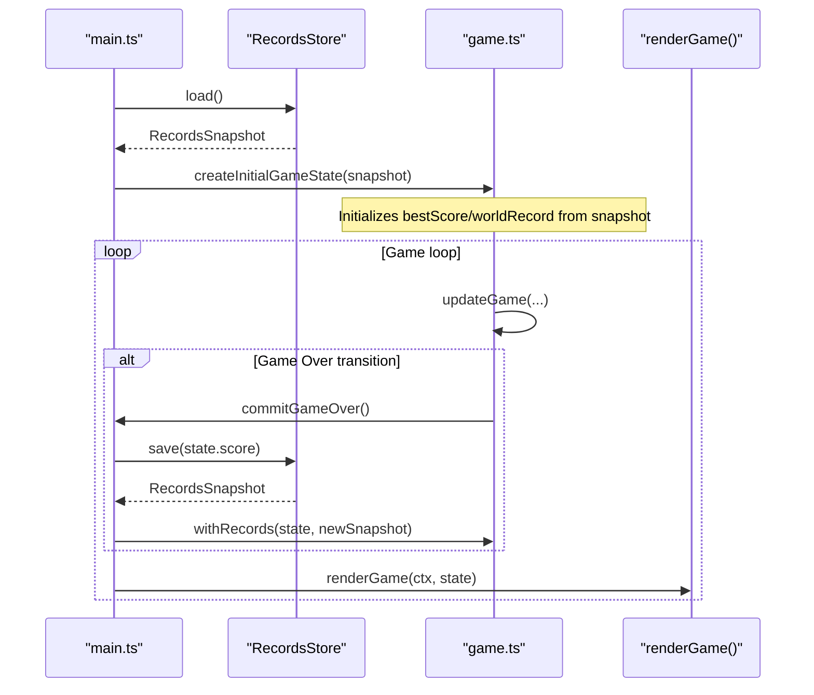
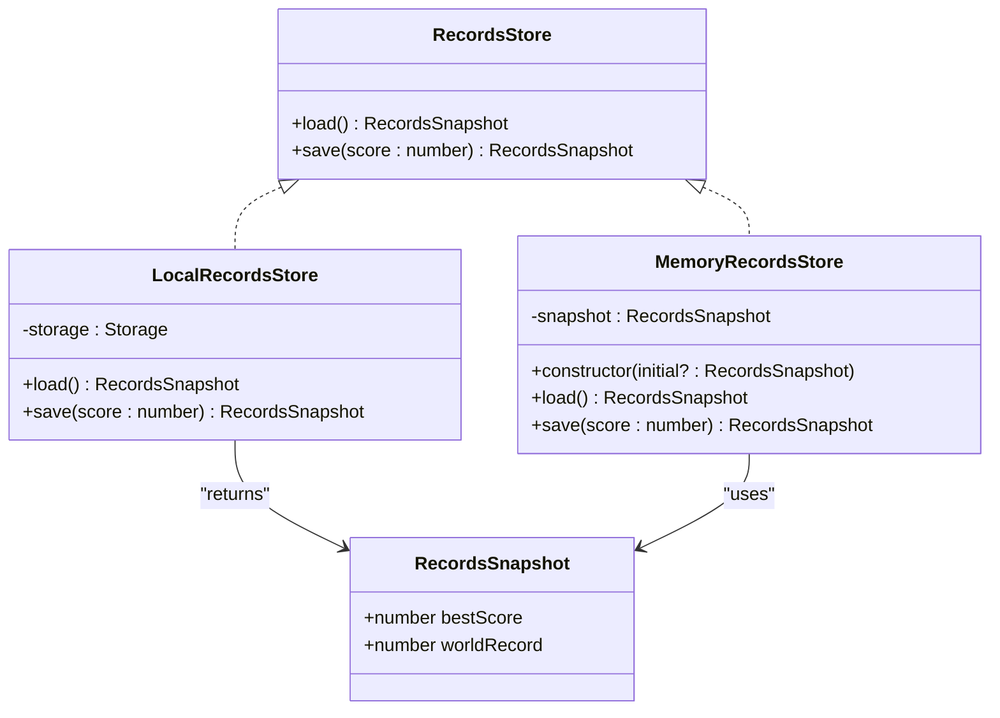
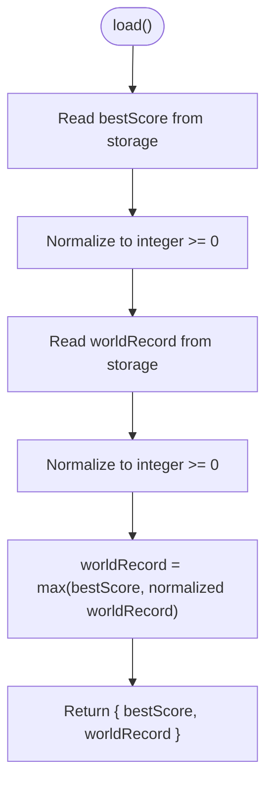
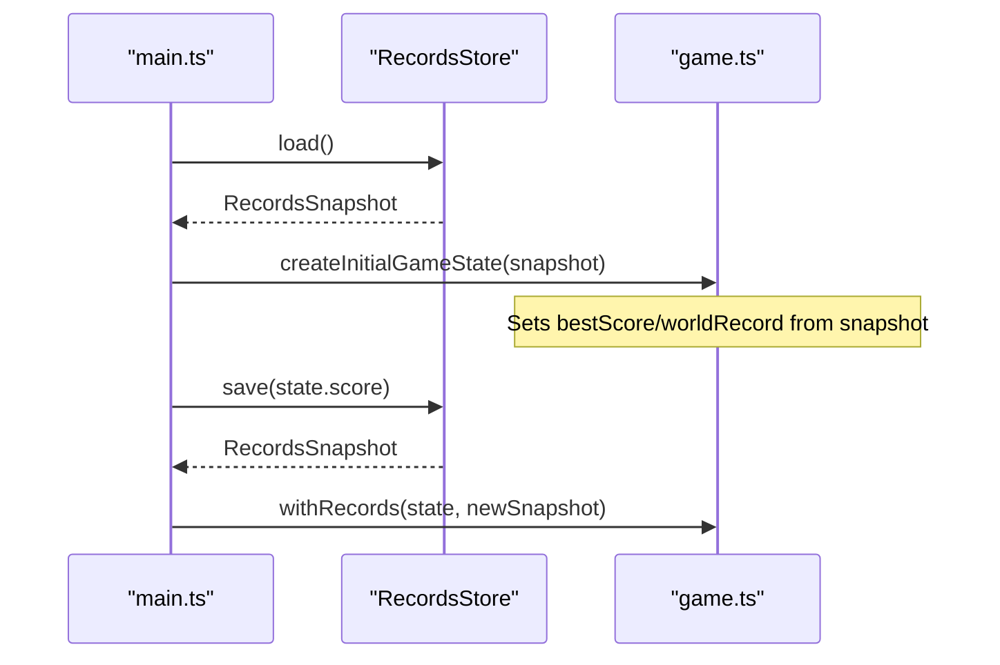
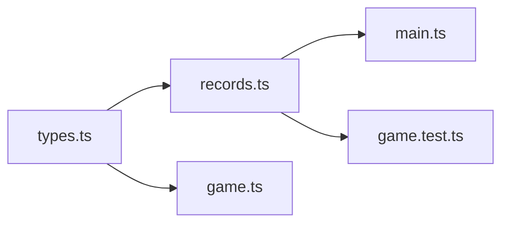

# Records Interface

<cite>
**Referenced Files in This Document**
- [types.ts](file://src/types.ts)
- [records.ts](file://src/records.ts)
- [main.ts](file://src/main.ts)
- [game.ts](file://src/game.ts)
- [game.test.ts](file://src/game.test.ts)
</cite>

## Table of Contents
1. [Introduction](#introduction)
2. [Project Structure](#project-structure)
3. [Core Components](#core-components)
4. [Architecture Overview](#architecture-overview)
5. [Detailed Component Analysis](#detailed-component-analysis)
6. [Dependency Analysis](#dependency-analysis)
7. [Performance Considerations](#performance-considerations)
8. [Troubleshooting Guide](#troubleshooting-guide)
9. [Conclusion](#conclusion)

## Introduction
This document explains the Records abstraction used to persist and retrieve high scores across game sessions. It focuses on:
- The RecordsSnapshot data model, including field semantics and validation rules
- The RecordsStore interface and its load/save behavior
- The strategy pattern implementation that enables pluggable storage backends
- Examples for implementing custom storage backends
- Benefits for testing and deployment flexibility

## Project Structure
The records subsystem is defined by a small set of TypeScript files:
- types.ts declares the RecordsSnapshot and RecordsStore interfaces
- records.ts provides two concrete implementations: LocalRecordsStore (browser localStorage) and MemoryRecordsStore (in-memory)
- main.ts wires up the runtime selection between local and memory stores
- game.ts consumes RecordsSnapshot when initializing game state
- game.test.ts validates the behavior of the records system using an in-memory store

**Diagram sources**
- [types.ts:45-53](file://src/types.ts#L45-L53)
- [records.ts:11-51](file://src/records.ts#L11-L51)
- [main.ts:153-159](file://src/main.ts#L153-L159)
- [game.ts:29-48](file://src/game.ts#L29-L48)
- [game.test.ts:364-372](file://src/game.test.ts#L364-L372)

**Section sources**
- [types.ts:45-53](file://src/types.ts#L45-L53)
- [records.ts:1-52](file://src/records.ts#L1-L52)
- [main.ts:153-159](file://src/main.ts#L153-L159)
- [game.ts:29-48](file://src/game.ts#L29-L48)
- [game.test.ts:364-372](file://src/game.test.ts#L364-L372)

## Core Components
- RecordsSnapshot: Immutable snapshot of best score and world record values
- RecordsStore: Strategy interface for loading and saving records
- LocalRecordsStore: Persistent browser storage backend
- MemoryRecordsStore: In-memory backend for tests and fallbacks

Key behaviors:
- save(score) updates both bestScore and worldRecord to be at least the provided score
- load() returns the current snapshot; LocalRecordsStore ensures consistency by deriving worldRecord from stored values

**Section sources**
- [types.ts:45-53](file://src/types.ts#L45-L53)
- [records.ts:11-51](file://src/records.ts#L11-L51)

## Architecture Overview
The application uses a strategy pattern to abstract storage concerns behind RecordsStore. At runtime, main.ts attempts to use LocalRecordsStore backed by window.localStorage. If unavailable or if access fails, it falls back to MemoryRecordsStore. Game logic depends only on RecordsSnapshot and RecordsStore, never on storage specifics.

**Diagram sources**
- [main.ts:39-48](file://src/main.ts#L39-L48)
- [main.ts:138-144](file://src/main.ts#L138-L144)
- [game.ts:29-48](file://src/game.ts#L29-L48)
- [game.ts:50-56](file://src/game.ts#L50-L56)

## Detailed Component Analysis

### RecordsSnapshot Data Model
- Fields:
  - bestScore: number — highest score achieved in the current session context
  - worldRecord: number — highest score ever recorded globally (or per-device in this implementation)
- Type constraints:
  - Both fields are numbers
- Validation rules:
  - Values must be non-negative integers
  - On load, invalid or missing values are normalized to zero
  - On save, values are updated to be at least the provided score
- Immutability:
  - Consumers treat snapshots as immutable; updates return new snapshots

Implementation notes:
- LocalRecordsStore normalizes persisted values via a helper that coerces strings to numbers and clamps invalid inputs to zero
- MemoryRecordsStore maintains an internal snapshot and returns copies on load to avoid accidental mutation

**Section sources**
- [types.ts:45-48](file://src/types.ts#L45-L48)
- [records.ts:6-9](file://src/records.ts#L6-L9)
- [records.ts:14-18](file://src/records.ts#L14-L18)
- [records.ts:39-41](file://src/records.ts#L39-L41)

### RecordsStore Interface
Methods:
- load(): RecordsSnapshot
  - Returns the current snapshot without side effects
- save(score: number): RecordsSnapshot
  - Persists updated bestScore and worldRecord based on the provided score
  - Ensures both fields are at least the provided score
  - Returns the new snapshot

Expected behavior:
- Idempotent updates: calling save with a lower score than current should not decrease values
- Consistency: after save, subsequent load must reflect the updated snapshot
- Determinism: given the same input score and prior snapshot, output snapshot is deterministic

**Section sources**
- [types.ts:50-53](file://src/types.ts#L50-L53)
- [records.ts:20-29](file://src/records.ts#L20-L29)
- [records.ts:43-50](file://src/records.ts#L43-L50)

### Strategy Pattern Implementation
Two strategies implement RecordsStore:
- LocalRecordsStore: persists to browser Storage (localStorage)
- MemoryRecordsStore: keeps state in process memory

Runtime selection:
- main.ts attempts to construct LocalRecordsStore with window.localStorage
- If construction or usage fails, it falls back to MemoryRecordsStore

**Diagram sources**
- [types.ts:45-53](file://src/types.ts#L45-L53)
- [records.ts:11-51](file://src/records.ts#L11-L51)
- [main.ts:153-159](file://src/main.ts#L153-L159)

#### LocalRecordsStore Behavior
- Keys:
  - Uses stable keys for bestScore and worldRecord
- Load:
  - Reads numeric values from storage
  - Normalizes invalid entries to zero
  - Derives worldRecord as the maximum of bestScore and stored worldRecord to ensure consistency
- Save:
  - Computes nextBest and nextWorld as max(current, score)
  - Persists stringified values
  - Returns new snapshot

Validation flow:

**Diagram sources**
- [records.ts:6-9](file://src/records.ts#L6-L9)
- [records.ts:14-18](file://src/records.ts#L14-L18)

**Section sources**
- [records.ts:11-30](file://src/records.ts#L11-L30)

#### MemoryRecordsStore Behavior
- Maintains an internal snapshot initialized with defaults or provided initial values
- load() returns a copy of the snapshot
- save() updates both fields to be at least the provided score and returns the new snapshot

Use cases:
- Unit tests
- Fallback when persistent storage is unavailable

**Section sources**
- [records.ts:32-51](file://src/records.ts#L32-L51)
- [game.test.ts:364-372](file://src/game.test.ts#L364-L372)

### Integration Points
- Game initialization:
  - createInitialGameState reads RecordsSnapshot.bestScore and RecordsSnapshot.worldRecord to seed the game state
- Game over handling:
  - commitGameOver calls records.save(state.score) and merges the returned snapshot into the game state

**Diagram sources**
- [main.ts:39-48](file://src/main.ts#L39-L48)
- [main.ts:138-144](file://src/main.ts#L138-L144)
- [game.ts:29-48](file://src/game.ts#L29-L48)
- [game.ts:50-56](file://src/game.ts#L50-L56)

**Section sources**
- [game.ts:29-48](file://src/game.ts#L29-L48)
- [game.ts:50-56](file://src/game.ts#L50-L56)
- [main.ts:138-144](file://src/main.ts#L138-L144)

### Implementing Custom Storage Backends
To add a new backend:
- Create a class that implements RecordsStore
- Ensure load() returns a valid RecordsSnapshot
- Ensure save(score) updates both bestScore and worldRecord to be at least score
- Persist data according to your target medium (e.g., IndexedDB, server API, cookie)
- Integrate by providing an instance where main.ts constructs the store

Example outline:
- Class name: ServerRecordsStore
- Methods:
  - load(): fetches snapshot from server and returns RecordsSnapshot
  - save(score): posts score to server and returns updated RecordsSnapshot
- Runtime wiring:
  - Replace or augment createRecordsStore() to choose the new backend based on environment or feature flags

Benefits:
- Decouples game logic from storage details
- Enables easy swapping between local, remote, or mock backends
- Simplifies configuration for different environments (development, staging, production)

[No sources needed since this section provides general guidance]

## Dependency Analysis
- Types dependency:
  - records.ts imports RecordsSnapshot and RecordsStore from types.ts
- Usage dependencies:
  - main.ts imports LocalRecordsStore and MemoryRecordsStore and creates a RecordsStore instance
  - game.ts consumes RecordsSnapshot during game initialization and merging
- Test dependency:
  - game.test.ts uses MemoryRecordsStore to validate persistence behavior

**Diagram sources**
- [types.ts:45-53](file://src/types.ts#L45-L53)
- [records.ts:1-2](file://src/records.ts#L1-L2)
- [main.ts:7](file://src/main.ts#L7)
- [game.ts:1](file://src/game.ts#L1)
- [game.test.ts:23](file://src/game.test.ts#L23)

**Section sources**
- [records.ts:1-2](file://src/records.ts#L1-L2)
- [main.ts:7](file://src/main.ts#L7)
- [game.ts:1](file://src/game.ts#L1)
- [game.test.ts:23](file://src/game.test.ts#L23)

## Performance Considerations
- LocalRecordsStore performs minimal I/O:
  - Two reads on load, two writes on save
  - Numeric normalization avoids expensive parsing by validating and flooring values
- MemoryRecordsStore has O(1) operations and no I/O overhead
- Avoid unnecessary re-renders by updating state only when records change (as done in commitGameOver)

[No sources needed since this section provides general guidance]

## Troubleshooting Guide
Common issues and resolutions:
- Invalid or corrupted persisted values:
  - LocalRecordsStore normalizes invalid entries to zero; verify key names and value formats
- Storage unavailable:
  - main.ts falls back to MemoryRecordsStore if localStorage is inaccessible; confirm try/catch behavior in createRecordsStore
- Inconsistent worldRecord:
  - LocalRecordsStore derives worldRecord as max(bestScore, stored worldRecord) on load to maintain consistency

**Section sources**
- [records.ts:6-9](file://src/records.ts#L6-L9)
- [records.ts:14-18](file://src/records.ts#L14-L18)
- [main.ts:153-159](file://src/main.ts#L153-L159)

## Conclusion
The Records abstraction cleanly separates game logic from storage concerns through a simple interface and two practical implementations. RecordsSnapshot defines clear, validated fields for bestScore and worldRecord. The strategy pattern enables flexible backend selection, robust testing with MemoryRecordsStore, and resilient deployment with automatic fallback. Extending to additional backends is straightforward and encourages environment-specific configurations without altering core game code.