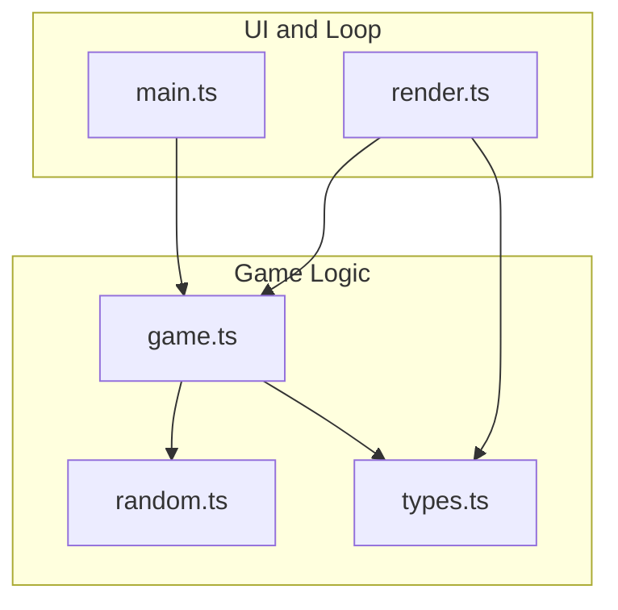
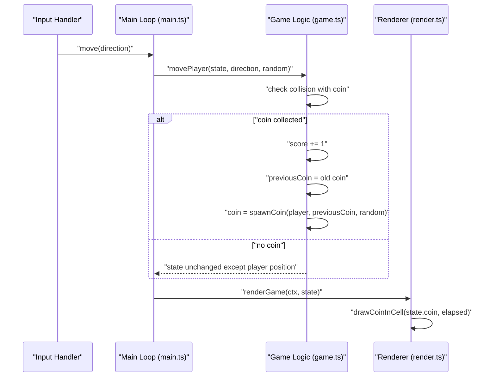
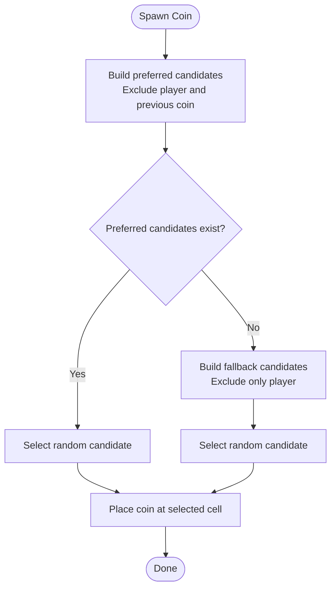
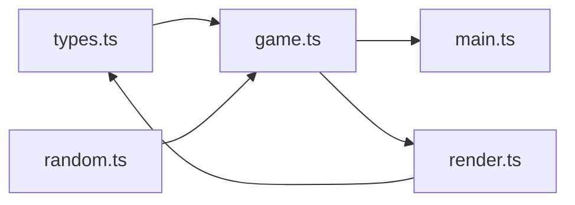

# Coin Collection System

<cite>
**Referenced Files in This Document**
- [game.ts](file://src/game.ts)
- [random.ts](file://src/random.ts)
- [types.ts](file://src/types.ts)
- [render.ts](file://src/render.ts)
- [main.ts](file://src/main.ts)
- [README.md](file://README.md)
</cite>

## Table of Contents
1. [Introduction](#introduction)
2. [Project Structure](#project-structure)
3. [Core Components](#core-components)
4. [Architecture Overview](#architecture-overview)
5. [Detailed Component Analysis](#detailed-component-analysis)
6. [Dependency Analysis](#dependency-analysis)
7. [Performance Considerations](#performance-considerations)
8. [Troubleshooting Guide](#troubleshooting-guide)
9. [Conclusion](#conclusion)

## Introduction
This document explains the coin collection mechanics in detail, focusing on how coins are spawned, collected, and respawned immediately upon collection. It covers the spawnCoin algorithm’s preferred cell selection strategy that avoids the player and previous coin positions, deterministic random number generation integration, scoring updates, and edge cases such as grid exhaustion with fallback strategies. Concrete examples from the codebase are referenced via file paths and line ranges to ensure traceability.

## Project Structure
The coin system is implemented primarily in the game logic module, with supporting utilities for randomness and type definitions. Rendering and main loop integration provide context for when and how coin events affect gameplay and visuals.

**Diagram sources**
- [game.ts:1-48](file://src/game.ts#L1-L48)
- [random.ts:1-18](file://src/random.ts#L1-L18)
- [types.ts:1-54](file://src/types.ts#L1-L54)
- [main.ts:1-160](file://src/main.ts#L1-L160)
- [render.ts:1-185](file://src/render.ts#L1-L185)

**Section sources**
- [game.ts:1-48](file://src/game.ts#L1-L48)
- [random.ts:1-18](file://src/random.ts#L1-L18)
- [types.ts:1-54](file://src/types.ts#L1-L54)
- [main.ts:1-160](file://src/main.ts#L1-L160)
- [render.ts:1-185](file://src/render.ts#L1-L185)

## Core Components
- Game state includes current coin position, previous coin position, score, and other fields used by the coin system.
- The spawnCoin function selects a new coin location deterministically using a provided RandomSource.
- Player movement triggers coin collection, immediate respawn, and score incrementation.
- Rendering displays the coin at its current cell and animates it.

Key responsibilities:
- Spawn logic: avoid player and previous coin positions; fallback if needed.
- Collection logic: update score, track previous coin, spawn new coin immediately.
- Deterministic RNG: integrate with a pluggable RandomSource for reproducibility.

**Section sources**
- [types.ts:28-43](file://src/types.ts#L28-L43)
- [game.ts:103-111](file://src/game.ts#L103-L111)
- [game.ts:58-81](file://src/game.ts#L58-L81)
- [render.ts:359-368](file://src/render.ts#L359-L368)

## Architecture Overview
The coin lifecycle spans input handling, game state updates, and rendering:

**Diagram sources**
- [main.ts:69-87](file://src/main.ts#L69-L87)
- [game.ts:58-81](file://src/game.ts#L58-L81)
- [render.ts:166-185](file://src/render.ts#L166-L185)
- [render.ts:359-368](file://src/render.ts#L359-L368)

## Detailed Component Analysis

### spawnCoin Algorithm
The spawnCoin function implements a two-stage candidate selection strategy:
- Preferred candidates: all cells excluding the player’s current cell and the previous coin’s cell (if any).
- Fallback candidates: all cells excluding only the player’s current cell.
- Selection: pick one candidate uniformly at random using the provided RandomSource.

Behavioral guarantees:
- Avoids spawning on the player to prevent instant collection.
- Avoids reusing the previous coin location to encourage movement.
- Ensures a valid placement even under extreme conditions by falling back to player-excluded-only set.

Deterministic RNG integration:
- Uses a RandomSource parameter to allow seeded or fixed sequences for testing and reproducibility.
- randomInt(maxExclusive, random) maps the source to an integer index within the candidate list.

Edge case handling:
- If preferred candidates are empty (e.g., grid size equals 1), fallback ensures a non-player cell is chosen.
- For very small grids, the fallback prevents invalid placements.

Complexity:
- Candidate filtering iterates over all cells O(N^2) where N is GRID_SIZE.
- Random selection is O(1).
- Overall per spawn cost is O(N^2), acceptable given small grid sizes.

Concrete example references:
- Candidate filtering and fallback selection: [spawnCoin implementation:103-111](file://src/game.ts#L103-L111)
- All cells enumeration helper: [createAllCells:281-291](file://src/game.ts#L281-L291)
- Random utility wrapper: [randomInt:3-5](file://src/random.ts#L3-L5)

**Section sources**
- [game.ts:103-111](file://src/game.ts#L103-L111)
- [game.ts:281-291](file://src/game.ts#L281-L291)
- [random.ts:3-5](file://src/random.ts#L3-L5)

### Immediate Respawn Behavior
When the player moves onto the coin’s cell:
- Score increments by 1.
- Previous coin position is recorded.
- A new coin is spawned immediately at a new cell using spawnCoin.
- Fireball spawner timing may reset depending on whether this is the first coin collected.

Integration points:
- movePlayer detects coin overlap and applies these updates atomically.
- The renderer draws the updated coin position each frame.

Concrete example references:
- Move and collection logic: [movePlayer coin detection and updates:58-81](file://src/game.ts#L58-L81)
- Initial state sets first coin via spawnCoin: [createInitialGameState:29-48](file://src/game.ts#L29-L48)
- Rendering of coin in cell: [drawCoinInCell:359-368](file://src/render.ts#L359-L368)

**Section sources**
- [game.ts:58-81](file://src/game.ts#L58-L81)
- [game.ts:29-48](file://src/game.ts#L29-L48)
- [render.ts:359-368](file://src/render.ts#L359-L368)

### Scoring Integration
Scoring is tightly coupled with coin collection:
- Each successful collection increases the score by 1.
- The HUD renders the current score and best/world records.
- Audio cues play on first coin and subsequent collections.

Concrete example references:
- Score increment and persistence in state: [movePlayer score update:58-81](file://src/game.ts#L58-L81)
- HUD drawing of score: [drawHud](file://src/render.ts:229-240)
- Audio feedback on coin collection: [dispatchMove audio calls](file://src/main.ts:69-87)

**Section sources**
- [game.ts:58-81](file://src/game.ts#L58-L81)
- [render.ts:229-240](file://src/render.ts#L229-L240)
- [main.ts:69-87](file://src/main.ts#L69-L87)

### Random Number Generation Integration
The coin system uses a pluggable RandomSource to support deterministic behavior:
- createInitialGameState accepts a RandomSource defaulting to Math.random.
- Tests inject fixed or sequenced random functions to verify deterministic outcomes.
- mulberry32 provides a seeded PRNG implementation for reproducible runs.

Concrete example references:
- RandomSource type and randomInt: [random.ts:1-5](file://src/random.ts#L1-L5)
- Seeded PRNG factory: [mulberry32:7-17](file://src/random.ts#L7-L17)
- Initial state creation with RandomSource: [createInitialGameState:29-48](file://src/game.ts#L29-L48)
- Test fixtures using fixedRandom and sequenceRandom: [game.test.ts:29-45](file://src/game.test.ts#L29-L45)

**Section sources**
- [random.ts:1-17](file://src/random.ts#L1-L17)
- [game.ts:29-48](file://src/game.ts#L29-L48)
- [game.test.ts:29-45](file://src/game.test.ts#L29-L45)

### Edge Cases and Fallback Strategies
- Grid exhaustion scenario: On extremely small grids, preferred candidates might be empty. The fallback strategy ensures a valid placement by selecting any non-player cell.
- First coin collection: Fireball spawning is gated until after the first coin is collected; initial delays are adjusted accordingly.

Concrete example references:
- Preferred vs fallback candidate selection: [spawnCoin:103-111](file://src/game.ts#L103-L111)
- All cells enumeration: [createAllCells:281-291](file://src/game.ts#L281-L291)
- Fireball delay scheduling and gating: [scheduleFireballDelay:225-243](file://src/game.ts#L225-L243)

**Section sources**
- [game.ts:103-111](file://src/game.ts#L103-L111)
- [game.ts:281-291](file://src/game.ts#L281-L291)
- [game.ts:225-243](file://src/game.ts#L225-L243)

### Conceptual Overview
The coin system emphasizes fairness and engagement:
- Avoiding immediate reuse of locations keeps gameplay dynamic.
- Immediate respawn maintains pacing and encourages continuous movement.
- Deterministic RNG enables consistent test coverage and replay scenarios.

[No sources needed since this diagram shows conceptual workflow, not actual code structure]

## Dependency Analysis
The coin system depends on core types, random utilities, and integrates with the main loop and renderer.

**Diagram sources**
- [types.ts:1-54](file://src/types.ts#L1-L54)
- [random.ts:1-18](file://src/random.ts#L1-L18)
- [game.ts:1-48](file://src/game.ts#L1-L48)
- [main.ts:1-160](file://src/main.ts#L1-L160)
- [render.ts:1-185](file://src/render.ts#L1-L185)

**Section sources**
- [types.ts:1-54](file://src/types.ts#L1-L54)
- [random.ts:1-18](file://src/random.ts#L1-L18)
- [game.ts:1-48](file://src/game.ts#L1-L48)
- [main.ts:1-160](file://src/main.ts#L1-L160)
- [render.ts:1-185](file://src/render.ts#L1-L185)

## Performance Considerations
- Candidate filtering is O(N^2) per spawn due to iterating all cells. With GRID_SIZE=5, this is negligible.
- Immediate respawn avoids additional timers or queues, keeping the update path simple.
- Using a deterministic RandomSource has no performance penalty compared to Math.random.

[No sources needed since this section provides general guidance]

## Troubleshooting Guide
Common issues and checks:
- Coin always spawns on the player: Verify that spawnCandidate filtering excludes the player and that the correct RandomSource is passed into spawnCoin.
- No coin appears after collection: Ensure movePlayer updates both previousCoin and coin fields and that render reads state.coin.
- Non-deterministic behavior in tests: Confirm that fixedRandom or mulberry32 is injected consistently across createInitialGameState and movePlayer calls.

Concrete example references:
- Candidate exclusion logic: [spawnCoin:103-111](file://src/game.ts#L103-L111)
- State updates on collection: [movePlayer:58-81](file://src/game.ts#L58-L81)
- Rendering of coin: [drawCoinInCell:359-368](file://src/render.ts#L359-L368)
- Deterministic RNG usage in tests: [game.test.ts:29-45](file://src/game.test.ts#L29-L45)

**Section sources**
- [game.ts:103-111](file://src/game.ts#L103-L111)
- [game.ts:58-81](file://src/game.ts#L58-L81)
- [render.ts:359-368](file://src/render.ts#L359-L368)
- [game.test.ts:29-45](file://src/game.test.ts#L29-L45)

## Conclusion
The coin collection system is designed for clarity, responsiveness, and determinism. The spawnCoin algorithm prioritizes variety by avoiding the player and previous coin positions, with robust fallbacks for edge cases. Immediate respawn and tight scoring integration maintain engaging gameplay, while pluggable randomness supports reliable testing and reproducible sessions.

[No sources needed since this section summarizes without analyzing specific files]