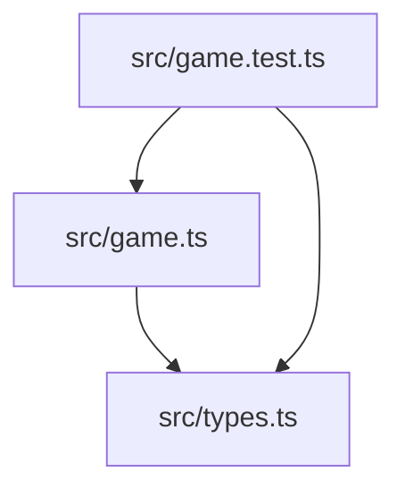
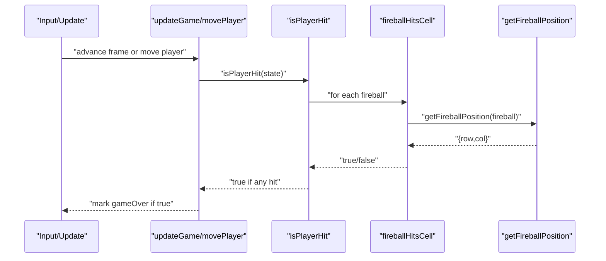
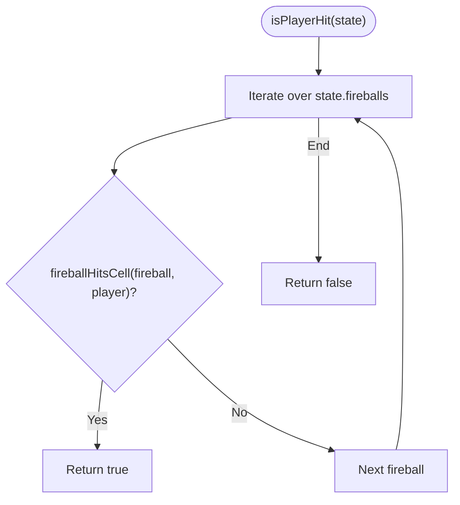
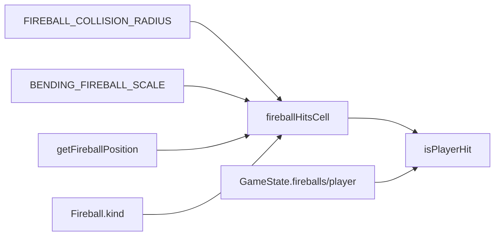

# Collision Detection

<cite>
**Referenced Files in This Document**
- [game.ts](file://src/game.ts)
- [types.ts](file://src/types.ts)
- [game.test.ts](file://src/game.test.ts)
</cite>

## Table of Contents
1. [Introduction](#introduction)
2. [Project Structure](#project-structure)
3. [Core Components](#core-components)
4. [Architecture Overview](#architecture-overview)
5. [Detailed Component Analysis](#detailed-component-analysis)
6. [Dependency Analysis](#dependency-analysis)
7. [Performance Considerations](#performance-considerations)
8. [Troubleshooting Guide](#troubleshooting-guide)
9. [Conclusion](#conclusion)

## Introduction
This document explains the collision detection system for fireballs and the player, focusing on:
- How fireballHitsCell computes hits using FIREBALL_COLLISION_RADIUS
- How bending fireballs adjust their hitbox with BENDING_FIREBALL_SCALE
- How isPlayerHit aggregates results across all active fireballs
- Concrete mathematical examples for distance checks and boundary conditions
- Performance considerations and early exit optimizations

## Project Structure
The collision logic lives in the game module alongside constants and utilities. Types are defined separately to keep interfaces clear.

**Diagram sources**
- [game.ts:1-20](file://src/game.ts#L1-L20)
- [types.ts:1-26](file://src/types.ts#L1-L26)
- [game.test.ts:1-25](file://src/game.test.ts#L1-L25)

**Section sources**
- [game.ts:1-20](file://src/game.ts#L1-L20)
- [types.ts:1-26](file://src/types.ts#L1-L26)

## Core Components
- Constants defining collision radii and scaling factors
- Fireball position computation helpers
- Collision check functions: fireballHitsCell and isPlayerHit
- Game loop integration points that call collision checks after updates or moves

Key constants:
- FIREBALL_COLLISION_RADIUS: base radius used for normal fireballs
- BENDING_FIREBALL_SCALE: multiplier applied to the radius for bending fireballs
- FIREBALL_WARNING_DURATION: time before a fireball becomes dangerous (outside grid warning phase)

Collision-relevant exports:
- fireballHitsCell(fireball, cell): boolean
- isPlayerHit(state): boolean

**Section sources**
- [game.ts:4-16](file://src/game.ts#L4-L16)
- [game.ts:210-223](file://src/game.ts#L210-L223)

## Architecture Overview
At a high level:
- The game state contains a list of active fireballs and the player’s current cell
- After each move or update step, the system checks whether any fireball collides with the player
- Each fireball has a kind (“normal” or “bending”) which affects its hitbox size
- The collision check uses axis-aligned bounds derived from the effective radius

**Diagram sources**
- [game.ts:83-101](file://src/game.ts#L83-L101)
- [game.ts:58-81](file://src/game.ts#L58-L81)
- [game.ts:221-223](file://src/game.ts#L221-L223)
- [game.ts:210-219](file://src/game.ts#L210-L219)
- [game.ts:168-176](file://src/game.ts#L168-L176)

## Detailed Component Analysis

### fireballHitsCell: Hitbox Calculation and Boundary Checks
Purpose:
- Determine if a single fireball overlaps the player’s cell during its dangerous phase.

Algorithm overview:
- Early exit if the fireball is still in its warning phase (age < warningDuration). During this phase, the fireball is off-screen and not dangerous.
- Compute the fireball’s continuous position at the current time via getFireballPosition.
- Choose an effective radius:
  - For normal fireballs: FIREBALL_COLLISION_RADIUS
  - For bending fireballs: FIREBALL_COLLISION_RADIUS * BENDING_FIREBALL_SCALE
- Perform an axis-aligned box test against the player’s integer cell coordinates:
  - |position.row - cell.row| <= radius AND |position.col - cell.col| <= radius

Mathematical details:
- Let r = effective radius
- Let p = {row, col} be the fireball’s continuous position
- Let c = {row, col} be the player’s discrete cell
- Hit condition: max(|p.row - c.row|, |p.col - c.col|) <= r

Boundary behavior:
- If the fireball is outside the grid but within the warning duration, it returns false immediately.
- If the fireball is inside the grid and within the radius around the player’s cell center, it returns true.

Concrete example (normal fireball):
- Assume GRID_SIZE = 5, CENTER_CELL = 2
- Player at cell {row: 2, col: 2}
- Normal fireball at continuous position {row: 2.1, col: 2.05}
- Effective radius r = FIREBALL_COLLISION_RADIUS ≈ 0.42
- Differences: Δrow = |2.1 - 2| = 0.1; Δcol = |2.05 - 2| = 0.05
- Both differences ≤ 0.42 → hit = true

Concrete example (bending fireball):
- Same player at {row: 2, col: 2}
- Bending fireball at {row: 2.2, col: 2.1}
- Effective radius r = FIREBALL_COLLISION_RADIUS * BENDING_FIREBALL_SCALE ≈ 0.42 * 0.75 = 0.315
- Differences: Δrow = 0.2; Δcol = 0.1
- Both differences ≤ 0.315 → hit = true

Edge case (warning phase):
- Fireball age < warningDuration → immediate false regardless of position

**Section sources**
- [game.ts:210-219](file://src/game.ts#L210-L219)
- [game.ts:168-176](file://src/game.ts#L168-L176)
- [game.ts:4-16](file://src/game.ts#L4-L16)
- [types.ts:13-26](file://src/types.ts#L13-L26)

### isPlayerHit: Aggregating Results Across All Active Fireballs
Purpose:
- Return true if any active fireball collides with the player.

Behavior:
- Iterates through state.fireballs and calls fireballHitsCell for each
- Uses short-circuit evaluation: returns true on the first hit
- Returns false if no fireball hits

Integration points:
- Called after movePlayer to detect collisions when the player steps into danger
- Called after updateGame to detect collisions after fireballs advance

**Diagram sources**
- [game.ts:221-223](file://src/game.ts#L221-L223)

**Section sources**
- [game.ts:221-223](file://src/game.ts#L221-L223)
- [game.ts:58-81](file://src/game.ts#L58-L81)
- [game.ts:83-101](file://src/game.ts#L83-L101)

### Positioning and Warning Phase
- getFireballPosition computes the continuous row/col based on progress and edge direction
- For bending fireballs after the warning phase, position is taken directly from the fireball’s updated row/col fields
- The returned object includes isWarning flag indicating whether the fireball is still off-screen and harmless

**Section sources**
- [game.ts:168-176](file://src/game.ts#L168-L176)

## Dependency Analysis
- fireballHitsCell depends on:
  - FIREBALL_COLLISION_RADIUS and BENDING_FIREBALL_SCALE constants
  - getFireballPosition helper
  - Fireball.kind to select the correct radius
- isPlayerHit depends on:
  - fireballHitsCell
  - GameState.fireballs and GameState.player

**Diagram sources**
- [game.ts:4-16](file://src/game.ts#L4-L16)
- [game.ts:168-176](file://src/game.ts#L168-L176)
- [game.ts:210-223](file://src/game.ts#L210-L223)

**Section sources**
- [game.ts:4-16](file://src/game.ts#L4-L16)
- [game.ts:168-176](file://src/game.ts#L168-L176)
- [game.ts:210-223](file://src/game.ts#L210-L223)

## Performance Considerations
- Early exit in fireballHitsCell:
  - If age < warningDuration, return false immediately without computing position or doing math. This avoids unnecessary work for off-screen warnings.
- Short-circuit aggregation in isPlayerHit:
  - Iteration stops at the first hit, minimizing checks when a collision occurs.
- Constant-time per-fireball check:
  - Each fireball requires O(1) arithmetic operations and one position lookup.
- Overall complexity:
  - Per frame: O(N) where N is the number of active fireballs
- Potential further optimizations (if needed):
  - Spatial partitioning (e.g., grid-based broad-phase) to reduce pairwise checks when N grows large
  - Precompute bounding boxes for quick rejection
  - Batch position computations only for fireballs whose travel phase allows potential hits

[No sources needed since this section provides general guidance]

## Troubleshooting Guide
Common issues and how to diagnose them:
- False negatives during warning phase:
  - Ensure you do not expect hits while fireball.age < warningDuration; by design, these are safe and off-screen.
- Unexpected misses near edges:
  - Verify the effective radius selection: bending fireballs use a smaller radius due to BENDING_FIREBALL_SCALE.
  - Confirm the player cell coordinates and fireball position rounding expectations.
- Inconsistent hit timing:
  - Check getFireballPosition behavior for bending vs straight fireballs and ensure the fireball’s age and travelDuration are set correctly.

Relevant tests demonstrating expected behavior:
- Smaller hitbox for bending fireballs
- Warning phase prevents hits while off-screen
- Straight travel and hitting the player when aligned

**Section sources**
- [game.test.ts:285-317](file://src/game.test.ts#L285-L317)
- [game.test.ts:319-338](file://src/game.test.ts#L319-L338)

## Conclusion
The collision detection system is simple, efficient, and robust:
- It uses a constant-radius, axis-aligned check against the player’s cell
- Bending fireballs have a proportionally smaller hitbox via BENDING_FIREBALL_SCALE
- Early exits and short-circuiting keep performance predictable
- The design cleanly separates position computation, radius selection, and aggregation logic

[No sources needed since this section summarizes without analyzing specific files]