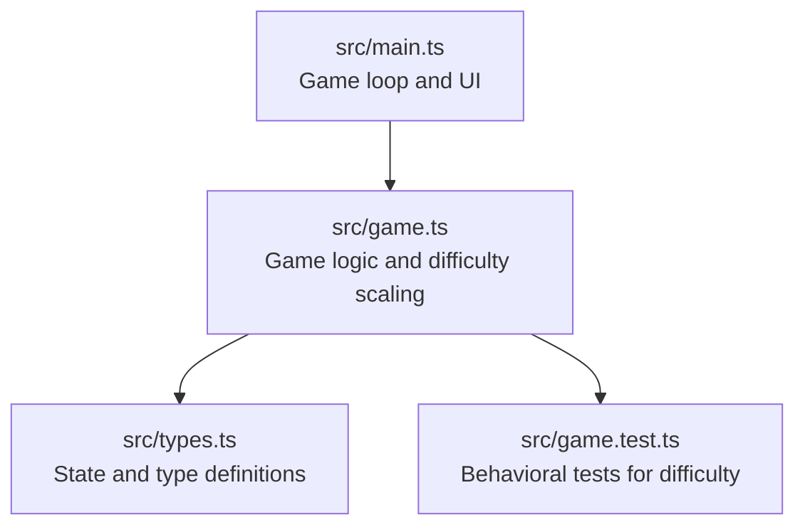
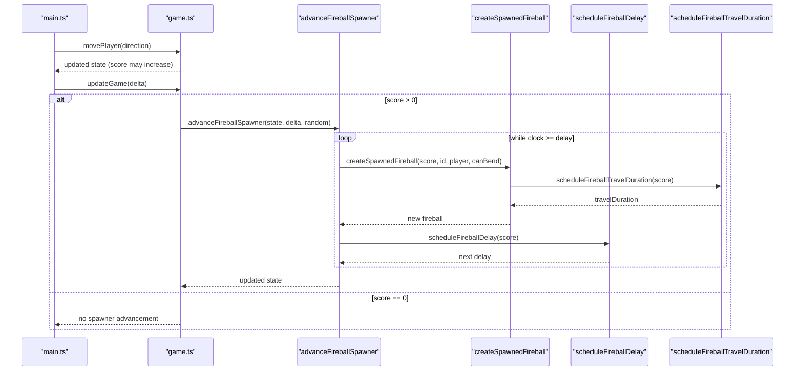
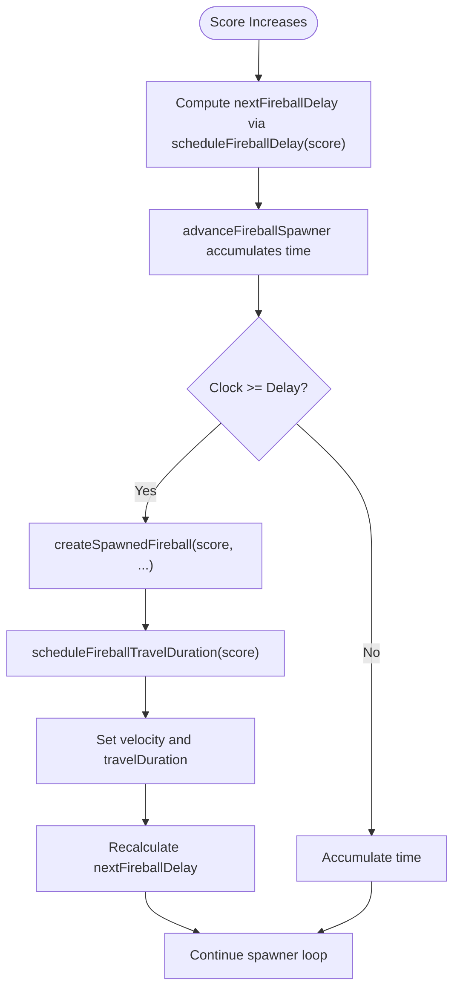

# Difficulty Scaling System

<cite>
**Referenced Files in This Document**
- [game.ts](file://src/game.ts)
- [main.ts](file://src/main.ts)
- [types.ts](file://src/types.ts)
- [game.test.ts](file://src/game.test.ts)
</cite>

## Table of Contents
1. [Introduction](#introduction)
2. [Project Structure](#project-structure)
3. [Core Components](#core-components)
4. [Architecture Overview](#architecture-overview)
5. [Detailed Component Analysis](#detailed-component-analysis)
6. [Dependency Analysis](#dependency-analysis)
7. [Performance Considerations](#performance-considerations)
8. [Troubleshooting Guide](#troubleshooting-guide)
9. [Conclusion](#conclusion)

## Introduction
This document explains the progressive difficulty scaling system that governs how fireballs are spawned and how fast they travel as players collect coins. It focuses on two key functions:
- scheduleFireballDelay: a tiered approach to reducing spawn intervals at score thresholds 10, 25, 50, 75, and 100.
- scheduleFireballTravelDuration: a dynamic speed adjustment that shortens travel time (increasing speed) with score.

It also covers the initial delay reset when starting from zero score, integration with the spawner loop, and how these mechanics balance challenge progression with player skill development.

## Project Structure
The difficulty scaling logic is implemented in the game module and integrated into the main loop. The core state and types are defined in the types module. Tests validate expected behavior for difficulty tiers and timing.

**Diagram sources**
- [main.ts:107-136](file://src/main.ts#L107-L136)
- [game.ts:83-101](file://src/game.ts#L83-L101)
- [types.ts:28-43](file://src/types.ts#L28-L43)
- [game.test.ts:154-177](file://src/game.test.ts#L154-L177)

**Section sources**
- [main.ts:107-136](file://src/main.ts#L107-L136)
- [game.ts:83-101](file://src/game.ts#L83-L101)
- [types.ts:28-43](file://src/types.ts#L28-L43)
- [game.test.ts:154-177](file://src/game.test.ts#L154-L177)

## Core Components
- scheduleFireballDelay(score): Returns the next spawn interval based on score tiers. As score increases, the interval decreases, increasing pressure.
- scheduleFireballTravelDuration(score): Returns the time it takes for a normal fireball to cross the grid. Higher scores reduce this duration, increasing speed.
- advanceFireballSpawner(state, deltaSeconds, random): Drives spawning by accumulating time and creating fireballs when the clock exceeds the current delay.
- createSpawnedFireball(score, id, player, canBend, random): Builds a new fireball using current score to determine travel duration and whether it bends toward the player.

Key behaviors:
- No fireballs spawn until the first coin is collected.
- After the first coin, an initial delay applies before the first fireball appears.
- Subsequent delays follow the tiered schedule based on current score.
- Fireball speed increases with score via reduced travel duration.

**Section sources**
- [game.ts:225-247](file://src/game.ts#L225-L247)
- [game.ts:249-279](file://src/game.ts#L249-L279)
- [game.ts:136-166](file://src/game.ts#L136-L166)
- [game.ts:83-101](file://src/game.ts#L83-L101)
- [game.test.ts:128-152](file://src/game.test.ts#L128-L152)

## Architecture Overview
The difficulty scaling integrates into the game loop through the following flow:
- Player movement may increase score and trigger difficulty updates.
- The update loop advances the spawner only after the first coin is collected.
- Spawning uses the current score to compute both delay and speed.

**Diagram sources**
- [main.ts:107-136](file://src/main.ts#L107-L136)
- [game.ts:83-101](file://src/game.ts#L83-L101)
- [game.ts:249-279](file://src/game.ts#L249-L279)
- [game.ts:136-166](file://src/game.ts#L136-L166)
- [game.ts:225-247](file://src/game.ts#L225-L247)

## Detailed Component Analysis

### scheduleFireballDelay(score)
Purpose:
- Define the time between consecutive fireball spawns based on score tiers.
- Provide stepwise increases in pressure at specific milestones.

Tiered behavior:
- Score < 10: longer delay (initial phase).
- 10 ≤ score < 25: moderate delay reduction.
- 25 ≤ score < 50: further reduction.
- 50 ≤ score < 75: significant reduction.
- 75 ≤ score < 100: high pressure.
- score ≥ 100: maximum pressure.

Concrete examples:
- At score 1–9: delay remains at the base value for early gameplay.
- At score 10: delay drops to the next tier, making fireballs appear more frequently.
- At score 25: delay reduces again, increasing density.
- At score 50: another reduction, raising overall threat level.
- At score 75: further reduction, demanding faster reactions.
- At score 100+: shortest delay, representing peak difficulty.

Integration notes:
- Used by the spawner to set nextFireballDelay after each spawn.
- When bending fireballs are forced, a separate fixed delay temporarily overrides the tiered schedule.

**Section sources**
- [game.ts:225-243](file://src/game.ts#L225-L243)
- [game.test.ts:154-177](file://src/game.test.ts#L154-L177)

### scheduleFireballTravelDuration(score)
Purpose:
- Determine how long a normal fireball takes to traverse the grid.
- Shorter durations mean higher speeds, increasing reaction time pressure.

Behavior:
- Travel duration decreases as score increases up to a capped threshold.
- Minimum duration is enforced to prevent excessive speed.

Impact on pacing:
- Early game: longer travel times allow players to learn patterns and react safely.
- Mid game: reduced travel times require quicker decisions and tighter navigation.
- Late game: near-minimum durations push players to optimize routes and anticipate threats.

Example progression:
- At low scores, travel duration is relatively long, giving ample warning and response time.
- As score approaches the cap, travel duration reaches its minimum, maximizing speed and challenge.

**Section sources**
- [game.ts:245-247](file://src/game.ts#L245-L247)
- [game.test.ts:319-338](file://src/game.test.ts#L319-L338)

### Initial Delay Reset When Starting From Zero Score
Behavior:
- Before the first coin is collected, no fireballs spawn regardless of elapsed time.
- Upon collecting the first coin, the spawner clock resets to zero and the initial delay is set to the base value for score 0.
- The first fireball appears after the initial delay elapses.

Why this matters:
- Provides a safe learning period for new players.
- Ensures the first threat arrives predictably, establishing baseline expectations.

**Section sources**
- [game.ts:29-48](file://src/game.ts#L29-L48)
- [game.ts:58-81](file://src/game.ts#L58-L81)
- [game.test.ts:128-152](file://src/game.test.ts#L128-L152)

### Integration With the Fireball Spawner System
Flow:
- The update loop advances the spawner only if score > 0.
- The spawner accumulates time and spawns fireballs when the clock meets or exceeds the current delay.
- Each spawn computes travel duration using current score and creates either a normal or bending fireball.
- After spawning, the next delay is recalculated using the current score unless a bending cooldown forces a fixed delay.

Bending fireball considerations:
- Rare bending fireballs have a longer travel duration and slower speed ratio.
- After a bending fireball spawns, a cooldown ensures the next several fireballs are normal and spaced by a fixed delay.

**Section sources**
- [game.ts:83-101](file://src/game.ts#L83-L101)
- [game.ts:249-279](file://src/game.ts#L249-L279)
- [game.ts:136-166](file://src/game.ts#L136-L166)
- [game.test.ts:265-283](file://src/game.test.ts#L265-L283)

### Concrete Examples of Difficulty Increase With Coins
- First coin collected:
  - Spawner starts; initial delay applies before the first fireball.
  - Travel duration reflects early-game speed.
- Reaching score 10:
  - Spawn interval shortens; fireballs appear more often.
  - Travel duration slightly reduced; increased speed.
- Reaching score 25:
  - Further reduction in spawn interval.
  - Additional speed increase.
- Reaching score 50:
  - Noticeable jump in pressure due to shorter intervals and faster travel.
- Reaching score 75:
  - High frequency and speed demand refined reflexes.
- Reaching score 100+:
  - Maximum pressure with minimal intervals and near-minimum travel duration.

These examples illustrate how collecting coins directly escalates both spawn frequency and speed, creating a smooth difficulty curve aligned with player progress.

**Section sources**
- [game.ts:225-247](file://src/game.ts#L225-L247)
- [game.test.ts:154-177](file://src/game.test.ts#L154-L177)

### Balance Between Challenge Progression and Player Skill Development
Design principles:
- Stepwise thresholds provide clear milestones where players can feel improvement.
- Gradual reductions in delay and travel duration avoid sudden spikes in difficulty.
- The initial delay reset offers a safe start, allowing players to learn controls and basic patterns.
- Bending fireballs introduce variety and occasional complexity without overwhelming early gameplay.

Outcome:
- Players develop skills incrementally as score rises.
- The system rewards consistent play with manageable increases in challenge.
- The combination of frequency and speed adjustments maintains engagement without frustration.

[No sources needed since this section provides general guidance]

## Dependency Analysis
The difficulty scaling depends on:
- Current score to compute delays and travel durations.
- Spawner state (clock, delay, cooldown) to control timing.
- Fireball creation logic to apply computed values.

**Diagram sources**
- [game.ts:225-247](file://src/game.ts#L225-L247)
- [game.ts:249-279](file://src/game.ts#L249-L279)
- [game.ts:136-166](file://src/game.ts#L136-L166)

**Section sources**
- [game.ts:225-247](file://src/game.ts#L225-L247)
- [game.ts:249-279](file://src/game.ts#L249-L279)
- [game.ts:136-166](file://src/game.ts#L136-L166)

## Performance Considerations
- Fixed timestep: The main loop uses a fixed step size to ensure consistent difficulty progression across frame rates.
- Spawner loop efficiency: The while loop processes multiple spawns per tick if necessary, preventing backlog accumulation.
- Minimal branching: Tiered delay checks are simple comparisons, keeping overhead low.
- Speed capping: Minimum travel duration prevents extreme performance issues and maintains predictable gameplay.

[No sources needed since this section provides general guidance]

## Troubleshooting Guide
Common issues and resolutions:
- No fireballs spawning:
  - Ensure the first coin has been collected; spawner does not run at score 0.
  - Verify the initial delay has elapsed after the first coin.
- Unexpectedly fast or slow difficulty:
  - Check current score against tier thresholds.
  - Confirm travel duration calculation is within expected bounds.
- Bending fireball anomalies:
  - Verify cooldown behavior and forced delay after bending spawns.
  - Ensure bending chance and cooldown counters are functioning as intended.

**Section sources**
- [game.ts:83-101](file://src/game.ts#L83-L101)
- [game.ts:249-279](file://src/game.ts#L249-L279)
- [game.test.ts:128-152](file://src/game.test.ts#L128-L152)
- [game.test.ts:265-283](file://src/game.test.ts#L265-L283)

## Conclusion
The difficulty scaling system uses two complementary mechanisms—tiered spawn delays and dynamic travel durations—to create a smooth, responsive challenge curve tied to player progress. By resetting the initial delay at zero score and integrating tightly with the spawner loop, the system balances accessibility with escalating pressure. The result is a well-paced experience that encourages skill development while maintaining engagement through measurable milestones.

[No sources needed since this section summarizes without analyzing specific files]