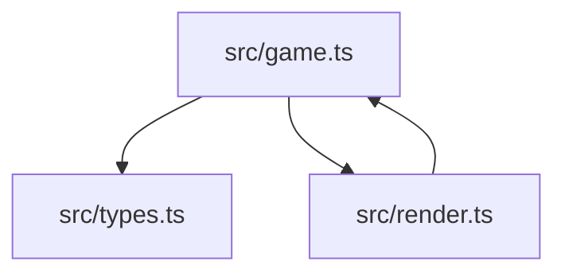
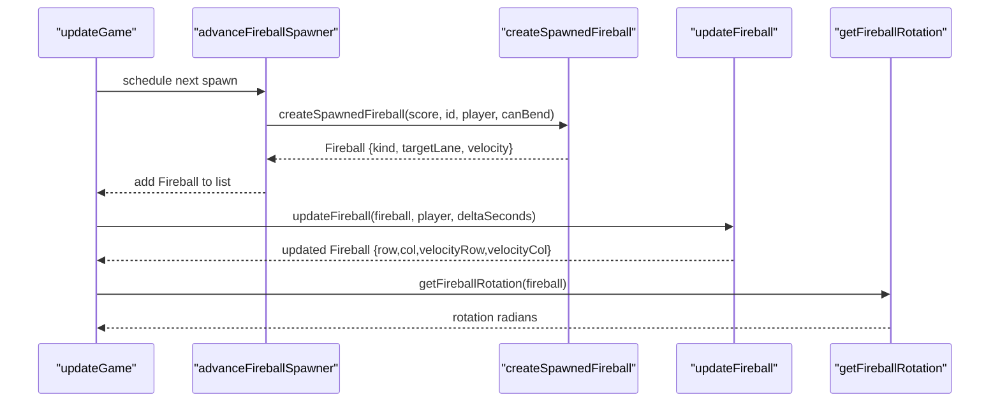
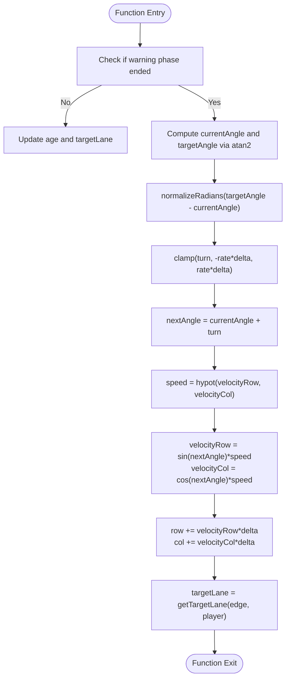
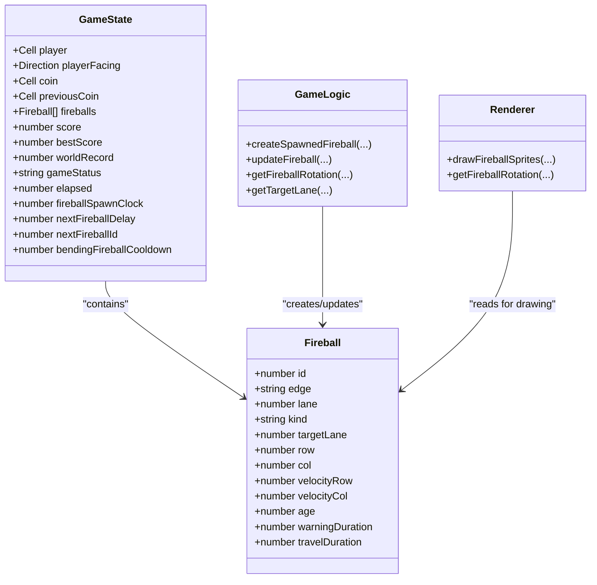

# Bending Fireballs

<cite>
**Referenced Files in This Document**
- [game.ts](file://src/game.ts)
- [types.ts](file://src/types.ts)
- [render.ts](file://src/render.ts)
</cite>

## Table of Contents
1. [Introduction](#introduction)
2. [Project Structure](#project-structure)
3. [Core Components](#core-components)
4. [Architecture Overview](#architecture-overview)
5. [Detailed Component Analysis](#detailed-component-analysis)
6. [Dependency Analysis](#dependency-analysis)
7. [Performance Considerations](#performance-considerations)
8. [Troubleshooting Guide](#troubleshooting-guide)
9. [Conclusion](#conclusion)

## Introduction
This document explains the bending fireball mechanics, focusing on how they are spawned, tracked toward the player, and rendered with smooth turning behavior. It covers:
- The createSpawnedFireball function and its targeting logic using getTargetLane and angle calculations via Math.atan2
- The BENDING_FIREBALL constants including chance probability (0.05), speed ratio (0.35), maximum travel time (10 seconds), turn rate limitations, and cooldown system preventing excessive spawns
- Concrete examples showing how fireballs track player movement with clamped rotation angles using normalizeRadians and clamp functions
- The smooth turning algorithm in updateFireball that calculates target angles, applies turn rate limits, and updates velocity vectors
- Visual rotation feedback through getFireballRotation and how bending fireballs differ from straight ones in collision radius and speed scaling

## Project Structure
The bending fireball logic is implemented primarily in the game module, with supporting types and rendering utilities.

**Diagram sources**
- [game.ts:136-166](file://src/game.ts#L136-L166)
- [types.ts:13-26](file://src/types.ts#L13-L26)
- [render.ts:380-393](file://src/render.ts#L380-L393)

**Section sources**
- [game.ts:1-16](file://src/game.ts#L1-L16)
- [types.ts:1-54](file://src/types.ts#L1-L54)
- [render.ts:380-393](file://src/render.ts#L380-L393)

## Core Components
- BENDING_FIREBALL constants define probabilities, speeds, durations, and turning constraints for bending fireballs.
- createSpawnedFireball decides whether a fireball bends, sets initial velocity, and computes target lane based on the player’s position.
- updateFireball implements the smooth turning algorithm during travel, updating position and velocity while respecting turn rate limits.
- getFireballRotation provides visual rotation feedback by comparing current movement direction to the original edge direction.
- Collision detection uses a smaller hitbox for bending fireballs compared to normal ones.

Key behaviors:
- Chance probability: 0.05 per spawn when allowed by cooldown
- Speed ratio: 0.35 for bending fireballs relative to normal speed
- Maximum travel time: 10 seconds for bending fireballs
- Turn rate limitations: derived from max angle and response factor
- Cooldown system: prevents too many bending fireballs by forcing longer delays after a bend

**Section sources**
- [game.ts:7-15](file://src/game.ts#L7-L15)
- [game.ts:136-166](file://src/game.ts#L136-L166)
- [game.ts:325-362](file://src/game.ts#L325-L362)
- [game.ts:178-185](file://src/game.ts#L178-L185)
- [game.ts:210-219](file://src/game.ts#L210-L219)

## Architecture Overview
Bending fireballs integrate into the main game loop as follows:
- Spawning: advanceFireballSpawner schedules spawns and calls createSpawnedFireball with a canBend flag controlled by a cooldown counter.
- Updating: updateGame maps over fireballs and calls updateFireball for each, filtering out expired ones.
- Rendering: render reads fireball state and uses getFireballRotation or direct angle computation to draw oriented sprites.

**Diagram sources**
- [game.ts:83-101](file://src/game.ts#L83-L101)
- [game.ts:249-279](file://src/game.ts#L249-L279)
- [game.ts:136-166](file://src/game.ts#L136-L166)
- [game.ts:325-362](file://src/game.ts#L325-L362)
- [game.ts:178-185](file://src/game.ts#L178-L185)

## Detailed Component Analysis

### Constants and Configuration
- BENDING_FIREBALL_CHANCE = 0.05: Probability that a spawned fireball will be a bending type when allowed.
- BENDING_FIREBALL_SPEED_RATIO = 0.35: Initial speed multiplier for bending fireballs.
- BENDING_FIREBALL_MAX_TRAVEL_SECONDS = 10: Maximum duration a bending fireball travels before expiring.
- BENDING_FIREBALL_TURN_RESPONSE = 0.75: Response factor applied to max angle to compute effective turn rate.
- BENDING_FIREBALL_MAX_ANGLE_RADIANS = π/4: Maximum angular deviation allowed for bending.
- BENDING_FIREBALL_TURN_RATE_RADIANS = MAX_ANGLE * TURN_RESPONSE: Effective per-second turn rate limit.
- BENDING_FIREBALL_COOLDOWN_SPAWNS = 5: Number of subsequent spawns blocked after a bending fireball appears.
- BENDING_FIREBALL_FORCED_DELAY = 1.5: Forced delay between spawns while cooldown is active.
- BENDING_FIREBALL_SCALE = 0.75: Scale factor for bending fireball collision radius.

These constants ensure bending fireballs are rare, slower, long-lived, and smoothly turning without abrupt changes.

**Section sources**
- [game.ts:7-15](file://src/game.ts#L7-L15)

### Targeting Logic: getTargetLane and Angle Calculations
- getTargetLane(edge, player): Determines the target row or column depending on the fireball’s entry edge. For left/right edges, it targets the player’s row; for up/down edges, it targets the player’s column.
- Angle calculations use Math.atan2 to compute both:
  - Current movement angle from velocity components
  - Target angle from the vector pointing from the fireball to the player’s current cell

This enables continuous tracking of the player’s position rather than locking onto a fixed lane.

**Section sources**
- [game.ts:399-401](file://src/game.ts#L399-L401)
- [game.ts:341-342](file://src/game.ts#L341-L342)

### createSpawnedFireball Function
Responsibilities:
- Randomly selects an entry edge and starting lane
- Computes targetLane via getTargetLane(edge, player)
- Decides if the fireball bends using random() < BENDING_FIREBALL_CHANCE and canBend flag
- Sets travelDuration:
  - Normal fireballs: scheduleFireballTravelDuration(score)
  - Bending fireballs: BENDING_FIREBALL_MAX_TRAVEL_SECONDS
- Initializes velocity using getStraightFireballVelocity with speedScale:
  - 1 for normal fireballs
  - BENDING_FIREBALL_SPEED_RATIO for bending fireballs

Resulting properties include kind ("normal" | "bending"), targetLane, initial row/col, and velocity components.

Concrete example references:
- Test verifies bending fireball speed equals normalSpeed × 0.35 and travelDuration equals 10 seconds.

**Section sources**
- [game.ts:136-166](file://src/game.ts#L136-L166)
- [game.ts:187-190](file://src/game.ts#L187-L190)
- [game.ts:380-393](file://src/game.ts#L380-L393)

### Smooth Turning Algorithm in updateFireball
During travel (after warning phase), updateFireball performs:
- Compute travelDelta as the fraction of travel time elapsed this frame
- If no travel progress yet, only update age and refresh targetLane
- Calculate:
  - currentAngle = Math.atan2(velocityRow, velocityCol)
  - targetAngle = Math.atan2(targetRow - row, targetCol - col)
- Normalize the angle difference using normalizeRadians
- Clamp the turn amount within ±(BENDING_FIREBALL_TURN_RATE_RADIANS × travelDelta) using clamp
- Update angle: nextAngle = currentAngle + turn
- Preserve speed magnitude: speed = hypot(velocityRow, velocityCol)
- Recompute velocity components:
  - velocityRow = sin(nextAngle) × speed
  - velocityCol = cos(nextAngle) × speed
- Advance position: row += velocityRow × travelDelta; col += velocityCol × travelDelta
- Refresh targetLane based on current player position

This ensures smooth, bounded turning toward the player without changing speed.

**Diagram sources**
- [game.ts:325-362](file://src/game.ts#L325-L362)
- [game.ts:416-418](file://src/game.ts#L416-L418)
- [game.ts:395-397](file://src/game.ts#L395-L397)

**Section sources**
- [game.ts:325-362](file://src/game.ts#L325-L362)

### Visual Rotation Feedback: getFireballRotation
For bending fireballs:
- Movement angle is computed from velocity components
- Subtract the base angle corresponding to the entry edge (from getStraightFireballAngle)
- Normalize the result to keep rotation within [-π, π]

This rotation value is used by the renderer to orient the fireball sprite along its current trajectory.

**Section sources**
- [game.ts:178-185](file://src/game.ts#L178-L185)
- [game.ts:403-414](file://src/game.ts#L403-L414)
- [game.ts:416-418](file://src/game.ts#L416-L418)

### Differences Between Bending and Straight Fireballs
- Speed scaling:
  - Bending fireballs start at 0.35× the normal speed
- Travel duration:
  - Bending fireballs have a fixed maximum travel time of 10 seconds
- Collision radius:
  - Bending fireballs use a scaled-down hitbox: FIREBALL_COLLISION_RADIUS × 0.75
- Visuals:
  - Bending fireballs rotate according to their current velocity direction
  - Straight fireballs maintain orientation aligned with their entry edge

**Section sources**
- [game.ts:8-10](file://src/game.ts#L8-L10)
- [game.ts:187-190](file://src/game.ts#L187-L190)
- [game.ts:210-219](file://src/game.ts#L210-L219)
- [game.ts:178-185](file://src/game.ts#L178-L185)

### Cooldown System Preventing Excessive Spawns
- After a bending fireball spawns, bendingFireballCooldown is set to 5
- While cooldown > 0, nextFireballDelay is forced to 1.5 seconds
- Each non-bending spawn decrements the cooldown by 1
- Once cooldown reaches 0, normal scheduling resumes

This prevents frequent bending fireballs and balances difficulty.

**Section sources**
- [game.ts:249-279](file://src/game.ts#L249-L279)

## Dependency Analysis
The bending fireball system depends on:
- Types defined in types.ts for Fireball and GameState structures
- Utility functions in game.ts for geometry and timing
- Rendering code in render.ts that consumes rotation and scale values

**Diagram sources**
- [types.ts:13-26](file://src/types.ts#L13-L26)
- [types.ts:28-43](file://src/types.ts#L28-L43)
- [game.ts:136-166](file://src/game.ts#L136-L166)
- [game.ts:325-362](file://src/game.ts#L325-L362)
- [game.ts:178-185](file://src/game.ts#L178-L185)
- [render.ts:380-393](file://src/render.ts#L380-L393)

**Section sources**
- [types.ts:1-54](file://src/types.ts#L1-L54)
- [game.ts:136-166](file://src/game.ts#L136-L166)
- [game.ts:325-362](file://src/game.ts#L325-L362)
- [render.ts:380-393](file://src/render.ts#L380-L393)

## Performance Considerations
- Angle normalization and clamping are lightweight operations performed per fireball per frame
- Maintaining constant speed while rotating avoids expensive re-normalization beyond hypot calculation
- Using travelDelta ensures consistent behavior across varying frame rates
- Limiting bending fireball frequency via cooldown reduces computational overhead and keeps gameplay balanced

[No sources needed since this section provides general guidance]

## Troubleshooting Guide
Common issues and checks:
- Fireball not turning: Ensure updateFireball is called during travel phase and that targetLane is refreshed each frame
- Overly sharp turns: Verify clamp bounds use BENDING_FIREBALL_TURN_RATE_RADIANS multiplied by travelDelta
- Incorrect rotation visuals: Confirm getFireballRotation subtracts getStraightFireballAngle and normalizes the result
- Too many bending fireballs: Check bendingFireballCooldown logic and forced delay assignment

**Section sources**
- [game.ts:325-362](file://src/game.ts#L325-L362)
- [game.ts:178-185](file://src/game.ts#L178-L185)
- [game.ts:249-279](file://src/game.ts#L249-L279)

## Conclusion
Bending fireballs introduce dynamic, player-tracking threats with carefully tuned probabilities, speeds, durations, and turning constraints. The implementation leverages precise angle math and clamping to achieve smooth motion, while the cooldown system maintains balance. Visual rotation feedback enhances clarity, and reduced collision radius differentiates them from straight fireballs.

[No sources needed since this section summarizes without analyzing specific files]