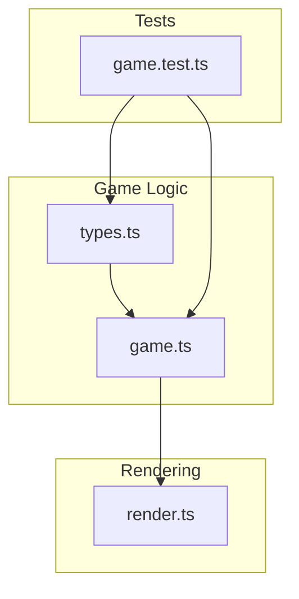
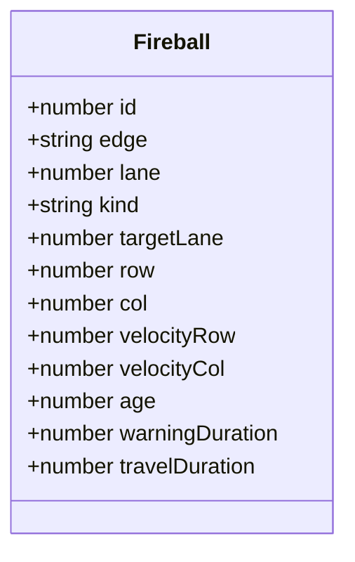
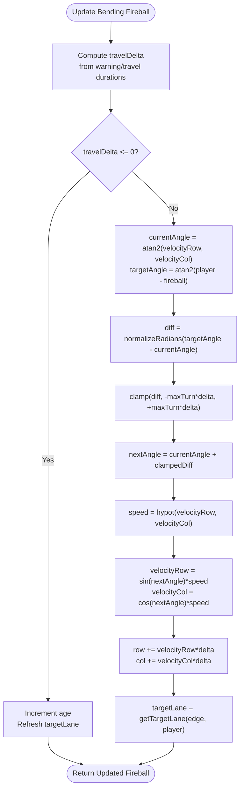
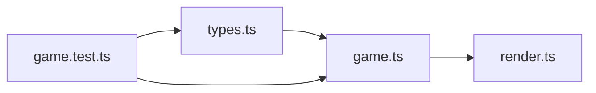

# Fireball Behavior System

<cite>
**Referenced Files in This Document**
- [game.ts](file://src/game.ts)
- [types.ts](file://src/types.ts)
- [render.ts](file://src/render.ts)
- [game.test.ts](file://src/game.test.ts)
</cite>

## Table of Contents
1. [Introduction](#introduction)
2. [Project Structure](#project-structure)
3. [Core Components](#core-components)
4. [Architecture Overview](#architecture-overview)
5. [Detailed Component Analysis](#detailed-component-analysis)
6. [Dependency Analysis](#dependency-analysis)
7. [Performance Considerations](#performance-considerations)
8. [Troubleshooting Guide](#troubleshooting-guide)
9. [Conclusion](#conclusion)

## Introduction
This document explains the fireball behavior system used by the game. It covers both straight and bending fireballs, their creation functions, movement algorithms, warning phase visualization, targeting and turning mechanics for bending fireballs, lifecycle from spawn to removal, velocity calculations, travel duration scheduling, off-screen boundary handling, cooldown system for bending fireballs, and difficulty scaling integration. The goal is to provide a clear, code-grounded understanding suitable for both technical and non-technical readers.

## Project Structure
The fireball system lives primarily in the game logic module and types definitions. Rendering utilities use computed positions and rotations to draw fireballs. Tests validate behavior across spawning, movement, collision, and lifecycle.



**Diagram sources**
- [game.ts:1-426](file://src/game.ts#L1-L426)
- [types.ts:1-54](file://src/types.ts#L1-L54)
- [render.ts:426-471](file://src/render.ts#L426-L471)
- [game.test.ts:120-373](file://src/game.test.ts#L120-L373)

**Section sources**
- [game.ts:1-426](file://src/game.ts#L1-L426)
- [types.ts:1-54](file://src/types.ts#L1-L54)

## Core Components
- Constants and configuration:
  - Warning duration, off-screen margin, collision radius, bending chance/scale/speed/turn limits, and cooldowns are defined as constants.
- Data models:
  - Fireball entity with position, velocity, timing, and kind (normal or bending).
  - Game state includes active fireballs and spawner counters.
- Creation functions:
  - Straight-only fireball factory.
  - Spawner-aware factory that can produce bending fireballs based on probability and cooldown.
- Movement and positioning:
  - Travel progress computation.
  - Straight interpolation for normal fireballs.
  - Continuous steering toward player for bending fireballs with turn rate limiting.
- Collision and hit detection:
  - Warning phase exclusion and scaled hitbox for bending fireballs.
- Scheduling and difficulty:
  - Spawn delay and travel duration scale with score.
- Cooldown system:
  - After a bending fireball spawns, a forced delay and a fixed number of subsequent normal fireballs are enforced.

**Section sources**
- [game.ts:4-16](file://src/game.ts#L4-L16)
- [types.ts:13-26](file://src/types.ts#L13-L26)
- [game.ts:113-166](file://src/game.ts#L113-L166)
- [game.ts:168-185](file://src/game.ts#L168-L185)
- [game.ts:317-362](file://src/game.ts#L317-L362)
- [game.ts:210-223](file://src/game.ts#L210-L223)
- [game.ts:225-247](file://src/game.ts#L225-L247)
- [game.ts:249-279](file://src/game.ts#L249-L279)

## Architecture Overview
High-level flow:
- The game loop updates elapsed time and advances each fireball’s state.
- Normal fireballs move along a fixed axis at constant speed; bending fireballs steer toward the player while maintaining constant speed.
- A warning phase precedes danger; during this time, fireballs appear outside the grid and cannot hit the player.
- After crossing the grid, fireballs are removed automatically.

```mermaid
sequenceDiagram
participant Loop as "updateGame()"
participant Spawner as "advanceFireballSpawner()"
participant Creator as "createSpawnedFireball()"
participant Updater as "updateFireball()"
participant Renderer as "getFireballPosition()/getFireballRotation()"
Loop->>Loop : increment elapsed
Loop->>Updater : map over fireballs
Updater-->>Loop : updated fireballs
Loop->>Loop : filter out expired fireballs
alt score > 0
Loop->>Spawner : advance clock and spawn if due
Spawner->>Creator : create normal or bending fireball
Creator-->>Spawner : new Fireball
Spawner-->>Loop : append to fireballs
end
Loop->>Renderer : compute positions/rotation for drawing
```

**Diagram sources**
- [game.ts:83-101](file://src/game.ts#L83-L101)
- [game.ts:249-279](file://src/game.ts#L249-L279)
- [game.ts:136-166](file://src/game.ts#L136-L166)
- [game.ts:325-362](file://src/game.ts#L325-L362)
- [game.ts:168-185](file://src/game.ts#L168-L185)

## Detailed Component Analysis

### Fireball Types and Data Model
- Kind:
  - "normal": moves straight along its edge lane.
  - "bending": steers toward the player’s current row/column while keeping constant speed.
- Key fields:
  - Position (row, col), velocity (velocityRow, velocityCol), age, warningDuration, travelDuration, targetLane.
- Bounding box and hitbox:
  - Warning phase prevents hits until after warningDuration.
  - Bending fireballs have a smaller effective collision radius.



**Diagram sources**
- [types.ts:13-26](file://src/types.ts#L13-L26)

**Section sources**
- [types.ts:13-26](file://src/types.ts#L13-L26)
- [game.ts:210-223](file://src/game.ts#L210-L223)

### Creation Functions

#### Straight Fireball Factory
- Purpose: Create a normal fireball moving along a random edge and lane.
- Inputs: score, id, optional random source.
- Behavior:
  - Randomly selects an edge and lane.
  - Computes travel duration based on score.
  - Derives start position off-screen and sets constant velocity to cross the grid within travelDuration.
  - Initializes age to zero and warningDuration to the global constant.

Key responsibilities:
- Edge and lane selection.
- Travel duration scheduling.
- Off-screen start placement.
- Velocity calculation for straight motion.

**Section sources**
- [game.ts:113-134](file://src/game.ts#L113-L134)
- [game.ts:364-393](file://src/game.ts#L364-L393)
- [game.ts:245-247](file://src/game.ts#L245-L247)

#### Spawner-Aware Fireball Factory
- Purpose: Create either a normal or bending fireball, considering player position and cooldown constraints.
- Inputs: score, id, player cell, canBend flag, optional random source.
- Behavior:
  - Randomly selects edge and lane.
  - Determines target lane based on player position and edge.
  - Decides if it becomes a bending fireball using a probability threshold when allowed.
  - Sets travel duration:
    - Bending fireballs use a fixed maximum travel duration.
    - Normal fireballs use score-based duration.
  - Computes initial velocity:
    - Bending fireballs use a reduced speed ratio relative to normal speed.
  - Initializes all required fields including warningDuration.

Key responsibilities:
- Player-targeting lane determination.
- Probability-based bending decision.
- Speed and duration scaling for bending vs normal.

**Section sources**
- [game.ts:136-166](file://src/game.ts#L136-L166)
- [game.ts:399-401](file://src/game.ts#L399-L401)
- [game.ts:187-190](file://src/game.ts#L187-L190)

### Movement Algorithms

#### Straight Motion (Normal Fireballs)
- Progress computation:
  - During warning phase, progress is zero.
  - After warning, progress ramps linearly from 0 to 1 over travelDuration.
- Position interpolation:
  - Start and end coordinates are off-screen margins around the grid.
  - For each edge, one axis interpolates forward/backward while the other stays fixed at the lane index.
- Velocity:
  - Constant magnitude derived from total travel distance divided by travelDuration.
  - Direction depends on edge.

Off-screen boundaries:
- Start positions are placed outside the grid by a configured margin.
- End positions extend beyond the opposite side by the same margin.
- Filtering removes fireballs once they exceed warningDuration + travelDuration.

**Section sources**
- [game.ts:317-323](file://src/game.ts#L317-L323)
- [game.ts:192-208](file://src/game.ts#L192-L208)
- [game.ts:380-393](file://src/game.ts#L380-L393)
- [game.ts:364-378](file://src/game.ts#L364-L378)
- [game.ts:83-101](file://src/game.ts#L83-L101)

#### Bending Motion (Player Tracking)
- Steering logic:
  - Compute current angle from velocity vector.
  - Compute target angle toward the player’s current position.
  - Normalize angular difference to [-π, π].
  - Clamp turn per frame proportional to travelDelta and a maximum turn rate.
  - Update angle and recompute velocity components while preserving speed magnitude.
- Target lane:
  - Continuously updated to the player’s corresponding coordinate depending on edge.
- Turn rate limiting:
  - Maximum turn per second is derived from a max angle and a response factor.
  - Per-frame limit scales with travelDelta to maintain consistent behavior across frame rates.
- Speed:
  - Magnitude remains constant; only direction changes.
- Rotation for rendering:
  - Derived from movement angle minus the base angle for the fireball’s entry edge.



**Diagram sources**
- [game.ts:325-362](file://src/game.ts#L325-L362)
- [game.ts:399-401](file://src/game.ts#L399-L401)
- [game.ts:403-418](file://src/game.ts#L403-L418)

**Section sources**
- [game.ts:325-362](file://src/game.ts#L325-L362)
- [game.ts:178-185](file://src/game.ts#L178-L185)
- [game.ts:399-418](file://src/game.ts#L399-L418)

### Warning Phase Visualization
- Timing:
  - FIREBALL_WARNING_DURATION defines how long a fireball is in warning before becoming dangerous.
- Positioning:
  - During warning, progress is zero, so the fireball appears at its off-screen start location.
- Hitability:
  - fireballHitsCell returns false during warning regardless of proximity.
- Rendering:
  - getFireballPosition returns isWarning flag and progress for visual effects.
  - Renderers can use isWarning to adjust opacity or animation.

Concrete example:
- A left-edge fireball created with age less than FIREBALL_WARNING_DURATION will be positioned off-screen to the left and marked as warning. It cannot collide with any cell until warning expires.

**Section sources**
- [game.ts:4](file://src/game.ts#L4)
- [game.ts:168-176](file://src/game.ts#L168-L176)
- [game.ts:210-219](file://src/game.ts#L210-L219)
- [game.test.ts:305-317](file://src/game.test.ts#L305-L317)

### Bending Fireball Targeting and Turning
- Target lane:
  - Determined by projecting the player’s position onto the axis perpendicular to the entry edge.
- Angle calculations:
  - Current angle from velocity vector.
  - Target angle from fireball position to player position.
  - Angular difference normalized to shortest path.
- Turn rate limiting:
  - Max turn per second equals MAX_ANGLE_RADIANS * TURN_RESPONSE.
  - Per-frame turn limited by multiplying max turn rate by travelDelta.
- Player tracking:
  - Target lane refreshes every update to follow the player’s current position.
  - Speed magnitude remains unchanged; only direction adjusts.

Example expectations validated by tests:
- Bending fireballs do not exceed the configured maximum angle.
- They curve toward the player without changing speed.
- They can start from any edge and track correctly.

**Section sources**
- [game.ts:399-401](file://src/game.ts#L399-L401)
- [game.ts:339-362](file://src/game.ts#L339-L362)
- [game.ts:403-418](file://src/game.ts#L403-L418)
- [game.test.ts:188-221](file://src/game.test.ts#L188-L221)
- [game.test.ts:223-263](file://src/game.test.ts#L223-L263)

### Lifecycle Examples

#### Example 1: Straight Fireball Spawn to Removal
- Spawn:
  - Created via straight factory with random edge/lane and score-based travelDuration.
- Warning:
  - Appears off-screen; isWarning true; cannot hit.
- Travel:
  - Moves at constant velocity; progress increases linearly.
- Danger:
  - After warningDuration, becomes hittable.
- Removal:
  - Filtered out when age exceeds warningDuration + travelDuration.

Relevant behaviors:
- Off-screen start/end positions.
- Linear progress mapping.
- Age-based filtering.

**Section sources**
- [game.ts:113-134](file://src/game.ts#L113-L134)
- [game.ts:192-208](file://src/game.ts#L192-L208)
- [game.ts:317-323](file://src/game.ts#L317-L323)
- [game.ts:83-101](file://src/game.ts#L83-L101)

#### Example 2: Bending Fireball Spawn to Removal
- Spawn:
  - Created via spawner factory; may become bending based on chance and cooldown.
- Warning:
  - Same off-screen appearance and safety window.
- Travel:
  - Steers toward player with constant speed; rotation reflects deviation from entry edge.
- Danger:
  - Becomes hittable after warningDuration; uses smaller hitbox.
- Removal:
  - Removed after fixed maximum travel duration.

Relevant behaviors:
- Reduced speed ratio for bending.
- Fixed maximum travel duration.
- Smaller collision radius.

**Section sources**
- [game.ts:136-166](file://src/game.ts#L136-L166)
- [game.ts:187-190](file://src/game.ts#L187-L190)
- [game.ts:210-219](file://src/game.ts#L210-L219)
- [game.ts:178-185](file://src/game.ts#L178-L185)

### Velocity Calculations and Travel Duration Scheduling
- Straight velocity:
  - Computed as total travel cells divided by travelDuration, scaled by edge direction.
  - Total travel cells include off-screen margins.
- Bending velocity:
  - Initial speed set to normal speed multiplied by a speed ratio.
  - Speed magnitude preserved during steering.
- Travel duration:
  - Normal fireballs: decreases with score up to a minimum bound.
  - Bending fireballs: fixed maximum duration independent of score.

Difficulty scaling:
- Spawn intervals decrease at score thresholds.
- Travel durations shorten with score, increasing pressure.

**Section sources**
- [game.ts:380-393](file://src/game.ts#L380-L393)
- [game.ts:245-247](file://src/game.ts#L245-L247)
- [game.ts:187-190](file://src/game.ts#L187-L190)
- [game.ts:225-243](file://src/game.ts#L225-L243)

### Off-Screen Boundary Handling
- Start positions:
  - Placed at negative margin before the first grid cell.
- End positions:
  - Extend past the last grid cell by the same margin.
- Progress mapping:
  - Maps [warningDuration, warningDuration + travelDuration] to [0, 1].
- Removal:
  - Fireballs filtered out once age exceeds total duration.

**Section sources**
- [game.ts:364-378](file://src/game.ts#L364-L378)
- [game.ts:317-323](file://src/game.ts#L317-L323)
- [game.ts:83-101](file://src/game.ts#L83-L101)

### Cooldown System for Bending Fireballs
- Trigger:
  - When a bending fireball spawns, a cooldown counter is set to a fixed number of spawns.
- Forced delay:
  - While cooldown > 0, next fireball delay is forced to a longer interval.
- Decay:
  - Each spawned fireball decrements the cooldown counter by one.
- Effect:
  - Ensures a sequence of normal fireballs follows a bending fireball, preventing excessive bending density.

**Section sources**
- [game.ts:249-279](file://src/game.ts#L249-L279)
- [game.test.ts:265-283](file://src/game.test.ts#L265-L283)

### Difficulty Scaling Integration
- Spawn delays:
  - Decrease at score milestones (e.g., 10, 25, 50, 75, 100).
- Travel durations:
  - Decrease with score up to a floor, making fireballs faster.
- Combined effect:
  - Higher scores lead to more frequent and faster threats, increasing challenge.

**Section sources**
- [game.ts:225-243](file://src/game.ts#L225-L243)
- [game.ts:245-247](file://src/game.ts#L245-L247)
- [game.test.ts:154-177](file://src/game.test.ts#L154-L177)

## Dependency Analysis
- Internal dependencies:
  - game.ts depends on types.ts for data structures and constants.
  - render.ts consumes computed positions and rotations from game.ts to draw fireballs.
- Cohesion:
  - All fireball-related logic is centralized in game.ts, improving cohesion.
- Coupling:
  - Rendering depends only on public getters for position and rotation, minimizing coupling.
- External integrations:
  - Randomness is injected via a RandomSource parameter for deterministic testing.



**Diagram sources**
- [types.ts:1-54](file://src/types.ts#L1-L54)
- [game.ts:1-426](file://src/game.ts#L1-L426)
- [render.ts:426-471](file://src/render.ts#L426-L471)
- [game.test.ts:120-373](file://src/game.test.ts#L120-L373)

**Section sources**
- [game.ts:1-426](file://src/game.ts#L1-L426)
- [types.ts:1-54](file://src/types.ts#L1-L54)
- [render.ts:426-471](file://src/render.ts#L426-L471)
- [game.test.ts:120-373](file://src/game.test.ts#L120-L373)

## Performance Considerations
- Constant-time updates per fireball:
  - Straight fireballs perform simple arithmetic.
  - Bending fireballs perform trigonometric operations per frame; consider capping active fireballs or optimizing math where possible.
- Frame-rate independence:
  - Turn rate and movement scale with travelDelta, ensuring consistent behavior across varying frame times.
- Memory:
  - Fireballs are immutable updates returning new objects; avoid unnecessary allocations in tight loops if profiling indicates issues.

[No sources needed since this section provides general guidance]

## Troubleshooting Guide
Common issues and checks:
- Fireballs not appearing:
  - Ensure score > 0 and enough time has passed since first coin collection.
- Warning phase too long/short:
  - Verify FIREBALL_WARNING_DURATION and that age comparisons use this value consistently.
- Bending fireballs not curving:
  - Confirm canBend is true and probability check allows bending.
  - Check turn rate constants and ensure travelDelta is positive.
- Excessive bending frequency:
  - Inspect bendingFireballCooldown and forced delay settings.
- Collision anomalies:
  - Validate hitbox scaling for bending fireballs and confirm warning phase exclusion.

**Section sources**
- [game.ts:83-101](file://src/game.ts#L83-L101)
- [game.ts:249-279](file://src/game.ts#L249-L279)
- [game.ts:210-219](file://src/game.ts#L210-L219)
- [game.test.ts:305-317](file://src/game.test.ts#L305-L317)

## Conclusion
The fireball system cleanly separates concerns between creation, movement, collision, and scheduling. Straight fireballs provide predictable lane-based threats, while bending fireballs introduce dynamic, player-tracking challenges with controlled turning and speed. The warning phase offers fair visual cues, and the cooldown system balances bending frequency. Difficulty scaling integrates through spawn intervals and travel durations, creating a responsive challenge curve. The design is testable, modular, and extensible for future enhancements.