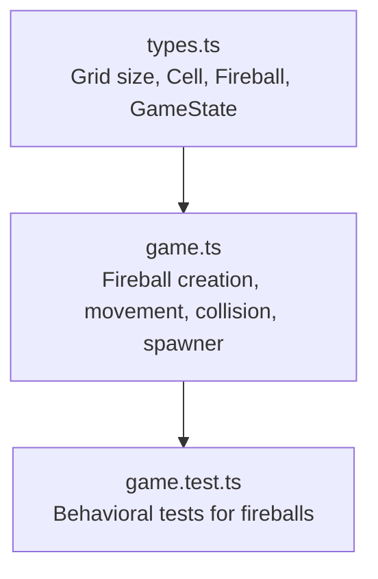
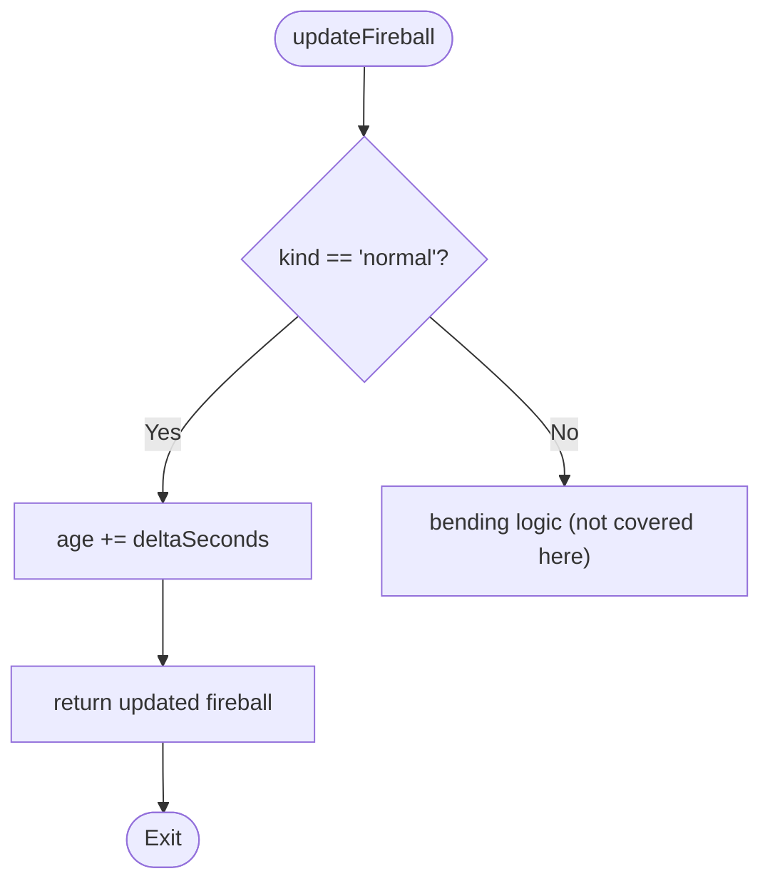
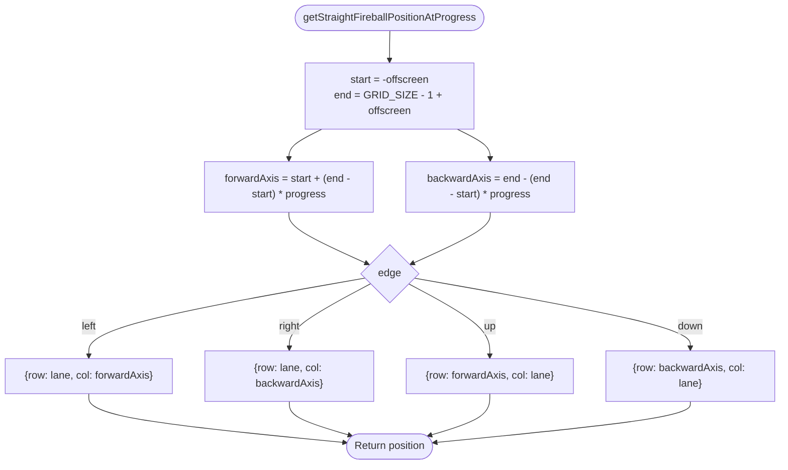
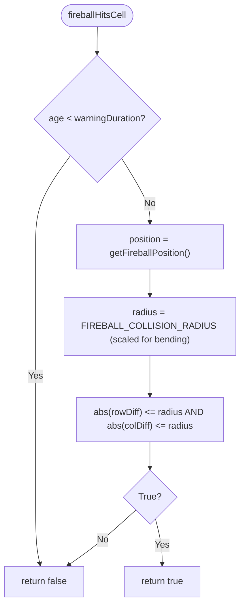
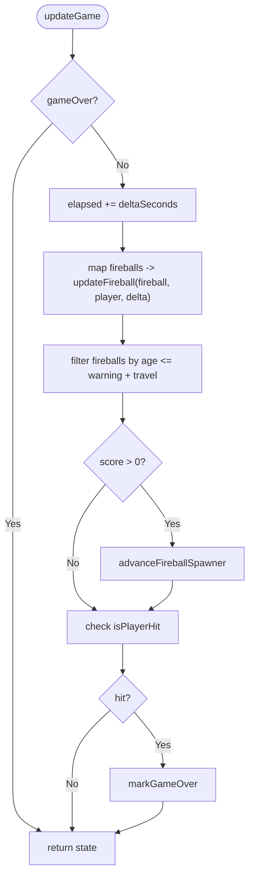
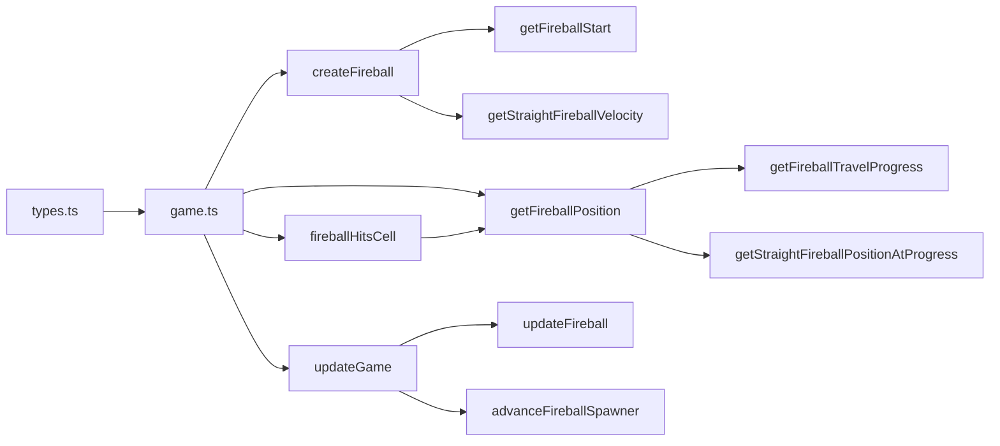

# Straight Fireballs

<cite>
**Referenced Files in This Document**
- [game.ts](file://src/game.ts)
- [types.ts](file://src/types.ts)
- [game.test.ts](file://src/game.test.ts)
</cite>

## Table of Contents
1. [Introduction](#introduction)
2. [Project Structure](#project-structure)
3. [Core Components](#core-components)
4. [Architecture Overview](#architecture-overview)
5. [Detailed Component Analysis](#detailed-component-analysis)
6. [Dependency Analysis](#dependency-analysis)
7. [Performance Considerations](#performance-considerations)
8. [Troubleshooting Guide](#troubleshooting-guide)
9. [Conclusion](#conclusion)

## Introduction
This document explains the straight fireball mechanics used in the game. It focuses on how fireballs are created, spawned from all four edges, move linearly across the grid, and interact with the player via collision detection. It also covers speed calculations based on travel duration, trajectory computation, progress tracking, performance optimizations for batch updates, memory management for large numbers of fireballs, and the warning phase that prevents premature collisions.

## Project Structure
The fireball system is implemented primarily in the game logic module and type definitions:
- Game constants, functions, and state transitions live in the main game module.
- Core types (grid size, cell coordinates, fireball entity, game state) are defined in the types module.
- Tests validate behavior such as spawning intervals, bending vs normal fireballs, hitboxes, and lifecycle.



**Diagram sources**
- [types.ts:1-54](file://src/types.ts#L1-L54)
- [game.ts:1-426](file://src/game.ts#L1-L426)
- [game.test.ts:1-373](file://src/game.test.ts#L1-L373)

**Section sources**
- [types.ts:1-54](file://src/types.ts#L1-L54)
- [game.ts:1-426](file://src/game.ts#L1-L426)
- [game.test.ts:1-373](file://src/game.test.ts#L1-L373)

## Core Components
- Constants and configuration:
  - Warning duration, off-screen padding, collision radius, and bending fireball parameters are defined at the top of the game module.
  - Travel distance constant is derived from grid size and off-screen padding to ensure consistent traversal time regardless of direction.
- Fireball entity:
  - Contains position, velocity, age, warning/travel durations, edge, lane, kind, and target lane.
- Spawning and scheduling:
  - Edge selection and lane assignment are randomized per spawn.
  - Travel duration scales with score; spawn delay decreases with higher scores.
- Movement and positioning:
  - Straight fireballs use a fixed velocity vector computed from travel duration and total travel distance.
  - Position is interpolated by progress along the axis aligned with the chosen edge.
- Collision and warnings:
  - During the warning phase, fireballs cannot collide.
  - After the warning, collision uses an axis-aligned radius check against the player’s cell.

Key responsibilities:
- createFireball: constructs a new straight fireball with randomized edge and lane, computes start position and velocity.
- getStraightFireballVelocity: calculates speed magnitude from FIREBALL_TRAVEL_CELLS and travelDuration, then assigns directional components.
- getFireballStart: returns the initial off-screen coordinate for a given edge and lane.
- getFireballTravelProgress: maps age into a normalized progress value after the warning phase.
- updateGame: advances all fireballs, filters out expired ones, and triggers spawning when appropriate.
- fireballHitsCell: performs collision checks only after the warning phase using FIREBALL_COLLISION_RADIUS.

**Section sources**
- [game.ts:4-18](file://src/game.ts#L4-L18)
- [game.ts:113-134](file://src/game.ts#L113-L134)
- [game.ts:380-393](file://src/game.ts#L380-L393)
- [game.ts:364-378](file://src/game.ts#L364-L378)
- [game.ts:317-323](file://src/game.ts#L317-L323)
- [game.ts:83-101](file://src/game.ts#L83-L101)
- [game.ts:210-223](file://src/game.ts#L210-L223)
- [types.ts:13-26](file://src/types.ts#L13-L26)

## Architecture Overview
The fireball system integrates with the game loop through a functional pipeline:
- Spawner schedules and creates fireballs based on score-dependent delays.
- Each frame, updateGame advances fireball ages and positions, removes expired entities, and checks collisions.
- Rendering utilities can query position and rotation for visual feedback.

```mermaid
sequenceDiagram
participant Loop as "updateGame"
participant Spawner as "advanceFireballSpawner"
participant Creator as "createSpawnedFireball/createFireball"
participant Updater as "updateFireball"
participant Checker as "isPlayerHit/fireballHitsCell"
Loop->>Loop : increment elapsed
Loop->>Updater : map over fireballs (age + delta)
Loop->>Loop : filter out expired fireballs
alt score > 0
Loop->>Spawner : advance clock and spawn if due
Spawner->>Creator : build fireball(s)
Spawner-->>Loop : append to fireballs list
end
Loop->>Checker : test player collision
Checker-->>Loop : mark gameOver if hit
```

**Diagram sources**
- [game.ts:83-101](file://src/game.ts#L83-L101)
- [game.ts:249-279](file://src/game.ts#L249-L279)
- [game.ts:136-166](file://src/game.ts#L136-L166)
- [game.ts:113-134](file://src/game.ts#L113-L134)
- [game.ts:325-362](file://src/game.ts#L325-L362)
- [game.ts:221-223](file://src/game.ts#L221-L223)
- [game.ts:210-219](file://src/game.ts#L210-L219)

## Detailed Component Analysis

### Straight Fireball Creation: createFireball
- Randomly selects one of the four edges and a random lane within the grid.
- Computes travel duration based on current score.
- Determines start position off-screen using getFireballStart.
- Calculates velocity using getStraightFireballVelocity so the fireball traverses the full path in exactly travelDuration seconds.
- Initializes age to zero and sets warningDuration and travelDuration.

Edge-based spawning:
- The edge set includes up, right, down, left, ensuring uniform coverage around the grid.
- Lane selection ensures each row/column has equal probability of being targeted.

Trajectory calculation:
- Start position is placed outside the visible grid by FIREBALL_OFFSCREEN_CELLS to allow smooth entry.
- Velocity is purely axial (row or col), producing straight-line motion.

**Section sources**
- [game.ts:113-134](file://src/game.ts#L113-L134)
- [game.ts:17](file://src/game.ts#L17)
- [game.ts:364-378](file://src/game.ts#L364-L378)
- [game.ts:380-393](file://src/game.ts#L380-L393)

### Speed Calculation: getStraightFireballVelocity
- Computes speed magnitude as total travel distance divided by travelDuration.
- Total travel distance is FIREBALL_TRAVEL_CELLS, which equals GRID_SIZE - 1 plus twice the off-screen padding.
- Assigns velocity components depending on edge:
  - Left: positive column velocity
  - Right: negative column velocity
  - Up: positive row velocity
  - Down: negative row velocity

Complexity:
- O(1) arithmetic operations per call.

Optimization opportunities:
- Precompute FIREBALL_TRAVEL_CELLS once (already done).
- Avoid repeated trigonometric calls for straight fireballs (not needed here).

**Section sources**
- [game.ts:380-393](file://src/game.ts#L380-L393)
- [game.ts:17-18](file://src/game.ts#L17-L18)

### Trajectory and Progress: getFireballStart and getFireballTravelProgress
- getFireballStart:
  - Returns the initial off-screen coordinate for a given edge and lane.
  - Uses the same start/end bounds as position interpolation to maintain consistency.
- getFireballTravelProgress:
  - Maps fireball.age into a normalized progress between 0 and 1 after the warning phase.
  - Clamps to [0, 1] to handle early/late frames safely.

Example usage patterns:
- To compute where a straight fireball will be at any time t after warning:
  - Compute progress = clamp((t - warningDuration) / travelDuration, 0, 1).
  - Use the edge-specific interpolation to find row/col.

**Section sources**
- [game.ts:364-378](file://src/game.ts#L364-L378)
- [game.ts:317-323](file://src/game.ts#L317-L323)

### Movement Update: updateFireball (straight case)
- For straight fireballs, the update simply increments age by deltaSeconds.
- Position is not stored explicitly during update; it is computed on demand via getFireballPosition and getStraightFireballPositionAtProgress.
- This design avoids redundant position storage and keeps state minimal.



**Diagram sources**
- [game.ts:325-328](file://src/game.ts#L325-L328)

**Section sources**
- [game.ts:325-328](file://src/game.ts#L325-L328)

### Position Interpolation: getStraightFireballPositionAtProgress
- Computes forwardAxis and backwardAxis based on progress and the start/end bounds.
- Selects the appropriate axis to interpolate based on edge:
  - Horizontal edges (left/right): interpolate column while keeping row fixed at lane.
  - Vertical edges (up/down): interpolate row while keeping column fixed at lane.



**Diagram sources**
- [game.ts:192-208](file://src/game.ts#L192-L208)

**Section sources**
- [game.ts:192-208](file://src/game.ts#L192-L208)

### Collision Detection: fireballHitsCell and isPlayerHit
- Warning phase:
  - If fireball.age < warningDuration, return false immediately.
- Post-warning:
  - Compute current position via getFireballPosition.
  - Compare absolute differences in row and col against FIREBALL_COLLISION_RADIUS.
  - For bending fireballs, the effective radius is scaled down.



**Diagram sources**
- [game.ts:210-219](file://src/game.ts#L210-L219)

**Section sources**
- [game.ts:210-219](file://src/game.ts#L210-L219)

### Spawning and Scheduling: scheduleFireballDelay and scheduleFireballTravelDuration
- scheduleFireballDelay:
  - Decreases spawn interval as score increases, creating more frequent threats.
- scheduleFireballTravelDuration:
  - Reduces travel time slightly as score increases, making fireballs faster.

These functions influence both the density and speed of fireballs, shaping difficulty progression.

**Section sources**
- [game.ts:225-247](file://src/game.ts#L225-L247)

### Batch Updates and Memory Management in updateGame
- Batch updates:
  - All fireballs are advanced in a single pass using map over the array.
  - Expired fireballs are removed in the same pass via filter, avoiding multiple allocations.
- Memory considerations:
  - Straight fireballs do not store intermediate positions; they are recomputed from age and constants, minimizing memory overhead.
  - Filtering creates a new array only when necessary; consider reusing buffers if profiling shows GC pressure under heavy loads.
- Early exits:
  - If gameStatus is "gameOver", no further updates occur, preventing unnecessary work.



**Diagram sources**
- [game.ts:83-101](file://src/game.ts#L83-L101)

**Section sources**
- [game.ts:83-101](file://src/game.ts#L83-L101)

## Dependency Analysis
- Types dependency:
  - game.ts imports core types (Cell, Direction, Edge, Fireball, GameState, RecordsSnapshot) and constants (GRID_SIZE, CENTER_CELL).
- Internal dependencies:
  - createFireball depends on getFireballStart and getStraightFireballVelocity.
  - getFireballPosition depends on getFireballTravelProgress and getStraightFireballPositionAtProgress.
  - fireballHitsCell depends on getFireballPosition and constants like FIREBALL_COLLISION_RADIUS.
  - updateGame composes updateFireball, filtering, and spawner logic.



**Diagram sources**
- [types.ts:1-54](file://src/types.ts#L1-L54)
- [game.ts:113-134](file://src/game.ts#L113-L134)
- [game.ts:364-378](file://src/game.ts#L364-L378)
- [game.ts:380-393](file://src/game.ts#L380-L393)
- [game.ts:168-176](file://src/game.ts#L168-L176)
- [game.ts:317-323](file://src/game.ts#L317-L323)
- [game.ts:192-208](file://src/game.ts#L192-L208)
- [game.ts:210-219](file://src/game.ts#L210-L219)
- [game.ts:83-101](file://src/game.ts#L83-L101)
- [game.ts:325-362](file://src/game.ts#L325-L362)
- [game.ts:249-279](file://src/game.ts#L249-L279)

**Section sources**
- [types.ts:1-54](file://src/types.ts#L1-L54)
- [game.ts:113-134](file://src/game.ts#L113-L134)
- [game.ts:364-378](file://src/game.ts#L364-L378)
- [game.ts:380-393](file://src/game.ts#L380-L393)
- [game.ts:168-176](file://src/game.ts#L168-L176)
- [game.ts:317-323](file://src/game.ts#L317-L323)
- [game.ts:192-208](file://src/game.ts#L192-L208)
- [game.ts:210-219](file://src/game.ts#L210-L219)
- [game.ts:83-101](file://src/game.ts#L83-L101)
- [game.ts:325-362](file://src/game.ts#L325-L362)
- [game.ts:249-279](file://src/game.ts#L249-L279)

## Performance Considerations
- Batch processing:
  - updateGame applies map and filter in a single pass to avoid multiple iterations over the fireball array.
- Minimal state:
  - Straight fireballs rely on age and precomputed velocities; positions are derived on demand, reducing memory footprint.
- Constant precomputation:
  - FIREBALL_TRAVEL_CELLS is computed once from grid dimensions and off-screen padding.
- Early exits:
  - When game is over, no further updates occur.
- Potential optimizations:
  - If profiling indicates GC pressure from frequent array allocations, consider object pooling for fireballs and reusing arrays for intermediate results.
  - Cache frequently accessed constants (e.g., inverse travelDuration) if needed, though current computations are already O(1).

[No sources needed since this section provides general guidance]

## Troubleshooting Guide
Common issues and diagnostics:
- Fireballs not colliding:
  - Ensure the fireball has passed its warning phase; collisions are disabled until age >= warningDuration.
  - Verify FIREBALL_COLLISION_RADIUS and scaling for bending fireballs.
- Unexpected positions:
  - Confirm progress calculation uses correct warningDuration and travelDuration.
  - Check edge-specific interpolation logic for horizontal vs vertical axes.
- Too many fireballs causing lag:
  - Review spawn delay tuning via scheduleFireballDelay and travel duration via scheduleFireballTravelDuration.
  - Consider implementing object pooling if memory churn becomes significant.

Validation references:
- Warning behavior and collision checks are validated in tests.
- Spawning intervals and travel durations are verified across score thresholds.

**Section sources**
- [game.ts:210-219](file://src/game.ts#L210-L219)
- [game.ts:317-323](file://src/game.ts#L317-L323)
- [game.ts:225-247](file://src/game.ts#L225-L247)
- [game.test.ts:305-317](file://src/game.test.ts#L305-L317)
- [game.test.ts:319-338](file://src/game.test.ts#L319-L338)

## Conclusion
Straight fireballs provide predictable, linear threats that traverse the grid from all four edges. Their speed is determined by a travel duration that scales with score, and their positions are computed deterministically from progress. The warning phase offers a safety window before collisions become possible. The implementation favors simplicity and performance by relying on minimal state and batched updates, while remaining extensible for additional behaviors like bending fireballs.

[No sources needed since this section summarizes without analyzing specific files]