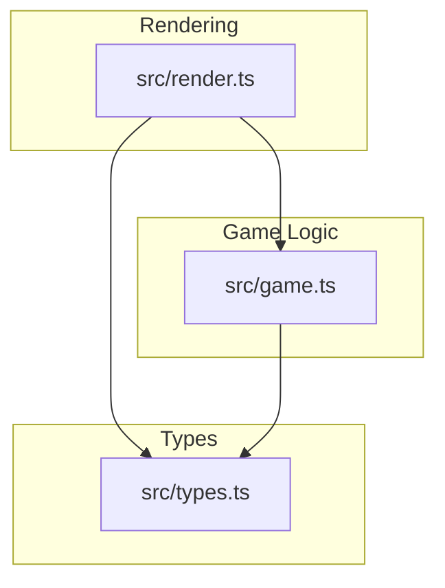
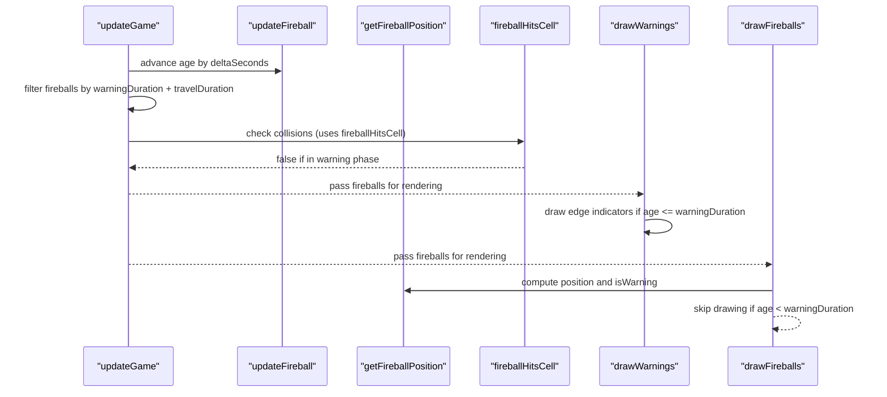
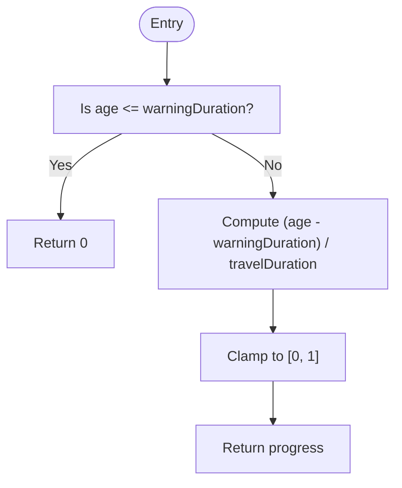
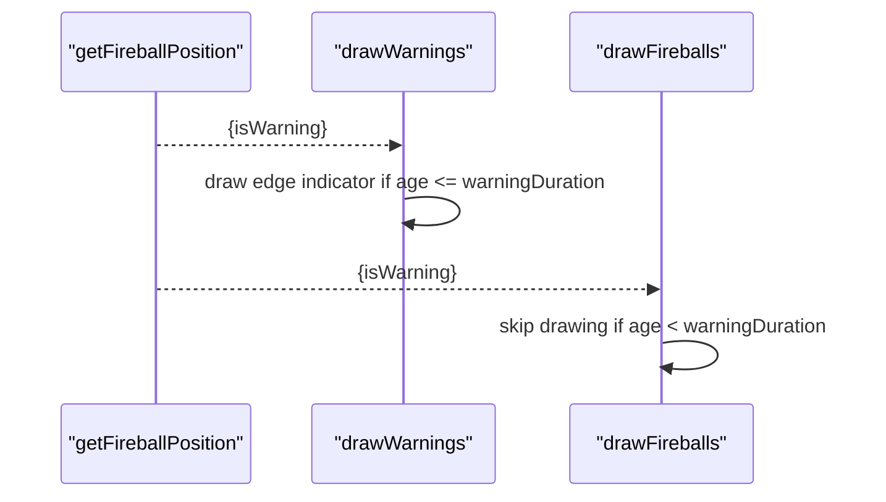
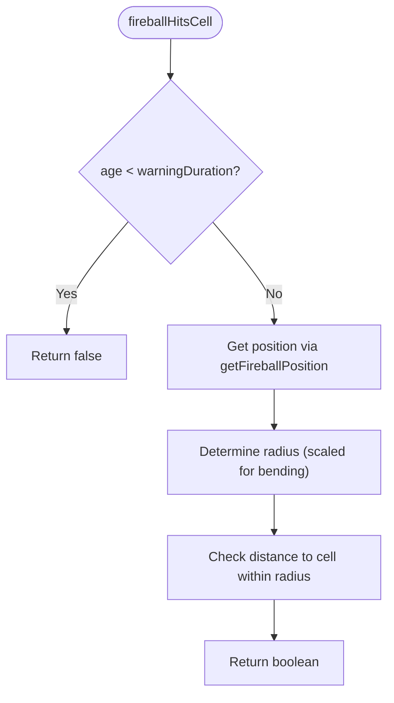
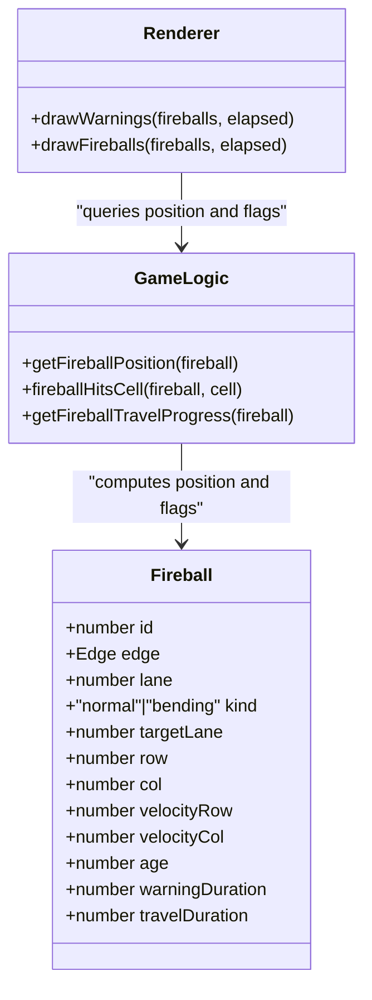
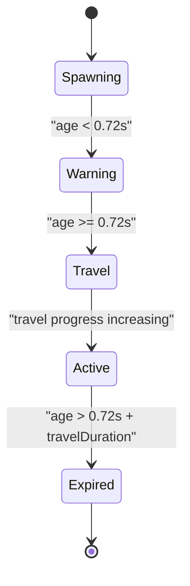
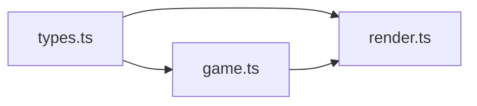

# Warning Phase System

<cite>
**Referenced Files in This Document**
- [game.ts](file://src/game.ts)
- [render.ts](file://src/render.ts)
- [types.ts](file://src/types.ts)
</cite>

## Table of Contents
1. [Introduction](#introduction)
2. [Project Structure](#project-structure)
3. [Core Components](#core-components)
4. [Architecture Overview](#architecture-overview)
5. [Detailed Component Analysis](#detailed-component-analysis)
6. [Dependency Analysis](#dependency-analysis)
7. [Performance Considerations](#performance-considerations)
8. [Troubleshooting Guide](#troubleshooting-guide)
9. [Conclusion](#conclusion)

## Introduction
This document explains the fireball warning phase system that provides players with a pre-impact reaction window before dangerous fireballs enter the grid. The core timing constant FIREBALL_WARNING_DURATION (0.72 seconds) controls how long a fireball remains in a “warning” state, during which it is not visible on the board and cannot collide with the player. After the warning expires, the fireball becomes visible and can hit the player. The system integrates both straight and bending fireballs, ensuring consistent behavior across types while giving players time to react.

## Project Structure
The warning system spans two primary modules:
- Game logic and timing: src/game.ts
- Rendering pipeline: src/render.ts
- Shared type definitions: src/types.ts

**Diagram sources**
- [game.ts:1-426](file://src/game.ts#L1-L426)
- [render.ts:1-721](file://src/render.ts#L1-L721)
- [types.ts:1-54](file://src/types.ts#L1-L54)

**Section sources**
- [game.ts:1-426](file://src/game.ts#L1-L426)
- [render.ts:1-721](file://src/render.ts#L1-L721)
- [types.ts:1-54](file://src/types.ts#L1-L54)

## Core Components
- Warning duration constant: FIREBALL_WARNING_DURATION = 0.72 seconds.
- Fireball lifecycle phases:
  - Warning phase: age < warningDuration; no collision, not drawn on the board.
  - Travel phase: warningDuration ≤ age ≤ warningDuration + travelDuration; visible and potentially colliding.
  - Expired: age > warningDuration + travelDuration; removed from active list.
- Progress calculation: getFireballTravelProgress returns 0 during warnings and normalizes progress over travelDuration after warnings expire.
- Collision gating: fireballHitsCell returns false during warnings regardless of position.
- Rendering integration: drawWarnings shows edge indicators during warnings; drawFireballs skips drawing until warnings expire.

Key responsibilities:
- Timing and progression: game.ts
- Visual feedback and visibility: render.ts
- Data contracts: types.ts

**Section sources**
- [game.ts:4-16](file://src/game.ts#L4-L16)
- [game.ts:168-176](file://src/game.ts#L168-L176)
- [game.ts:210-223](file://src/game.ts#L210-L223)
- [game.ts:317-323](file://src/game.ts#L317-L323)
- [render.ts:316-357](file://src/render.ts#L316-L357)
- [render.ts:370-394](file://src/render.ts#L370-L394)
- [types.ts:13-26](file://src/types.ts#L13-L26)

## Architecture Overview
The warning system coordinates between game updates and rendering:
- On each frame, updateGame advances fireball ages and filters out expired ones.
- getFireballPosition computes current position and sets isWarning based on age vs warningDuration.
- drawWarnings renders edge indicators for all fireballs still in the warning phase.
- drawFireballs only draws fireballs after their warning phase has ended.
- Collision checks use fireballHitsCell, which short-circuits during warnings.

**Diagram sources**
- [game.ts:83-101](file://src/game.ts#L83-L101)
- [game.ts:325-362](file://src/game.ts#L325-L362)
- [game.ts:210-223](file://src/game.ts#L210-L223)
- [render.ts:316-357](file://src/render.ts#L316-L357)
- [render.ts:370-394](file://src/render.ts#L370-L394)
- [game.ts:168-176](file://src/game.ts#L168-L176)

## Detailed Component Analysis

### Warning Duration and Lifecycle
- FIREBALL_WARNING_DURATION defines the pre-impact period (0.72s). During this time:
  - getFireballTravelProgress returns 0, so straight fireballs remain at their off-screen start positions.
  - fireballHitsCell returns false, preventing any collision.
  - drawFireballs skips drawing the fireball sprite.
  - drawWarnings draws an edge indicator near the grid boundary to signal incoming danger.
- After the warning expires:
  - getFireballTravelProgress increases linearly up to 1 over travelDuration.
  - Straight fireballs move along their lane; bending fireballs begin turning toward the player’s lane.
  - drawFireballs renders the fireball sprites.
  - fireballHitsCell performs collision checks using the computed position and radius.

Timing relationships:
- Total visible life = warningDuration + travelDuration.
- For straight fireballs, travelDuration depends on score via scheduleFireballTravelDuration.
- For bending fireballs, travelDuration is set to BENDING_FIREBALL_MAX_TRAVEL_SECONDS when isBending is true.

**Section sources**
- [game.ts:4-16](file://src/game.ts#L4-L16)
- [game.ts:245-247](file://src/game.ts#L245-L247)
- [game.ts:187-190](file://src/game.ts#L187-L190)
- [game.ts:317-323](file://src/game.ts#L317-L323)
- [game.ts:210-223](file://src/game.ts#L210-L223)
- [render.ts:316-357](file://src/render.ts#L316-L357)
- [render.ts:370-394](file://src/render.ts#L370-L394)

### getFireballTravelProgress Behavior
- Returns 0 when age ≤ warningDuration.
- Otherwise returns normalized progress: clamp((age - warningDuration) / travelDuration, 0, 1).
- This ensures:
  - No movement or collision during warnings.
  - Smooth transition into the travel phase once warnings expire.

**Diagram sources**
- [game.ts:317-323](file://src/game.ts#L317-L323)

**Section sources**
- [game.ts:317-323](file://src/game.ts#L317-L323)

### isWarning Flag Usage in Rendering Pipeline
- getFireballPosition computes isWarning as age < warningDuration.
- Rendering uses this flag indirectly:
  - drawWarnings iterates fireballs and draws edge indicators when age ≤ warningDuration.
  - drawFireballs skips drawing when age < warningDuration.
- This separation allows clear visual cues (edge indicators) before the actual fireball appears.

**Diagram sources**
- [game.ts:168-176](file://src/game.ts#L168-L176)
- [render.ts:316-357](file://src/render.ts#L316-L357)
- [render.ts:370-394](file://src/render.ts#L370-L394)

**Section sources**
- [game.ts:168-176](file://src/game.ts#L168-L176)
- [render.ts:316-357](file://src/render.ts#L316-L357)
- [render.ts:370-394](file://src/render.ts#L370-L394)

### Collision Detection During Warnings
- fireballHitsCell immediately returns false if age < warningDuration.
- This prevents any collision detection from triggering during the warning phase, even if the fireball’s projected path would intersect the player later.
- After warnings expire, collision uses the current position and a radius scaled for bending fireballs.

**Diagram sources**
- [game.ts:210-223](file://src/game.ts#L210-L223)
- [game.ts:168-176](file://src/game.ts#L168-L176)

**Section sources**
- [game.ts:210-223](file://src/game.ts#L210-L223)
- [game.ts:168-176](file://src/game.ts#L168-L176)

### Integration With Straight and Bending Fireballs
- Straight fireballs:
  - Remain stationary (progress = 0) during warnings.
  - Move along their lane after warnings expire, based on progress.
- Bending fireballs:
  - Also remain stationary during warnings.
  - Begin turning toward the player’s target lane after warnings expire, using velocity-based steering constrained by turn rate.
- Both types share the same warningDuration and are gated identically for visibility and collision.

**Diagram sources**
- [types.ts:13-26](file://src/types.ts#L13-L26)
- [game.ts:168-176](file://src/game.ts#L168-L176)
- [game.ts:210-223](file://src/game.ts#L210-L223)
- [game.ts:317-323](file://src/game.ts#L317-L323)
- [render.ts:316-357](file://src/render.ts#L316-L357)
- [render.ts:370-394](file://src/render.ts#L370-L394)

**Section sources**
- [game.ts:325-362](file://src/game.ts#L325-L362)
- [game.ts:168-176](file://src/game.ts#L168-L176)
- [render.ts:370-394](file://src/render.ts#L370-L394)

### Warning State Transitions and Player Reaction Time
- Transition timeline per fireball:
  - t = 0: spawn; age = 0; warning phase begins.
  - t ∈ [0, 0.72): warning phase; edge indicator visible; no collision; no fireball sprite.
  - t ≥ 0.72: travel phase begins; fireball becomes visible; collision possible.
  - t ∈ [0.72, 0.72 + travelDuration]: travel continues until progress reaches 1.
  - t > 0.72 + travelDuration: fireball removed from active list.
- Player reaction window equals FIREBALL_WARNING_DURATION (0.72s), providing consistent time to respond regardless of speed or type.

[No diagram sources needed since this diagram shows conceptual workflow, not actual code structure]

**Section sources**
- [game.ts:83-101](file://src/game.ts#L83-L101)
- [game.ts:317-323](file://src/game.ts#L317-L323)
- [render.ts:316-357](file://src/render.ts#L316-L357)
- [render.ts:370-394](file://src/render.ts#L370-L394)

### Relationship Between Warning Duration and Travel Duration
- Total lifecycle = warningDuration + travelDuration.
- For straight fireballs, travelDuration decreases with score via scheduleFireballTravelDuration, making impacts faster but keeping the warning window fixed at 0.72s.
- For bending fireballs, travelDuration is capped at BENDING_FIREBALL_MAX_TRAVEL_SECONDS when isBending is true, ensuring predictable maximum exposure time.

**Section sources**
- [game.ts:245-247](file://src/game.ts#L245-L247)
- [game.ts:187-190](file://src/game.ts#L187-L190)
- [game.ts:83-101](file://src/game.ts#L83-L101)

## Dependency Analysis
- Rendering depends on game logic for position and flags:
  - drawWarnings and drawFireballs call into getFireballPosition and rely on age/warningDuration comparisons.
- Game logic encapsulates timing constants and calculations:
  - FIREBALL_WARNING_DURATION, scheduleFireballTravelDuration, and getFireballTravelProgress centralize timing behavior.
- Types define shared interfaces used by both modules.

**Diagram sources**
- [types.ts:1-54](file://src/types.ts#L1-54)
- [game.ts:1-426](file://src/game.ts#L1-426)
- [render.ts:1-721](file://src/render.ts#L1-721)

**Section sources**
- [types.ts:1-54](file://src/types.ts#L1-54)
- [game.ts:1-426](file://src/game.ts#L1-426)
- [render.ts:1-721](file://src/render.ts#L1-721)

## Performance Considerations
- Early exits:
  - drawFireballs skips processing for fireballs still in warning phase.
  - fireballHitsCell short-circuits during warnings, avoiding unnecessary geometry checks.
- Constant-time operations:
  - getFireballTravelProgress is O(1).
  - Collision checks are simple bounding comparisons.
- Filtering:
  - updateGame removes expired fireballs promptly, reducing iteration overhead.

[No sources needed since this section provides general guidance]

## Troubleshooting Guide
- If fireballs appear too early or too late:
  - Verify FIREBALL_WARNING_DURATION and ensure drawWarnings and drawFireballs thresholds match the intended behavior.
- If collisions occur during warnings:
  - Confirm fireballHitsCell returns false when age < warningDuration and that getFireballPosition is not bypassed in custom logic.
- If bending fireballs do not turn:
  - Ensure they have exited the warning phase and that updateFireball applies steering only when travelDelta > 0.
- If total lifecycle feels inconsistent:
  - Check scheduleFireballTravelDuration for straight fireballs and BENDING_FIREBALL_MAX_TRAVEL_SECONDS for bending fireballs.

**Section sources**
- [game.ts:210-223](file://src/game.ts#L210-L223)
- [game.ts:325-362](file://src/game.ts#L325-L362)
- [render.ts:316-357](file://src/render.ts#L316-L357)
- [render.ts:370-394](file://src/render.ts#L370-L394)

## Conclusion
The warning phase system provides a consistent 0.72-second pre-impact window for both straight and bending fireballs. During warnings, fireballs are invisible on the board and cannot collide, while edge indicators alert players to incoming threats. Once warnings expire, fireballs become visible and dangerous, progressing according to their travel durations. This design balances fairness and challenge by guaranteeing predictable reaction time while allowing difficulty scaling through travel duration adjustments.