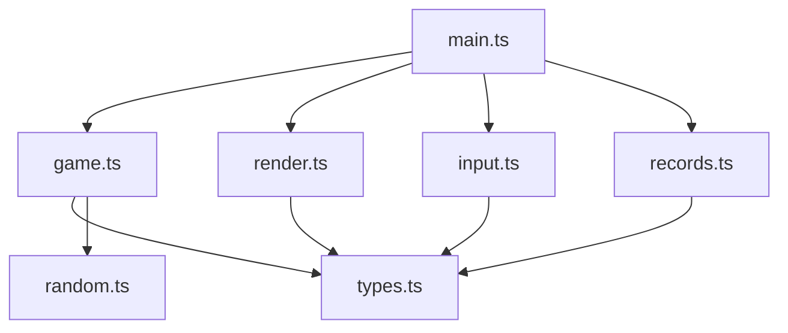
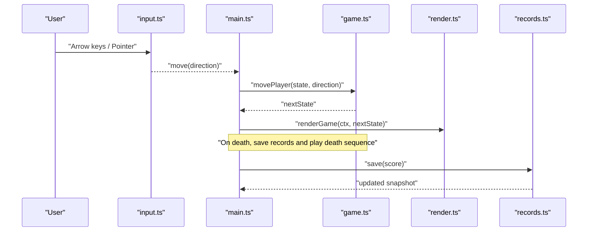
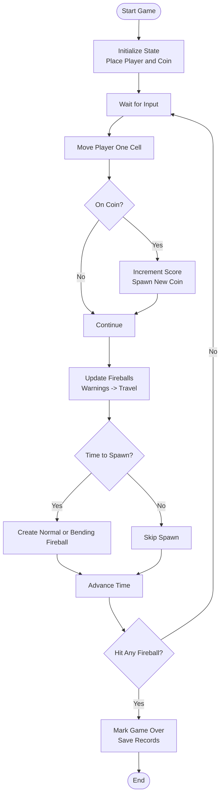
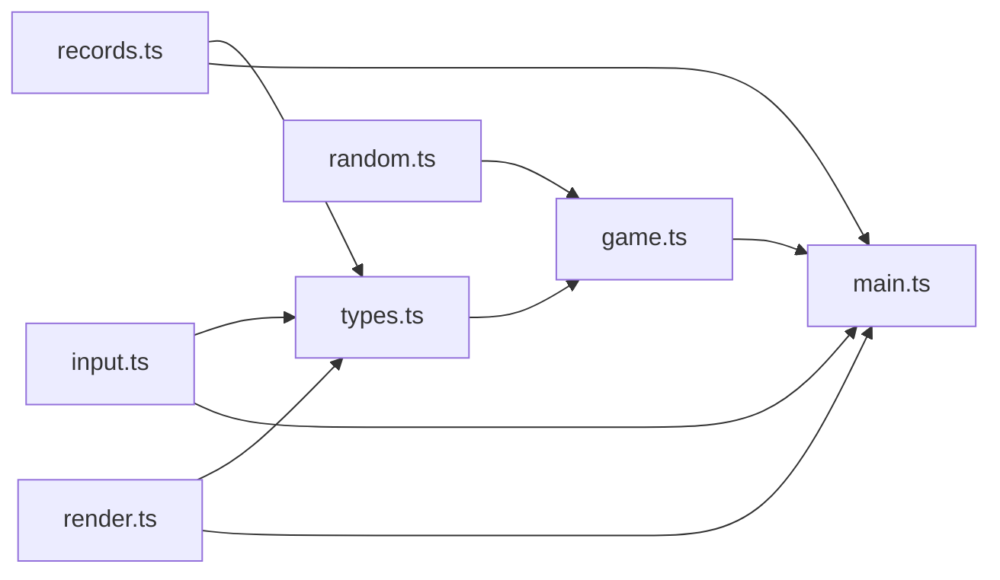

# Game Mechanics

<cite>
**Referenced Files in This Document**
- [game.ts](file://src/game.ts)
- [types.ts](file://src/types.ts)
- [random.ts](file://src/random.ts)
- [render.ts](file://src/render.ts)
- [input.ts](file://src/input.ts)
- [main.ts](file://src/main.ts)
- [records.ts](file://src/records.ts)
- [README.md](file://README.md)
</cite>

## Table of Contents
1. [Introduction](#introduction)
2. [Project Structure](#project-structure)
3. [Core Components](#core-components)
4. [Architecture Overview](#architecture-overview)
5. [Detailed Component Analysis](#detailed-component-analysis)
6. [Dependency Analysis](#dependency-analysis)
7. [Performance Considerations](#performance-considerations)
8. [Troubleshooting Guide](#troubleshooting-guide)
9. [Conclusion](#conclusion)

## Introduction
This document explains the game mechanics system for a 5×5 grid-based arcade game. It covers:
- Grid movement with clamped boundaries (no wrap-around; movement is constrained to the board).
- Coin collection and immediate respawn logic.
- Fireball spawning, including straight and bending behaviors, warning phase visualization, and collision detection with precise hitboxes.
- Progressive difficulty scaling based on score thresholds.
- Deterministic random number generation utilities.
- Performance considerations for collision detection and entity management.

The game uses a fixed timestep update loop, immutable state transitions, and a Canvas renderer.

## Project Structure
At a high level:
- types.ts defines core data structures and constants.
- game.ts implements all game logic: movement, coin spawning, fireball lifecycle, collision, and difficulty scheduling.
- random.ts provides deterministic RNG utilities.
- render.ts handles drawing and visual feedback (including warnings).
- input.ts translates keyboard and pointer events into directional moves and control actions.
- main.ts orchestrates the game loop, audio, records persistence, and state transitions.
- records.ts persists best and world scores.

**Diagram sources**
- [main.ts:1-160](file://src/main.ts#L1-L160)
- [game.ts:1-426](file://src/game.ts#L1-L426)
- [render.ts:1-721](file://src/render.ts#L1-L721)
- [input.ts:1-255](file://src/input.ts#L1-L255)
- [records.ts:1-52](file://src/records.ts#L1-L52)
- [types.ts:1-54](file://src/types.ts#L1-L54)
- [random.ts:1-18](file://src/random.ts#L1-L18)

**Section sources**
- [README.md:1-30](file://README.md#L1-L30)

## Core Components
- Grid and player: The board is a 5×5 grid. Player moves one cell per input event and is clamped to valid rows/columns.
- Coins: When the player lands on the coin cell, score increments and a new coin spawns immediately at a different cell.
- Fireballs: Spawn after the first coin is collected. They travel across lanes from edges. Some bend toward the player’s current lane.
- Collision: Hitbox checks use a radius around the fireball position compared to the player’s cell center.
- Difficulty: As score increases, spawn intervals shorten and travel durations decrease.
- Randomness: All randomness is injected via a RandomSource interface to enable deterministic behavior.

**Section sources**
- [types.ts:1-54](file://src/types.ts#L1-L54)
- [game.ts:29-48](file://src/game.ts#L29-L48)
- [game.ts:103-111](file://src/game.ts#L103-L111)
- [game.ts:113-166](file://src/game.ts#L113-L166)
- [game.ts:210-223](file://src/game.ts#L210-L223)
- [game.ts:225-247](file://src/game.ts#L225-L247)
- [random.ts:1-18](file://src/random.ts#L1-L18)

## Architecture Overview
The game follows an event-driven architecture:
- Input layer converts user actions into direction updates.
- Game logic applies deterministic state transitions.
- Renderer draws the updated state each frame.
- Records store persists scores across sessions.

**Diagram sources**
- [input.ts:28-214](file://src/input.ts#L28-L214)
- [main.ts:69-144](file://src/main.ts#L69-L144)
- [game.ts:58-81](file://src/game.ts#L58-L81)
- [render.ts:166-185](file://src/render.ts#L166-L185)
- [records.ts:20-29](file://src/records.ts#L20-L29)

## Detailed Component Analysis

### Grid Movement and Boundaries
- Movement model: Each move advances the player by one cell along the chosen axis.
- Boundary handling: After stepping, the new cell is clamped to the 0..4 range for both row and column. There is no wrap-around; attempts to move off-grid are clamped to the nearest edge cell.
- Facing direction: The last direction is stored for sprite animation.

Key implementation references:
- Step and clamp functions ensure single-cell movement within bounds.
- Move function updates facing direction and checks collisions after movement.

**Section sources**
- [game.ts:293-315](file://src/game.ts#L293-L315)
- [game.ts:58-81](file://src/game.ts#L58-L81)
- [types.ts:1-11](file://src/types.ts#L1-L11)

### Coin Collection and Respawn Strategy
- Collection: If the player’s new cell equals the coin cell, increment score and mark previous coin location.
- Immediate respawn: A new coin is spawned right away using a strategy that prefers cells not equal to the player or the previous coin. If those preferred cells are unavailable, it falls back to any non-player cell.
- First coin effect: On the very first coin collected, the spawner clock resets so the first fireball appears after a fixed delay.

Implementation references:
- Coin spawn selection algorithm filters candidates and picks randomly.
- State transition on collection updates score, previous coin, and next fireball timing.

**Section sources**
- [game.ts:103-111](file://src/game.ts#L103-L111)
- [game.ts:66-81](file://src/game.ts#L66-L81)

### Fireball Spawning System
- Initial delay: No fireballs spawn until the first coin is collected. After that, a countdown begins and the first fireball appears after a fixed initial delay.
- Spawn interval: The time between subsequent fireballs decreases at score thresholds: 10, 25, 50, 75, and 100 points.
- Travel duration: Fireballs cross the board faster as score increases, up to a minimum speed cap.
- Edge and lane selection: Each fireball chooses a random edge and a random lane index.
- Bending fireballs:
  - Chance to be “bending” when spawned.
  - Slower speed ratio and longer travel duration than normal fireballs.
  - Turn rate limited to a maximum angle per second; they curve toward the player’s current row/column depending on entry edge.
  - After a bending fireball spawns, the next five fireballs are forced to be normal and spawn at a fixed delay.

Implementation references:
- Scheduling functions compute delays and travel durations based on score.
- Creation functions set velocities, positions, and flags for normal vs. bending.
- Spawner advances a clock and enforces cooldowns and forced delays.

**Section sources**
- [game.ts:225-247](file://src/game.ts#L225-L247)
- [game.ts:113-166](file://src/game.ts#L113-L166)
- [game.ts:249-279](file://src/game.ts#L249-L279)

### Warning Phase Visualization
- Warning window: Before entering the grid, fireballs show a warning indicator outside the board for a fixed duration.
- Rendering: Warnings are drawn at the corresponding edge and lane, animated with frames. During this phase, fireballs do not collide.

Implementation references:
- Warning duration constant and position calculation during warning.
- Renderer draws warning sprites aligned to the correct edge/lane.

**Section sources**
- [game.ts:4](file://src/game.ts#L4)
- [game.ts:168-176](file://src/game.ts#L168-L176)
- [render.ts:316-357](file://src/render.ts#L316-L357)

### Collision Detection and Hitbox Calculations
- Timing: Collisions only occur after the warning phase has elapsed.
- Positioning: For straight fireballs, position is interpolated along the lane based on progress. For bending fireballs, position is updated continuously using velocity vectors.
- Hitbox: A square-inclusive check compares absolute differences in row and col against a radius. Bending fireballs use a scaled-down radius.
- Player hit: If any active fireball overlaps the player’s cell, the game ends.

Implementation references:
- Progress calculation ensures safe interpolation within [0,1].
- Collision function applies radius scaling and checks overlap.
- Global hit check iterates all fireballs.

**Section sources**
- [game.ts:317-323](file://src/game.ts#L317-L323)
- [game.ts:210-223](file://src/game.ts#L210-L223)
- [game.ts:168-176](file://src/game.ts#L168-L176)

### Progressive Difficulty Scaling
- Spawn intervals: Decrease at specific score thresholds to increase pressure.
- Travel durations: Decrease linearly with score up to a minimum, making fireballs traverse the board faster.
- Bending frequency: Controlled by chance and enforced cooldowns to balance threat levels.

Implementation references:
- Threshold-based schedule functions.
- Linear formula for travel duration capped at a minimum.

**Section sources**
- [game.ts:225-247](file://src/game.ts#L225-L247)

### Deterministic Random Number Generation
- Random source abstraction: All stochastic decisions accept a RandomSource function, enabling deterministic seeding.
- Utilities: Integer sampling helper and a seeded PRNG implementation are provided.
- Usage: Tests inject deterministic sequences to validate behavior reproducibly.

Implementation references:
- RandomSource type and integer sampler.
- Seeded PRNG generator.

**Section sources**
- [random.ts:1-18](file://src/random.ts#L1-L18)
- [game.test.ts:29-41](file://src/game.test.ts#L29-L41)

### Game State Transitions (Examples from Codebase)
- Starting a game: Initializes player at center, first coin elsewhere, zero score, and prepares spawner settings.
- Collecting a coin: Increments score, stores previous coin, spawns a new coin, and adjusts spawner timing if it was the first coin.
- Updating the game loop: Advances time, updates fireball ages and positions, removes expired fireballs, and triggers spawner if score > 0.
- Game over: Marks status as game over; main loop saves records and plays death sequence.

Concrete references:
- Initial state creation and coin placement.
- Move path with coin collection and spawner reset.
- Update loop with fireball lifecycle and spawner advancement.
- Game over commit flow.

**Section sources**
- [game.ts:29-48](file://src/game.ts#L29-L48)
- [game.ts:66-81](file://src/game.ts#L66-L81)
- [game.ts:83-101](file://src/game.ts#L83-L101)
- [main.ts:138-144](file://src/main.ts#L138-L144)

### Conceptual Overview
The following diagram illustrates the conceptual flow of a typical gameplay loop without mapping to specific files:

[No sources needed since this diagram shows conceptual workflow, not actual code structure]

## Dependency Analysis
High-level dependencies among modules:
- main.ts depends on game.ts, render.ts, input.ts, and records.ts.
- game.ts depends on types.ts and random.ts.
- render.ts depends on types.ts and reads some constants from game.ts for rendering parameters.
- input.ts depends on types.ts and render.ts for coordinate conversion.
- records.ts depends on types.ts for record interfaces.

**Diagram sources**
- [game.ts:1-10](file://src/game.ts#L1-L10)
- [render.ts:1-10](file://src/render.ts#L1-L10)
- [input.ts:1-10](file://src/input.ts#L1-L10)
- [main.ts:1-10](file://src/main.ts#L1-L10)
- [records.ts:1-10](file://src/records.ts#L1-L10)
- [types.ts:1-10](file://src/types.ts#L1-L10)
- [random.ts:1-10](file://src/random.ts#L1-L10)

**Section sources**
- [game.ts:1-10](file://src/game.ts#L1-L10)
- [render.ts:1-10](file://src/render.ts#L1-L10)
- [input.ts:1-10](file://src/input.ts#L1-L10)
- [main.ts:1-10](file://src/main.ts#L1-L10)
- [records.ts:1-10](file://src/records.ts#L1-L10)
- [types.ts:1-10](file://src/types.ts#L1-L10)
- [random.ts:1-10](file://src/random.ts#L1-L10)

## Performance Considerations
- Fixed timestep updates: The game loop advances in fixed increments, ensuring consistent physics and deterministic behavior across frame rates.
- Entity filtering: Expired fireballs are filtered out each update to keep the list small.
- Collision checks: O(n) per frame where n is the number of active fireballs. Given the small board and limited concurrent threats, this remains efficient.
- Rendering optimizations: Sprite loading and readiness checks avoid redundant draw calls; procedural fallbacks prevent stalls while assets load.
- Determinism: Using a seeded RNG avoids nondeterministic drift and aids testing and replayability.

[No sources needed since this section provides general guidance]

## Troubleshooting Guide
Common issues and resolutions:
- Player stuck at edges: Movement clamps to the board; verify input directions and confirm boundary clamping logic.
- Fireballs not appearing: Ensure the first coin has been collected and the spawner clock advanced past the initial delay.
- Unexpected collisions: Confirm warning phase duration and that collision checks ignore fireballs before their travel phase.
- Non-deterministic behavior: Inject a deterministic RandomSource to reproduce scenarios consistently.

**Section sources**
- [game.ts:293-315](file://src/game.ts#L293-L315)
- [game.ts:83-101](file://src/game.ts#L83-L101)
- [game.ts:210-223](file://src/game.ts#L210-L223)
- [random.ts:1-18](file://src/random.ts#L1-L18)

## Conclusion
The game mechanics combine simple, robust systems:
- A constrained 5×5 grid movement model.
- Immediate coin respawn with strategic placement.
- A layered fireball system with warnings, straight and bending trajectories, and precise hitboxes.
- Clear difficulty progression tied to score thresholds.
- Deterministic randomness for reliable behavior and testing.

These components together deliver a tight, responsive arcade experience with clear visual feedback and scalable challenge.