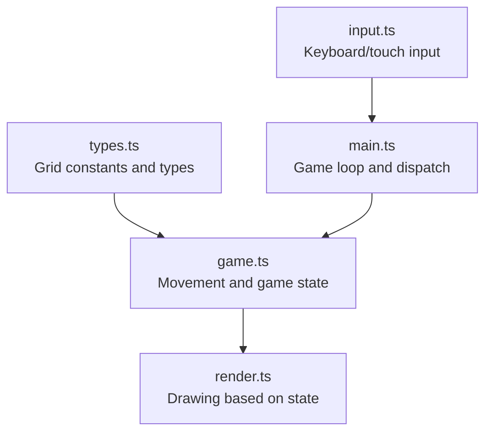
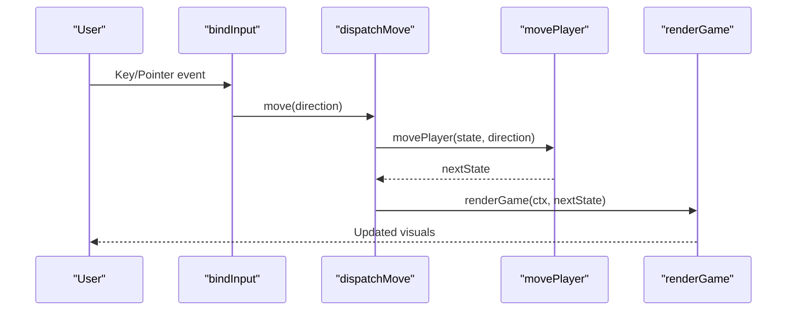
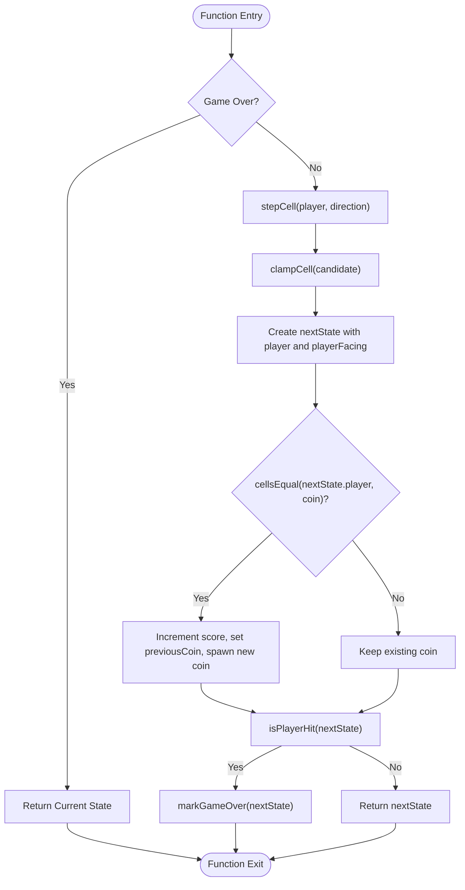
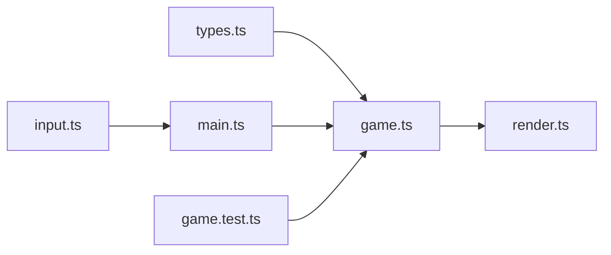

# Movement System

<cite>
**Referenced Files in This Document**
- [game.ts](file://src/game.ts)
- [types.ts](file://src/types.ts)
- [input.ts](file://src/input.ts)
- [render.ts](file://src/render.ts)
- [main.ts](file://src/main.ts)
- [game.test.ts](file://src/game.test.ts)
</cite>

## Table of Contents
1. [Introduction](#introduction)
2. [Project Structure](#project-structure)
3. [Core Components](#core-components)
4. [Architecture Overview](#architecture-overview)
5. [Detailed Component Analysis](#detailed-component-analysis)
6. [Dependency Analysis](#dependency-analysis)
7. [Performance Considerations](#performance-considerations)
8. [Troubleshooting Guide](#troubleshooting-guide)
9. [Conclusion](#conclusion)

## Introduction
This document explains the grid-based movement system used by the game. It focuses on the 5×5 board coordinate system, player positioning with boundary handling, and the core functions that implement movement: stepCell, clampCell, and cellsEqual. It also covers how direction persistence (playerFacing) drives animation, and provides concrete examples of movement transitions within the game state. Finally, it addresses performance considerations for cell calculations and collision detection optimization.

## Project Structure
The movement system is implemented primarily in the game logic module, with supporting types and input handling. The rendering layer consumes the resulting state to draw the player and other elements.

**Diagram sources**
- [types.ts:1-11](file://src/types.ts#L1-L11)
- [game.ts:29-81](file://src/game.ts#L29-L81)
- [input.ts:28-113](file://src/input.ts#L28-L113)
- [main.ts:69-87](file://src/main.ts#L69-L87)
- [render.ts:166-185](file://src/render.ts#L166-L185)

**Section sources**
- [types.ts:1-11](file://src/types.ts#L1-L11)
- [game.ts:29-81](file://src/game.ts#L29-L81)
- [input.ts:28-113](file://src/input.ts#L28-L113)
- [main.ts:69-87](file://src/main.ts#L69-L87)
- [render.ts:166-185](file://src/render.ts#L166-L185)

## Core Components
- Grid constants and types define a fixed 5×5 board and the Cell type used for positions.
- The movePlayer function orchestrates directional movement, boundary clamping, coin collection, and hit detection.
- Helper functions stepCell, clampCell, and cellsEqual implement the low-level movement mechanics.
- Direction persistence via playerFacing ensures correct sprite orientation during animations.

Key responsibilities:
- Coordinate system: row and col indices from 0 to GRID_SIZE - 1.
- Movement: one-cell steps per input event.
- Boundary handling: clamp to valid range; no wrap-around.
- Collision: compare positions using cellsEqual.
- Animation: update playerFacing to reflect last movement direction.

**Section sources**
- [types.ts:1-11](file://src/types.ts#L1-L11)
- [game.ts:293-315](file://src/game.ts#L293-L315)
- [game.ts:58-81](file://src/game.ts#L58-L81)
- [game.test.ts:85-109](file://src/game.test.ts#L85-L109)

## Architecture Overview
The movement flow integrates input, game state updates, and rendering. Input events are translated into directions and dispatched to the game logic, which computes the new state and renders it.

**Diagram sources**
- [input.ts:28-113](file://src/input.ts#L28-L113)
- [main.ts:69-87](file://src/main.ts#L69-L87)
- [game.ts:58-81](file://src/game.ts#L58-L81)
- [render.ts:166-185](file://src/render.ts#L166-L185)

## Detailed Component Analysis

### Coordinate System and Board Layout
- The board is a 5×5 grid with rows and columns indexed from 0 to 4.
- CENTER_CELL defines the starting position at index 2 for both axes.
- Cells are represented as objects with row and col fields.

Practical implications:
- All movement and collision checks operate on integer coordinates within this range.
- Rendering maps these coordinates to pixel positions using stride and offsets.

**Section sources**
- [types.ts:1-11](file://src/types.ts#L1-L11)
- [render.ts:187-203](file://src/render.ts#L187-L203)

### stepCell Function
Purpose:
- Computes the next candidate cell by applying a directional offset to the current cell.

Behavior:
- For each direction ("up", "right", "down", "left"), adjusts either row or col by ±1 while keeping the other axis unchanged.

Complexity:
- O(1) time and space.

Usage:
- Called inside movePlayer before boundary handling.

**Section sources**
- [game.ts:293-304](file://src/game.ts#L293-L304)

### clampCell Function
Purpose:
- Enforces board boundaries by clamping row and col to the valid range [0, GRID_SIZE - 1].

Behavior:
- Uses min/max operations to ensure coordinates remain within the grid.

Complexity:
- O(1) time and space.

Boundary semantics:
- Movement does not wrap around; attempts to move off the board are clamped to the edge cell.

**Section sources**
- [game.ts:306-311](file://src/game.ts#L306-L311)
- [game.test.ts:85-96](file://src/game.test.ts#L85-L96)

### cellsEqual Function
Purpose:
- Compares two cells for equality by checking both row and col.

Behavior:
- Returns true if both coordinates match exactly.

Complexity:
- O(1) time and space.

Usage:
- Used to detect coin collection and to avoid spawning coins on occupied cells.

**Section sources**
- [game.ts:313-315](file://src/game.ts#L313-L315)
- [game.ts:103-111](file://src/game.ts#L103-L111)

### Direction Persistence (playerFacing)
Purpose:
- Tracks the last movement direction to drive player sprite orientation.

Behavior:
- On each successful move, playerFacing is updated to the movement direction.
- Persists across frames until changed by another move.

Animation integration:
- Rendering selects the appropriate sprite loop based on playerFacing.

**Section sources**
- [game.ts:58-64](file://src/game.ts#L58-L64)
- [render.ts:487-507](file://src/render.ts#L487-L507)
- [game.test.ts:98-109](file://src/game.test.ts#L98-L109)

### Movement Transitions in Game State
High-level flow:
- Input triggers a move request.
- movePlayer computes the next position using stepCell and clampCell.
- If the new position matches the coin, score increments and a new coin spawns.
- Collision with fireballs ends the game.

Concrete example sequence:
- Starting at center (2, 2), moving left three times then up three times results in position (0, 0).
- Moving right onto a coin at (2, 3) increments score and spawns a new coin elsewhere.

These behaviors are validated by tests covering boundary clamping, direction persistence, and coin collection.

**Section sources**
- [game.ts:58-81](file://src/game.ts#L58-L81)
- [game.test.ts:85-125](file://src/game.test.ts#L85-L125)

### Flowchart of movePlayer Logic

**Diagram sources**
- [game.ts:58-81](file://src/game.ts#L58-L81)
- [game.ts:293-315](file://src/game.ts#L293-L315)
- [game.ts:221-223](file://src/game.ts#L221-L223)

## Dependency Analysis
The movement system depends on:
- Types and constants for grid size and cell representation.
- Input handling to translate user actions into directions.
- Rendering to visualize player position and facing direction.
- Tests to validate behavior and edge cases.

**Diagram sources**
- [types.ts:1-11](file://src/types.ts#L1-L11)
- [game.ts:58-81](file://src/game.ts#L58-L81)
- [input.ts:28-113](file://src/input.ts#L28-L113)
- [main.ts:69-87](file://src/main.ts#L69-L87)
- [render.ts:166-185](file://src/render.ts#L166-L185)
- [game.test.ts:85-125](file://src/game.test.ts#L85-L125)

**Section sources**
- [types.ts:1-11](file://src/types.ts#L1-L11)
- [game.ts:58-81](file://src/game.ts#L58-L81)
- [input.ts:28-113](file://src/input.ts#L28-L113)
- [main.ts:69-87](file://src/main.ts#L69-L87)
- [render.ts:166-185](file://src/render.ts#L166-L185)
- [game.test.ts:85-125](file://src/game.test.ts#L85-L125)

## Performance Considerations
- Cell calculations (stepCell, clampCell, cellsEqual) are constant-time operations with minimal overhead.
- Boundary handling uses simple min/max comparisons; no branching beyond direction switch.
- Player-facing updates occur once per move, avoiding repeated computations.
- Collision detection for fireballs uses a radius check against discrete cells; keep fireball arrays bounded by lifecycle filtering to maintain efficiency.
- Avoid unnecessary allocations by reusing computed values where possible (e.g., precompute stride and offsets in rendering).

[No sources needed since this section provides general guidance]

## Troubleshooting Guide
Common issues and resolutions:
- Player stuck at edges: Ensure clampCell is applied after stepCell so out-of-bounds moves are corrected.
- Incorrect sprite orientation: Verify playerFacing is updated on every move and read consistently in rendering.
- Coin not collected: Confirm cellsEqual compares both row and col and that coin position differs from player before collection.
- Unexpected wrap-around: Confirm clampCell enforces bounds; there is no wrap-around in the current implementation.

Validation references:
- Boundary clamping and direction persistence are covered by tests.
- Coin collection and immediate respawn are verified by tests.

**Section sources**
- [game.ts:58-81](file://src/game.ts#L58-L81)
- [game.test.ts:85-125](file://src/game.test.ts#L85-L125)

## Conclusion
The movement system centers on a straightforward 5×5 grid with robust boundary clamping and clear direction persistence. The core functions stepCell, clampCell, and cellsEqual provide efficient, predictable movement logic. Integration with input and rendering ensures responsive gameplay and accurate visual feedback. The design emphasizes simplicity and performance, making it easy to extend or modify while maintaining reliable behavior.