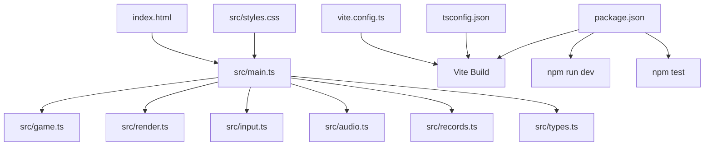
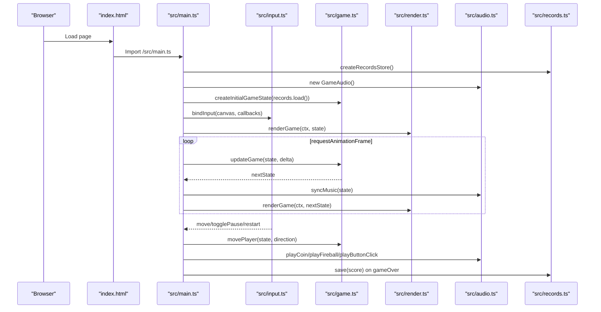
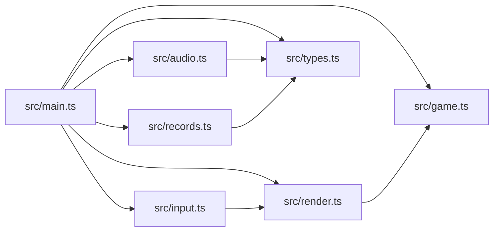

# Getting Started

<cite>
**Referenced Files in This Document**
- [package.json](file://package.json)
- [README.md](file://README.md)
- [vite.config.ts](file://vite.config.ts)
- [tsconfig.json](file://tsconfig.json)
- [index.html](file://index.html)
- [src/main.ts](file://src/main.ts)
- [src/game.ts](file://src/game.ts)
- [src/render.ts](file://src/render.ts)
- [src/input.ts](file://src/input.ts)
- [src/audio.ts](file://src/audio.ts)
- [src/records.ts](file://src/records.ts)
- [src/types.ts](file://src/types.ts)
- [src/styles.css](file://src/styles.css)
</cite>

## Table of Contents
1. Introduction
2. Project Structure
3. Core Components
4. Architecture Overview
5. Detailed Component Analysis
6. Dependency Analysis
7. Performance Considerations
8. Troubleshooting Guide
9. Conclusion

## Introduction
Raid and Run is a pixel-art browser game built with Vite, TypeScript, and Canvas. It features a 5x5 grid where you collect coins while dodging fireballs that spawn and travel across lanes. The project includes local development tooling, unit tests, and a production build pipeline.

This guide helps you set up the environment, run the development server, build for production, and run tests. It also explains how to navigate the codebase and troubleshoot common issues.

## Project Structure
At a high level:
- index.html is the application entry point loaded by Vite.
- src/main.ts bootstraps the game loop, input, audio, rendering, and state persistence.
- src/game.ts contains core game logic (state transitions, movement, collision, spawning).
- src/render.ts handles drawing on the Canvas and UI overlays.
- src/input.ts manages keyboard and pointer/touch interactions.
- src/audio.ts manages background music and sound effects using Web Audio API.
- src/records.ts persists best score and world record.
- src/types.ts defines shared types and constants.
- vite.config.ts configures base path for deployment.
- tsconfig.json configures TypeScript compilation targets and module resolution.
- package.json defines scripts and dependencies.

**Diagram sources**
- [index.html:19-19](file://index.html#L19-L19)
- [src/main.ts:1-10](file://src/main.ts#L1-L10)
- [src/game.ts:1-16](file://src/game.ts#L1-L16)
- [src/render.ts:1-12](file://src/render.ts#L1-L12)
- [src/input.ts:1-10](file://src/input.ts#L1-L10)
- [src/audio.ts:1-17](file://src/audio.ts#L1-L17)
- [src/records.ts:1-5](file://src/records.ts#L1-L5)
- [src/types.ts:1-6](file://src/types.ts#L1-L6)
- [vite.config.ts:1-6](file://vite.config.ts#L1-L6)
- [tsconfig.json:1-20](file://tsconfig.json#L1-L20)
- [package.json:6-11](file://package.json#L6-L11)

**Section sources**
- [index.html:1-22](file://index.html#L1-L22)
- [src/main.ts:1-160](file://src/main.ts#L1-L160)
- [src/game.ts:1-426](file://src/game.ts#L1-L426)
- [src/render.ts:1-721](file://src/render.ts#L1-L721)
- [src/input.ts:1-255](file://src/input.ts#L1-L255)
- [src/audio.ts:1-296](file://src/audio.ts#L1-L296)
- [src/records.ts:1-52](file://src/records.ts#L1-L52)
- [src/types.ts:1-54](file://src/types.ts#L1-L54)
- [vite.config.ts:1-6](file://vite.config.ts#L1-L6)
- [tsconfig.json:1-20](file://tsconfig.json#L1-L20)
- [package.json:1-19](file://package.json#L1-L19)

## Core Components
- Application bootstrap and lifecycle: initializes DOM elements, canvas context, records store, audio, initial state, and starts the fixed-step game loop.
- Game logic: player movement, coin collection, fireball spawning and movement, collision detection, scoring, and game over handling.
- Rendering: draws background, board, warnings, coins, fireballs, player, HUD, pause overlay, and game over screens.
- Input: supports keyboard (arrow keys and WASD), pointer/touch (tap, swipe), and button controls; includes held-move repeat behavior.
- Audio: loads and plays background music and sound effects; manages unlocking media playback and mode switching.
- Persistence: stores best score and world record using localStorage when available, otherwise falls back to in-memory storage.
- Configuration: Vite base path for GitHub Pages, TypeScript target and module settings.

**Section sources**
- [src/main.ts:14-160](file://src/main.ts#L14-L160)
- [src/game.ts:29-101](file://src/game.ts#L29-L101)
- [src/render.ts:166-185](file://src/render.ts#L166-L185)
- [src/input.ts:28-214](file://src/input.ts#L28-L214)
- [src/audio.ts:37-132](file://src/audio.ts#L37-L132)
- [src/records.ts:11-51](file://src/records.ts#L11-L51)
- [vite.config.ts:3-5](file://vite.config.ts#L3-L5)
- [tsconfig.json:2-17](file://tsconfig.json#L2-L17)

## Architecture Overview
The app follows a clear separation of concerns:
- Entry point wires together modules and drives the main loop.
- Pure game logic updates immutable-like state snapshots.
- Rendering reads state and draws frames.
- Input translates user actions into state changes via callbacks.
- Audio responds to game events and state transitions.
- Records persist scores across sessions.

**Diagram sources**
- [index.html:19-19](file://index.html#L19-L19)
- [src/main.ts:39-136](file://src/main.ts#L39-L136)
- [src/input.ts:28-214](file://src/input.ts#L28-L214)
- [src/game.ts:83-101](file://src/game.ts#L83-L101)
- [src/render.ts:166-185](file://src/render.ts#L166-L185)
- [src/audio.ts:65-76](file://src/audio.ts#L65-L76)
- [src/records.ts:20-29](file://src/records.ts#L20-L29)

## Detailed Component Analysis

### Installation and Setup
- Prerequisites: Node.js and npm installed on your machine.
- Install dependencies:
  - Run: npm install
  - This installs Vite, Vitest, TypeScript, and type definitions used by the project.

**Section sources**
- [package.json:12-17](file://package.json#L12-L17)
- [README.md:15-18](file://README.md#L15-L18)

### Local Development Workflow
- Start the development server:
  - Run: npm run dev
  - Vite launches a development server with hot module replacement (HMR). Changes to source files are reflected instantly without a full reload.
  - The server is configured to listen on all interfaces (useful for LAN access or remote debugging).

What happens under the hood:
- Vite serves index.html and resolves imports from src/main.ts.
- TypeScript types are validated at compile time; no emitted JS due to configuration.
- HMR updates modules in place during development.

**Section sources**
- [package.json:6-7](file://package.json#L6-L7)
- [vite.config.ts:3-5](file://vite.config.ts#L3-L5)
- [tsconfig.json:15-16](file://tsconfig.json#L15-L16)
- [index.html:19-19](file://index.html#L19-L19)

### Building for Production
- Build command:
  - Run: npm run build
  - This runs TypeScript checks then builds optimized assets with Vite.
- Output:
  - Vite generates static assets suitable for hosting (e.g., GitHub Pages).
- Base path:
  - The project sets base to "./" for relative paths, which works well for GitHub Pages subpath deployments.

**Section sources**
- [package.json:8](file://package.json#L8)
- [vite.config.ts:4](file://vite.config.ts#L4)
- [README.md:27-29](file://README.md#L27-L29)

### Testing Procedures
- Run tests once:
  - Run: npm test
  - Uses Vitest to execute unit tests defined in the project.
- Watch mode:
  - Run: npm run test:watch
  - Re-runs tests on file changes.

Where tests live:
- src/game.test.ts covers game mechanics such as movement, coin collection, fireball spawning, bending fireball behavior, collision, and records persistence.

**Section sources**
- [package.json:9-10](file://package.json#L9-L10)
- [src/game.test.ts:1-373](file://src/game.test.ts#L1-373)

### Navigating the Codebase
- Entry point:
  - index.html loads the module script from src/main.ts.
- Bootstrap and loop:
  - src/main.ts initializes DOM, canvas, audio, records, and starts the fixed-step game loop.
- Game logic:
  - src/game.ts implements pure functions for state transitions, movement, collision, and spawning.
- Rendering:
  - src/render.ts draws everything to the Canvas and provides helpers like coordinate conversion.
- Input:
  - src/input.ts binds keyboard and pointer events and maps them to game actions.
- Audio:
  - src/audio.ts manages Web Audio contexts, buffers, and playback modes.
- Persistence:
  - src/records.ts abstracts localStorage vs in-memory storage.
- Types:
  - src/types.ts centralizes shared types and constants.
- Styling:
  - src/styles.css styles the game shell, canvas, and buttons.

**Section sources**
- [index.html:19-19](file://index.html#L19-L19)
- [src/main.ts:14-160](file://src/main.ts#L14-L160)
- [src/game.ts:29-101](file://src/game.ts#L29-L101)
- [src/render.ts:166-185](file://src/render.ts#L166-L185)
- [src/input.ts:28-214](file://src/input.ts#L28-L214)
- [src/audio.ts:37-132](file://src/audio.ts#L37-L132)
- [src/records.ts:11-51](file://src/records.ts#L11-L51)
- [src/types.ts:1-54](file://src/types.ts#L1-L54)
- [src/styles.css:29-49](file://src/styles.css#L29-L49)

## Dependency Analysis
High-level dependency relationships:
- main.ts depends on game, render, input, audio, records, and types.
- render.ts depends on asset-path and game utilities for positioning and rotation.
- input.ts depends on render for coordinate mapping.
- audio.ts depends on asset-path and types.
- records.ts depends on types.
- game.ts depends on types and random utilities.

**Diagram sources**
- [src/main.ts:3-9](file://src/main.ts#L3-L9)
- [src/render.ts:1-4](file://src/render.ts#L1-L4)
- [src/input.ts:1-3](file://src/input.ts#L1-L3)
- [src/audio.ts:1-2](file://src/audio.ts#L1-L2)
- [src/records.ts:1](file://src/records.ts#L1)
- [src/game.ts:1-2](file://src/game.ts#L1-L2)

**Section sources**
- [src/main.ts:3-9](file://src/main.ts#L3-L9)
- [src/render.ts:1-4](file://src/render.ts#L1-L4)
- [src/input.ts:1-3](file://src/input.ts#L1-L3)
- [src/audio.ts:1-2](file://src/audio.ts#L1-L2)
- [src/records.ts:1](file://src/records.ts#L1)
- [src/game.ts:1-2](file://src/game.ts#L1-L2)

## Performance Considerations
- Fixed timestep: The game loop uses a fixed step size to ensure consistent physics and deterministic updates regardless of frame rate.
- Max frame cap: A maximum frame duration prevents large jumps when the tab is inactive.
- Efficient rendering: Pixelated image rendering and sprite caching reduce visual artifacts and improve performance.
- Audio buffering: Background music and effects are preloaded and reused to avoid repeated decoding overhead.

[No sources needed since this section provides general guidance]

## Troubleshooting Guide
Common setup and runtime issues:
- Missing Node.js/npm: Ensure Node.js and npm are installed before running npm install.
- Port conflicts: If the default port is in use, Vite will pick another automatically. You can specify a different port if needed.
- Assets not loading: Verify that asset files exist under public/assets and referenced names match exactly.
- Audio autoplay blocked: Browsers require user interaction to unlock audio. Interact with the canvas or buttons to enable sound.
- Canvas not supported: If getContext fails, the app throws an error indicating lack of Canvas support.
- localStorage unavailable: In private browsing or restricted environments, the app falls back to in-memory storage for records.
- TypeScript errors: The project enforces strict typing. Fix reported type errors before building.
- GitHub Pages base path: The project sets base to "./". Ensure your Pages deployment uses the correct repository root path.

**Section sources**
- [src/main.ts:18-35](file://src/main.ts#L18-L35)
- [src/audio.ts:59-63](file://src/audio.ts#L59-L63)
- [src/records.ts:11-29](file://src/records.ts#L11-L29)
- [vite.config.ts:4](file://vite.config.ts#L4)
- [tsconfig.json:11-16](file://tsconfig.json#L11-L16)

## Conclusion
You now have the essentials to install, develop, build, and test Raid and Run. Use npm run dev for fast iteration with HMR, npm run build for production assets, and npm test to validate game logic. Explore the modular structure to extend gameplay, add assets, or refine rendering and audio behavior.