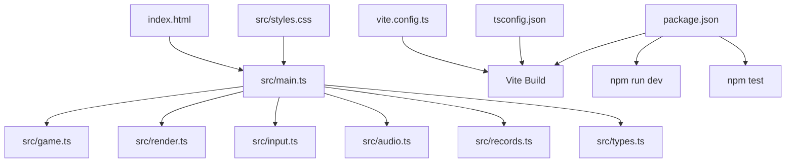
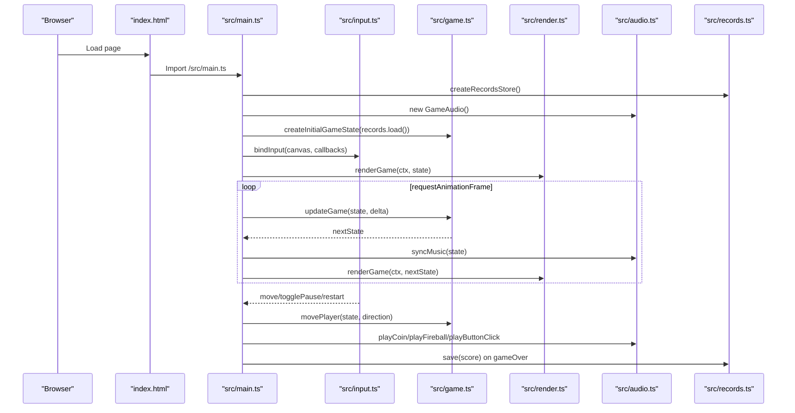
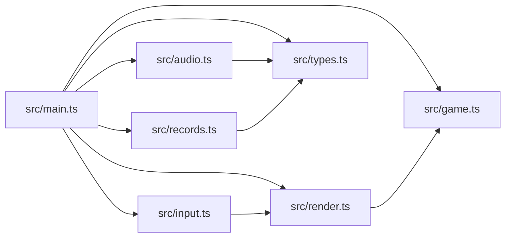

# Getting Started

<cite>
**Referenced Files in This Document**
- [package.json](file://package.json)
- [README.md](file://README.md)
- [vite.config.ts](file://vite.config.ts)
- [tsconfig.json](file://tsconfig.json)
- [index.html](file://index.html)
- [src/main.ts](file://src/main.ts)
- [src/game.ts](file://src/game.ts)
- [src/render.ts](file://src/render.ts)
- [src/input.ts](file://src/input.ts)
- [src/audio.ts](file://src/audio.ts)
- [src/records.ts](file://src/records.ts)
- [src/types.ts](file://src/types.ts)
- [src/styles.css](file://src/styles.css)
</cite>

## Update Summary
**Changes Made**
- Updated installation instructions to reflect current package.json configuration
- Enhanced local development workflow documentation with Vite-specific details
- Added comprehensive testing procedures with Vitest integration
- Improved troubleshooting guide with browser compatibility requirements
- Updated project structure section with current file organization

## Table of Contents
1. Introduction
2. Prerequisites and Installation
3. Local Development Workflow
4. Building for Production
5. Testing Procedures
6. Project Structure Overview
7. Core Components
8. Architecture Overview
9. Dependency Analysis
10. Performance Considerations
11. Troubleshooting Guide
12. Conclusion

## Introduction
Raid and Run is a pixel-art browser game built with Vite, TypeScript, and Canvas. It features a 5x5 grid where you collect coins while dodging fireballs that spawn and travel across lanes. The project includes local development tooling, unit tests, and a production build pipeline optimized for GitHub Pages deployment.

This guide helps you set up the environment, run the development server, build for production, and run tests. It also explains how to navigate the codebase and troubleshoot common issues.

## Prerequisites and Installation

### System Requirements
- **Node.js**: Version 18 or higher (recommended)
- **npm**: Version 8 or higher (comes with Node.js)
- **Modern Browser**: Chrome, Firefox, Safari, or Edge with Canvas support

### Installation Steps

1. **Clone the repository** (if not already done):
   ```bash
   git clone https://github.com/codingcodey/raid-and-run.git
   cd raid-and-run
   ```

2. **Install dependencies**:
   ```bash
   npm install
   ```
   This installs:
   - **Vite** (development server and build tool)
   - **TypeScript** (type checking and compilation)
   - **Vitest** (unit testing framework)
   - **Type definitions** for Node.js

**Section sources**
- [package.json:12-17](file://package.json#L12-L17)
- [README.md:15-18](file://README.md#L15-L18)

## Local Development Workflow

### Starting the Development Server

Run the following command to start the development server:

```bash
npm run dev
```

The development server will:
- Launch on `http://localhost:5173` by default
- Listen on all network interfaces (`0.0.0.0`) for LAN access
- Enable hot module replacement (HMR) for instant updates
- Serve the application with TypeScript type checking

### What Happens Under the Hood

When you run `npm run dev`:

1. **Vite Configuration**: The server reads `vite.config.ts` which sets the base path to `"./"` for relative asset loading
2. **Module Resolution**: Vite serves `index.html` and resolves the main entry point at `/src/main.ts`
3. **TypeScript Processing**: Types are validated at compile time without emitting JavaScript files
4. **Hot Module Replacement**: Changes to source files trigger immediate updates without full page reloads
5. **Asset Handling**: Static assets under `public/assets/` are served directly

### Development Features

- **Instant Feedback**: Edit any `.ts`, `.css`, or HTML file and see changes immediately
- **Error Overlay**: TypeScript errors and runtime exceptions display in the browser
- **Network Access**: Access the game from other devices on your network using your computer's IP address
- **Debugging**: Full browser developer tools support with source maps

**Section sources**
- [package.json:6-7](file://package.json#L6-L7)
- [vite.config.ts:3-5](file://vite.config.ts#L3-L5)
- [tsconfig.json:15-16](file://tsconfig.json#L15-L16)
- [index.html:26-26](file://index.html#L26-L26)

## Building for Production

### Build Command

Generate optimized production assets:

```bash
npm run build
```

This command performs:
1. **TypeScript Compilation**: Type checking and validation
2. **Asset Optimization**: Minification and bundling with Vite
3. **Static Asset Generation**: Output files ready for deployment

### Build Output

The build process generates:
- **Optimized JavaScript bundles** with tree-shaking
- **Minified CSS** with unused styles removed
- **Optimized images** and static assets
- **Source maps** for debugging (in development builds)

### Deployment Configuration

The project is configured for GitHub Pages deployment:
- **Base Path**: Set to `"./"` for subpath deployments
- **Output Directory**: `dist/` folder contains all production assets
- **Asset Loading**: Relative paths ensure correct asset resolution

**Section sources**
- [package.json:8](file://package.json#L8)
- [vite.config.ts:4](file://vite.config.ts#L4)
- [README.md:27-29](file://README.md#L27-L29)

## Testing Procedures

### Running Tests

Execute the test suite:

```bash
npm test
```

This runs all unit tests defined in the project using Vitest.

### Test Watch Mode

For continuous testing during development:

```bash
npm run test:watch
```

Tests automatically re-run when you modify source files.

### Test Coverage

The test suite covers:
- **Game Mechanics**: Player movement, coin collection, collision detection
- **Fireball Behavior**: Spawning, movement patterns, bending mechanics
- **State Management**: Game state transitions and persistence
- **Audio System**: Sound effects and music playback logic
- **Input Handling**: Keyboard and touch input processing

### Writing New Tests

Add new tests alongside existing ones in `src/game.test.ts`. Use Vitest's API for test organization:

```typescript
import { describe, expect, it } from "vitest";

describe("feature name", () => {
  it("should behave correctly", () => {
    // Test implementation
  });
});
```

**Section sources**
- [package.json:9-10](file://package.json#L9-L10)
- [src/game.test.ts:1-373](file://src/game.test.ts#L1-373)

## Project Structure Overview

### High-Level Architecture



**Diagram sources**
- [index.html:26-26](file://index.html#L26-L26)
- [src/main.ts:3-9](file://src/main.ts#L3-L9)
- [src/game.ts:1-16](file://src/game.ts#L1-L16)
- [src/render.ts:1-12](file://src/render.ts#L1-L12)
- [src/input.ts:1-10](file://src/input.ts#L1-L10)
- [src/audio.ts:1-17](file://src/audio.ts#L1-L17)
- [src/records.ts:1-5](file://src/records.ts#L1-L5)
- [src/types.ts:1-6](file://src/types.ts#L1-L6)
- [vite.config.ts:1-6](file://vite.config.ts#L1-L6)
- [tsconfig.json:1-20](file://tsconfig.json#L1-L20)
- [package.json:6-11](file://package.json#L6-L11)

### File Organization

**Entry Points:**
- `index.html` - Application shell and DOM structure
- `src/main.ts` - Bootstrap and game loop initialization

**Core Modules:**
- `src/game.ts` - Game logic, state management, and rules
- `src/render.ts` - Canvas rendering and visual output
- `src/input.ts` - User input handling (keyboard, touch, mouse)
- `src/audio.ts` - Web Audio API integration for sound and music
- `src/records.ts` - Score persistence (localStorage/memory)
- `src/types.ts` - Shared TypeScript types and constants

**Configuration:**
- `vite.config.ts` - Vite build and development configuration
- `tsconfig.json` - TypeScript compiler options
- `package.json` - Dependencies and npm scripts

**Assets:**
- `public/assets/` - Static game assets (images, audio files)
- `src/styles.css` - Game styling and layout

**Section sources**
- [index.html:1-29](file://index.html#L1-L29)
- [src/main.ts:1-160](file://src/main.ts#L1-L160)
- [src/game.ts:1-426](file://src/game.ts#L1-L426)
- [src/render.ts:1-721](file://src/render.ts#L1-L721)
- [src/input.ts:1-255](file://src/input.ts#L1-L255)
- [src/audio.ts:1-296](file://src/audio.ts#L1-L296)
- [src/records.ts:1-52](file://src/records.ts#L1-L52)
- [src/types.ts:1-54](file://src/types.ts#L1-L54)
- [vite.config.ts:1-6](file://vite.config.ts#L1-L6)
- [tsconfig.json:1-20](file://tsconfig.json#L1-L20)
- [package.json:1-19](file://package.json#L1-L19)

## Core Components

### Application Lifecycle
- **Bootstrap**: Initializes DOM elements, canvas context, records store, audio system, and initial game state
- **Game Loop**: Fixed-step loop running at 60fps with frame rate compensation
- **Resource Management**: Handles asset loading, audio contexts, and memory cleanup

### Game Logic
- **Player Movement**: Grid-based movement with direction tracking and animation
- **Coin Collection**: Collision detection and score management
- **Fireball System**: Spawning, movement patterns, and collision detection
- **Difficulty Scaling**: Progressive challenge based on player score

### Rendering Engine
- **Canvas Drawing**: Pixel-perfect rendering with sprite animations
- **UI Overlays**: HUD, pause screens, and game over displays
- **Responsive Design**: Adapts to different screen sizes and orientations

### Input System
- **Keyboard Controls**: Arrow keys and WASD support
- **Touch/Mouse**: Pointer events for mobile and desktop interaction
- **Button Controls**: On-screen D-pad and action buttons

### Audio System
- **Web Audio API**: Background music and sound effects
- **Context Management**: Proper audio context lifecycle handling
- **Playback Modes**: Different audio states for gameplay scenarios

### Data Persistence
- **Score Storage**: Best score and world record tracking
- **Fallback Strategy**: localStorage with in-memory fallback
- **Data Migration**: Safe storage format handling

**Section sources**
- [src/main.ts:14-160](file://src/main.ts#L14-L160)
- [src/game.ts:29-101](file://src/game.ts#L29-L101)
- [src/render.ts:166-185](file://src/render.ts#L166-L185)
- [src/input.ts:28-214](file://src/input.ts#L28-L214)
- [src/audio.ts:37-132](file://src/audio.ts#L37-L132)
- [src/records.ts:11-51](file://src/records.ts#L11-L51)
- [vite.config.ts:3-5](file://vite.config.ts#L3-L5)
- [tsconfig.json:2-17](file://tsconfig.json#L2-L17)

## Architecture Overview

The application follows a modular architecture with clear separation of concerns:



**Diagram sources**
- [index.html:26-26](file://index.html#L26-L26)
- [src/main.ts:39-136](file://src/main.ts#L39-L136)
- [src/input.ts:28-214](file://src/input.ts#L28-L214)
- [src/game.ts:83-101](file://src/game.ts#L83-L101)
- [src/render.ts:166-185](file://src/render.ts#L166-L185)
- [src/audio.ts:65-76](file://src/audio.ts#L65-L76)
- [src/records.ts:20-29](file://src/records.ts#L20-L29)

### Key Architectural Patterns

**Separation of Concerns:**
- Entry point wires together modules and drives the main loop
- Pure game logic updates immutable-like state snapshots
- Rendering reads state and draws frames independently
- Input translates user actions into state changes via callbacks
- Audio responds to game events and state transitions
- Records persist scores across sessions

**Fixed Timestep Game Loop:**
- Consistent physics updates regardless of frame rate
- Frame rate compensation prevents large jumps when tab is inactive
- Deterministic behavior for reliable gameplay

**Modular Design:**
- Each module has a single responsibility
- Clear interfaces between components
- Easy to extend and maintain individual systems

## Dependency Analysis

High-level dependency relationships:



**Diagram sources**
- [src/main.ts:3-9](file://src/main.ts#L3-L9)
- [src/render.ts:1-4](file://src/render.ts#L1-L4)
- [src/input.ts:1-3](file://src/input.ts#L1-L3)
- [src/audio.ts:1-2](file://src/audio.ts#L1-L2)
- [src/records.ts:1](file://src/records.ts#L1)
- [src/game.ts:1-2](file://src/game.ts#L1-L2)

### Dependency Details

- **main.ts** depends on: game, render, input, audio, records, and types
- **render.ts** depends on: asset-path and game utilities for positioning and rotation
- **input.ts** depends on: render for coordinate mapping
- **audio.ts** depends on: asset-path and types
- **records.ts** depends on: types
- **game.ts** depends on: types and random utilities

**Section sources**
- [src/main.ts:3-9](file://src/main.ts#L3-L9)
- [src/render.ts:1-4](file://src/render.ts#L1-L4)
- [src/input.ts:1-3](file://src/input.ts#L1-L3)
- [src/audio.ts:1-2](file://src/audio.ts#L1-L2)
- [src/records.ts:1](file://src/records.ts#L1)
- [src/game.ts:1-2](file://src/game.ts#L1-L2)

## Performance Considerations

### Game Loop Optimization
- **Fixed Timestep**: Ensures consistent physics and deterministic updates regardless of frame rate
- **Frame Rate Compensation**: Maximum frame duration prevents large jumps when the tab is inactive
- **Efficient Rendering**: Pixelated image rendering and sprite caching reduce visual artifacts

### Memory Management
- **Audio Buffering**: Background music and effects are preloaded and reused to avoid repeated decoding overhead
- **Object Pooling**: Reusable objects minimize garbage collection pressure
- **Event Cleanup**: Proper event listener removal prevents memory leaks

### Browser Compatibility
- **Canvas Support**: Requires modern browsers with Canvas 2D API support
- **Web Audio API**: Modern browsers with proper autoplay policy handling
- **ES2020 Features**: Uses modern JavaScript features (optional chaining, nullish coalescing)

**Section sources**
- [src/main.ts:107-136](file://src/main.ts#L107-L136)
- [src/audio.ts:37-132](file://src/audio.ts#L37-L132)
- [tsconfig.json:2-6](file://tsconfig.json#L2-L6)

## Troubleshooting Guide

### Common Setup Issues

**Missing Node.js/npm:**
- Ensure Node.js (v18+) and npm (v8+) are installed before running `npm install`
- Verify installation: `node --version` and `npm --version`

**Port Conflicts:**
- If the default port (5173) is in use, Vite automatically selects another port
- Specify custom port: `npx vite --port 3000`

**Assets Not Loading:**
- Verify asset files exist under `public/assets/` with exact filename matches
- Check browser console for 404 errors
- Ensure case-sensitive filenames match exactly

**Audio Autoplay Blocked:**
- Browsers require user interaction to unlock audio playback
- Interact with the canvas or buttons to enable sound
- Check browser autoplay policies

### Runtime Issues

**Canvas Not Supported:**
- If `getContext` fails, the app throws an error indicating lack of Canvas support
- Update your browser or check browser compatibility settings

**localStorage Unavailable:**
- In private browsing or restricted environments, the app falls back to in-memory storage
- Scores won't persist across sessions in these modes

**TypeScript Errors:**
- The project enforces strict typing with comprehensive error reporting
- Fix reported type errors before building
- Use your IDE's TypeScript integration for real-time feedback

**GitHub Pages Deployment:**
- Base path is set to `"./"` for relative asset loading
- Ensure Pages deployment uses the correct repository root path
- Check browser console for asset loading errors after deployment

### Development Environment

**Hot Module Replacement Not Working:**
- Clear browser cache if HMR seems unresponsive
- Restart the development server: `npm run dev`
- Check for syntax errors that might prevent module updates

**Build Failures:**
- Run `npm run build` to see detailed TypeScript compilation errors
- Check for missing dependencies: `npm install`
- Verify file permissions and disk space

**Section sources**
- [src/main.ts:18-35](file://src/main.ts#L18-L35)
- [src/audio.ts:59-63](file://src/audio.ts#L59-L63)
- [src/records.ts:11-29](file://src/records.ts#L11-L29)
- [vite.config.ts:4](file://vite.config.ts#L4)
- [tsconfig.json:11-16](file://tsconfig.json#L11-L16)

## Conclusion

You now have everything needed to install, develop, build, and test Raid and Run. Use `npm run dev` for fast iteration with hot module replacement, `npm run build` for production assets, and `npm test` to validate game logic.

The modular architecture makes it easy to extend gameplay, add new assets, or refine rendering and audio behavior. Start by exploring the core game logic in `src/game.ts`, then experiment with the rendering system in `src/render.ts` to customize the visual experience.

Happy developing! 🎮