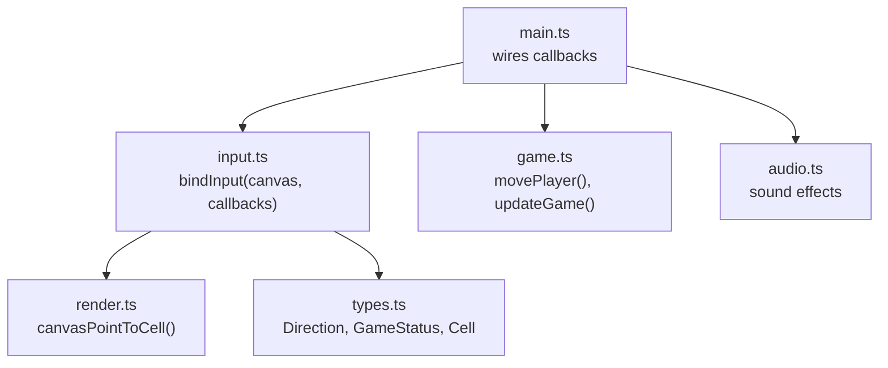
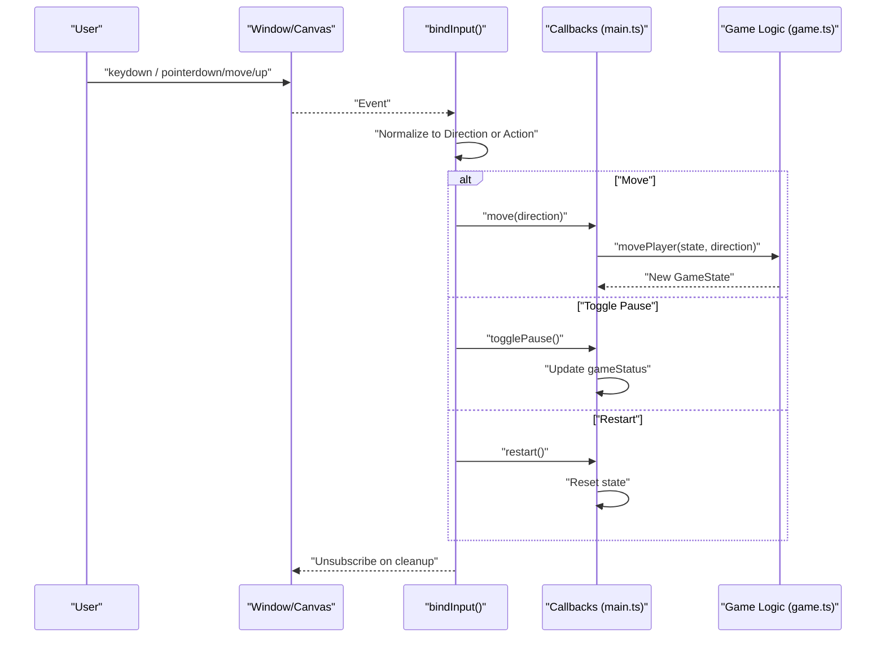
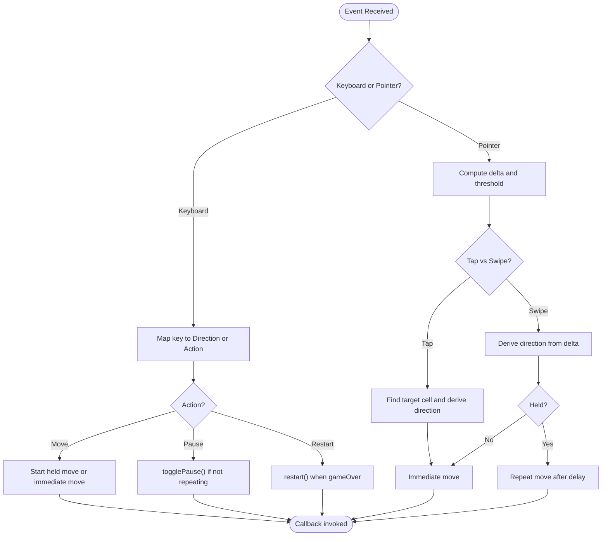
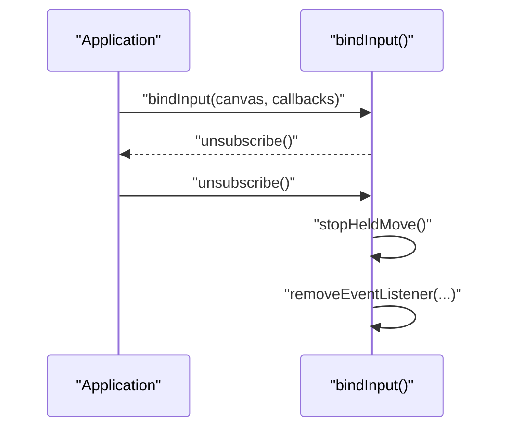
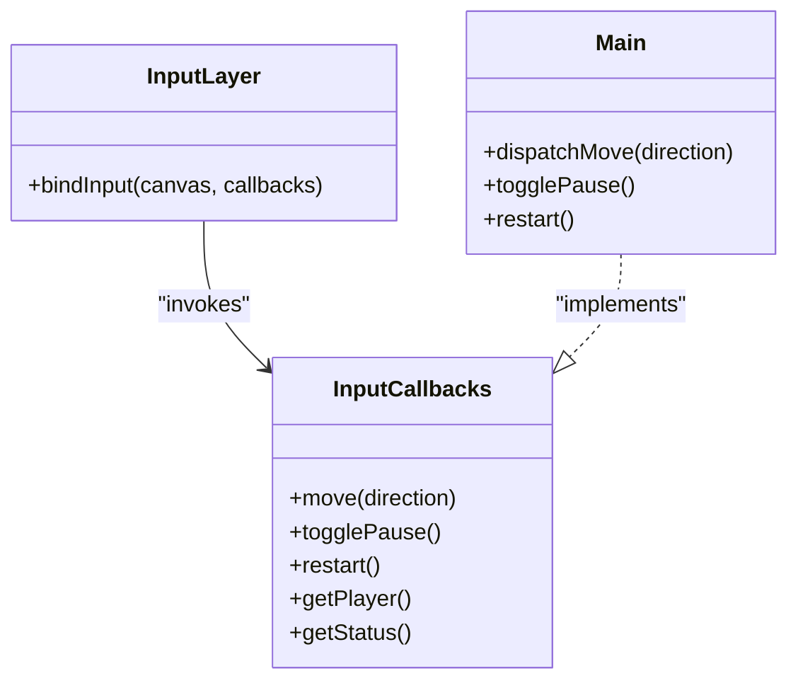
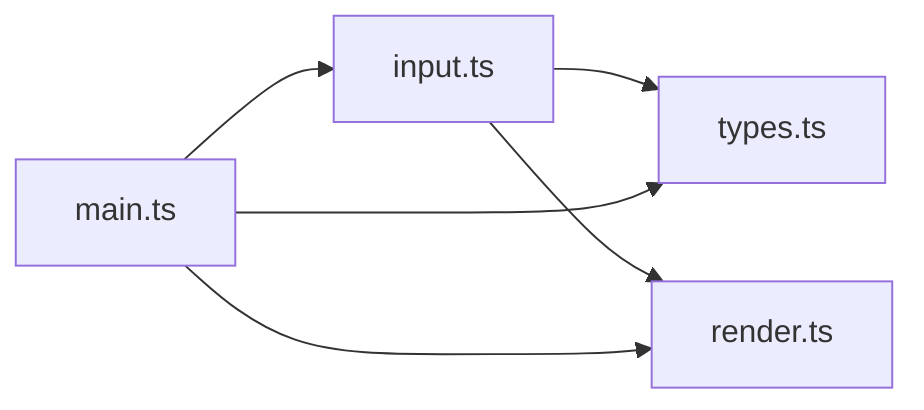

# Input Abstraction Layer

<cite>
**Referenced Files in This Document**
- [input.ts](file://src/input.ts)
- [types.ts](file://src/types.ts)
- [render.ts](file://src/render.ts)
- [main.ts](file://src/main.ts)
</cite>

## Table of Contents
1. [Introduction](#introduction)
2. [Project Structure](#project-structure)
3. [Core Components](#core-components)
4. [Architecture Overview](#architecture-overview)
5. [Detailed Component Analysis](#detailed-component-analysis)
6. [Dependency Analysis](#dependency-analysis)
7. [Performance Considerations](#performance-considerations)
8. [Troubleshooting Guide](#troubleshooting-guide)
9. [Conclusion](#conclusion)
10. [Appendices](#appendices)

## Introduction
This document explains the input abstraction layer that unifies keyboard, pointer, and touch interactions into a single callback-based interface. The design decouples input handling from game logic by exposing a small set of actions: move(), togglePause(), restart(), getPlayer(), and getStatus(). The layer normalizes platform-specific differences (keyboard events, pointer events, and touch gestures) and provides a cleanup mechanism via an unsubscribe function for proper resource management. It also shows how to extend the system with custom controls while preserving the same callback contract.

## Project Structure
The input abstraction is implemented in a dedicated module and integrated at application bootstrap. Key files involved:
- Input abstraction and event binding: src/input.ts
- Shared types used by input and game: src/types.ts
- Rendering utilities used by input for coordinate mapping: src/render.ts
- Application entry point wiring inputs to game state: src/main.ts

**Diagram sources**
- [main.ts:89-95](file://src/main.ts#L89-L95)
- [input.ts:28-214](file://src/input.ts#L28-L214)
- [render.ts:187-203](file://src/render.ts#L187-L203)
- [types.ts:1-54](file://src/types.ts#L1-L54)

**Section sources**
- [input.ts:1-255](file://src/input.ts#L1-L255)
- [types.ts:1-54](file://src/types.ts#L1-L54)
- [render.ts:187-203](file://src/render.ts#L187-L203)
- [main.ts:89-95](file://src/main.ts#L89-L95)

## Core Components
- InputCallbacks interface: Defines the minimal contract between input and game logic.
- bindInput function: Attaches listeners for keyboard and pointer/touch, normalizes them to Direction or control actions, and returns an unsubscribe function.
- Coordinate helpers: Convert client coordinates to canvas grid cells for tap/swipe interpretation.
- State queries: getPlayer() and getStatus() allow input to adapt behavior based on current game state.

Key responsibilities:
- Keyboard: Arrow keys and WASD map to directions; Enter/Space/R/W/Up restart when game over; P toggles pause.
- Pointer/Touch: Tap toward a cell moves; swipe thresholds trigger movement; holding a direction repeats movement after a delay.
- Cleanup: Returns a function that removes all event listeners and clears timers.

**Section sources**
- [input.ts:4-10](file://src/input.ts#L4-L10)
- [input.ts:28-214](file://src/input.ts#L28-L214)
- [input.ts:224-254](file://src/input.ts#L224-L254)
- [main.ts:89-95](file://src/main.ts#L89-L95)

## Architecture Overview
The input layer sits between DOM events and game logic. It translates raw events into high-level actions using the InputCallbacks contract. The game supplies read-only accessors (getPlayer, getStatus) and action handlers (move, togglePause, restart).

**Diagram sources**
- [input.ts:91-121](file://src/input.ts#L91-L121)
- [input.ts:123-196](file://src/input.ts#L123-L196)
- [main.ts:69-95](file://src/main.ts#L69-L95)
- [game.ts:58-81](file://src/game.ts#L58-L81)

## Detailed Component Analysis

### InputCallbacks Interface Design
The InputCallbacks interface defines a small, stable surface area that decouples input from game logic:
- move(direction): Applies a directional move.
- togglePause(): Switches between playing and paused states.
- restart(): Restarts the game.
- getPlayer(): Provides the player’s current cell for gesture calculations.
- getStatus(): Provides the current game status to gate behaviors like repeat movement or restart triggers.

Benefits:
- Loose coupling: Input does not import game modules; it only calls back into provided functions.
- Testability: You can supply mock callbacks to validate input behavior without running the full game.
- Extensibility: New input devices can be added by implementing the same interface.

**Section sources**
- [input.ts:4-10](file://src/input.ts#L4-L10)
- [main.ts:89-95](file://src/main.ts#L89-L95)

### Callback-Based Architecture and Event Normalization
The bindInput function centralizes event handling and normalizes multiple modalities into the same actions:
- Keyboard normalization maps keys to Direction values and recognizes special keys for pause/restart.
- Pointer/touch normalization interprets taps, swipes, and holds, converting screen coordinates to grid cells and deriving directions.
- State gating uses getStatus() to prevent actions during non-playing states and to enable restart on game over.

**Diagram sources**
- [input.ts:91-121](file://src/input.ts#L91-L121)
- [input.ts:123-196](file://src/input.ts#L123-L196)
- [input.ts:233-254](file://src/input.ts#L233-L254)

**Section sources**
- [input.ts:91-121](file://src/input.ts#L91-L121)
- [input.ts:123-196](file://src/input.ts#L123-L196)
- [input.ts:233-254](file://src/input.ts#L233-L254)

### Platform-Specific Handling
- Keyboard:
  - Supports both arrow keys and WASD.
  - Prevents default scrolling for navigation keys.
  - Recognizes pause and restart keys, including case-insensitive matching.
- Pointer/Touch:
  - Uses pointer events to unify mouse and touch.
  - Captures the primary pointer to avoid multi-pointer interference.
  - Converts client coordinates to canvas grid coordinates using render utilities.
  - Interprets taps within the grid as moves toward the tapped cell.
  - Interprets swipes beyond a threshold as directional moves.
  - Supports holding a direction to repeat movement after an initial delay.

Coordinate conversion relies on render constants and helper functions to map pixel positions to grid cells consistently across devices.

**Section sources**
- [input.ts:12-26](file://src/input.ts#L12-L26)
- [input.ts:91-121](file://src/input.ts#L91-L121)
- [input.ts:123-196](file://src/input.ts#L123-L196)
- [input.ts:224-231](file://src/input.ts#L224-L231)
- [render.ts:187-203](file://src/render.ts#L187-L203)

### Cleanup Mechanism and Resource Management
bindInput returns an unsubscribe function that:
- Stops any active held-move repeat timers.
- Removes all window and canvas event listeners.
This ensures no memory leaks or stale handlers remain after components unmount or when reinitializing input.

**Diagram sources**
- [input.ts:205-214](file://src/input.ts#L205-L214)
- [input.ts:38-50](file://src/input.ts#L38-L50)

**Section sources**
- [input.ts:205-214](file://src/input.ts#L205-L214)
- [input.ts:38-50](file://src/input.ts#L38-L50)

### Integration With Game Logic
At startup, main.ts wires the InputCallbacks to the game:
- move(direction) updates the game state via movePlayer and plays sound cues.
- togglePause() flips the game status and updates UI controls.
- restart() resets state and focuses the canvas.
- getPlayer() and getStatus() provide read-only access for input decisions.

**Diagram sources**
- [input.ts:4-10](file://src/input.ts#L4-L10)
- [main.ts:69-95](file://src/main.ts#L69-L95)

**Section sources**
- [main.ts:69-95](file://src/main.ts#L69-L95)
- [input.ts:4-10](file://src/input.ts#L4-L10)

### Extending the System With Custom Controls
Because the input layer depends only on the InputCallbacks interface, you can add new input devices or control schemes by:
- Implementing the same five methods in your own handler object.
- Optionally reading getPlayer() and getStatus() to tailor behavior to context.
- Binding your device’s events inside a wrapper that forwards to these callbacks.

Examples:
- Gamepad: Map buttons to move(), handle start/select for togglePause(), and A/X for restart().
- Voice commands: Parse recognized phrases to call move(), togglePause(), or restart().
- Accessibility switches: Provide discrete actions for move(togglePause/restart) with timing controls.

All extensions maintain the same callback interface, ensuring consistent integration with the rest of the game.

[No sources needed since this section provides general guidance]

## Dependency Analysis
The input layer has clear, minimal dependencies:
- Types from types.ts for Direction, GameStatus, and Cell.
- Coordinate mapping from render.ts for translating pointer/touch positions to grid cells.
- No direct dependency on game logic; it only invokes callbacks supplied by the caller.

**Diagram sources**
- [input.ts:1-2](file://src/input.ts#L1-L2)
- [input.ts:28-214](file://src/input.ts#L28-L214)
- [main.ts:1-10](file://src/main.ts#L1-L10)

**Section sources**
- [input.ts:1-2](file://src/input.ts#L1-L2)
- [input.ts:28-214](file://src/input.ts#L28-L214)
- [main.ts:1-10](file://src/main.ts#L1-L10)

## Performance Considerations
- Held-move repetition uses timeouts and intervals with configurable delays to balance responsiveness and performance.
- Pointer capture prevents unnecessary tracking of non-primary pointers.
- Early exits guard against invalid states (e.g., non-playing), avoiding redundant work.
- Coordinate conversions are lightweight and rely on precomputed render constants.

[No sources needed since this section provides general guidance]

## Troubleshooting Guide
Common issues and resolutions:
- Events not firing after component unmount: Ensure the unsubscribe function returned by bindInput is called to remove listeners and clear timers.
- Movement not responding on mobile: Verify pointer events are supported and that the canvas captures the primary pointer. Check that canvasPointToCell returns valid cells for taps.
- Accidental page scroll on arrow keys: Confirm default behavior is prevented for navigation keys.
- Pause or restart not triggering: Validate getStatus() reflects expected state and that key mappings include the intended keys.

**Section sources**
- [input.ts:205-214](file://src/input.ts#L205-L214)
- [input.ts:123-139](file://src/input.ts#L123-L139)
- [input.ts:91-121](file://src/input.ts#L91-L121)

## Conclusion
The input abstraction layer cleanly separates input handling from game logic through a small, well-defined callback interface. It normalizes keyboard, pointer, and touch interactions, supports hold-and-repeat movement, and provides a robust cleanup mechanism. By adhering to the InputCallbacks contract, developers can easily integrate additional input devices or custom controls without modifying core game logic.

[No sources needed since this section summarizes without analyzing specific files]

## Appendices

### API Reference Summary
- InputCallbacks.move(direction): Apply a directional move.
- InputCallbacks.togglePause(): Toggle between playing and paused.
- InputCallbacks.restart(): Restart the game.
- InputCallbacks.getPlayer(): Return the current player cell.
- InputCallbacks.getStatus(): Return the current game status.
- bindInput(canvas, callbacks): Attach input listeners and return an unsubscribe function.

**Section sources**
- [input.ts:4-10](file://src/input.ts#L4-L10)
- [input.ts:28-214](file://src/input.ts#L28-L214)