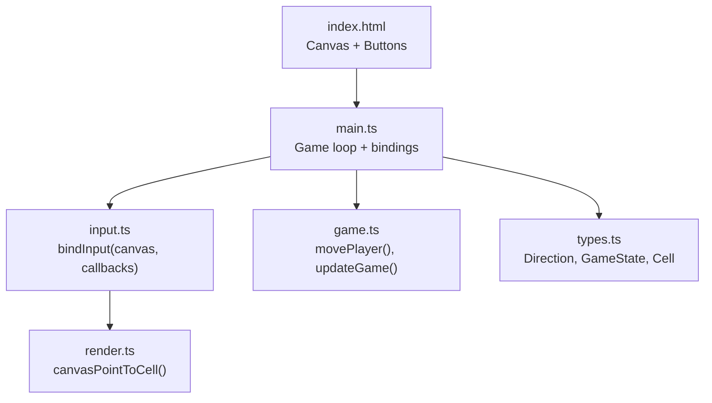
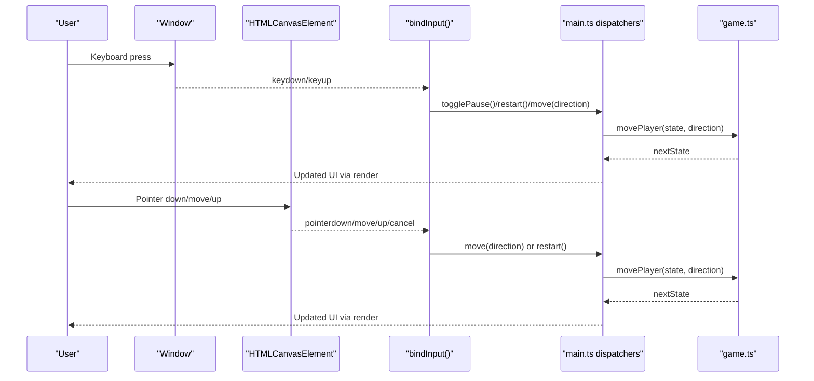
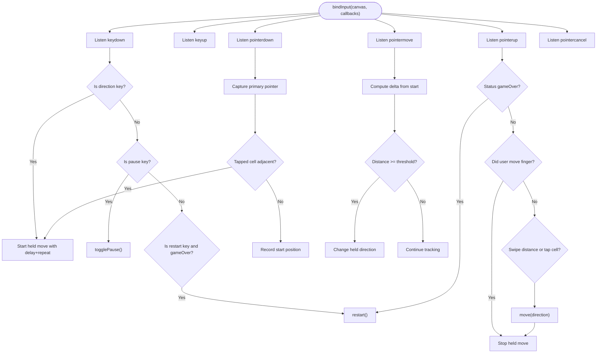
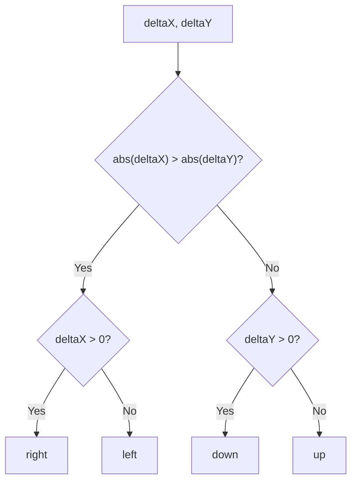
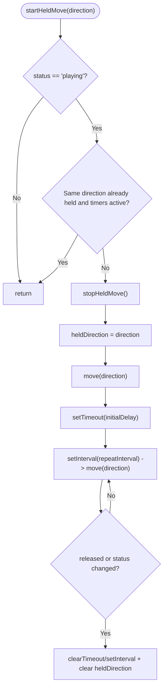
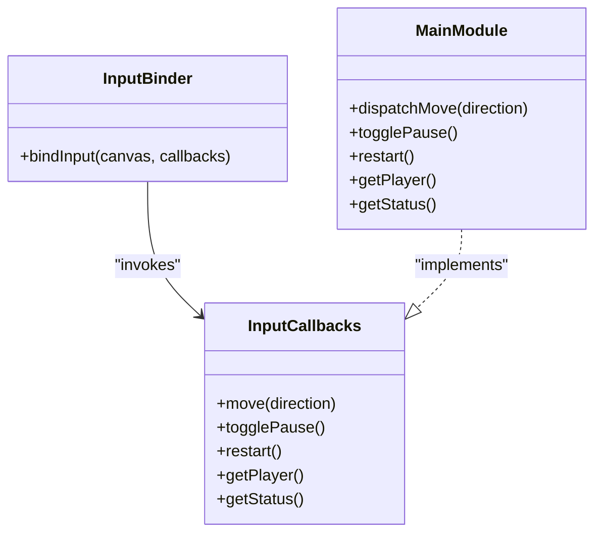
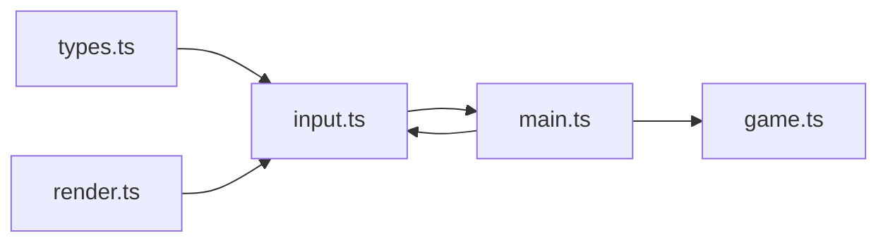

# Input Handling

<cite>
**Referenced Files in This Document**
- [input.ts](file://src/input.ts)
- [game.ts](file://src/game.ts)
- [main.ts](file://src/main.ts)
- [render.ts](file://src/render.ts)
- [types.ts](file://src/types.ts)
- [index.html](file://index.html)
</cite>

## Table of Contents
1. [Introduction](#introduction)
2. [Project Structure](#project-structure)
3. [Core Components](#core-components)
4. [Architecture Overview](#architecture-overview)
5. [Detailed Component Analysis](#detailed-component-analysis)
6. [Dependency Analysis](#dependency-analysis)
7. [Performance Considerations](#performance-considerations)
8. [Troubleshooting Guide](#troubleshooting-guide)
9. [Conclusion](#conclusion)

## Introduction
This document explains the multi-modal input handling system that supports keyboard navigation (WASD and Arrow keys), mouse interactions, and touch gestures. It covers the unified input processing architecture, swipe direction detection, hold-and-repeat behavior for mobile devices, and an event-driven callback system that abstracts platform-specific differences. It also includes guidance on pointer events versus touch events, cross-browser compatibility strategies, mobile optimization techniques, and accessibility considerations.

## Project Structure
The input system is implemented as a thin abstraction layer over browser input APIs. The main entry point wires up the game loop, state, and input callbacks. Rendering utilities provide coordinate conversion between canvas pixels and grid cells. Types define shared interfaces used across modules.

**Diagram sources**
- [index.html:10-18](file://index.html#L10-L18)
- [main.ts:89-95](file://src/main.ts#L89-L95)
- [input.ts:28-214](file://src/input.ts#L28-L214)
- [render.ts:187-203](file://src/render.ts#L187-L203)
- [game.ts:58-81](file://src/game.ts#L58-L81)
- [types.ts:1-54](file://src/types.ts#L1-L54)

**Section sources**
- [index.html:10-18](file://index.html#L10-L18)
- [main.ts:1-160](file://src/main.ts#L1-L160)
- [input.ts:1-255](file://src/input.ts#L1-L255)
- [render.ts:1-721](file://src/render.ts#L1-L721)
- [types.ts:1-54](file://src/types.ts#L1-L54)

## Core Components
- Unified input binding function that registers listeners for keyboard and pointer events and exposes a small callback interface to the game.
- Direction mapping from key codes to canonical directions.
- Hold-and-repeat logic with configurable delays and intervals.
- Swipe detection using pointer deltas and a threshold.
- Tap-to-move by converting pointer coordinates to grid cells.
- Game state-aware control flow (pause, game over).

Key responsibilities:
- Normalize all inputs into a single move action or control actions (pause/restart).
- Provide a clean API for the rest of the game to consume without knowing about input specifics.

**Section sources**
- [input.ts:4-10](file://src/input.ts#L4-L10)
- [input.ts:12-26](file://src/input.ts#L12-L26)
- [input.ts:28-214](file://src/input.ts#L28-L214)

## Architecture Overview
The input system uses an event-driven callback pattern. The game initializes the input binder with a canvas element and a set of callbacks. The binder listens to window-level keyboard events and canvas-level pointer events. It translates raw events into high-level actions and invokes the appropriate callbacks. The game’s main loop updates state and renders frames independently of input details.

**Diagram sources**
- [input.ts:91-121](file://src/input.ts#L91-L121)
- [input.ts:123-196](file://src/input.ts#L123-L196)
- [main.ts:69-95](file://src/main.ts#L69-L95)
- [game.ts:58-81](file://src/game.ts#L58-L81)

## Detailed Component Analysis

### Unified Input Binding and Callback System
The central function binds all input sources and exposes a minimal interface to the game:
- move(direction): advances the player one cell in the given direction.
- togglePause(): toggles paused state when not in game over.
- restart(): resets the game when in game over.
- getPlayer(): returns current player cell for tap-to-move calculations.
- getStatus(): returns current game status to gate behaviors.

Behavior highlights:
- Keyboard:
  - Supports Arrow keys and WASD for movement.
  - Pause key toggles pause; multiple keys can restart on game over.
  - Prevents default scrolling for directional keys and pause key.
- Pointer:
  - Uses pointer events to unify mouse and touch.
  - Captures the primary pointer to avoid conflicts with other pointers.
  - Converts client coordinates to canvas-local coordinates and then to grid cells.
  - Implements tap-to-move and swipe-to-move.
  - Implements hold-and-repeat with initial delay and repeat interval.

**Diagram sources**
- [input.ts:28-214](file://src/input.ts#L28-L214)
- [input.ts:224-231](file://src/input.ts#L224-L231)
- [input.ts:233-254](file://src/input.ts#L233-L254)

**Section sources**
- [input.ts:4-10](file://src/input.ts#L4-L10)
- [input.ts:28-214](file://src/input.ts#L28-L214)

### Keyboard Navigation (WASD + Arrow Keys)
- Direction mapping:
  - ArrowUp/ArrowRight/ArrowDown/ArrowLeft map to canonical directions.
  - W/A/S/D map to the same directions.
- Behavior:
  - On keydown, if a direction key is pressed, it starts a held move with an initial delay before repeating at a fixed interval.
  - On keyup, if the released key matches the currently held direction, the repeat timers are cleared.
  - Pause key toggles pause only on the initial press (ignores auto-repeat).
  - Restart keys trigger restart when the game is over.

Configuration constants:
- HOLD_REPEAT_DELAY_MS: initial delay before repeat begins.
- MOVE_REPEAT_MS: interval between repeated moves while holding.

Accessibility notes:
- Default scrolling is prevented for movement and pause keys to keep focus on the game.
- The canvas is focusable so keyboard users can interact directly.

**Section sources**
- [input.ts:12-26](file://src/input.ts#L12-L26)
- [input.ts:91-121](file://src/input.ts#L91-L121)
- [main.ts:26-28](file://src/main.ts#L26-L28)

### Mouse and Touch Interactions (Pointer Events)
- Unified pointer handling:
  - Only the primary pointer is processed to avoid interference from additional pointers.
  - Pointer capture ensures consistent tracking even if the pointer leaves the canvas.
- Coordinate conversion:
  - Client coordinates are converted to canvas-local coordinates using the canvas bounding rect and logical dimensions.
  - Canvas-local coordinates are mapped to grid cells for tap-to-move.
- Tap-to-move:
  - If the pointer down occurs within the grid and targets an adjacent cell, movement is initiated immediately.
- Swipe-to-move:
  - While moving the pointer, if the distance exceeds a threshold, the held direction changes accordingly.
  - On pointer up, if no significant movement occurred but the swipe distance exceeds the threshold, a single move is issued.
- Hold-and-repeat:
  - When a direction is held, after an initial delay, the system repeatedly issues move commands at a fixed interval until release or cancellation.

Mobile optimization:
- Pointer events replace separate touch/mouse handlers, simplifying code and improving compatibility.
- Using pointer capture reduces missed events during fast swipes.
- Threshold-based swipe detection avoids accidental taps being interpreted as swipes.

Cross-browser strategy:
- Pointer events are widely supported across modern browsers.
- For legacy environments lacking pointer events, a fallback to touch and mouse events would be needed; this implementation assumes pointer events are available.

**Section sources**
- [input.ts:123-196](file://src/input.ts#L123-L196)
- [input.ts:224-231](file://src/input.ts#L224-L231)
- [input.ts:233-254](file://src/input.ts#L233-L254)

### Swipe Direction Detection Algorithm
The algorithm determines the dominant axis of movement based on delta values:
- If horizontal delta magnitude exceeds vertical delta magnitude, the direction is left or right depending on sign.
- Otherwise, the direction is up or down depending on sign.

A minimum distance threshold prevents tiny movements from triggering direction changes.

**Diagram sources**
- [input.ts:233-239](file://src/input.ts#L233-L239)

**Section sources**
- [input.ts:233-239](file://src/input.ts#L233-L239)

### Hold-and-Repeat Functionality
When a direction is held:
- Immediately issue one move.
- After an initial delay, start a timer that repeats moves at a fixed interval.
- Clear both timers on release, change of direction, or when the game is not in playing state.

This provides responsive immediate feedback followed by smooth continuous movement.

**Diagram sources**
- [input.ts:52-81](file://src/input.ts#L52-L81)
- [input.ts:38-50](file://src/input.ts#L38-L50)

**Section sources**
- [input.ts:38-81](file://src/input.ts#L38-L81)

### Event-Driven Callback Abstraction
The input module defines a small callback interface that decouples input from game logic:
- move(direction): invoked for each discrete movement step.
- togglePause(): invoked to switch between playing and paused states.
- restart(): invoked to reset the game.
- getPlayer(): queried to determine target cell for tap-to-move.
- getStatus(): queried to gate behaviors like preventing moves when paused or game over.

The main module implements these callbacks and integrates them with the game loop and rendering.

**Diagram sources**
- [input.ts:4-10](file://src/input.ts#L4-L10)
- [main.ts:69-95](file://src/main.ts#L69-L95)

**Section sources**
- [input.ts:4-10](file://src/input.ts#L4-L10)
- [main.ts:69-95](file://src/main.ts#L69-L95)

### Coordinate Conversion and Grid Mapping
Pointer coordinates are transformed into grid cells:
- Client coordinates are converted to canvas-local coordinates using the canvas bounding rectangle and logical width/height.
- Canvas-local coordinates are mapped to row/column indices based on grid layout constants.

This enables accurate tap-to-move regardless of device pixel ratio or CSS scaling.

**Section sources**
- [input.ts:224-231](file://src/input.ts#L224-L231)
- [render.ts:187-203](file://src/render.ts#L187-L203)

### Integration with Game State and Rendering
- The main module wires input callbacks to game functions:
  - move triggers movePlayer and updates audio and game over transitions.
  - togglePause updates game status and UI controls.
  - restart resets state and focuses the canvas.
- The game loop updates state at a fixed timestep and renders frames.

**Section sources**
- [main.ts:45-105](file://src/main.ts#L45-L105)
- [main.ts:107-144](file://src/main.ts#L107-L144)
- [game.ts:58-81](file://src/game.ts#L58-L81)

## Dependency Analysis
The input system depends on:
- types.ts for shared enums and interfaces.
- render.ts for coordinate conversion utilities.
- main.ts for wiring callbacks and integrating with the game loop.
- game.ts indirectly through callbacks provided by main.ts.

**Diagram sources**
- [input.ts:1-2](file://src/input.ts#L1-L2)
- [main.ts:1-10](file://src/main.ts#L1-L10)
- [game.ts:1-16](file://src/game.ts#L1-L16)
- [types.ts:1-54](file://src/types.ts#L1-L54)

**Section sources**
- [input.ts:1-2](file://src/input.ts#L1-L2)
- [main.ts:1-10](file://src/main.ts#L1-L10)
- [game.ts:1-16](file://src/game.ts#L1-L16)
- [types.ts:1-54](file://src/types.ts#L1-L54)

## Performance Considerations
- Fixed timestep game loop:
  - The game updates at a constant rate independent of frame rate, ensuring deterministic behavior.
- Input throttling:
  - Hold-and-repeat uses timeouts and intervals to limit move frequency, reducing unnecessary state churn.
- Pointer capture:
  - Minimizes missed events during rapid gestures.
- Avoiding redundant work:
  - Early exits when game is not in playing state prevent unnecessary computations.

[No sources needed since this section provides general guidance]

## Troubleshooting Guide
Common issues and resolutions:
- Movement does not respond on mobile:
  - Ensure pointer events are supported and the canvas is interactive.
  - Verify pointer capture is working and the primary pointer is tracked.
- Accidental page scrolling when pressing arrow keys:
  - Confirm default behavior is prevented for movement keys.
- Tap-to-move not working:
  - Check coordinate conversion and ensure the click falls within the grid bounds.
- Hold-and-repeat not firing:
  - Verify timers are not cleared prematurely due to status changes or direction switches.
- Pause button not updating accessibility state:
  - Ensure aria-pressed attribute is synchronized with game status.

**Section sources**
- [input.ts:91-121](file://src/input.ts#L91-L121)
- [input.ts:123-196](file://src/input.ts#L123-L196)
- [main.ts:146-151](file://src/main.ts#L146-L151)

## Conclusion
The input handling system provides a robust, cross-platform solution for keyboard, mouse, and touch interactions. By unifying pointer events, implementing swipe detection, and offering hold-and-repeat functionality, it delivers a responsive experience across devices. The callback abstraction cleanly separates input concerns from game logic, facilitating maintainability and extensibility. Accessibility features such as focus management and ARIA attributes enhance usability for diverse users.

[No sources needed since this section summarizes without analyzing specific files]