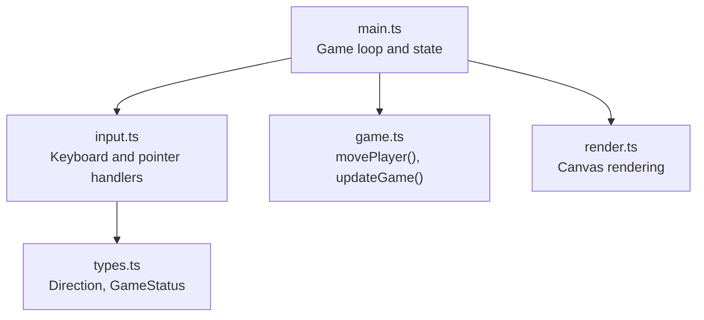
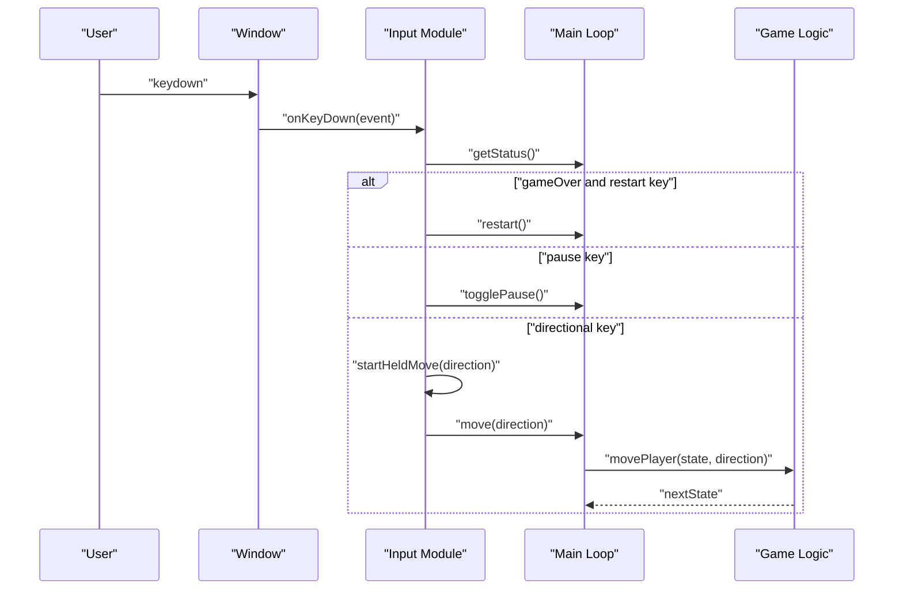
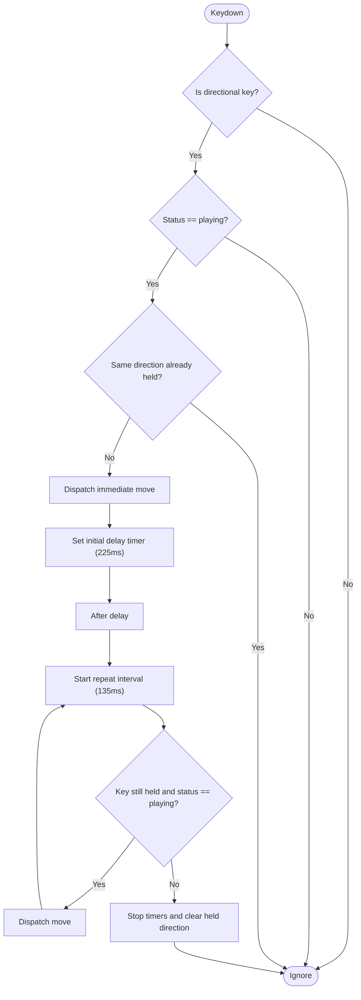
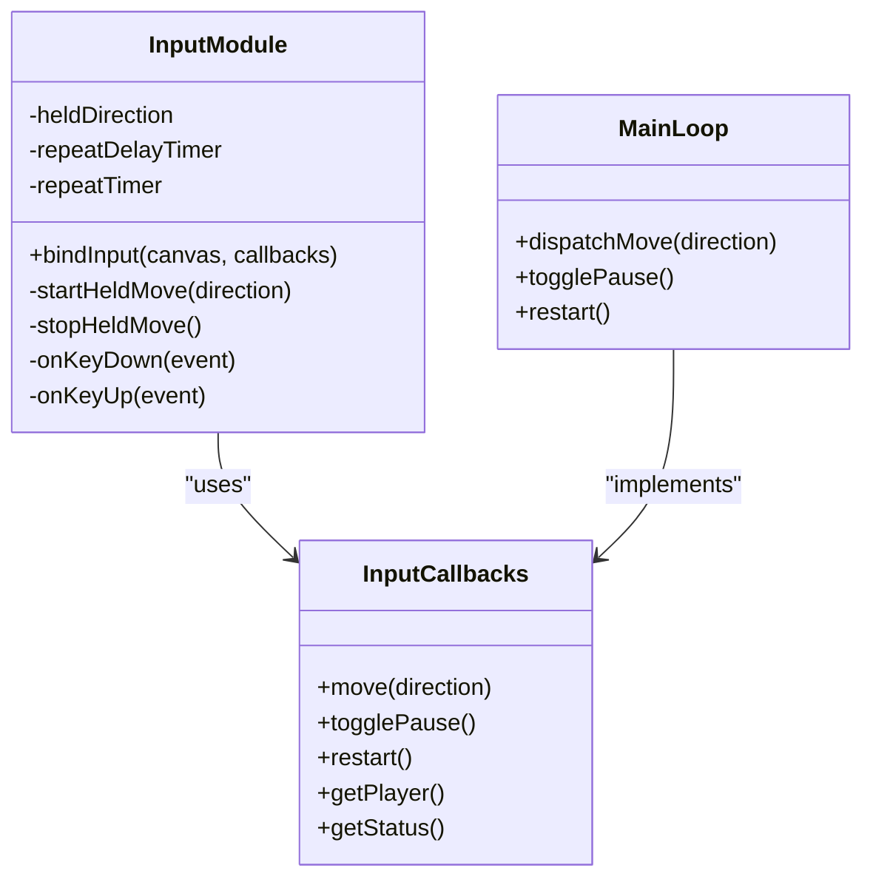
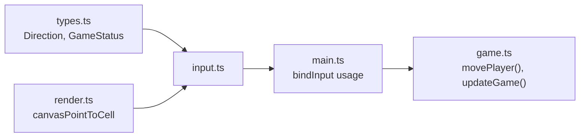

# Keyboard Input

<cite>
**Referenced Files in This Document**
- [input.ts](file://src/input.ts)
- [game.ts](file://src/game.ts)
- [main.ts](file://src/main.ts)
- [types.ts](file://src/types.ts)
</cite>

## Table of Contents
1. [Introduction](#introduction)
2. [Project Structure](#project-structure)
3. [Core Components](#core-components)
4. [Architecture Overview](#architecture-overview)
5. [Detailed Component Analysis](#detailed-component-analysis)
6. [Dependency Analysis](#dependency-analysis)
7. [Performance Considerations](#performance-considerations)
8. [Troubleshooting Guide](#troubleshooting-guide)
9. [Conclusion](#conclusion)
10. [Appendices](#appendices)

## Introduction
This document explains the keyboard input handling system for directional movement, pause, and restart. It covers key mapping (WASD and Arrow keys), case-insensitive detection, hold-and-repeat behavior with precise timing, event prevention to avoid browser defaults, and integration with game state so that input is processed only when appropriate. It also provides guidance for customizing bindings and accessibility considerations across different keyboard layouts.

## Project Structure
The input subsystem is implemented in a dedicated module and integrates with the main game loop and state management:
- Input binding and event handling are encapsulated in the input module.
- The main entry wires input callbacks into the game state and UI controls.
- Game logic enforces state-based processing of moves and transitions.

**Diagram sources**
- [main.ts:89-95](file://src/main.ts#L89-L95)
- [input.ts:28-214](file://src/input.ts#L28-L214)
- [types.ts:4-6](file://src/types.ts#L4-L6)
- [game.ts:58-81](file://src/game.ts#L58-L81)

**Section sources**
- [main.ts:1-160](file://src/main.ts#L1-L160)
- [input.ts:1-255](file://src/input.ts#L1-L255)
- [types.ts:1-54](file://src/types.ts#L1-L54)
- [game.ts:1-426](file://src/game.ts#L1-L426)

## Core Components
- Key mapping configuration supports both WASD and Arrow keys for directional movement.
- Case-insensitive detection ensures consistent behavior regardless of Caps Lock or Shift.
- Restart and pause functionality use specific key sets.
- Hold-and-repeat mechanism provides continuous movement with an initial delay and repeat interval.
- Event prevention avoids default browser behaviors such as scrolling.
- State-aware processing prevents input actions during paused or game over states.

Key constants and mappings:
- Directional keys: ArrowUp/ArrowRight/ArrowDown/ArrowLeft and w/d/s/a.
- Restart keys: Enter, Space, r, w, ArrowUp.
- Pause key: p.
- Timing: initial hold delay 225ms; repeat interval 135ms.

Behavior highlights:
- On keydown, if the game is in game over and a restart key is pressed, restart is triggered.
- If a pause key is pressed, pause toggles and held movement stops.
- For directional keys, the first move occurs immediately, then after the initial delay, repeats occur at the repeat interval until keyup.
- All handled events call preventDefault to avoid page scrolling or other defaults.

**Section sources**
- [input.ts:12-26](file://src/input.ts#L12-L26)
- [input.ts:91-121](file://src/input.ts#L91-L121)
- [input.ts:52-81](file://src/input.ts#L52-L81)
- [input.ts:216-222](file://src/input.ts#L216-L222)

## Architecture Overview
The input system uses a callback-driven design. The main module binds input handlers and forwards them to the game state via callbacks. The input module inspects the current game status before acting on input.

**Diagram sources**
- [input.ts:91-121](file://src/input.ts#L91-L121)
- [input.ts:52-81](file://src/input.ts#L52-L81)
- [main.ts:69-87](file://src/main.ts#L69-L87)
- [game.ts:58-81](file://src/game.ts#L58-L81)

## Detailed Component Analysis

### Key Mapping Configuration
- Directional mapping includes Arrow keys and lowercase letters w, d, s, a.
- Case-insensitive lookup normalizes uppercase letters by lowercasing before lookup.
- This allows consistent behavior even if Caps Lock is active or Shift is held.

Implementation references:
- Direction map includes ArrowUp/Right/Down/Left and w/d/s/a.
- Lookup uses event.key and falls back to its lowercase variant.

**Section sources**
- [input.ts:12-21](file://src/input.ts#L12-L21)
- [input.ts:107-112](file://src/input.ts#L107-L112)

### Restart and Pause Functionality
- Restart keys: Enter, Space, r, w, ArrowUp.
- Pause key: p.
- When a restart key is pressed while in game over, the game restarts.
- When a pause key is pressed, pause toggles and any held movement is stopped.
- Both handlers call preventDefault to avoid unintended browser actions.

Notes:
- The pause handler ignores repeated key events to avoid rapid toggling.
- Restart is only allowed from game over; otherwise, it is ignored by the input layer.

**Section sources**
- [input.ts:22-23](file://src/input.ts#L22-L23)
- [input.ts:91-105](file://src/input.ts#L91-L105)
- [input.ts:216-222](file://src/input.ts#L216-L222)

### Hold-and-Repeat Mechanism
- Immediate action: pressing a directional key triggers one move immediately.
- Initial delay: after 225ms, repeating begins.
- Repeat interval: every 135ms, another move is dispatched while the key remains held.
- Changing direction while holding updates the held direction without restarting timers unnecessarily.
- Releasing the key stops all timers and clears the held direction.

Edge cases:
- If the game status changes to non-playing while holding, timers stop and no further moves are issued.
- If the same direction is already being held, redundant starts are ignored.

**Diagram sources**
- [input.ts:52-81](file://src/input.ts#L52-L81)
- [input.ts:83-89](file://src/input.ts#L83-L89)
- [input.ts:38-50](file://src/input.ts#L38-L50)

**Section sources**
- [input.ts:24-25](file://src/input.ts#L24-L25)
- [input.ts:52-81](file://src/input.ts#L52-L81)
- [input.ts:83-89](file://src/input.ts#L83-L89)
- [input.ts:38-50](file://src/input.ts#L38-L50)

### Event Prevention Strategies
- All handled keyboard events call preventDefault to avoid browser defaults like scrolling or focus changes.
- Pointer events are used for touch/mouse interactions and do not conflict with keyboard behavior.

Practical effects:
- Prevents accidental page scrolling when using arrow keys.
- Keeps focus on the canvas for consistent input capture.

**Section sources**
- [input.ts:91-112](file://src/input.ts#L91-L112)
- [main.ts:28](file://src/main.ts#L28)

### Game State Integration
- Input checks the current game status before acting:
  - Movement is only processed when status is playing.
  - Restart is only triggered when status is gameOver.
  - Pause toggles unless the game is already in game over.
- The main module exposes getStatus and getPlayer to the input module for these decisions.

**Diagram sources**
- [input.ts:4-10](file://src/input.ts#L4-L10)
- [input.ts:28-214](file://src/input.ts#L28-L214)
- [main.ts:69-95](file://src/main.ts#L69-L95)

**Section sources**
- [input.ts:52-55](file://src/input.ts#L52-L55)
- [input.ts:91-105](file://src/input.ts#L91-L105)
- [main.ts:69-95](file://src/main.ts#L69-L95)

### Concrete Examples of Custom Key Binding Configuration
To customize key bindings, adjust the following areas:
- Add new keys to the directional map to support additional keys (e.g., numpad arrows).
- Extend the restart key set to include more keys (e.g., Escape).
- Modify the pause key set to allow alternative pause keys (e.g., F1).
- Adjust timing constants for initial delay and repeat interval to suit gameplay preferences.

Where to change:
- Directional mapping and restart/pause sets are defined near the top of the input module.
- Timing constants are defined alongside the key sets.

Example scenarios:
- Adding Numpad support: add entries for Numpad0–Numpad9 mapped to directions if desired.
- Enabling Escape to restart: add "Escape" to the restart key set.
- Slower repeat feel: increase the repeat interval constant.

**Section sources**
- [input.ts:12-26](file://src/input.ts#L12-L26)

### Accessibility Considerations for Different Keyboard Layouts
- Case-insensitive detection ensures that Shift or Caps Lock does not break movement.
- Using both WASD and Arrow keys accommodates users who prefer either layout.
- Avoid relying on modifier-only combinations that may be intercepted by OS or browser shortcuts.
- Provide visual feedback for pause and restart availability through UI elements.
- Ensure the canvas is focusable and accessible via keyboard navigation.

Recommendations:
- Keep primary movement keys simple and well-known.
- Offer optional remapping through settings if possible.
- Test with international layouts where key positions differ.

[No sources needed since this section provides general guidance]

## Dependency Analysis
The input module depends on types for Direction and GameStatus, and on render utilities for coordinate conversion. The main module wires input callbacks into the game loop and state.

**Diagram sources**
- [input.ts:1-2](file://src/input.ts#L1-L2)
- [main.ts:6-9](file://src/main.ts#L6-L9)
- [game.ts:58-81](file://src/game.ts#L58-L81)

**Section sources**
- [input.ts:1-2](file://src/input.ts#L1-L2)
- [main.ts:6-9](file://src/main.ts#L6-L9)

## Performance Considerations
- Timers are cleared promptly on keyup or state changes to avoid unnecessary work.
- Immediate move plus delayed repeat balances responsiveness with performance.
- Avoiding repeated start calls for the same direction reduces overhead.
- Keeping input handlers lightweight ensures smooth frame pacing.

[No sources needed since this section provides general guidance]

## Troubleshooting Guide
Common issues and resolutions:
- Keys do nothing while paused: ensure the game status is playing; input is intentionally blocked in paused or game over states except for restart/pause.
- Page scrolls when using arrow keys: confirm that preventDefault is called for handled keys.
- Repeat feels too fast or slow: adjust the initial delay and repeat interval constants.
- Restart not working: verify the game is in game over state and the correct restart key is pressed.

**Section sources**
- [input.ts:91-105](file://src/input.ts#L91-L105)
- [input.ts:52-55](file://src/input.ts#L52-L55)
- [input.ts:24-25](file://src/input.ts#L24-L25)

## Conclusion
The input system provides robust, state-aware keyboard handling with flexible key mapping, case-insensitive detection, and a responsive hold-and-repeat mechanism. It integrates cleanly with the game loop and respects user experience by preventing default browser behaviors. Customization points allow tailoring to player preferences and accessibility needs.

[No sources needed since this section summarizes without analyzing specific files]

## Appendices

### Key Bindings Summary
- Directional movement: Arrow keys and W/A/S/D (case-insensitive).
- Restart: Enter, Space, R, W, ArrowUp (only in game over).
- Pause: P (toggles unless in game over).

Timing:
- Initial hold delay: 225ms.
- Repeat interval: 135ms.

**Section sources**
- [input.ts:12-26](file://src/input.ts#L12-L26)
- [input.ts:91-105](file://src/input.ts#L91-L105)
- [input.ts:24-25](file://src/input.ts#L24-L25)