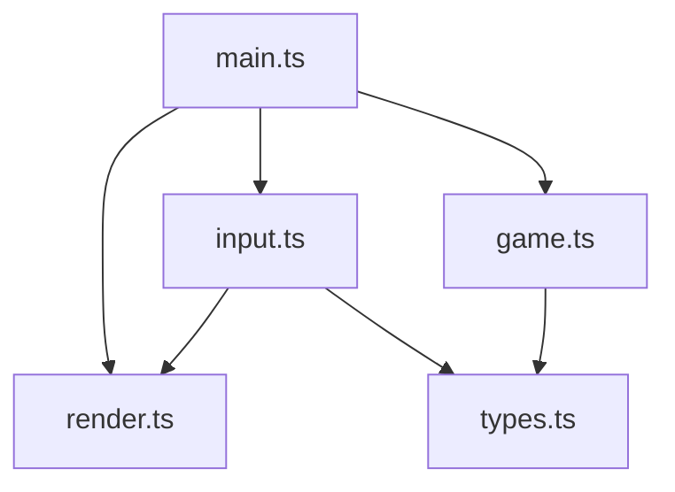
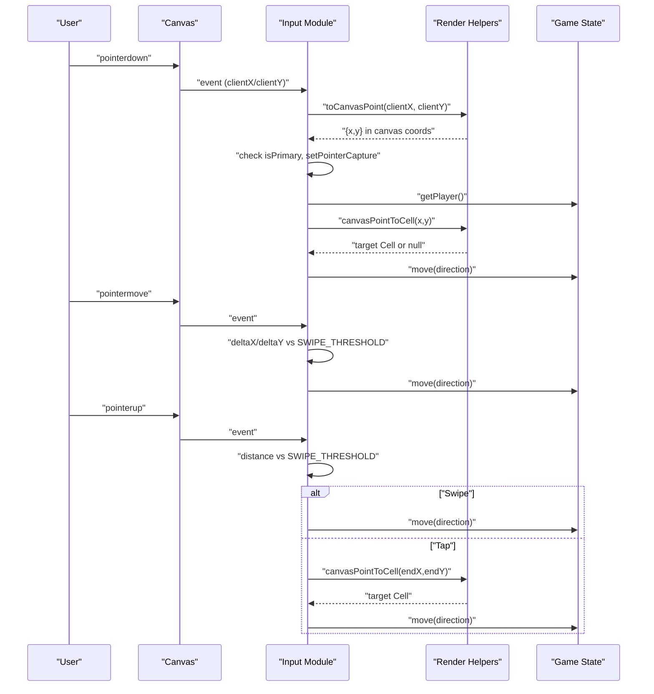
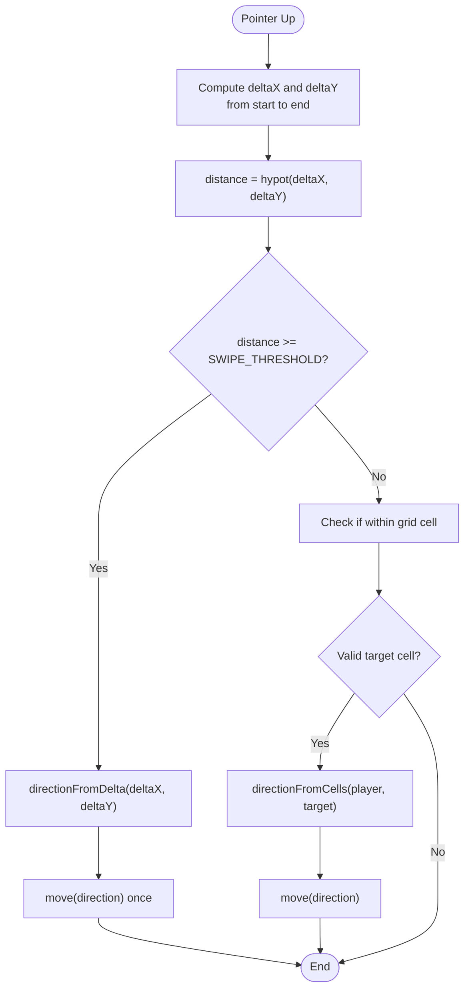
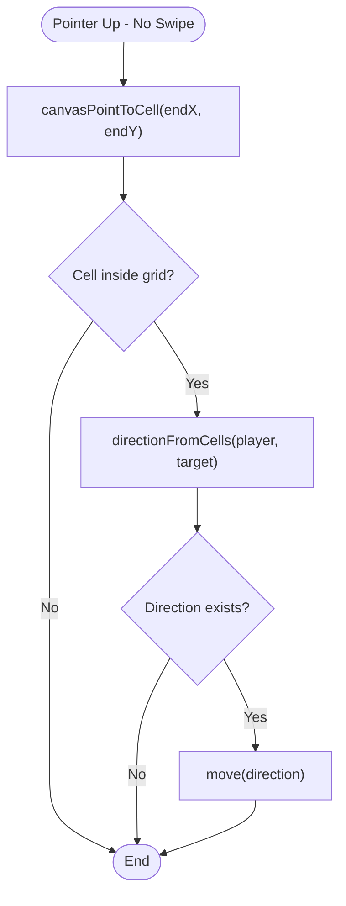
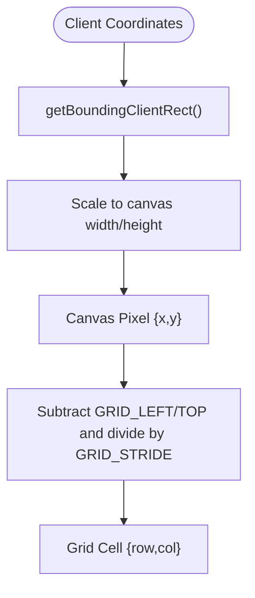
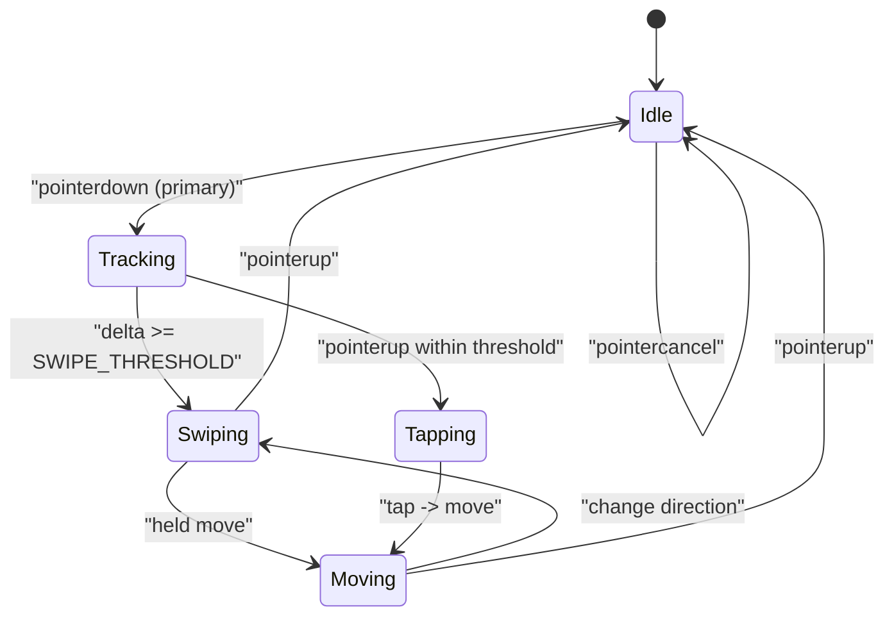
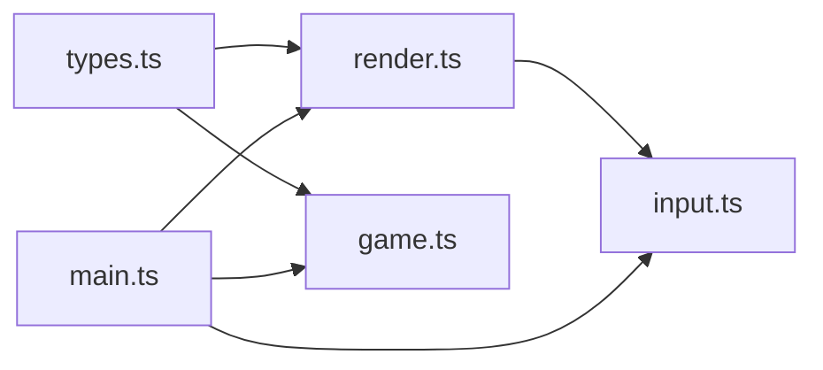

# Touch & Gesture Recognition

<cite>
**Referenced Files in This Document**
- [input.ts](file://src/input.ts)
- [render.ts](file://src/render.ts)
- [game.ts](file://src/game.ts)
- [main.ts](file://src/main.ts)
- [types.ts](file://src/types.ts)
</cite>

## Table of Contents
1. [Introduction](#introduction)
2. [Project Structure](#project-structure)
3. [Core Components](#core-components)
4. [Architecture Overview](#architecture-overview)
5. [Detailed Component Analysis](#detailed-component-analysis)
6. [Dependency Analysis](#dependency-analysis)
7. [Performance Considerations](#performance-considerations)
8. [Troubleshooting Guide](#troubleshooting-guide)
9. [Conclusion](#conclusion)

## Introduction
This document explains the touch input and gesture recognition system for a canvas-based game. It covers unified pointer event handling, primary pointer tracking, multi-pointer considerations, swipe detection using a fixed threshold, tap-to-move logic, coordinate transformation from client to canvas space, mobile optimization strategies, touch event lifecycle management, and cross-browser compatibility notes.

## Project Structure
The input subsystem is implemented in a dedicated module that binds keyboard and pointer events to game actions. The rendering module provides constants and helpers for coordinate transformations between canvas pixel coordinates and grid cells. The main entry wires everything together and drives the game loop.

**Diagram sources**
- [main.ts:1-160](file://src/main.ts#L1-L160)
- [input.ts:1-255](file://src/input.ts#L1-L255)
- [render.ts:1-721](file://src/render.ts#L1-L721)
- [game.ts:1-426](file://src/game.ts#L1-L426)
- [types.ts:1-54](file://src/types.ts#L1-L54)

**Section sources**
- [main.ts:1-160](file://src/main.ts#L1-L160)
- [input.ts:1-255](file://src/input.ts#L1-L255)
- [render.ts:1-721](file://src/render.ts#L1-L721)
- [game.ts:1-426](file://src/game.ts#L1-L426)
- [types.ts:1-54](file://src/types.ts#L1-L54)

## Core Components
- Unified Pointer Input Manager: Handles pointerdown/move/up/cancel on the canvas, tracks the primary pointer, computes deltas, detects swipes, and interprets taps as moves toward a target cell.
- Coordinate Transformation: Converts browser client coordinates to canvas pixel coordinates using getBoundingClientRect(), then maps pixels to grid cells.
- Swipe Detection: Uses a constant threshold to determine direction from deltaX and deltaY.
- Tap-to-Move: If no significant movement occurs, calculates direction from player position to tapped cell.
- Game Integration: Delegates move commands to the game state via callbacks; respects game status (playing/paused/gameOver).

Key implementation references:
- Pointer binding and lifecycle: [bindInput:28-214](file://src/input.ts#L28-L214)
- Primary pointer check and capture: [onPointerDown:123-139](file://src/input.ts#L123-L139), [setPointerCapture](file://src/input.ts#L130)
- Move delta and swipe threshold: [SWIPE_THRESHOLD](file://src/input.ts#L26), [onPointerMove:141-154](file://src/input.ts#L141-L154), [onPointerUp:156-192](file://src/input.ts#L156-L192)
- Direction from delta: [directionFromDelta:233-239](file://src/input.ts#L233-L239)
- Tap-to-move direction: [directionFromCells:241-254](file://src/input.ts#L241-L254)
- Client-to-canvas transform: [toCanvasPoint:224-231](file://src/input.ts#L224-L231)
- Canvas-to-cell mapping: [canvasPointToCell:187-203](file://src/render.ts#L187-L203)
- Game action dispatch: [dispatchMove:69-87](file://src/main.ts#L69-L87), [movePlayer:58-81](file://src/game.ts#L58-L81)

**Section sources**
- [input.ts:26-26](file://src/input.ts#L26-L26)
- [input.ts:123-192](file://src/input.ts#L123-L192)
- [input.ts:224-239](file://src/input.ts#L224-L239)
- [input.ts:241-254](file://src/input.ts#L241-L254)
- [render.ts:187-203](file://src/render.ts#L187-L203)
- [main.ts:69-87](file://src/main.ts#L69-L87)
- [game.ts:58-81](file://src/game.ts#L58-L81)

## Architecture Overview
The input layer listens to pointer events on the canvas, transforms coordinates into canvas space, determines gestures (swipe or tap), and invokes game actions through callbacks. The game updates state accordingly.

**Diagram sources**
- [input.ts:123-192](file://src/input.ts#L123-L192)
- [input.ts:224-231](file://src/input.ts#L224-L231)
- [render.ts:187-203](file://src/render.ts#L187-L203)
- [main.ts:69-87](file://src/main.ts#L69-L87)
- [game.ts:58-81](file://src/game.ts#L58-L81)

## Detailed Component Analysis

### Pointer Events Handling and Primary Pointer Tracking
- Event binding: Keyboard and pointer events are attached to window and canvas respectively. Cleanup returns an unbind function to remove listeners.
- Primary pointer: Only the primary pointer (isPrimary) is processed for movement and gestures. This ensures consistent behavior across mouse and touch inputs.
- Pointer capture: On pointerdown, the canvas captures the active pointer by id, ensuring move/up events are delivered even if the pointer leaves the canvas bounds.
- Multi-pointer support: Non-primary pointers are ignored for movement. This avoids accidental multi-touch interference while still allowing other UI elements to respond to additional pointers.

References:
- [bindInput:28-214](file://src/input.ts#L28-L214)
- [onPointerDown:123-139](file://src/input.ts#L123-L139)
- [onPointerMove:141-154](file://src/input.ts#L141-L154)
- [onPointerUp:156-192](file://src/input.ts#L156-L192)
- [onPointerCancel:193-196](file://src/input.ts#L193-L196)

**Section sources**
- [input.ts:28-214](file://src/input.ts#L28-L214)
- [input.ts:123-196](file://src/input.ts#L123-L196)

### Swipe Detection Algorithm (SWIPE_THRESHOLD = 20)
- Threshold constant: SWIPE_THRESHOLD is defined once and used consistently for both move and up phases.
- Movement phase: During pointermove, deltaX and deltaY are computed relative to the start point. When the Euclidean distance exceeds the threshold, the held direction is updated based on the dominant axis.
- Release phase: During pointerup, if the total distance from start to end exceeds the threshold, a single directional move is issued without requiring a held repeat.
- Direction determination: The dominant axis decides horizontal vs vertical movement; sign determines positive/negative direction.

References:
- [SWIPE_THRESHOLD](file://src/input.ts#L26)
- [onPointerMove:141-154](file://src/input.ts#L141-L154)
- [onPointerUp:156-192](file://src/input.ts#L156-L192)
- [directionFromDelta:233-239](file://src/input.ts#L233-L239)

**Diagram sources**
- [input.ts:156-192](file://src/input.ts#L156-L192)
- [input.ts:233-239](file://src/input.ts#L233-L239)
- [input.ts:241-254](file://src/input.ts#L241-L254)

**Section sources**
- [input.ts:26-26](file://src/input.ts#L26-L26)
- [input.ts:141-192](file://src/input.ts#L141-L192)
- [input.ts:233-254](file://src/input.ts#L233-L254)

### Tap-to-Move Functionality
- If no significant movement occurred during the interaction, the system attempts to interpret the pointer location as a tap.
- The canvas pixel coordinates are mapped to a grid cell using canvasPointToCell.
- If the target cell is valid and different from the player’s current cell, the direction is calculated from the player’s position to the target cell.
- The resulting direction triggers a single move command.

References:
- [onPointerUp tap branch:183-191](file://src/input.ts#L183-L191)
- [canvasPointToCell:187-203](file://src/render.ts#L187-L203)
- [directionFromCells:241-254](file://src/input.ts#L241-L254)

**Diagram sources**
- [input.ts:183-191](file://src/input.ts#L183-L191)
- [render.ts:187-203](file://src/render.ts#L187-L203)
- [input.ts:241-254](file://src/input.ts#L241-L254)

**Section sources**
- [input.ts:183-191](file://src/input.ts#L183-L191)
- [render.ts:187-203](file://src/render.ts#L187-L203)
- [input.ts:241-254](file://src/input.ts#L241-L254)

### Coordinate Transformation System
- Client to canvas: toCanvasPoint uses getBoundingClientRect() to compute the canvas rectangle and scales client coordinates into canvas pixel space.
- Canvas to cell: canvasPointToCell subtracts grid offsets, checks bounds, and divides by stride to obtain row/col indices.

References:
- [toCanvasPoint:224-231](file://src/input.ts#L224-L231)
- [canvasPointToCell:187-203](file://src/render.ts#L187-L203)

**Diagram sources**
- [input.ts:224-231](file://src/input.ts#L224-L231)
- [render.ts:187-203](file://src/render.ts#L187-L203)

**Section sources**
- [input.ts:224-231](file://src/input.ts#L224-L231)
- [render.ts:187-203](file://src/render.ts#L187-L203)

### Mobile Optimization Strategies
- Pointer capture: Ensures continuous tracking even when the finger slides off the canvas, improving reliability on small screens.
- Single primary pointer: Prevents accidental multi-touch interference with gameplay.
- Threshold tuning: SWIPE_THRESHOLD balances responsiveness and false positives on touch devices.
- Focus management: The canvas is focusable and receives focus after interactions to ensure keyboard controls remain available.

References:
- [setPointerCapture usage](file://src/input.ts#L130)
- [isPrimary gating:124-126](file://src/input.ts#L124-L126)
- [SWIPE_THRESHOLD](file://src/input.ts#L26)
- [focus management:51-52](file://src/main.ts#L51-L52)

**Section sources**
- [input.ts:124-130](file://src/input.ts#L124-L130)
- [input.ts:26-26](file://src/input.ts#L26-L26)
- [main.ts:51-52](file://src/main.ts#L51-L52)

### Touch Event Lifecycle Management
- Down: Capture pointer, record start coordinates, optionally initiate held movement if tapping a valid adjacent cell.
- Move: Track deltas; if exceeding threshold, switch to held movement along the dominant axis.
- Up: Decide between swipe or tap; execute appropriate move.
- Cancel: Clean up state and timers to avoid leaks.

References:
- [onPointerDown:123-139](file://src/input.ts#L123-L139)
- [onPointerMove:141-154](file://src/input.ts#L141-L154)
- [onPointerUp:156-192](file://src/input.ts#L156-L192)
- [onPointerCancel:193-196](file://src/input.ts#L193-L196)

**Diagram sources**
- [input.ts:123-196](file://src/input.ts#L123-L196)

**Section sources**
- [input.ts:123-196](file://src/input.ts#L123-L196)

### Cross-Browser Compatibility Considerations
- Pointer Events API: Provides a unified interface for mouse, pen, and touch. The code relies on standard properties like isPrimary, pointerId, and setPointerCapture.
- Fallbacks: For environments lacking Image or Canvas, the render module guards against undefined globals. While not directly part of input, this ensures overall stability.
- Best practices: Always check isPrimary before processing pointer events; use setPointerCapture to maintain continuity; handle pointercancel to reset state.

References:
- [isPrimary checks:124-126](file://src/input.ts#L124-L126)
- [setPointerCapture](file://src/input.ts#L130)
- [pointercancel handler:193-196](file://src/input.ts#L193-L196)
- [Image guard in render](file://src/render.ts:133-L139)

**Section sources**
- [input.ts:124-196](file://src/input.ts#L124-L196)
- [render.ts:133-139](file://src/render.ts#L133-L139)

## Dependency Analysis
The input module depends on rendering utilities for coordinate conversions and on types for shared interfaces. The main module orchestrates input bindings and game updates.

**Diagram sources**
- [types.ts:1-54](file://src/types.ts#L1-L54)
- [render.ts:1-721](file://src/render.ts#L1-L721)
- [game.ts:1-426](file://src/game.ts#L1-L426)
- [input.ts:1-255](file://src/input.ts#L1-L255)
- [main.ts:1-160](file://src/main.ts#L1-L160)

**Section sources**
- [types.ts:1-54](file://src/types.ts#L1-L54)
- [render.ts:1-721](file://src/render.ts#L1-L721)
- [game.ts:1-426](file://src/game.ts#L1-L426)
- [input.ts:1-255](file://src/input.ts#L1-L255)
- [main.ts:1-160](file://src/main.ts#L1-L160)

## Performance Considerations
- Minimal allocations: Input handlers compute lightweight objects and reuse state variables to reduce GC pressure.
- Fixed thresholds: Using a constant threshold avoids expensive recalculations.
- Efficient geometry: Hypotenuse calculation is used only when necessary (move and up phases).
- Stable timing: Held movement uses timeouts and intervals with clear cleanup to prevent drift and memory leaks.

[No sources needed since this section provides general guidance]

## Troubleshooting Guide
- Pointer not captured: Ensure pointerdown fires on the canvas and setPointerCapture is called with the correct pointerId.
- Incorrect direction: Verify toCanvasPoint scaling matches CANVAS_WIDTH/CANVAS_HEIGHT and that GRID_LEFT/TOP/GRID_STRIDE align with visual layout.
- Tap misinterpreted as swipe: Adjust SWIPE_THRESHOLD if too sensitive; confirm distance calculation uses hypot of deltaX/deltaY.
- Multi-touch interference: Confirm only isPrimary pointers are handled for movement.
- State not resetting: Ensure pointercancel clears pointerState and stops held movement timers.

**Section sources**
- [input.ts:123-196](file://src/input.ts#L123-L196)
- [input.ts:224-231](file://src/input.ts#L224-L231)
- [input.ts:26-26](file://src/input.ts#L26-L26)

## Conclusion
The input system provides robust, cross-platform touch and mouse support through the Pointer Events API. It combines precise coordinate transformations, a simple yet effective swipe detection algorithm, and intuitive tap-to-move behavior. With careful attention to pointer lifecycle and thresholds, it delivers responsive gameplay on both desktop and mobile devices.