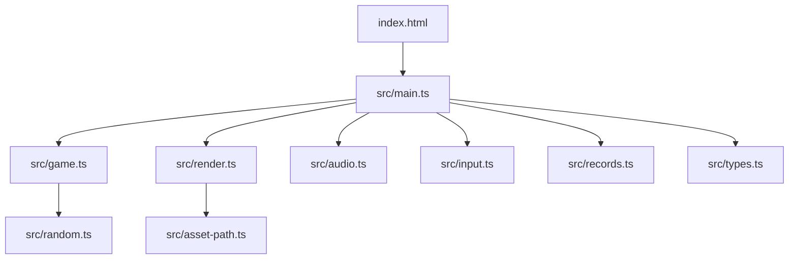
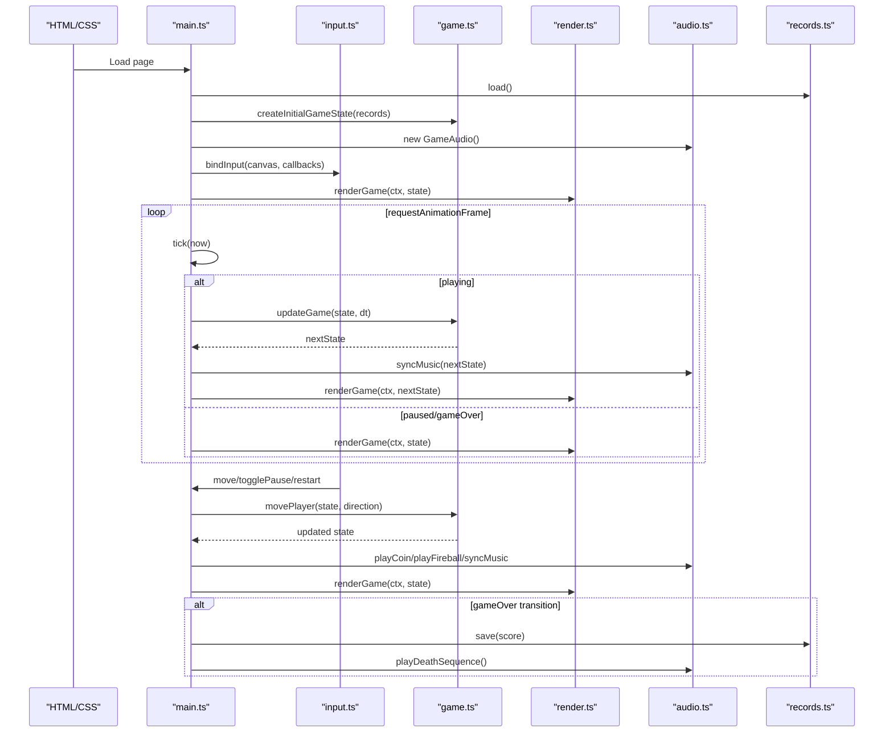
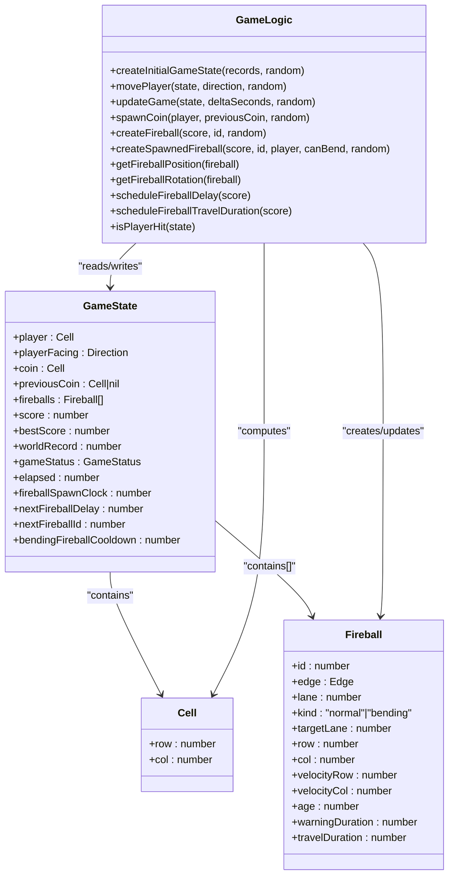
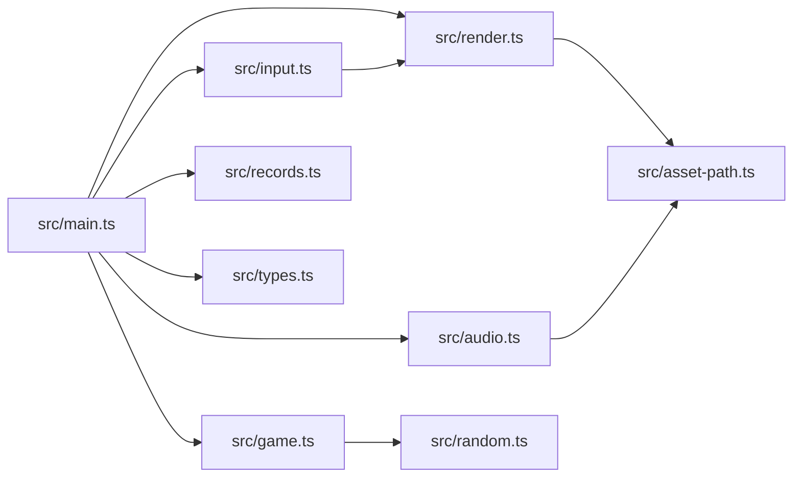

# Project Overview

<cite>
**Referenced Files in This Document**
- [README.md](file://README.md)
- [package.json](file://package.json)
- [index.html](file://index.html)
- [vite.config.ts](file://vite.config.ts)
- [src/main.ts](file://src/main.ts)
- [src/game.ts](file://src/game.ts)
- [src/render.ts](file://src/render.ts)
- [src/audio.ts](file://src/audio.ts)
- [src/input.ts](file://src/input.ts)
- [src/records.ts](file://src/records.ts)
- [src/types.ts](file://src/types.ts)
- [src/asset-path.ts](file://src/asset-path.ts)
- [src/random.ts](file://src/random.ts)
</cite>

## Update Summary
**Changes Made**
- Updated documentation structure to reflect file organization improvements
- Maintained comprehensive coverage of game mechanics and architecture
- Enhanced source tracking with specific file references and line numbers

## Table of Contents
1. [Introduction](#introduction)
2. [Project Structure](#project-structure)
3. [Core Components](#core-components)
4. [Architecture Overview](#architecture-overview)
5. [Detailed Component Analysis](#detailed-component-analysis)
6. [Dependency Analysis](#dependency-analysis)
7. [Performance Considerations](#performance-considerations)
8. [Troubleshooting Guide](#troubleshooting-guide)
9. [Conclusion](#conclusion)

## Introduction
Raid and Run is a grid-based arcade game where you navigate a 5×5 board to collect coins while dodging fireballs that travel across rows and columns. The goal is to survive as long as possible, collecting coins for points and trying to beat your best score and the world record. As your score increases, fireballs spawn faster and move quicker, creating progressive difficulty.

The project demonstrates modern web game development patterns using Vite, TypeScript, the Canvas API for rendering, and the Web Audio API for sound and music. It includes keyboard and pointer input handling, deterministic-style random utilities, persistent high scores, and a clean separation between game logic, rendering, audio, and input.

Live demo: https://codingcodey.github.io/raid-and-run/

## Project Structure
At a high level, the application follows a modular architecture:
- Entry point initializes the canvas, binds input, manages the main loop, and coordinates state transitions.
- Game logic encapsulates movement, collision detection, coin spawning, and fireball behavior.
- Rendering draws the board, player, coins, warnings, fireballs, and HUD using the Canvas API.
- Audio manages background music and effects with the Web Audio API.
- Input handles keyboard and pointer events, including swipe and tap-to-move.
- Records persist best and world scores.
- Types define shared interfaces and constants.

**Diagram sources**
- [index.html:1-29](file://index.html#L1-L29)
- [src/main.ts:1-160](file://src/main.ts#L1-L160)
- [src/game.ts:1-426](file://src/game.ts#L1-L426)
- [src/render.ts:1-721](file://src/render.ts#L1-L721)
- [src/audio.ts:1-296](file://src/audio.ts#L1-L296)
- [src/input.ts:1-322](file://src/input.ts#L1-L322)
- [src/records.ts:1-52](file://src/records.ts#L1-L52)
- [src/types.ts:1-54](file://src/types.ts#L1-L54)
- [src/asset-path.ts:1-5](file://src/asset-path.ts#L1-L5)
- [src/random.ts:1-18](file://src/random.ts#L1-L18)

**Section sources**
- [README.md:1-30](file://README.md#L1-L30)
- [package.json:1-19](file://package.json#L1-L19)
- [index.html:1-29](file://index.html#L1-L29)
- [vite.config.ts:1-6](file://vite.config.ts#L1-L6)

## Core Components
- Game Loop and State Management: Fixed timestep updates, accumulator pattern, pause/restart flows, and game over persistence.
- Grid and Movement: 5×5 grid with clamped movement; no wrap-around boundaries are implemented.
- Coin Collection: Coins spawn on empty cells and increment score; first coin triggers special audio.
- Fireball System: Straight and bending fireballs with warning phases, travel durations, and collision detection.
- Progressive Difficulty: Spawn delay and travel duration scale with score.
- Persistence: Best and world records stored via localStorage or in-memory fallback.
- Rendering: Pixel-art style drawing with sprite frames and procedural fallbacks.
- Audio: Background music modes (pre-coin, active, game over), effect playback, and volume control.
- Input: Keyboard (WASD/arrows), hold-repeat movement, tap-to-move, and swipe gestures.

**Section sources**
- [src/main.ts:1-160](file://src/main.ts#L1-L160)
- [src/game.ts:1-426](file://src/game.ts#L1-L426)
- [src/render.ts:1-721](file://src/render.ts#L1-L721)
- [src/audio.ts:1-296](file://src/audio.ts#L1-L296)
- [src/input.ts:1-322](file://src/input.ts#L1-L322)
- [src/records.ts:1-52](file://src/records.ts#L1-L52)
- [src/types.ts:1-54](file://src/types.ts#L1-L54)

## Architecture Overview
The application uses a clear separation of concerns:
- Main orchestrates initialization, event binding, and the fixed-step update loop.
- Game module exposes pure functions to compute next state from current state and inputs.
- Render module consumes GameState to draw frames.
- Audio module responds to state changes and user actions to play music/effects.
- Input module translates user interactions into directional moves and control commands.
- Records module abstracts storage backends.

**Diagram sources**
- [src/main.ts:1-160](file://src/main.ts#L1-L160)
- [src/game.ts:1-426](file://src/game.ts#L1-L426)
- [src/render.ts:1-721](file://src/render.ts#L1-L721)
- [src/audio.ts:1-296](file://src/audio.ts#L1-L296)
- [src/input.ts:1-322](file://src/input.ts#L1-L322)
- [src/records.ts:1-52](file://src/records.ts#L1-L52)

## Detailed Component Analysis

### Game Logic (game.ts)
Responsibilities:
- Create initial game state with player at center, first coin, and zeroed timers.
- Move player by one cell per input, clamp within bounds, handle coin collection, and check collisions.
- Update fireballs each frame: advance age, filter expired, spawn new ones based on score-driven delays.
- Collision detection uses a radius around the player's cell; bending fireballs have reduced collision radius.
- Progressive difficulty:
  - Spawn delay decreases with score thresholds.
  - Travel duration decreases with score up to a minimum.
- Bending fireballs:
  - Appear with a chance after cooldown, target the player's row/column, and turn gradually toward the player.
  - Have longer travel time and slower speed ratio compared to straight fireballs.

Key data structures:
- Cell: { row, col }
- Fireball: id, edge, lane, kind, targetLane, position, velocity, age, warningDuration, travelDuration
- GameState: player, facing, coin, previousCoin, fireballs, score, bestScore, worldRecord, status, elapsed, spawner timers

Complexity highlights:
- Per-frame update iterates over active fireballs: O(F).
- Collision checks iterate over all fireballs: O(F).
- Spawning may add multiple fireballs per step depending on accumulated delay.

Optimization opportunities:
- Spatial partitioning is unnecessary for 5×5 but could be considered if expanding the grid.
- Avoid object churn by reusing arrays or pooling fireball objects when scaling up.

Error handling:
- Graceful return of unchanged state when game is over.
- Safe filtering of expired fireballs prevents memory growth.

**Section sources**
- [src/game.ts:1-426](file://src/game.ts#L1-L426)
- [src/types.ts:1-54](file://src/types.ts#L1-L54)
- [src/random.ts:1-18](file://src/random.ts#L1-L18)

#### Class and Function Relationships

**Diagram sources**
- [src/types.ts:1-54](file://src/types.ts#L1-L54)
- [src/game.ts:1-426](file://src/game.ts#L1-L426)

### Rendering (render.ts)
Responsibilities:
- Draw background, animated snow, board tiles, warnings, coins, fireballs, player, HUD, overlays.
- Provide pixel-perfect rendering with sprite frames and procedural fallbacks when assets are not ready.
- Convert canvas coordinates to grid cells for interaction hints.

Highlights:
- Uses assetPath to resolve base URL correctly for GitHub Pages.
- Animated sprites for coins, fireballs, and player with frame timing.
- Procedural drawing ensures graceful degradation without images.

Performance considerations:
- Disables image smoothing for crisp pixel art.
- Reuses computed positions and scales to minimize per-frame allocations.

**Section sources**
- [src/render.ts:1-721](file://src/render.ts#L1-L721)
- [src/asset-path.ts:1-5](file://src/asset-path.ts#L1-L5)

### Audio (audio.ts)
Responsibilities:
- Manage AudioContext lifecycle and unlock policy.
- Play looping background music in different modes (pre-coin, active, game over).
- Queue and play short effects (coin, first coin, fireball, button click, death sequence).
- Maintain volumes per asset and stop/clean up sources safely.

Behavioral notes:
- Music mode selection depends on score and game status.
- Death sequence interrupts music and plays a unique effect before switching to game over music.

**Section sources**
- [src/audio.ts:1-296](file://src/audio.ts#L1-L296)

### Input (input.ts)
Responsibilities:
- Bind keyboard and pointer events to game controls.
- Support WASD/arrows, hold-repeat movement, tap-to-move, and swipe gestures.
- Compute direction from pointer deltas and relative cell positions.

Usability features:
- Hold-repeat with initial delay and interval.
- Prevent default scrolling on arrow keys.
- Restart shortcuts during game over.

**Section sources**
- [src/input.ts:1-322](file://src/input.ts#L1-L322)

### Records (records.ts)
Responsibilities:
- Persist best and world records using localStorage or an in-memory store fallback.
- Normalize and validate stored values.

Persistence strategy:
- LocalRecordsStore writes to Storage; MemoryRecordsStore keeps values in process memory.
- On save, both best and world records are updated to the maximum of existing and current score.

**Section sources**
- [src/records.ts:1-52](file://src/records.ts#L1-L52)

### Main Orchestrator (main.ts)
Responsibilities:
- Initialize canvas, context, and UI elements.
- Create records store and audio instance.
- Build initial game state and start the fixed-timestep loop.
- Handle restart/pause toggles and commit game over transitions.
- Dispatch move actions and synchronize audio/music.

Fixed timestep details:
- FIXED_STEP_SECONDS = 1/60 seconds.
- Accumulator drives deterministic updates independent of frame rate.
- MAX_FRAME_SECONDS caps large jumps to prevent spiral of death.

**Section sources**
- [src/main.ts:1-160](file://src/main.ts#L1-L160)

## Dependency Analysis
High-level dependencies:
- main.ts depends on game, render, audio, input, records, types, and asset-path.
- render.ts depends on types and asset-path, and reads game helpers for fireball positioning/rotation.
- game.ts depends on types and random utilities.
- input.ts depends on render for coordinate conversion and types for directions/status.
- audio.ts depends on types and asset-path.
- records.ts depends on types.

**Diagram sources**
- [src/main.ts:1-160](file://src/main.ts#L1-L160)
- [src/game.ts:1-426](file://src/game.ts#L1-L426)
- [src/render.ts:1-721](file://src/render.ts#L1-L721)
- [src/audio.ts:1-296](file://src/audio.ts#L1-L296)
- [src/input.ts:1-322](file://src/input.ts#L1-L322)
- [src/records.ts:1-52](file://src/records.ts#L1-L52)
- [src/types.ts:1-54](file://src/types.ts#L1-L54)
- [src/asset-path.ts:1-5](file://src/asset-path.ts#L1-L5)
- [src/random.ts:1-18](file://src/random.ts#L1-L18)

**Section sources**
- [src/main.ts:1-160](file://src/main.ts#L1-L160)
- [src/game.ts:1-426](file://src/game.ts#L1-L426)
- [src/render.ts:1-721](file://src/render.ts#L1-L721)
- [src/audio.ts:1-296](file://src/audio.ts#L1-L296)
- [src/input.ts:1-322](file://src/input.ts#L1-L322)
- [src/records.ts:1-52](file://src/records.ts#L1-L52)
- [src/types.ts:1-54](file://src/types.ts#L1-L54)
- [src/asset-path.ts:1-5](file://src/asset-path.ts#L1-L5)
- [src/random.ts:1-18](file://src/random.ts#L1-L18)

## Performance Considerations
- Fixed timestep loop ensures consistent gameplay regardless of display refresh rates.
- Canvas rendering avoids expensive operations by disabling smoothing and batching draw calls per frame.
- Sprite loading is asynchronous; procedural fallbacks keep the game playable while assets load.
- Audio buffers are preloaded and reused; effects are short-lived and cleaned up promptly.
- For future scalability, consider object pooling for fireballs and minimizing per-frame allocations.

[No sources needed since this section provides general guidance]

## Troubleshooting Guide
Common issues and resolutions:
- Audio does not play: Ensure user interaction has occurred to unlock the AudioContext. The app unlocks on pointerdown/click and button interactions.
- High scores not saved: If localStorage is unavailable, the app falls back to in-memory storage. Check browser privacy settings or use a local dev server.
- Assets not visible: Verify BASE_URL configuration and that assets exist under public/assets. The assetPath helper resolves paths relative to BASE_URL.
- Input not responding: Confirm the canvas has focus and that key repeat is handled. Arrow keys are prevented from scrolling.

Operational references:
- Audio unlock and music syncing occur on user interactions and state changes.
- Records store creation tries localStorage first and falls back to memory.
- Asset path resolution uses import.meta.env.BASE_URL.

**Section sources**
- [src/main.ts:1-160](file://src/main.ts#L1-L160)
- [src/audio.ts:1-296](file://src/audio.ts#L1-L296)
- [src/records.ts:1-52](file://src/records.ts#L1-L52)
- [src/asset-path.ts:1-5](file://src/asset-path.ts#L1-L5)

## Conclusion
Raid and Run showcases a compact yet complete modern web game built with Vite and TypeScript. It cleanly separates concerns across modules, implements a robust fixed-step game loop, and leverages the Canvas and Web Audio APIs for rich interactivity and feedback. The 5×5 grid design keeps gameplay accessible while offering meaningful depth through progressive difficulty and strategic movement. The codebase serves as an educational example of contemporary web game patterns, including deterministic updates, sprite-based rendering, audio management, and persistent scoring.

[No sources needed since this section summarizes without analyzing specific files]