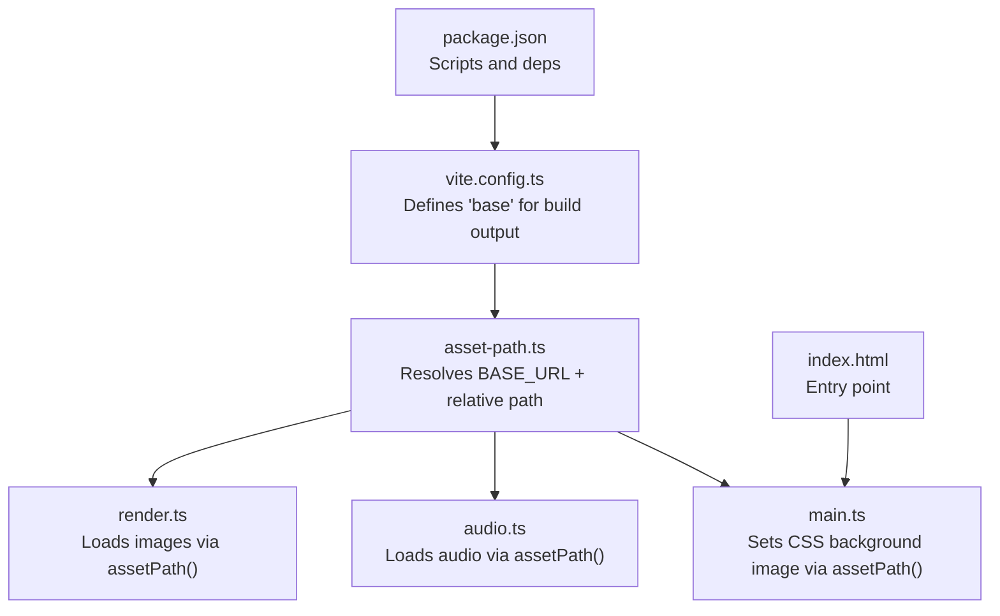
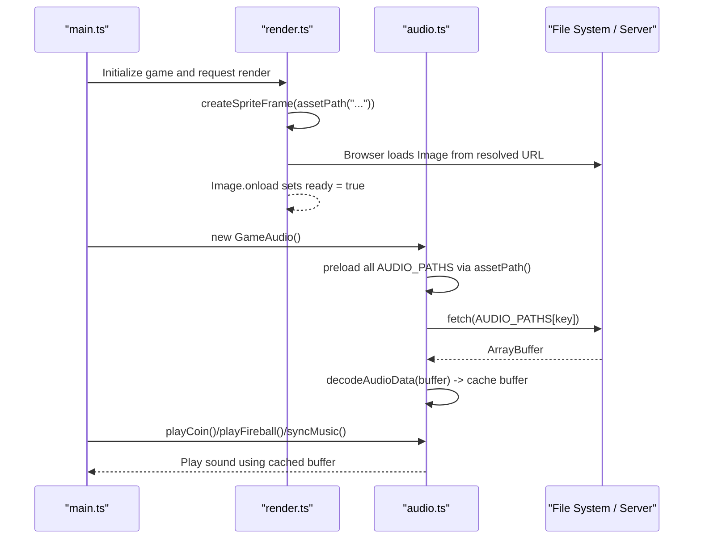
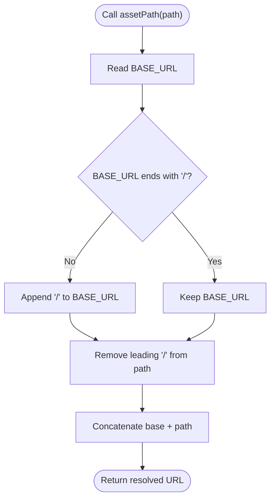
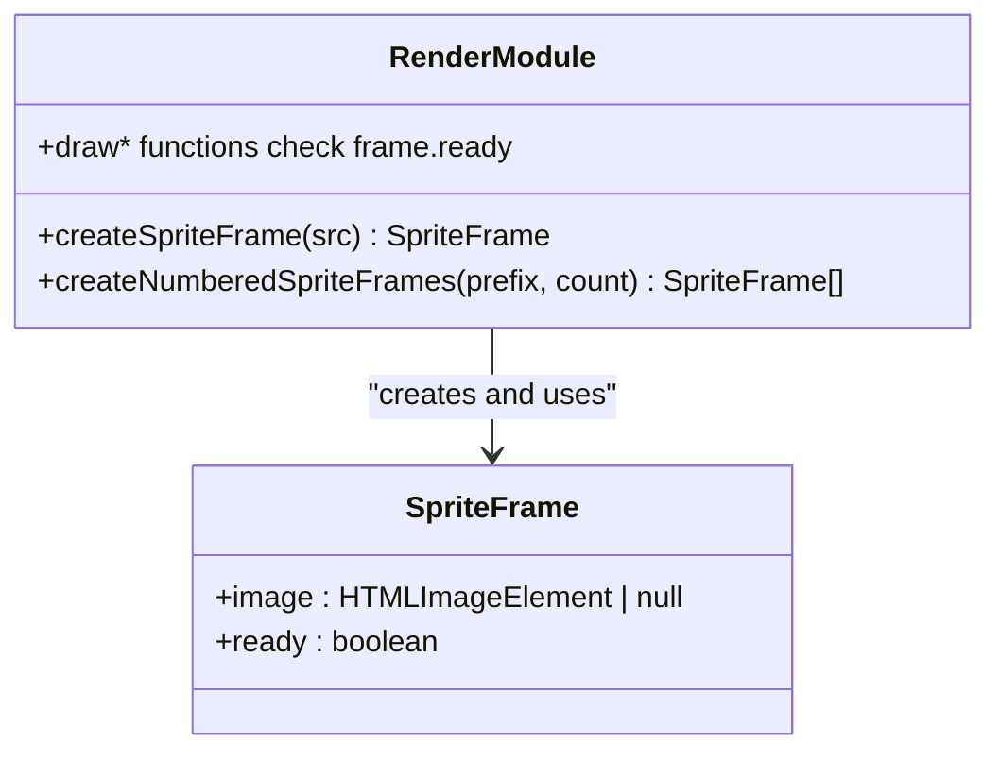
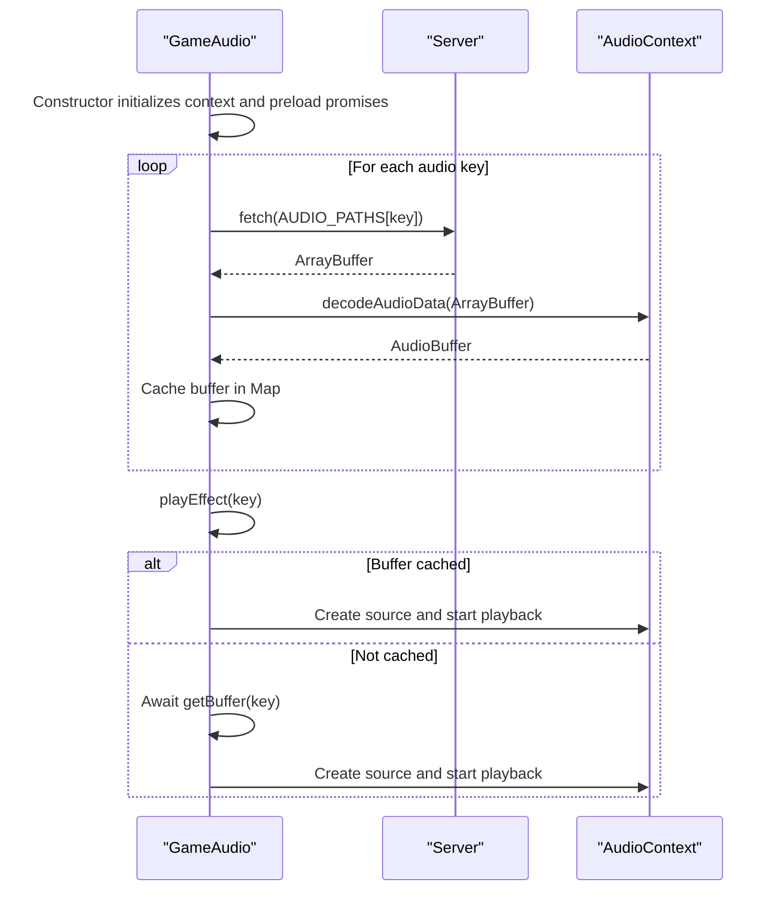
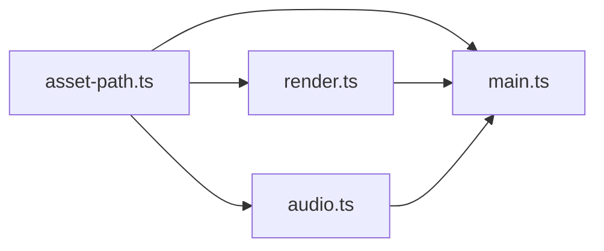

# Asset Management and Path Resolution

<cite>
**Referenced Files in This Document**
- [asset-path.ts](file://src/asset-path.ts)
- [render.ts](file://src/render.ts)
- [audio.ts](file://src/audio.ts)
- [main.ts](file://src/main.ts)
- [vite.config.ts](file://vite.config.ts)
- [package.json](file://package.json)
- [index.html](file://index.html)
</cite>

## Table of Contents
1. [Introduction](#introduction)
2. [Project Structure](#project-structure)
3. [Core Components](#core-components)
4. [Architecture Overview](#architecture-overview)
5. [Detailed Component Analysis](#detailed-component-analysis)
6. [Dependency Analysis](#dependency-analysis)
7. [Performance Considerations](#performance-considerations)
8. [Troubleshooting Guide](#troubleshooting-guide)
9. [Conclusion](#conclusion)

## Introduction
This document explains the asset management system and path resolution utility used by the game. It focuses on how the assetPath function resolves relative paths across environments, how the rendering system integrates with it to load images, and how audio assets are managed. It also covers the asset loading lifecycle (Image creation, onload handling, readiness state), error handling strategies including graceful degradation to procedural graphics, caching mechanisms, memory considerations, environment configuration for base paths, and performance optimization techniques such as preloading critical assets and lazy loading non-essential resources.

## Project Structure
The asset-related logic is concentrated in a small set of modules:
- Path resolution utility: src/asset-path.ts
- Image asset loading and rendering integration: src/render.ts
- Audio asset loading and playback: src/audio.ts
- Application bootstrap and UI asset usage: src/main.ts
- Build-time base path configuration: vite.config.ts
- Entry HTML: index.html
- Package scripts and dependencies: package.json

**Diagram sources**
- [asset-path.ts:1-5](file://src/asset-path.ts#L1-L5)
- [render.ts:1-165](file://src/render.ts#L1-L165)
- [audio.ts:1-17](file://src/audio.ts#L1-L17)
- [main.ts:29](file://src/main.ts#L29)
- [vite.config.ts:3-5](file://vite.config.ts#L3-L5)
- [index.html:19](file://index.html#L19)
- [package.json:6-11](file://package.json#L6-L11)

**Section sources**
- [asset-path.ts:1-5](file://src/asset-path.ts#L1-L5)
- [render.ts:1-165](file://src/render.ts#L1-L165)
- [audio.ts:1-17](file://src/audio.ts#L1-L17)
- [main.ts:29](file://src/main.ts#L29)
- [vite.config.ts:3-5](file://vite.config.ts#L3-L5)
- [index.html:19](file://index.html#L19)
- [package.json:6-11](file://package.json#L6-L11)

## Core Components
- assetPath(path): Centralized resolver that prepends the correct base URL and normalizes the path to avoid double slashes.
- render.ts: Creates HTMLImageElement instances for sprites, tracks readiness via a ready flag, and falls back to procedural drawing when assets are not yet available.
- audio.ts: Preloads audio buffers using fetch and decodeAudioData, caches them, and plays effects or music based on game state.
- main.ts: Uses assetPath for UI elements (e.g., restart button background) and orchestrates game loop and audio unlock.

Key responsibilities:
- Path normalization and environment-aware base URL composition
- Asynchronous asset loading with readiness tracking
- Graceful fallbacks when assets fail to load
- Centralized caching for audio buffers

**Section sources**
- [asset-path.ts:1-5](file://src/asset-path.ts#L1-L5)
- [render.ts:104-164](file://src/render.ts#L104-L164)
- [audio.ts:37-57](file://src/audio.ts#L37-L57)
- [main.ts:29](file://src/main.ts#L29)

## Architecture Overview
The asset pipeline is simple and robust:
- All resource URLs are generated through assetPath, ensuring consistent base path behavior across development, testing, and production builds.
- Images are loaded asynchronously; their readiness is tracked per frame so rendering can proceed even before assets arrive.
- Audio assets are fetched and decoded into AudioBuffer objects once, then reused for playback.

**Diagram sources**
- [render.ts:141-164](file://src/render.ts#L141-L164)
- [audio.ts:258-276](file://src/audio.ts#L258-L276)
- [asset-path.ts:1-5](file://src/asset-path.ts#L1-L5)
- [main.ts:40](file://src/main.ts#L40)

## Detailed Component Analysis

### Path Resolution Utility: assetPath
- Purpose: Normalize and resolve asset URLs relative to the application’s base path.
- Behavior:
  - Reads import.meta.env.BASE_URL provided by the bundler.
  - Ensures exactly one trailing slash on the base.
  - Strips leading slashes from the input path to prevent double slashes.
  - Concatenates base and normalized path.
- Environment configuration:
  - The base path is defined at build time via Vite’s base option.
  - For local development, the default base is "./", which works when served from the root.
  - For subpath deployments, configure base to the deployment prefix (e.g., "/game/") so all asset URLs resolve correctly.

**Diagram sources**
- [asset-path.ts:1-5](file://src/asset-path.ts#L1-L5)

**Section sources**
- [asset-path.ts:1-5](file://src/asset-path.ts#L1-L5)
- [vite.config.ts:3-5](file://vite.config.ts#L3-L5)

### Rendering Integration and Image Loading Lifecycle
- Initialization:
  - Module-level constants compute absolute image URLs via assetPath.
  - Sprite frames are created using createSpriteFrame, which constructs an HTMLImageElement and assigns its src to the resolved URL.
- Readiness tracking:
  - Each sprite frame has a ready flag set to false initially.
  - On Image.onload, ready becomes true, indicating the image is available for drawing.
- Rendering flow:
  - When drawing, if the frame is not ready or invalid, the renderer falls back to procedural graphics.
  - Once ready, drawImage is called with appropriate scaling and positioning.
- Special case:
  - The ice map image is loaded separately at module initialization and guarded by an isIceMapReady flag.

**Diagram sources**
- [render.ts:48-51](file://src/render.ts#L48-L51)
- [render.ts:141-164](file://src/render.ts#L141-L164)
- [render.ts:104-139](file://src/render.ts#L104-L139)

**Section sources**
- [render.ts:14-21](file://src/render.ts#L14-L21)
- [render.ts:104-139](file://src/render.ts#L104-L139)
- [render.ts:141-164](file://src/render.ts#L141-L164)
- [render.ts:242-259](file://src/render.ts#L242-L259)
- [render.ts:345-357](file://src/render.ts#L345-L357)
- [render.ts:408-427](file://src/render.ts#L408-L427)
- [render.ts:437-459](file://src/render.ts#L437-L459)
- [render.ts:487-507](file://src/render.ts#L487-L507)
- [render.ts:539-562](file://src/render.ts#L539-L562)
- [render.ts:597-610](file://src/render.ts#L597-L610)
- [render.ts:627-634](file://src/render.ts#L627-L634)
- [render.ts:645-672](file://src/render.ts#L645-L672)

### Audio Asset Loading and Playback
- Initialization:
  - GameAudio constructor creates an AudioContext and starts preloading all audio files referenced in AUDIO_PATHS.
  - Paths are resolved via assetPath to ensure correct base URL.
- Loading strategy:
  - Each audio file is fetched as an ArrayBuffer and decoded into an AudioBuffer.
  - Decoded buffers are cached in a Map keyed by audio key.
  - A loading promise per key prevents duplicate concurrent requests.
- Playback:
  - Effects are played immediately if already loaded; otherwise they are loaded on demand and queued until ready.
  - Music modes switch based on game state, with volume control and looping support.
- Error handling:
  - If fetch fails or decoding errors occur, the buffer is not cached and playback is skipped gracefully.

**Diagram sources**
- [audio.ts:37-57](file://src/audio.ts#L37-L57)
- [audio.ts:258-276](file://src/audio.ts#L258-L276)
- [audio.ts:191-234](file://src/audio.ts#L191-L234)

**Section sources**
- [audio.ts:8-17](file://src/audio.ts#L8-L17)
- [audio.ts:37-57](file://src/audio.ts#L37-L57)
- [audio.ts:258-276](file://src/audio.ts#L258-L276)
- [audio.ts:191-234](file://src/audio.ts#L191-L234)

### UI Asset Usage
- The restart button’s background image is set using assetPath to ensure the correct URL regardless of deployment base.

**Section sources**
- [main.ts:29](file://src/main.ts#L29)

## Dependency Analysis
- assetPath is imported by render.ts, audio.ts, and main.ts.
- render.ts depends on assetPath for all image URLs and manages Image object lifecycles.
- audio.ts depends on assetPath for all audio URLs and manages AudioBuffer caching.
- main.ts uses assetPath for UI styling and coordinates audio unlocking and game loop.

**Diagram sources**
- [asset-path.ts:1-5](file://src/asset-path.ts#L1-L5)
- [render.ts:1](file://src/render.ts#L1)
- [audio.ts:1](file://src/audio.ts#L1)
- [main.ts:3](file://src/main.ts#L3)

**Section sources**
- [asset-path.ts:1-5](file://src/asset-path.ts#L1-L5)
- [render.ts:1](file://src/render.ts#L1)
- [audio.ts:1](file://src/audio.ts#L1)
- [main.ts:3](file://src/main.ts#L3)

## Performance Considerations
- Preload critical assets:
  - Images: The current approach creates Image objects at module load time, effectively preloading critical sprites. This reduces first-frame latency.
  - Audio: All audio files are preloaded into AudioBuffer objects during GameAudio construction, minimizing startup delays for sounds and music.
- Lazy loading non-essential resources:
  - Consider deferring creation of less important sprites until needed (e.g., after initial gameplay).
  - For audio, use on-demand loading for rarely used effects to reduce initial network overhead.
- Avoid redundant requests:
  - Audio uses a loading promise per key to prevent duplicate fetches while decoding.
  - Image loading relies on browser caching; ensure unique filenames or proper cache headers for repeat visits.
- Memory management:
  - Audio buffers are retained in memory for reuse; this is efficient but consider releasing unused buffers if the app grows significantly.
  - Image objects are held in arrays; if many large textures are added, monitor memory usage and consider offscreen canvases or texture atlases.
- Network and caching:
  - Use versioned asset filenames or cache-busting to force refresh when assets change.
  - Configure server cache headers appropriately for long-term caching of static assets.

[No sources needed since this section provides general guidance]

## Troubleshooting Guide
Common issues and resolutions:
- Assets not found or blank images:
  - Verify BASE_URL configuration in the build tool matches your deployment path.
  - Check that assetPath produces correct URLs and that the server serves assets at those paths.
- Audio does not play:
  - Ensure user interaction has unlocked the AudioContext (the code unlocks on pointerdown/click and button interactions).
  - Confirm fetch responses are successful and decodeAudioData completes without errors.
- Stuttering or delayed first frame:
  - Ensure critical assets are preloaded; avoid heavy synchronous work during initialization.
  - Consider splitting asset loading into phases to prioritize core visuals and sounds.

**Section sources**
- [asset-path.ts:1-5](file://src/asset-path.ts#L1-L5)
- [render.ts:141-164](file://src/render.ts#L141-L164)
- [audio.ts:258-276](file://src/audio.ts#L258-L276)
- [main.ts:99-103](file://src/main.ts#L99-L103)

## Conclusion
The asset management system centers around a simple, reliable path resolver that ensures assets load correctly across environments. The rendering layer adopts a resilient pattern by tracking image readiness and falling back to procedural graphics when assets are unavailable. Audio assets are preloaded and cached for low-latency playback. Together, these patterns provide a robust foundation for flexible deployment, smooth user experience, and maintainable asset handling.

[No sources needed since this section summarizes without analyzing specific files]