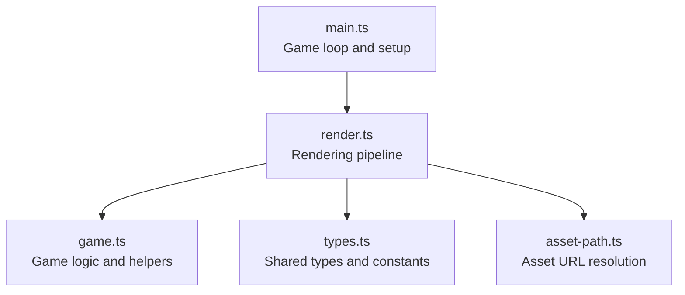
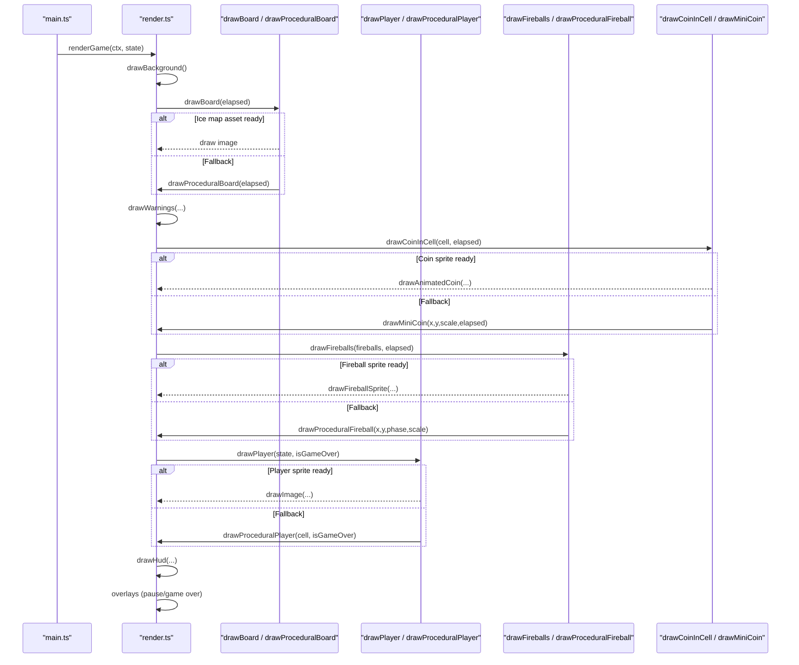
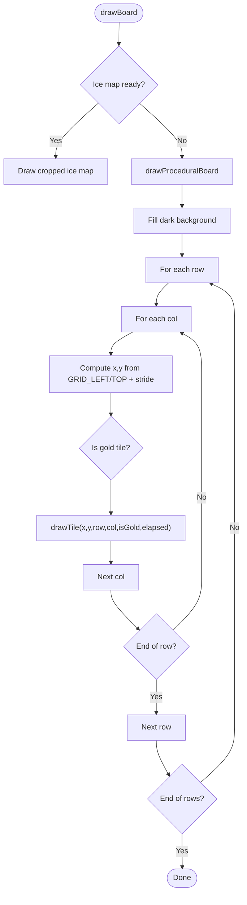
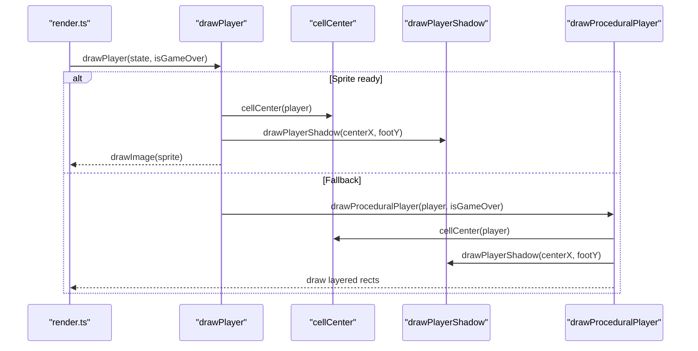
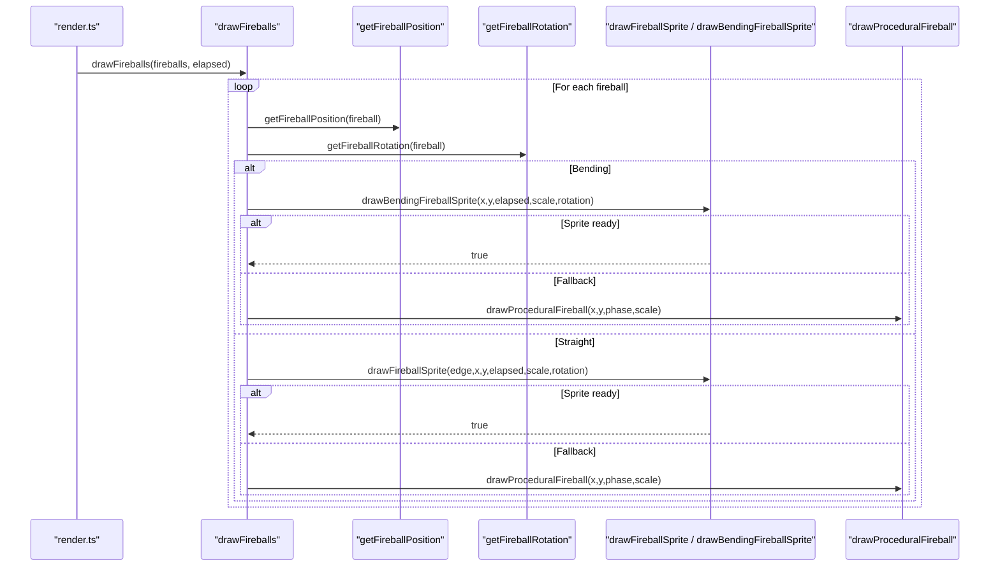
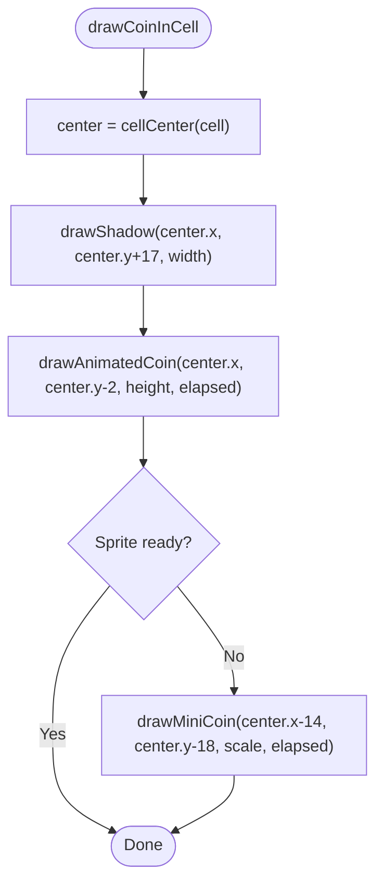
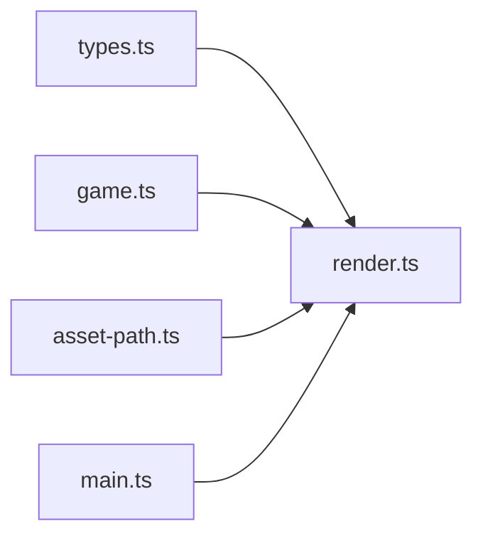

# Procedural Graphics Fallbacks

<cite>
**Referenced Files in This Document**
- [render.ts](file://src/render.ts)
- [game.ts](file://src/game.ts)
- [types.ts](file://src/types.ts)
- [main.ts](file://src/main.ts)
- [asset-path.ts](file://src/asset-path.ts)
</cite>

## Table of Contents
1. [Introduction](#introduction)
2. [Project Structure](#project-structure)
3. [Core Components](#core-components)
4. [Architecture Overview](#architecture-overview)
5. [Detailed Component Analysis](#detailed-component-analysis)
6. [Dependency Analysis](#dependency-analysis)
7. [Performance Considerations](#performance-considerations)
8. [Troubleshooting Guide](#troubleshooting-guide)
9. [Conclusion](#conclusion)

## Introduction
This document explains the procedural graphics fallback system that ensures the game renders complete visuals even when asset files fail to load or are unavailable. It focuses on how the rendering pipeline chooses between sprite-based assets and procedural drawing, and it details key functions:
- drawProceduralBoard: draws a grid background with alternating tile patterns and sparkle effects
- drawProceduralPlayer: draws the character using layered rectangles with proper color layering and positioning
- drawProceduralFireball: creates animated fire effects using layered rectangles with flickering animations
- drawMiniCoin: provides simple coin representations for HUD and cell coins
- Shadow drawing utilities: consistent shadow rendering for player and coins

It also includes coordinate transformation examples showing how game logic positions map to screen coordinates, and discusses visual consistency between sprite-based and procedural rendering to ensure a seamless user experience regardless of asset availability.

## Project Structure
The procedural fallback system is implemented primarily in the rendering module, which orchestrates both asset-based and procedural drawing paths. The game loop initializes the canvas, updates state, and delegates rendering to the render module.

**Diagram sources**
- [main.ts:107-136](file://src/main.ts#L107-L136)
- [render.ts:166-185](file://src/render.ts#L166-L185)
- [game.ts:1-20](file://src/game.ts#L1-L20)
- [types.ts:1-10](file://src/types.ts#L1-L10)
- [asset-path.ts:1-5](file://src/asset-path.ts#L1-L5)

**Section sources**
- [main.ts:107-136](file://src/main.ts#L107-L136)
- [render.ts:166-185](file://src/render.ts#L166-L185)

## Core Components
- Rendering pipeline: clears the canvas, draws background, board, warnings, coin, fireballs, player, HUD, and overlays based on game status.
- Sprite loading: attempts to load images; if not ready or invalid, falls back to procedural drawing.
- Procedural drawing: uses Canvas primitives (rectangles, fills) to recreate visuals consistently with sprites.
- Coordinate transformations: convert logical grid cells to screen pixel coordinates for accurate placement.

Key responsibilities:
- Choose sprite vs procedural path per frame
- Maintain visual parity across both paths
- Provide robust fallbacks for missing assets

**Section sources**
- [render.ts:166-185](file://src/render.ts#L166-L185)
- [render.ts:141-164](file://src/render.ts#L141-L164)
- [render.ts:242-259](file://src/render.ts#L242-L259)
- [render.ts:487-537](file://src/render.ts#L487-L537)
- [render.ts:461-485](file://src/render.ts#L461-L485)
- [render.ts:674-694](file://src/render.ts#L674-L694)
- [render.ts:696-701](file://src/render.ts#L696-L701)

## Architecture Overview
The rendering architecture prioritizes asset-based visuals but guarantees full functionality via procedural fallbacks. Each drawable component checks asset readiness and switches to procedural drawing if needed.

**Diagram sources**
- [render.ts:166-185](file://src/render.ts#L166-L185)
- [render.ts:242-259](file://src/render.ts#L242-L259)
- [render.ts:359-368](file://src/render.ts#L359-L368)
- [render.ts:370-394](file://src/render.ts#L370-L394)
- [render.ts:487-537](file://src/render.ts#L487-L537)

## Detailed Component Analysis

### Board Background and Procedural Grid
The board can be drawn from an ice map asset or procedurally. When the asset is unavailable, drawProceduralBoard constructs a dark base and iterates through each grid cell to draw tiles with alternating gold and brown palettes, highlights, shadows, chips, and periodic sparkles.

- Alternating tile pattern: determined by row+col parity plus special cases for specific cells.
- Sparkle effect: toggled per tile using a sine function over time.
- Visual consistency: colors and shapes mimic the intended sprite look.

**Diagram sources**
- [render.ts:242-259](file://src/render.ts#L242-L259)
- [render.ts:261-273](file://src/render.ts#L261-L273)
- [render.ts:275-314](file://src/render.ts#L275-L314)

**Section sources**
- [render.ts:242-259](file://src/render.ts#L242-L259)
- [render.ts:261-273](file://src/render.ts#L261-L273)
- [render.ts:275-314](file://src/render.ts#L275-L314)

### Player Character: Sprite vs Procedural
The player rendering prefers animated sprites. If the current frame is not ready or invalid, it falls back to drawProceduralPlayer, which composes the character from layered rectangles representing body parts, eyes, arms, and feet. A shadow is always drawn beneath the player.

- Color layering: multiple rectangles layered to form torso, head, limbs, and eyes.
- Positioning: center derived from cellCenter; vertical offset applied; bobbing during game over.
- Shadow utility: drawPlayerShadow calls drawShadow, which either draws a sprite or a rectangle fallback.

**Diagram sources**
- [render.ts:487-537](file://src/render.ts#L487-L537)
- [render.ts:539-562](file://src/render.ts#L539-L562)
- [render.ts:696-701](file://src/render.ts#L696-L701)

**Section sources**
- [render.ts:487-537](file://src/render.ts#L487-L537)
- [render.ts:539-562](file://src/render.ts#L539-L562)
- [render.ts:696-701](file://src/render.ts#L696-L701)

### Fireballs: Animated Sprites and Procedural Fallback
Fireballs use directional sprite frames with rotation and scaling. If sprites are unavailable, drawProceduralFireball draws layered rectangles with a flicker effect to simulate flames. Bending fireballs have different scale and rotation logic.

- Animation: frame selection based on elapsed time and frame duration.
- Rotation: computed from velocity for bending fireballs; zero for straight ones.
- Flicker: sinusoidal variation applied to one rectangle to create dynamic flame appearance.

**Diagram sources**
- [render.ts:370-394](file://src/render.ts#L370-L394)
- [render.ts:396-459](file://src/render.ts#L396-L459)
- [render.ts:461-485](file://src/render.ts#L461-L485)
- [game.ts:168-185](file://src/game.ts#L168-L185)

**Section sources**
- [render.ts:370-394](file://src/render.ts#L370-L394)
- [render.ts:396-459](file://src/render.ts#L396-L459)
- [render.ts:461-485](file://src/render.ts#L461-L485)
- [game.ts:168-185](file://src/game.ts#L168-L185)

### Coins and Mini Coin Representation
Coins are drawn using animated sprites when available. Otherwise, drawMiniCoin renders a compact coin composed of layered rectangles with a shine effect. Both the HUD and in-cell coins use this fallback.

- HUD usage: drawHud attempts drawAnimatedCoin; if unavailable, draws drawMiniCoin at fixed position.
- In-cell usage: drawCoinInCell draws a shadow then tries drawAnimatedCoin; otherwise draws drawMiniCoin centered in the cell.

**Diagram sources**
- [render.ts:359-368](file://src/render.ts#L359-L368)
- [render.ts:645-672](file://src/render.ts#L645-L672)
- [render.ts:674-694](file://src/render.ts#L674-L694)
- [render.ts:229-240](file://src/render.ts#L229-L240)

**Section sources**
- [render.ts:359-368](file://src/render.ts#L359-L368)
- [render.ts:645-672](file://src/render.ts#L645-L672)
- [render.ts:674-694](file://src/render.ts#L674-L694)
- [render.ts:229-240](file://src/render.ts#L229-L240)

### Coordinate Transformation Examples
To map game logic positions to screen coordinates:
- cellCenter converts a logical {row, col} into pixel {x, y} using GRID_LEFT, GRID_TOP, GRID_STRIDE, and CELL_SIZE.
- Fireball positions are computed from game logic and then converted to pixel centers for drawing.

Examples:
- Player center:
  - Input: player cell {row, col}
  - Output: x = GRID_LEFT + col * GRID_STRIDE + CELL_SIZE / 2; y = GRID_TOP + row * GRID_STRIDE + CELL_SIZE / 2
- Fireball center:
  - Input: fireball position {row, col}
  - Output: x = GRID_LEFT + col * GRID_STRIDE + CELL_SIZE / 2; y = GRID_TOP + row * GRID_STRIDE + CELL_SIZE / 2

These transformations ensure consistent alignment between sprites and procedural elements.

**Section sources**
- [render.ts:696-701](file://src/render.ts#L696-L701)
- [render.ts:376-378](file://src/render.ts#L376-L378)

## Dependency Analysis
The rendering module depends on shared types and game logic helpers for fireball positioning and rotation. Asset URLs are resolved via a helper that respects the deployment base path.

**Diagram sources**
- [types.ts:1-10](file://src/types.ts#L1-L10)
- [game.ts:1-20](file://src/game.ts#L1-L20)
- [asset-path.ts:1-5](file://src/asset-path.ts#L1-L5)
- [main.ts:1-10](file://src/main.ts#L1-L10)
- [render.ts:1-10](file://src/render.ts#L1-L10)

**Section sources**
- [render.ts:1-10](file://src/render.ts#L1-L10)
- [game.ts:1-20](file://src/game.ts#L1-L20)
- [types.ts:1-10](file://src/types.ts#L1-L10)
- [asset-path.ts:1-5](file://src/asset-path.ts#L1-L5)
- [main.ts:1-10](file://src/main.ts#L1-L10)

## Performance Considerations
- Prefer sprite drawing when available to reduce CPU work; procedural fallbacks use minimal rectangles and avoid heavy operations.
- Use integer rounding for positions to prevent subpixel jitter.
- Limit procedural complexity: only essential layers are drawn for fireballs and player.
- Avoid unnecessary context saves/restores; reuse transforms where possible.

[No sources needed since this section provides general guidance]

## Troubleshooting Guide
Common issues and resolutions:
- Assets not loading:
  - Ensure BASE_URL resolves correctly via assetPath.
  - Verify Image availability and onload callbacks set ready flags.
  - Confirm naturalWidth > 0 before drawing sprites.
- Misaligned visuals:
  - Check GRID_LEFT, GRID_TOP, GRID_STRIDE, and CELL_SIZE constants.
  - Validate cellCenter calculations and offsets used for player and coin drawing.
- Flicker or animation glitches:
  - Confirm frame durations and phase offsets used for fireball and coin animations.
  - Ensure elapsed time is passed consistently to procedural functions.

**Section sources**
- [asset-path.ts:1-5](file://src/asset-path.ts#L1-L5)
- [render.ts:141-164](file://src/render.ts#L141-L164)
- [render.ts:696-701](file://src/render.ts#L696-L701)
- [render.ts:469-485](file://src/render.ts#L469-L485)

## Conclusion
The procedural graphics fallback system guarantees a fully functional and visually coherent experience even when assets are missing or fail to load. By checking asset readiness and switching to procedural drawing, the game maintains consistent positioning, color schemes, and animations. Key functions like drawProceduralBoard, drawProceduralPlayer, drawProceduralFireball, and drawMiniCoin provide robust alternatives that mirror sprite-based visuals, ensuring seamless gameplay under all conditions.