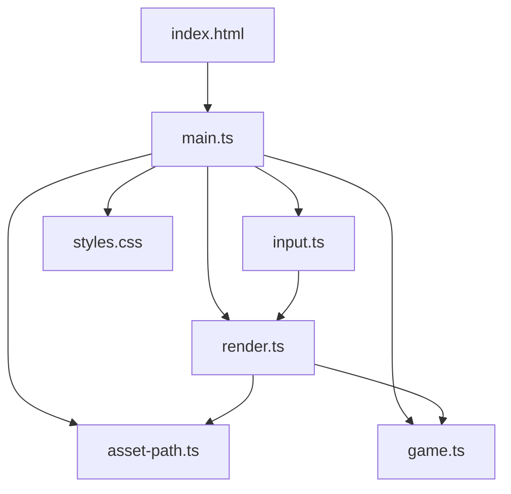
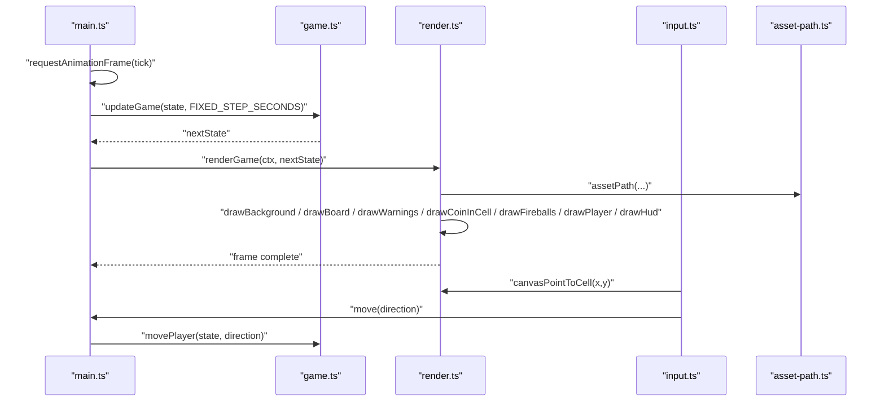
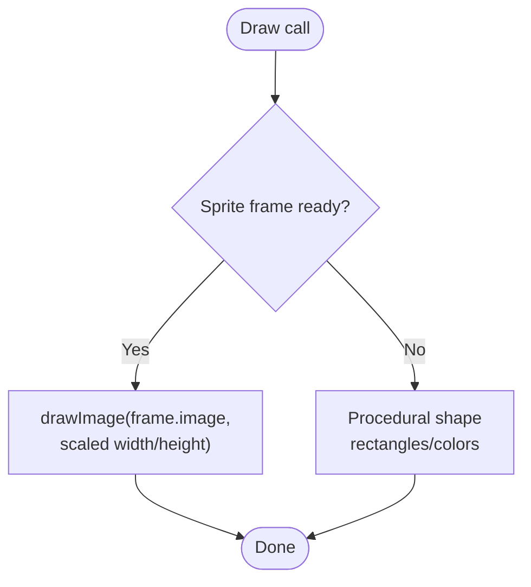
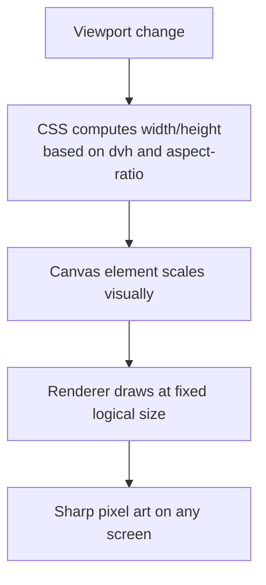
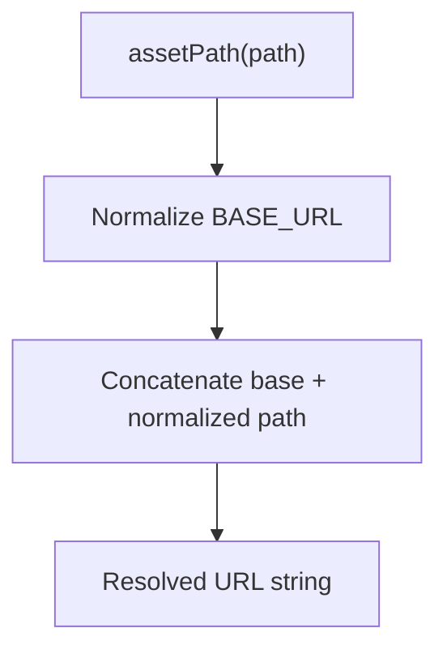
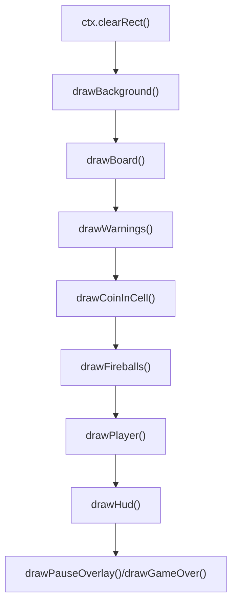
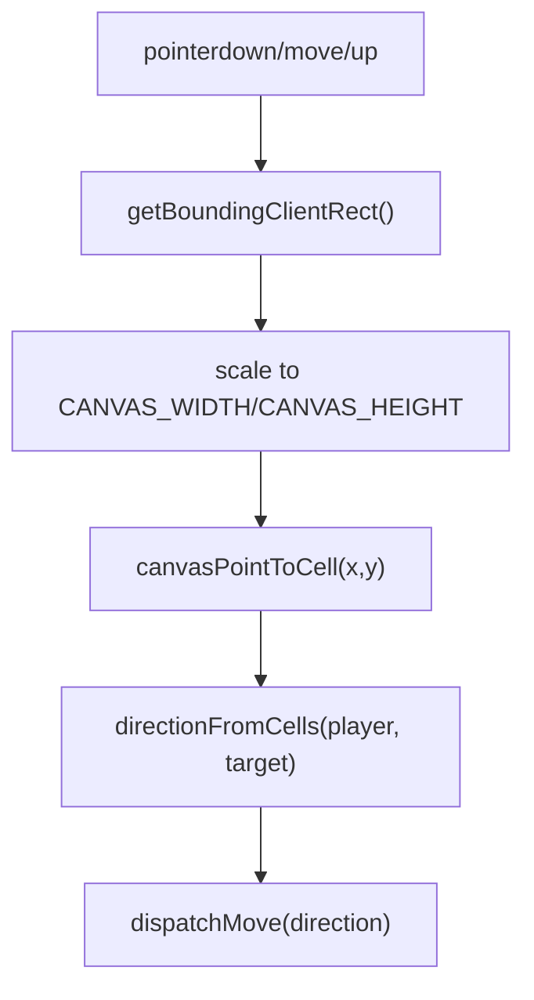
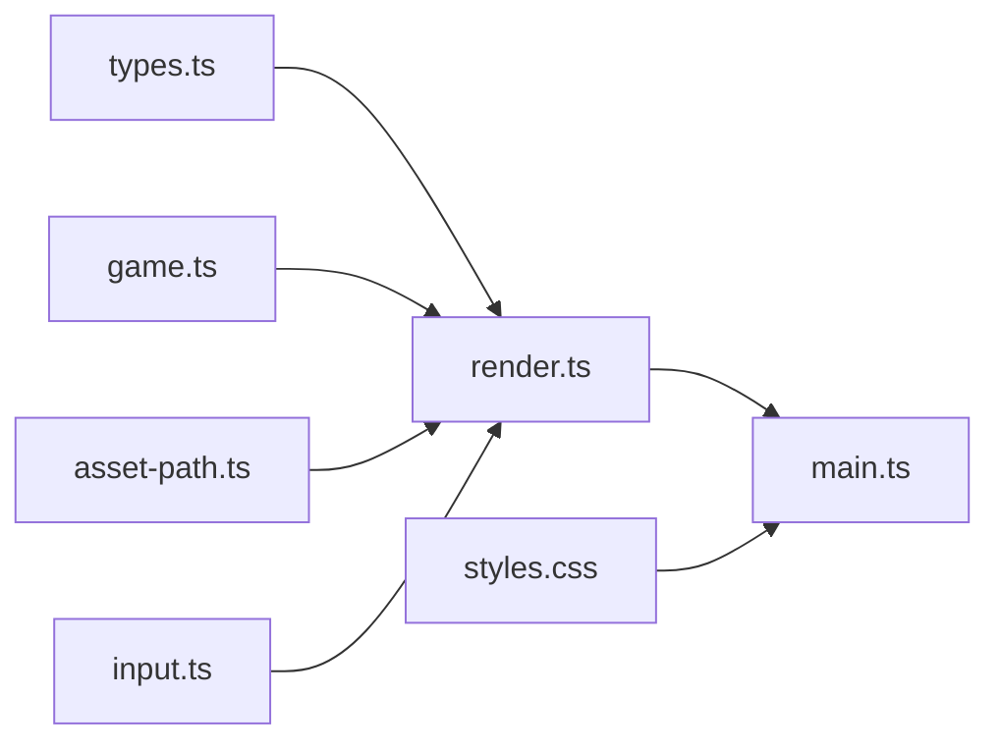

# Rendering System

<cite>
**Referenced Files in This Document**
- [render.ts](file://src/render.ts)
- [game.ts](file://src/game.ts)
- [main.ts](file://src/main.ts)
- [asset-path.ts](file://src/asset-path.ts)
- [input.ts](file://src/input.ts)
- [types.ts](file://src/types.ts)
- [styles.css](file://src/styles.css)
- [index.html](file://index.html)
</cite>

## Table of Contents
1. [Introduction](#introduction)
2. [Project Structure](#project-structure)
3. [Core Components](#core-components)
4. [Architecture Overview](#architecture-overview)
5. [Detailed Component Analysis](#detailed-component-analysis)
6. [Dependency Analysis](#dependency-analysis)
7. [Performance Considerations](#performance-considerations)
8. [Troubleshooting Guide](#troubleshooting-guide)
9. [Conclusion](#conclusion)
10. [Appendices](#appendices)

## Introduction
This document explains the Canvas-based rendering system for a pixel-art browser game. It covers:
- Sprite animation with frame-by-frame rendering and procedural fallbacks when assets fail to load
- Responsive canvas scaling across screen sizes and orientations
- Asset path resolution for flexible deployment
- Coordinate transformation from game logic positions to screen coordinates
- Drawing primitives, sprite loading, and animation loops
- Performance optimization techniques such as batching draws and minimizing canvas operations
- CSS styling integration for responsive design and accessibility

## Project Structure
The rendering system is implemented primarily in render.ts, integrated by main.ts, and styled via styles.css. The HTML entry point provides the canvas and UI controls. Input handling bridges user actions to game state updates.



**Diagram sources**
- [index.html:10-18](file://index.html#L10-L18)
- [main.ts:1-160](file://src/main.ts#L1-L160)
- [render.ts:1-721](file://src/render.ts#L1-L721)
- [game.ts:1-426](file://src/game.ts#L1-L426)
- [input.ts:1-255](file://src/input.ts#L1-L255)
- [asset-path.ts:1-5](file://src/asset-path.ts#L1-L5)
- [styles.css:1-132](file://src/styles.css#L1-L132)

**Section sources**
- [index.html:10-18](file://index.html#L10-L18)
- [main.ts:1-160](file://src/main.ts#L1-L160)
- [render.ts:1-721](file://src/render.ts#L1-L721)
- [game.ts:1-426](file://src/game.ts#L1-L426)
- [input.ts:1-255](file://src/input.ts#L1-L255)
- [asset-path.ts:1-5](file://src/asset-path.ts#L1-L5)
- [styles.css:1-132](file://src/styles.css#L1-L132)

## Core Components
- Canvas constants and grid metrics define logical drawing dimensions and cell layout.
- Sprite frames are loaded asynchronously with readiness flags; procedural fallbacks draw shapes when images are unavailable.
- The renderer composes background, board, warnings, coins, fireballs, player, HUD, overlays, and banners each frame.
- Coordinate utilities map between canvas pixels, grid cells, and world positions.
- The asset path utility resolves paths relative to the deployment base URL.
- The input system translates pointer and keyboard events into directional moves using coordinate transformations.
- The main loop uses fixed timestep updates and requestAnimationFrame-driven rendering.

Key responsibilities:
- render.ts: all drawing, sprite management, procedural fallbacks, coordinate transforms
- game.ts: game state, fireball motion, collision, spawning (used by renderer for positioning and rotation)
- main.ts: initialization, fixed-step update loop, audio sync, control synchronization
- asset-path.ts: BASE_URL-aware asset path resolution
- input.ts: event binding, coordinate mapping to canvas space, direction computation
- types.ts: shared types and constants used by renderer and game logic
- styles.css: responsive canvas sizing, pixelated image rendering, accessible UI buttons

**Section sources**
- [render.ts:1-721](file://src/render.ts#L1-L721)
- [game.ts:1-426](file://src/game.ts#L1-L426)
- [main.ts:1-160](file://src/main.ts#L1-L160)
- [asset-path.ts:1-5](file://src/asset-path.ts#L1-L5)
- [input.ts:1-255](file://src/input.ts#L1-L255)
- [types.ts:1-54](file://src/types.ts#L1-L54)
- [styles.css:1-132](file://src/styles.css#L1-L132)

## Architecture Overview
The rendering pipeline integrates with the game loop and input system. Each frame:
- The main loop accumulates time and advances game state at a fixed step.
- The renderer clears the canvas and draws layers in order: background, board, warnings, coin, fireballs, player, HUD, overlays, banners.
- Sprites are drawn if ready; otherwise, procedural graphics are rendered.
- Input events are transformed into canvas coordinates and mapped to grid cells.



**Diagram sources**
- [main.ts:107-136](file://src/main.ts#L107-L136)
- [render.ts:166-185](file://src/render.ts#L166-L185)
- [input.ts:224-231](file://src/input.ts#L224-L231)
- [asset-path.ts:1-5](file://src/asset-path.ts#L1-L5)

## Detailed Component Analysis

### Sprite Animation and Procedural Fallbacks
- Sprite frames are created with an async Image loader and a ready flag. Numbered sprites are generated from prefixes.
- During drawing, if a frame is not ready or invalid, the renderer falls back to procedural shapes that mimic the intended visual.
- Player, coin, warning, and fireball animations use elapsed time to select frames.



**Diagram sources**
- [render.ts:141-164](file://src/render.ts#L141-L164)
- [render.ts:487-537](file://src/render.ts#L487-L537)
- [render.ts:645-694](file://src/render.ts#L645-L694)
- [render.ts:316-357](file://src/render.ts#L316-L357)
- [render.ts:396-485](file://src/render.ts#L396-L485)

**Section sources**
- [render.ts:141-164](file://src/render.ts#L141-L164)
- [render.ts:487-537](file://src/render.ts#L487-L537)
- [render.ts:645-694](file://src/render.ts#L645-L694)
- [render.ts:316-357](file://src/render.ts#L316-L357)
- [render.ts:396-485](file://src/render.ts#L396-L485)

### Responsive Canvas Scaling
- The canvas has a fixed logical size defined by constants.
- CSS sets the canvas width based on viewport height and aspect ratio, ensuring it fits within the screen while preserving pixel art clarity.
- image-rendering is set to pixelated/crisp-edges to avoid blurring.



**Diagram sources**
- [styles.css:40-49](file://src/styles.css#L40-L49)
- [render.ts:5-12](file://src/render.ts#L5-L12)

**Section sources**
- [styles.css:40-49](file://src/styles.css#L40-L49)
- [render.ts:5-12](file://src/render.ts#L5-L12)

### Asset Path Resolution Utility
- Resolves asset paths relative to import.meta.env.BASE_URL, normalizing trailing slashes and stripping leading slashes from provided paths.
- Used throughout the renderer to construct absolute URLs for images.



**Diagram sources**
- [asset-path.ts:1-5](file://src/asset-path.ts#L1-L5)

**Section sources**
- [asset-path.ts:1-5](file://src/asset-path.ts#L1-L5)

### Coordinate Transformation System
- Grid constants define cell size, gap, stride, and grid origin offsets.
- canvasPointToCell converts canvas pixel coordinates to grid row/col.
- cellCenter maps a grid cell to its center pixel position.
- Fireball positions and rotations are computed from game logic and then converted to screen coordinates for drawing.

```mermaid
classDiagram
class RenderConstants {
+CANVAS_WIDTH
+CANVAS_HEIGHT
+CELL_SIZE
+CELL_GAP
+GRID_LEFT
+GRID_TOP
+GRID_STRIDE
+GRID_PIXEL_SIZE
}
class Transform {
+canvasPointToCell(x,y) Cell|null
+cellCenter(cell) {x,y}
}
class GameLogic {
+getFireballPosition(fireball) FireballPosition
+getFireballRotation(fireball) number
}
RenderConstants <.. Transform : "uses"
Transform <.. GameLogic : "consumes positions"
```

**Diagram sources**
- [render.ts:5-12](file://src/render.ts#L5-L12)
- [render.ts:187-203](file://src/render.ts#L187-L203)
- [render.ts:696-701](file://src/render.ts#L696-L701)
- [game.ts:168-185](file://src/game.ts#L168-L185)

**Section sources**
- [render.ts:5-12](file://src/render.ts#L5-L12)
- [render.ts:187-203](file://src/render.ts#L187-L203)
- [render.ts:696-701](file://src/render.ts#L696-L701)
- [game.ts:168-185](file://src/game.ts#L168-L185)

### Drawing Primitives and Scene Composition
- Background: solid fill plus animated snow rectangles.
- Board: either a cropped background image or procedurally drawn tiles with highlights and shadows.
- Warnings: animated icons near edges or procedural rectangles if missing.
- Coin: animated sprite or mini procedural coin.
- Fireballs: animated sprites per edge or procedural layered rectangles with flicker.
- Player: animated sprite or procedural character with shadow.
- HUD and overlays: text and banners, with procedural fallbacks.



**Diagram sources**
- [render.ts:166-185](file://src/render.ts#L166-L185)
- [render.ts:205-222](file://src/render.ts#L205-L222)
- [render.ts:242-314](file://src/render.ts#L242-L314)
- [render.ts:316-357](file://src/render.ts#L316-L357)
- [render.ts:359-368](file://src/render.ts#L359-L368)
- [render.ts:370-485](file://src/render.ts#L370-L485)
- [render.ts:487-537](file://src/render.ts#L487-L537)
- [render.ts:229-240](file://src/render.ts#L229-L240)
- [render.ts:564-586](file://src/render.ts#L564-L586)

**Section sources**
- [render.ts:166-185](file://src/render.ts#L166-L185)
- [render.ts:205-222](file://src/render.ts#L205-L222)
- [render.ts:242-314](file://src/render.ts#L242-L314)
- [render.ts:316-357](file://src/render.ts#L316-L357)
- [render.ts:359-368](file://src/render.ts#L359-L368)
- [render.ts:370-485](file://src/render.ts#L370-L485)
- [render.ts:487-537](file://src/render.ts#L487-L537)
- [render.ts:229-240](file://src/render.ts#L229-L240)
- [render.ts:564-586](file://src/render.ts#L564-L586)

### Animation Loops and Timing
- Fixed timestep updates ensure deterministic simulation regardless of frame rate.
- Accumulator drives multiple updates per frame when needed, capped by maximum frame delta to prevent spiral-of-death.
- Rendering occurs every frame after updates.

```mermaid
sequenceDiagram
participant Loop as "tick(now)"
participant Acc as "accumulator"
participant State as "state"
Loop->>Loop : "frameSeconds = min(MAX_FRAME_SECONDS, dt)"
alt playing
Loop->>Acc : "accumulator += frameSeconds"
loop while accumulator >= FIXED_STEP_SECONDS
Loop->>State : "updateGame(state, FIXED_STEP_SECONDS)"
Loop->>Acc : "accumulator -= FIXED_STEP_SECONDS"
end
else paused/game over
Loop->>Acc : "accumulator = 0"
end
Loop->>Render : "renderGame(ctx, state)"
Loop->>Loop : "requestAnimationFrame(tick)"
```

**Diagram sources**
- [main.ts:107-136](file://src/main.ts#L107-L136)

**Section sources**
- [main.ts:107-136](file://src/main.ts#L107-L136)

### Input-to-Rendering Coordinate Mapping
- Pointer events are translated to canvas coordinates using getBoundingClientRect and scaled to the logical canvas size.
- canvasPointToCell maps canvas points to grid cells for tap/swipe decisions.



**Diagram sources**
- [input.ts:224-231](file://src/input.ts#L224-L231)
- [input.ts:241-254](file://src/input.ts#L241-L254)
- [render.ts:187-203](file://src/render.ts#L187-L203)

**Section sources**
- [input.ts:224-231](file://src/input.ts#L224-L231)
- [input.ts:241-254](file://src/input.ts#L241-L254)
- [render.ts:187-203](file://src/render.ts#L187-L203)

## Dependency Analysis
The renderer depends on:
- Types and constants from types.ts
- Game logic helpers for fireball position and rotation from game.ts
- Asset path resolver from asset-path.ts
- Input module uses renderer’s coordinate conversion



**Diagram sources**
- [render.ts:1-4](file://src/render.ts#L1-L4)
- [input.ts:1-2](file://src/input.ts#L1-L2)
- [main.ts:1-9](file://src/main.ts#L1-L9)

**Section sources**
- [render.ts:1-4](file://src/render.ts#L1-L4)
- [input.ts:1-2](file://src/input.ts#L1-L2)
- [main.ts:1-9](file://src/main.ts#L1-L9)

## Performance Considerations
- Batch draw calls:
  - Background snow is drawn in a tight loop using repeated fillRect calls with minimal state changes.
  - Board tiles reuse color assignments and draw sequences to reduce overhead.
- Minimize context state changes:
  - GlobalAlpha is only applied when drawing shadows; restored immediately after.
  - ctx.save/restore used around transformations for fireballs and player to isolate state.
- Avoid unnecessary computations:
  - Frame indices are computed using integer division and modulo against elapsed time.
  - Offscreen travel and warning durations filter out inactive fireballs before drawing.
- Pixel-perfect rendering:
  - imageSmoothingEnabled is disabled to keep crisp pixel art.
  - CSS image-rendering ensures no interpolation during scaling.
- Efficient sprite selection:
  - Precomputed arrays of SpriteFrame objects avoid repeated lookups.
- Early exits:
  - If ice map image is ready, procedural board drawing is skipped entirely.

[No sources needed since this section provides general guidance]

## Troubleshooting Guide
Common issues and resolutions:
- Assets not loading:
  - Ensure BASE_URL is correctly configured for your deployment environment.
  - Verify asset files exist at resolved paths.
  - Renderer will fall back to procedural graphics automatically if images are not ready.
- Canvas not supported:
  - The app throws an error if getContext("2d") fails; check browser compatibility.
- Incorrect input mapping:
  - Confirm canvas bounding rect and scaling are correct; pointer events must be captured properly.
- Stuttering or lag:
  - Ensure MAX_FRAME_SECONDS caps large deltas; verify update loop runs at fixed steps.
- Accessibility:
  - Buttons have aria-labels and focus outlines; ensure they remain visible and operable.

**Section sources**
- [asset-path.ts:1-5](file://src/asset-path.ts#L1-L5)
- [render.ts:133-139](file://src/render.ts#L133-L139)
- [main.ts:31-35](file://src/main.ts#L31-L35)
- [input.ts:123-139](file://src/input.ts#L123-L139)
- [main.ts:107-136](file://src/main.ts#L107-L136)
- [styles.css:80-83](file://src/styles.css#L80-L83)
- [styles.css:128-131](file://src/styles.css#L128-L131)

## Conclusion
The rendering system combines robust sprite animation with resilient procedural fallbacks, precise coordinate transformations, and responsive scaling. Its modular structure separates concerns between rendering, game logic, input, and asset resolution, enabling maintainability and performance. With careful attention to draw batching, state minimization, and CSS-driven responsiveness, the game delivers consistent visuals across devices and environments.

[No sources needed since this section summarizes without analyzing specific files]

## Appendices

### Examples Reference Paths
- Drawing primitives:
  - Snow particles and HUD text: [render.ts:205-222](file://src/render.ts#L205-L222), [render.ts:229-240](file://src/render.ts#L229-L240)
  - Procedural board tiles: [render.ts:261-314](file://src/render.ts#L261-L314)
- Sprite loading and animation:
  - Sprite frame creation: [render.ts:141-164](file://src/render.ts#L141-L164)
  - Player animation and fallback: [render.ts:487-537](file://src/render.ts#L487-L537)
  - Coin animation and fallback: [render.ts:645-694](file://src/render.ts#L645-L694)
  - Warning and fireball animations with fallbacks: [render.ts:316-357](file://src/render.ts#L316-L357), [render.ts:396-485](file://src/render.ts#L396-L485)
- Animation loop:
  - Fixed timestep loop: [main.ts:107-136](file://src/main.ts#L107-L136)
- Coordinate transformations:
  - Canvas to cell: [render.ts:187-203](file://src/render.ts#L187-L203)
  - Cell to center: [render.ts:696-701](file://src/render.ts#L696-L701)
  - Input coordinate mapping: [input.ts:224-231](file://src/input.ts#L224-L231)
- Asset path resolution:
  - Utility function: [asset-path.ts:1-5](file://src/asset-path.ts#L1-L5)
- Responsive CSS:
  - Canvas scaling and pixelation: [styles.css:40-49](file://src/styles.css#L40-L49)

**Section sources**
- [render.ts:205-222](file://src/render.ts#L205-L222)
- [render.ts:229-240](file://src/render.ts#L229-L240)
- [render.ts:261-314](file://src/render.ts#L261-L314)
- [render.ts:141-164](file://src/render.ts#L141-L164)
- [render.ts:487-537](file://src/render.ts#L487-L537)
- [render.ts:645-694](file://src/render.ts#L645-L694)
- [render.ts:316-357](file://src/render.ts#L316-L357)
- [render.ts:396-485](file://src/render.ts#L396-L485)
- [main.ts:107-136](file://src/main.ts#L107-L136)
- [render.ts:187-203](file://src/render.ts#L187-L203)
- [render.ts:696-701](file://src/render.ts#L696-L701)
- [input.ts:224-231](file://src/input.ts#L224-L231)
- [asset-path.ts:1-5](file://src/asset-path.ts#L1-L5)
- [styles.css:40-49](file://src/styles.css#L40-L49)