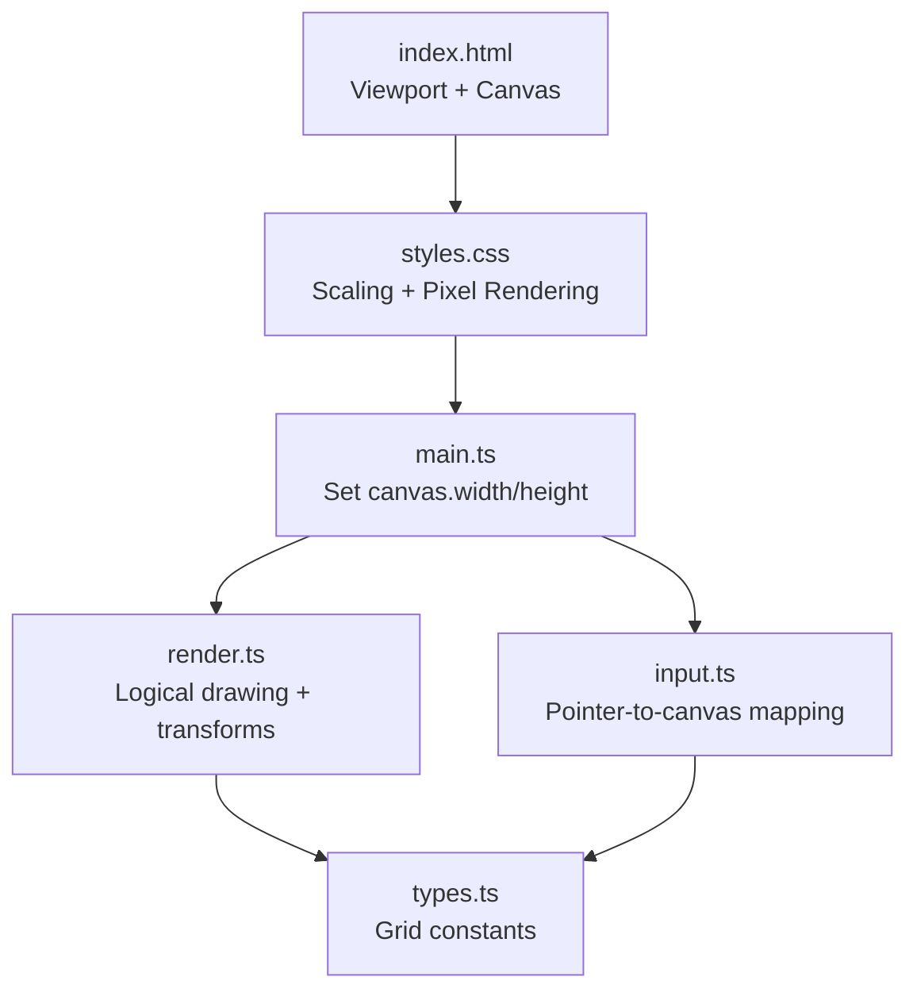
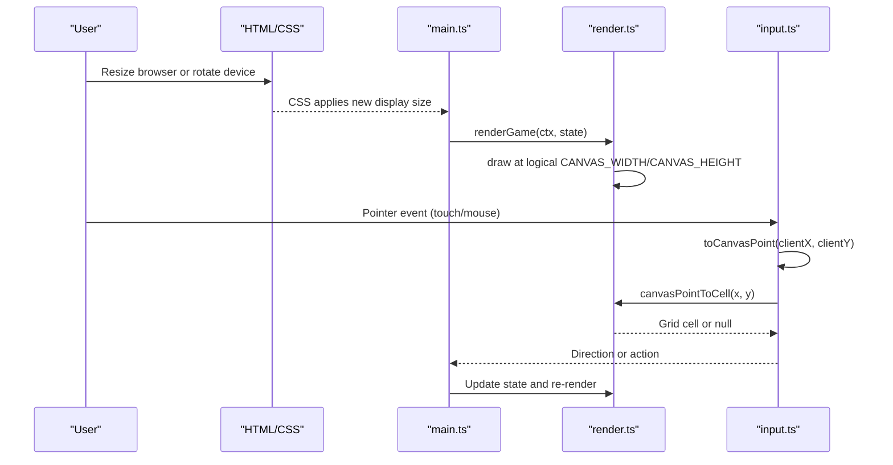
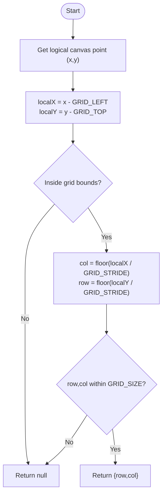
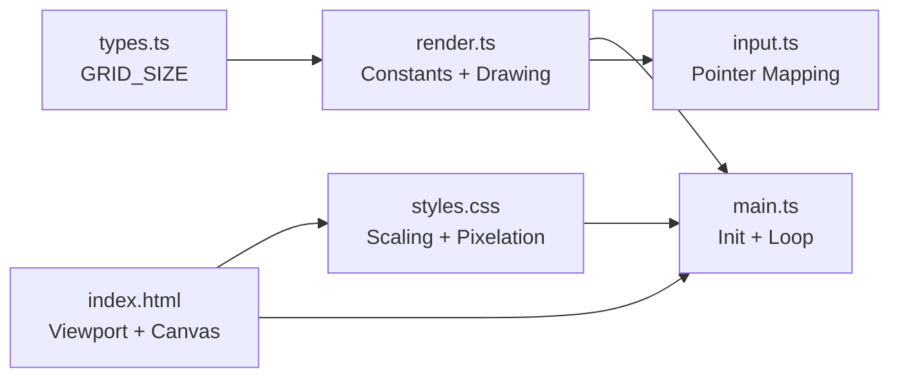

# Responsive Canvas Scaling

<cite>
**Referenced Files in This Document**
- [index.html](file://index.html)
- [src/styles.css](file://src/styles.css)
- [src/main.ts](file://src/main.ts)
- [src/render.ts](file://src/render.ts)
- [src/input.ts](file://src/input.ts)
- [src/types.ts](file://src/types.ts)
</cite>

## Table of Contents
1. [Introduction](#introduction)
2. [Project Structure](#project-structure)
3. [Core Components](#core-components)
4. [Architecture Overview](#architecture-overview)
5. [Detailed Component Analysis](#detailed-component-analysis)
6. [Dependency Analysis](#dependency-analysis)
7. [Performance Considerations](#performance-considerations)
8. [Troubleshooting Guide](#troubleshooting-guide)
9. [Conclusion](#conclusion)

## Introduction
This document explains the responsive canvas scaling implementation used by the game. It focuses on how a fixed logical canvas size is maintained while CSS scales the element to fit any screen, how coordinate transformations map between grid cells and screen pixels, and how pixel-perfect rendering is achieved across devices and orientations. It also includes practical examples for converting coordinates and guidance for mobile-specific considerations.

## Project Structure
The responsive scaling spans HTML, CSS, and JavaScript/TypeScript:
- The HTML defines the viewport and the canvas element with its intrinsic dimensions.
- CSS scales the canvas to fit the viewport while preserving aspect ratio and enabling crisp pixel rendering.
- TypeScript sets the internal canvas resolution to the logical size and renders at that resolution.
- Input handling converts pointer events into logical canvas coordinates using the same constants.

**Diagram sources**
- [index.html:1-22](file://index.html#L1-L22)
- [src/styles.css:1-132](file://src/styles.css#L1-L132)
- [src/main.ts:1-160](file://src/main.ts#L1-L160)
- [src/render.ts:1-721](file://src/render.ts#L1-L721)
- [src/input.ts:1-255](file://src/input.ts#L1-L255)
- [src/types.ts:1-54](file://src/types.ts#L1-L54)

**Section sources**
- [index.html:1-22](file://index.html#L1-L22)
- [src/styles.css:1-132](file://src/styles.css#L1-L132)
- [src/main.ts:1-160](file://src/main.ts#L1-L160)
- [src/render.ts:1-721](file://src/render.ts#L1-L721)
- [src/input.ts:1-255](file://src/input.ts#L1-L255)
- [src/types.ts:1-54](file://src/types.ts#L1-L54)

## Core Components
- Fixed logical canvas size: CANVAS_WIDTH and CANVAS_HEIGHT define the internal resolution used for all drawing and logic.
- CSS scaling: The canvas element is scaled via CSS to fit the viewport while maintaining aspect ratio; image smoothing is disabled for crisp pixels.
- Coordinate transformation system: GRID_LEFT, GRID_TOP, GRID_STRIDE, CELL_SIZE, CELL_GAP, and GRID_PIXEL_SIZE map grid cells to screen coordinates.
- Input mapping: Pointer events are converted to logical canvas coordinates using the same constants.

Key responsibilities:
- HTML provides the viewport and initial canvas attributes.
- CSS ensures responsive sizing and pixel-perfect rendering.
- main.ts initializes the canvas context and sets the internal resolution.
- render.ts performs all drawing at the logical resolution and exposes conversion utilities.
- input.ts maps user interactions to logical coordinates and grid cells.

**Section sources**
- [src/render.ts:5-12](file://src/render.ts#L5-L12)
- [src/render.ts:166-185](file://src/render.ts#L166-L185)
- [src/render.ts:187-203](file://src/render.ts#L187-L203)
- [src/input.ts:224-231](file://src/input.ts#L224-L231)
- [src/main.ts:26-28](file://src/main.ts#L26-L28)
- [src/styles.css:40-49](file://src/styles.css#L40-L49)
- [index.html:5](file://index.html#L5)

## Architecture Overview
The system separates logical resolution from display size:
- Logical resolution is fixed (CANVAS_WIDTH x CANVAS_HEIGHT).
- CSS scales the canvas element to fit the viewport without changing the logical resolution.
- All drawing uses logical coordinates.
- Input coordinates are normalized to logical coordinates before being mapped to grid cells.

**Diagram sources**
- [src/styles.css:40-49](file://src/styles.css#L40-L49)
- [src/main.ts:107-136](file://src/main.ts#L107-L136)
- [src/render.ts:166-185](file://src/render.ts#L166-L185)
- [src/input.ts:123-192](file://src/input.ts#L123-L192)
- [src/input.ts:224-231](file://src/input.ts#L224-L231)
- [src/render.ts:187-203](file://src/render.ts#L187-L203)

## Detailed Component Analysis

### Fixed Logical Canvas Size
- CANVAS_WIDTH and CANVAS_HEIGHT define the logical canvas resolution independent of the display size.
- main.ts assigns these values to canvas.width and canvas.height so all drawing occurs at this fixed resolution.
- This approach guarantees consistent gameplay and visuals regardless of device pixel density or screen size.

Practical implications:
- Game logic and rendering use integer grid positions based on these constants.
- Scaling is handled entirely by CSS, not by resizing the canvas buffer.

**Section sources**
- [src/render.ts:5-6](file://src/render.ts#L5-L6)
- [src/main.ts:26-28](file://src/main.ts#L26-L28)

### CSS Scaling and Aspect Ratio
- The canvas is centered and sized to fit the viewport while preserving its aspect ratio.
- CSS properties ensure:
  - Width adapts to the smaller dimension of the viewport considering height constraints.
  - Height remains auto to preserve aspect ratio.
  - Max-height prevents overflow below the safe area.
  - image-rendering disables smoothing for crisp pixel art.
- The viewport meta tag enables proper mobile behavior and safe-area support.

Mobile and orientation considerations:
- Using dynamic viewport units helps account for mobile UI chrome.
- Safe-area insets keep interactive elements within visible areas on devices with notches or home indicators.
- touch-action and user-select prevent unwanted gestures and selection during play.

**Section sources**
- [src/styles.css:23-49](file://src/styles.css#L23-L49)
- [src/styles.css:54-73](file://src/styles.css#L54-L73)
- [src/styles.css:85-131](file://src/styles.css#L85-L131)
- [index.html:5](file://index.html#L5)

### Coordinate Transformation System
The system maps between three spaces:
- Grid space: discrete cells (row, col).
- Logical canvas space: pixels within CANVAS_WIDTH x CANVAS_HEIGHT.
- Display space: CSS-scaled pixels on screen.

Key constants:
- CELL_SIZE and CELL_GAP define tile geometry.
- GRID_STRIDE = CELL_SIZE + CELL_GAP is the step per cell.
- GRID_LEFT and GRID_TOP define the top-left offset of the grid.
- GRID_PIXEL_SIZE is the total grid width/height in logical pixels.

Mapping formulas:
- From grid cell to logical canvas:
  - x = GRID_LEFT + col * GRID_STRIDE + CELL_SIZE / 2
  - y = GRID_TOP + row * GRID_STRIDE + CELL_SIZE / 2
- From logical canvas to grid cell:
  - localX = x - GRID_LEFT
  - localY = y - GRID_TOP
  - col = floor(localX / GRID_STRIDE)
  - row = floor(localY / GRID_STRIDE)
  - Validate bounds against GRID_SIZE and GRID_PIXEL_SIZE.

Examples:
- To find the center of cell (row=1, col=2):
  - Use the grid-to-canvas formula above.
- To convert a pointer tap at logical point (x=150, y=220) to a cell:
  - Subtract GRID_LEFT/GIRD_TOP, divide by GRID_STRIDE, and clamp to valid ranges.

These conversions are implemented in render.ts and used by input.ts to determine movement direction.

**Diagram sources**
- [src/render.ts:187-203](file://src/render.ts#L187-L203)
- [src/render.ts:696-701](file://src/render.ts#L696-L701)
- [src/types.ts:1](file://src/types.ts#L1)

**Section sources**
- [src/render.ts:7-12](file://src/render.ts#L7-L12)
- [src/render.ts:187-203](file://src/render.ts#L187-L203)
- [src/render.ts:696-701](file://src/render.ts#L696-L701)
- [src/types.ts:1](file://src/types.ts#L1)

### Pixel-Perfect Rendering Settings
- ctx.imageSmoothingEnabled = false ensures images are drawn without interpolation, producing sharp pixel art.
- CSS image-rendering: pixelated and crisp-edges reinforce crisp scaling when the canvas is resized by CSS.

Why it matters:
- Prevents blurriness when the canvas is upscaled or downscaled by CSS.
- Keeps sprites and tiles aligned to pixel boundaries.

**Section sources**
- [src/render.ts:166-168](file://src/render.ts#L166-L168)
- [src/styles.css:44-46](file://src/styles.css#L44-L46)

### Handling Device Orientations and Screen Densities
- Orientation changes: CSS recalculates the canvas display size based on viewport dimensions while keeping the logical resolution constant.
- High DPI screens: Because the logical resolution is fixed, the browser may scale the canvas up or down depending on CSS sizing. Crisp rendering is preserved by disabling smoothing.
- Safe areas: Buttons and overlays respect env(safe-area-inset-*), ensuring they remain accessible on devices with notches or curved edges.

Best practices observed:
- Use dynamic viewport units for responsive layout.
- Keep the logical resolution fixed and rely on CSS for display scaling.
- Disable smoothing for pixel art.

**Section sources**
- [src/styles.css:23-49](file://src/styles.css#L23-L49)
- [src/styles.css:54-73](file://src/styles.css#L54-L73)
- [src/styles.css:85-131](file://src/styles.css#L85-L131)
- [index.html:5](file://index.html#L5)

### Mobile-Specific Considerations
- Touch target sizing: Pause button is large enough for comfortable tapping; restart button scales responsively and respects safe areas.
- Gesture control: Pointer events handle both mouse and touch uniformly; swipe thresholds avoid accidental moves.
- Viewport meta tags: width=device-width, initial-scale=1.0, and viewport-fit=cover enable correct layout on mobile browsers.

**Section sources**
- [src/styles.css:85-131](file://src/styles.css#L85-L131)
- [src/input.ts:123-192](file://src/input.ts#L123-L192)
- [index.html:5](file://index.html#L5)

## Dependency Analysis
The following diagram shows how modules depend on each other for responsive scaling and coordinate mapping.

**Diagram sources**
- [src/types.ts:1](file://src/types.ts#L1)
- [src/render.ts:5-12](file://src/render.ts#L5-L12)
- [src/main.ts:1-10](file://src/main.ts#L1-L10)
- [src/input.ts:1-10](file://src/input.ts#L1-L10)
- [src/styles.css:40-49](file://src/styles.css#L40-L49)
- [index.html:1-12](file://index.html#L1-L12)

**Section sources**
- [src/types.ts:1](file://src/types.ts#L1)
- [src/render.ts:5-12](file://src/render.ts#L5-L12)
- [src/main.ts:1-10](file://src/main.ts#L1-L10)
- [src/input.ts:1-10](file://src/input.ts#L1-L10)
- [src/styles.css:40-49](file://src/styles.css#L40-L49)
- [index.html:1-12](file://index.html#L1-L12)

## Performance Considerations
- Fixed logical resolution avoids expensive reflows and keeps the rendering pipeline predictable.
- Disabling image smoothing reduces GPU texture filtering overhead and improves visual fidelity for pixel art.
- CSS-based scaling offloads resizing to the compositor, which is efficient on modern browsers.
- Avoid dynamically changing canvas.width/height at runtime; instead, keep them constant and let CSS handle display size.

[No sources needed since this section provides general guidance]

## Troubleshooting Guide
Common issues and resolutions:
- Blurry or soft graphics:
  - Ensure ctx.imageSmoothingEnabled is set to false during rendering.
  - Confirm CSS image-rendering is set to pixelated/crisp-edges.
- Misaligned clicks or taps:
  - Verify pointer coordinates are converted to logical canvas coordinates using getBoundingClientRect and the fixed CANVAS_WIDTH/CANVAS_HEIGHT.
  - Check that canvasPointToCell uses GRID_LEFT, GRID_TOP, and GRID_STRIDE consistently.
- Canvas overflows or clipped content:
  - Review CSS max-height and aspect-ratio settings; ensure safe-area insets are respected for buttons.
- Orientation glitches:
  - Rely on CSS to recalculate sizes on orientation change; do not resize the canvas buffer manually.
- Mobile UI chrome interference:
  - Use dynamic viewport units and safe-area insets to keep interactive elements visible.

**Section sources**
- [src/render.ts:166-168](file://src/render.ts#L166-L168)
- [src/styles.css:44-49](file://src/styles.css#L44-L49)
- [src/input.ts:224-231](file://src/input.ts#L224-L231)
- [src/render.ts:187-203](file://src/render.ts#L187-L203)
- [src/styles.css:54-73](file://src/styles.css#L54-L73)
- [src/styles.css:85-131](file://src/styles.css#L85-L131)

## Conclusion
The responsive canvas scaling implementation cleanly separates logical resolution from display size. Fixed constants define the game’s coordinate space, CSS handles responsive scaling while preserving aspect ratio and pixel clarity, and input mapping ensures accurate interaction across devices and orientations. Following these patterns yields crisp, predictable visuals and reliable controls on desktop and mobile platforms alike.