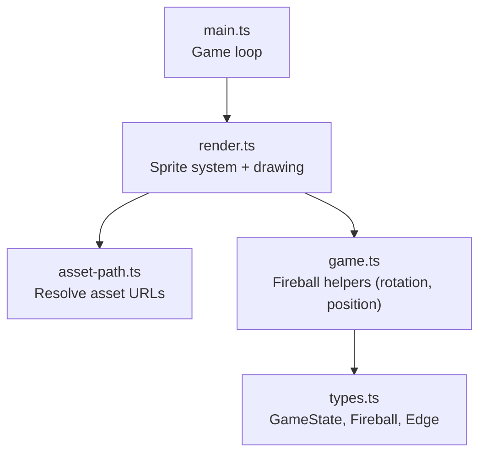
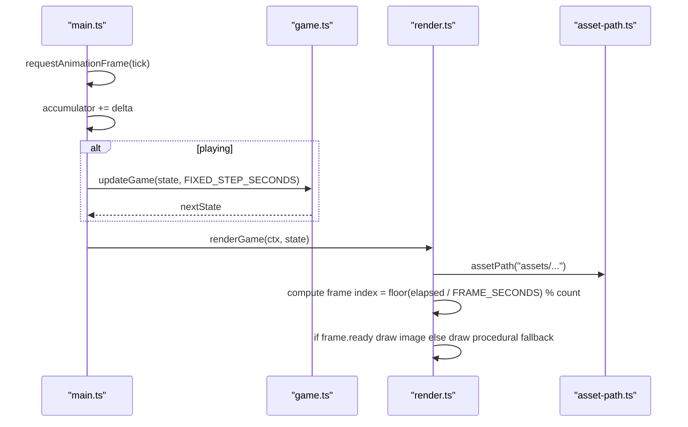
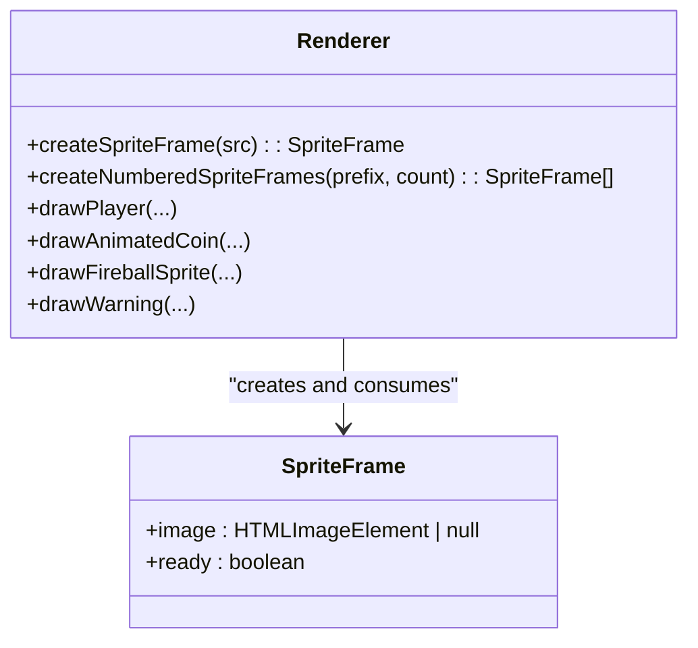
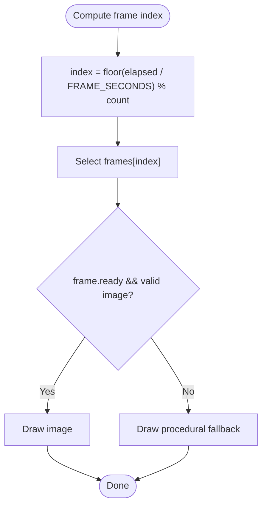
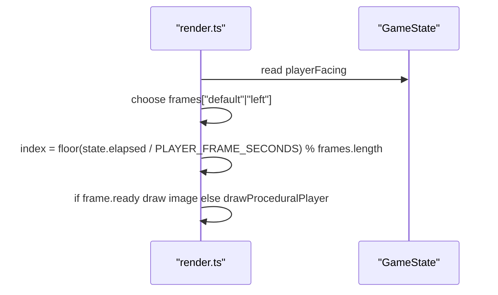
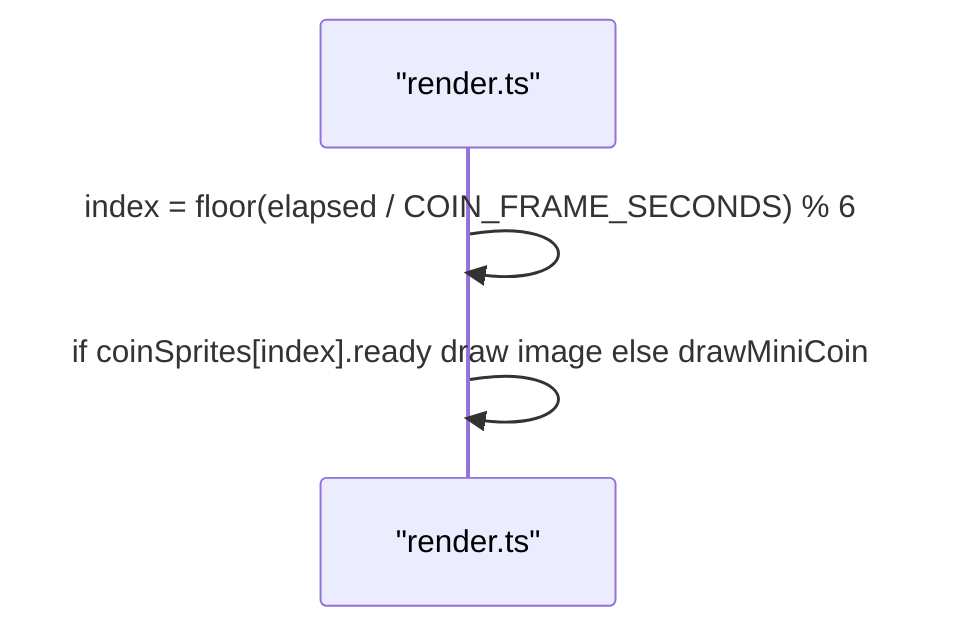
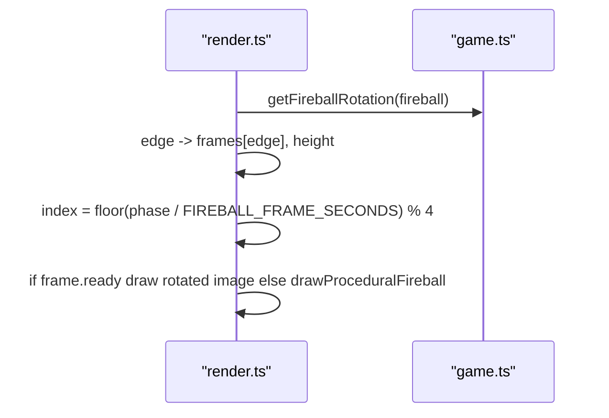
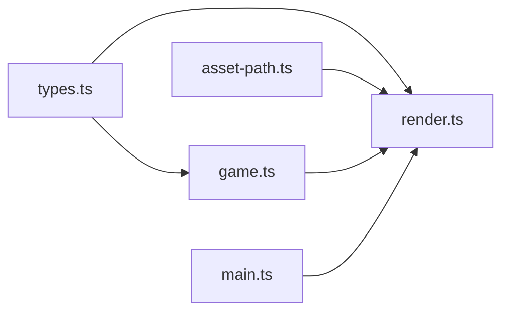

# Sprite Animation System

<cite>
**Referenced Files in This Document**
- [render.ts](file://src/render.ts)
- [game.ts](file://src/game.ts)
- [types.ts](file://src/types.ts)
- [main.ts](file://src/main.ts)
- [asset-path.ts](file://src/asset-path.ts)
</cite>

## Table of Contents
1. [Introduction](#introduction)
2. [Project Structure](#project-structure)
3. [Core Components](#core-components)
4. [Architecture Overview](#architecture-overview)
5. [Detailed Component Analysis](#detailed-component-analysis)
6. [Dependency Analysis](#dependency-analysis)
7. [Performance Considerations](#performance-considerations)
8. [Troubleshooting Guide](#troubleshooting-guide)
9. [Conclusion](#conclusion)

## Introduction
This document explains the sprite animation system used to render animated game elements such as the player, coins, warnings, and fireballs. It focuses on how frames are loaded asynchronously, how readiness is tracked, how frame sequences are created, and how timing constants drive smooth animations. It also covers fallback procedural graphics when assets fail to load and provides performance guidance for preloading and minimizing canvas operations.

## Project Structure
The sprite animation system lives primarily in the rendering module, with supporting types and a fixed-step game loop that drives elapsed time. Asset paths are resolved via a small utility.

**Diagram sources**
- [main.ts:107-136](file://src/main.ts#L107-L136)
- [render.ts:166-185](file://src/render.ts#L166-L185)
- [asset-path.ts:1-5](file://src/asset-path.ts#L1-L5)
- [game.ts:168-185](file://src/game.ts#L168-L185)
- [types.ts:1-54](file://src/types.ts#L1-L54)

**Section sources**
- [main.ts:107-136](file://src/main.ts#L107-L136)
- [render.ts:166-185](file://src/render.ts#L166-L185)
- [asset-path.ts:1-5](file://src/asset-path.ts#L1-L5)
- [game.ts:168-185](file://src/game.ts#L168-L185)
- [types.ts:1-54](file://src/types.ts#L1-L54)

## Core Components
- SpriteFrame interface: Represents an image frame with a ready flag indicating whether the underlying HTMLImageElement has finished loading.
- createSpriteFrame: Creates a single SpriteFrame by constructing an Image and setting its source; marks ready when onload fires.
- createNumberedSpriteFrames: Generates an array of SpriteFrames from a naming pattern (prefix-index.png).
- Frame timing constants: PLAYER_FRAME_SECONDS, COIN_FRAME_SECONDS, WARNING_FRAME_SECONDS, FIREBALL_FRAME_SECONDS control per-second frame cycling.
- Animation selection: Frames are selected using Math.floor(elapsed / FRAME_SECONDS) % count to cycle through sequences smoothly.
- Fallbacks: If a frame is not ready or invalid, the renderer draws procedural graphics instead.

Key responsibilities:
- Asynchronous asset loading with readiness tracking
- Deterministic frame selection based on global elapsed time
- Directional variants for player and fireballs
- Graceful degradation to procedural graphics

**Section sources**
- [render.ts:48-51](file://src/render.ts#L48-L51)
- [render.ts:141-164](file://src/render.ts#L141-L164)
- [render.ts:23-46](file://src/render.ts#L23-L46)
- [render.ts:487-507](file://src/render.ts#L487-L507)
- [render.ts:645-672](file://src/render.ts#L645-L672)
- [render.ts:396-427](file://src/render.ts#L396-L427)
- [render.ts:429-459](file://src/render.ts#L429-L459)
- [render.ts:316-357](file://src/render.ts#L316-L357)

## Architecture Overview
The rendering pipeline uses a global elapsed time to select frames deterministically. Each drawable element maintains its own frame sequence and timing constant. The main loop increments elapsed time at a fixed step and calls the renderer each frame.

**Diagram sources**
- [main.ts:107-136](file://src/main.ts#L107-L136)
- [game.ts:83-101](file://src/game.ts#L83-L101)
- [render.ts:166-185](file://src/render.ts#L166-L185)
- [asset-path.ts:1-5](file://src/asset-path.ts#L1-L5)

## Detailed Component Analysis

### SpriteFrame Interface and Loading States
- Purpose: Encapsulate an HTMLImageElement and a ready boolean.
- Lifecycle:
  - Created via createSpriteFrame with a URL.
  - ready is initially false.
  - Set to true when the image’s onload event fires.
- Usage: Before drawing, code checks frame.ready and validates naturalWidth > 0.

**Diagram sources**
- [render.ts:48-51](file://src/render.ts#L48-L51)
- [render.ts:141-164](file://src/render.ts#L141-L164)
- [render.ts:487-507](file://src/render.ts#L487-L507)
- [render.ts:645-672](file://src/render.ts#L645-L672)
- [render.ts:396-427](file://src/render.ts#L396-L427)
- [render.ts:316-357](file://src/render.ts#L316-L357)

**Section sources**
- [render.ts:48-51](file://src/render.ts#L48-L51)
- [render.ts:141-164](file://src/render.ts#L141-L164)

### Creating Animated Sequences
- createSpriteFrame:
  - Returns a non-ready frame immediately.
  - Sets ready to true after the image loads.
- createNumberedSpriteFrames:
  - Builds an array of frames following a naming convention like prefix-1.png, prefix-2.png, etc.
  - Uses assetPath to resolve base URL correctly.

Examples in the codebase:
- Player loops: default and left directions, each with two frames.
- Coin spin: six frames generated from a numbered series.
- Warning indicators: three frames.
- Fireballs: directional sets (left/right/top/bottom) plus bending variant.

**Section sources**
- [render.ts:106-131](file://src/render.ts#L106-L131)
- [render.ts:162-164](file://src/render.ts#L162-L164)
- [asset-path.ts:1-5](file://src/asset-path.ts#L1-L5)

### Frame Timing Constants and Smooth Cycling
- PLAYER_FRAME_SECONDS: Controls player walk cycle speed.
- COIN_FRAME_SECONDS: Controls coin spin speed.
- WARNING_FRAME_SECONDS: Controls warning indicator blink speed.
- FIREBALL_FRAME_SECONDS: Controls fireball flicker speed.

Frame selection formula:
- index = Math.floor(elapsed / FRAME_SECONDS) % count
- elapsed is either the global state.elapsed or a per-element phase offset to stagger animations slightly.

**Diagram sources**
- [render.ts:487-507](file://src/render.ts#L487-L507)
- [render.ts:645-672](file://src/render.ts#L645-L672)
- [render.ts:396-427](file://src/render.ts#L396-L427)
- [render.ts:429-459](file://src/render.ts#L429-L459)
- [render.ts:316-357](file://src/render.ts#L316-L357)

**Section sources**
- [render.ts:23-46](file://src/render.ts#L23-L46)
- [render.ts:487-507](file://src/render.ts#L487-L507)
- [render.ts:645-672](file://src/render.ts#L645-L672)
- [render.ts:396-427](file://src/render.ts#L396-L427)
- [render.ts:429-459](file://src/render.ts#L429-L459)
- [render.ts:316-357](file://src/render.ts#L316-L357)

### Player Animations (Facing Directions)
- Two loops: default and left.
- Selection based on playerFacing direction.
- Uses global elapsed time to pick frames.
- Fallback: Procedural player drawn if frames are not ready.

**Diagram sources**
- [render.ts:487-507](file://src/render.ts#L487-L507)

**Section sources**
- [render.ts:106-115](file://src/render.ts#L106-L115)
- [render.ts:487-507](file://src/render.ts#L487-L507)

### Coin Spinning Animation
- Six frames generated from a numbered series.
- Uses COIN_FRAME_SECONDS to determine frame index.
- Fallback: Mini procedural coin drawn if images are unavailable.

**Diagram sources**
- [render.ts:117](file://src/render.ts#L117)
- [render.ts:645-672](file://src/render.ts#L645-L672)

**Section sources**
- [render.ts:117](file://src/render.ts#L117)
- [render.ts:645-672](file://src/render.ts#L645-L672)

### Fireball Directional Animations
- Four directional sets: left, right, top, bottom, each with four frames.
- Bending fireball uses a separate set of four frames.
- Rotation is computed from velocity for proper orientation.
- Fallback: Procedural fireball drawn if sprites are not ready.

**Diagram sources**
- [render.ts:121-131](file://src/render.ts#L121-L131)
- [render.ts:396-427](file://src/render.ts#L396-L427)
- [render.ts:429-459](file://src/render.ts#L429-L459)
- [game.ts:178-185](file://src/game.ts#L178-L185)

**Section sources**
- [render.ts:121-131](file://src/render.ts#L121-L131)
- [render.ts:396-427](file://src/render.ts#L396-L427)
- [render.ts:429-459](file://src/render.ts#L429-L459)
- [game.ts:178-185](file://src/game.ts#L178-L185)

### Warning Indicator Animation
- Three frames for warning icons around the board edges.
- Uses WARNING_FRAME_SECONDS and a per-fireball phase offset to stagger blinking.
- Fallback: Simple procedural shapes drawn if frames are not ready.

**Section sources**
- [render.ts:316-357](file://src/render.ts#L316-L357)

### Fallback Mechanism and Procedural Graphics
When any sprite frame is not ready or invalid, the renderer falls back to procedural drawing:
- Player: drawProceduralPlayer
- Coin: drawMiniCoin
- Fireball: drawProceduralFireball
- Warning: simple colored rectangles forming a stylized icon
- Background map: drawProceduralBoard if the ice map image is not ready

These ensure the game remains playable even if assets fail to load.

**Section sources**
- [render.ts:487-507](file://src/render.ts#L487-L507)
- [render.ts:645-672](file://src/render.ts#L645-L672)
- [render.ts:461-485](file://src/render.ts#L461-L485)
- [render.ts:316-357](file://src/render.ts#L316-L357)
- [render.ts:242-273](file://src/render.ts#L242-L273)

## Dependency Analysis
- render.ts depends on:
  - asset-path.ts for resolving asset URLs
  - game.ts for fireball rotation and positioning helpers
  - types.ts for shared types (Cell, Edge, GameState, Fireball)
- main.ts orchestrates the fixed-step loop and calls renderGame every frame

**Diagram sources**
- [types.ts:1-54](file://src/types.ts#L1-L54)
- [game.ts:168-185](file://src/game.ts#L168-L185)
- [render.ts:1-4](file://src/render.ts#L1-L4)
- [asset-path.ts:1-5](file://src/asset-path.ts#L1-L5)
- [main.ts:107-136](file://src/main.ts#L107-L136)

**Section sources**
- [types.ts:1-54](file://src/types.ts#L1-L54)
- [game.ts:168-185](file://src/game.ts#L168-L185)
- [render.ts:1-4](file://src/render.ts#L1-L4)
- [asset-path.ts:1-5](file://src/asset-path.ts#L1-L5)
- [main.ts:107-136](file://src/main.ts#L107-L136)

## Performance Considerations
- Preload assets:
  - All sprites are constructed at module load time, which starts network requests early.
  - Ensure server caching headers are configured for assets to avoid repeated downloads.
- Minimize canvas operations:
  - Use integer coordinates (Math.round) before drawing to reduce subpixel blurring and extra work.
  - Avoid unnecessary ctx.save/ctx.restore nesting; only apply transforms when needed.
  - Reuse computed values where possible (e.g., width/height derived from aspect ratio once per frame).
- Stable frame pacing:
  - Fixed-step updates prevent spiral-of-death on slow frames.
  - Elapsed-based frame selection ensures consistent animation speeds independent of frame rate.
- Conditional drawing:
  - Skip drawing sprites until ready to avoid wasted draw calls and layout thrashing.
  - Procedural fallbacks are lightweight and avoid heavy computations.

[No sources needed since this section provides general guidance]

## Troubleshooting Guide
Common issues and resolutions:
- Sprites not appearing:
  - Check that assetPath resolves to correct URLs and that files exist under public/assets.
  - Verify that frame.ready becomes true after onload; inspect naturalWidth > 0 before drawing.
- Stuttering or inconsistent animation speed:
  - Confirm elapsed is incremented consistently by the fixed-step loop.
  - Ensure frame indices use modulo with the correct frame count.
- Incorrect fireball orientation:
  - Validate rotation calculation uses velocity components and matches sprite orientation conventions.
- High CPU usage:
  - Reduce redundant ctx.save/restore calls.
  - Ensure no heavy logic runs inside draw functions; keep drawing minimal.

**Section sources**
- [render.ts:141-164](file://src/render.ts#L141-L164)
- [render.ts:487-507](file://src/render.ts#L487-L507)
- [render.ts:396-427](file://src/render.ts#L396-L427)
- [render.ts:429-459](file://src/render.ts#L429-L459)
- [main.ts:107-136](file://src/main.ts#L107-L136)

## Conclusion
The sprite animation system combines asynchronous asset loading with deterministic, time-based frame selection to deliver smooth animations across player, coin, warning, and fireball elements. The design emphasizes resilience through procedural fallbacks and performance through careful canvas usage and stable timing. By leveraging createSpriteFrame and createNumberedSpriteFrames, developers can easily add new animated assets while maintaining consistent behavior and robustness.