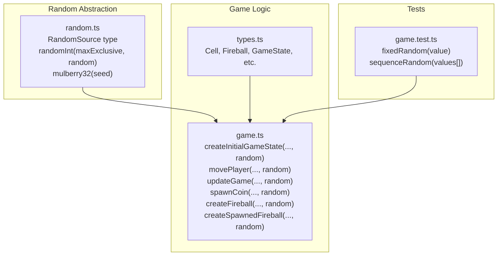
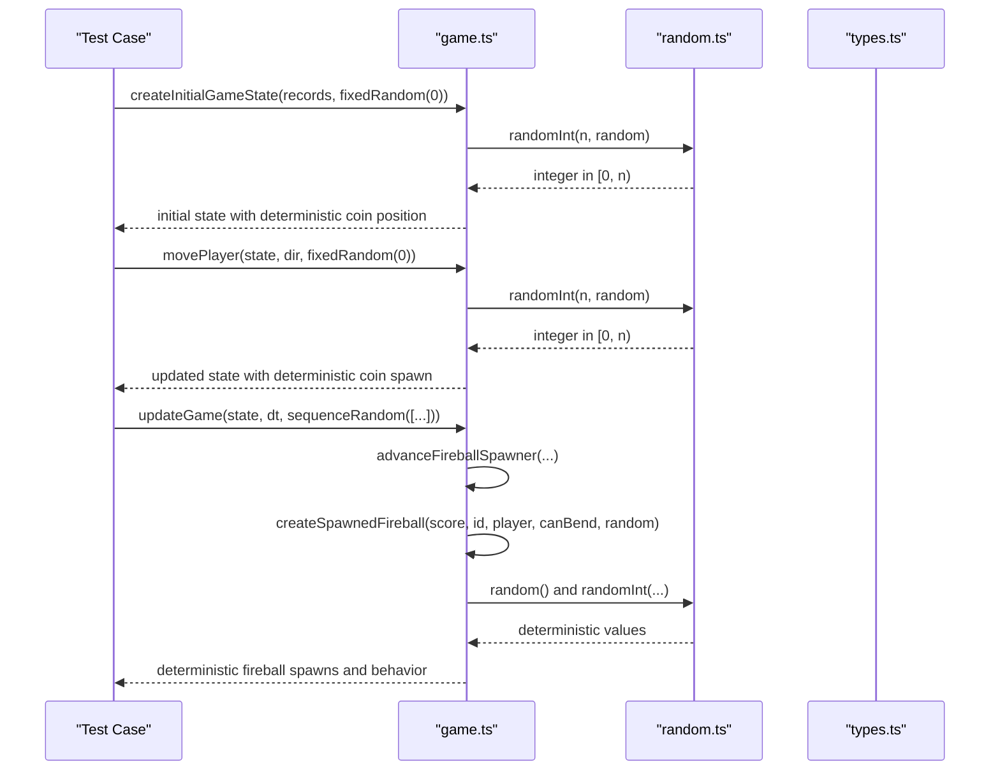
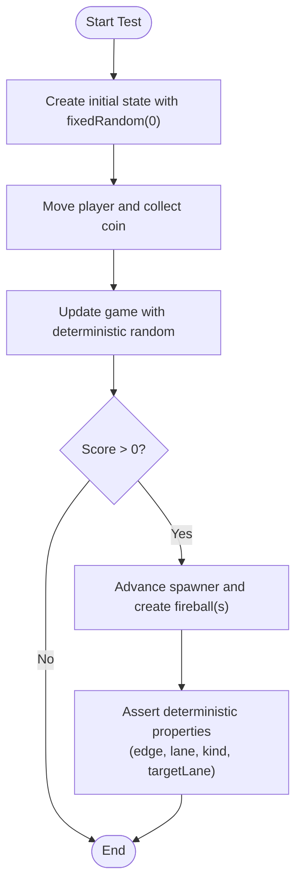
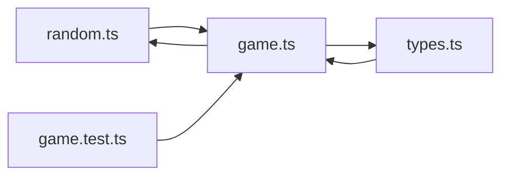

# Deterministic Random Generation

<cite>
**Referenced Files in This Document**
- [random.ts](file://src/random.ts)
- [game.ts](file://src/game.ts)
- [types.ts](file://src/types.ts)
- [game.test.ts](file://src/game.test.ts)
</cite>

## Table of Contents
1. [Introduction](#introduction)
2. [Project Structure](#project-structure)
3. [Core Components](#core-components)
4. [Architecture Overview](#architecture-overview)
5. [Detailed Component Analysis](#detailed-component-analysis)
6. [Dependency Analysis](#dependency-analysis)
7. [Performance Considerations](#performance-considerations)
8. [Troubleshooting Guide](#troubleshooting-guide)
9. [Conclusion](#conclusion)

## Introduction
This document explains the deterministic random number generation system used throughout the game. It focuses on how a small, explicit random abstraction enables reproducible behavior for testing while remaining simple enough to swap between production and test sources. You will learn:
- The random function interface and its usage across game logic
- How fixedRandom() and sequenceRandom() enable predictable tests
- Concrete examples for fireball spawning, coin placement, and bending fireball targeting
- Why deterministic randomness improves test reliability and debugging

## Project Structure
The random abstraction is implemented in a dedicated module and consumed by game logic. Tests provide their own deterministic sources to control stochastic behavior.

**Diagram sources**
- [random.ts:1-18](file://src/random.ts#L1-L18)
- [game.ts:1-426](file://src/game.ts#L1-L426)
- [types.ts:1-54](file://src/types.ts#L1-L54)
- [game.test.ts:1-373](file://src/game.test.ts#L1-L373)

**Section sources**
- [random.ts:1-18](file://src/random.ts#L1-L18)
- [game.ts:1-426](file://src/game.ts#L1-L426)
- [types.ts:1-54](file://src/types.ts#L1-L54)
- [game.test.ts:1-373](file://src/game.test.ts#L1-L373)

## Core Components
- RandomSource: A function returning a number in [0, 1).
- randomInt(maxExclusive, random): Returns an integer in [0, maxExclusive) using the provided RandomSource.
- mulberry32(seed): Creates a seeded PRNG (RandomSource) based on the Mulberry32 algorithm. Useful for deterministic sequences from a seed.
- Test helpers:
  - fixedRandom(value): Always returns the same value.
  - sequenceRandom(values[]): Returns successive values from a predefined array until exhaustion.

These components decouple randomness from implementation details, allowing tests to inject controlled sources while production uses Math.random by default.

**Section sources**
- [random.ts:1-18](file://src/random.ts#L1-L18)
- [game.test.ts:29-41](file://src/game.test.ts#L29-L41)

## Architecture Overview
The game’s core functions accept a RandomSource parameter with a default of Math.random. This design allows:
- Production code to remain unchanged and use true randomness via the default.
- Tests to pass deterministic sources to reproduce exact scenarios.

**Diagram sources**
- [game.ts:29-48](file://src/game.ts#L29-L48)
- [game.ts:58-81](file://src/game.ts#L58-L81)
- [game.ts:83-101](file://src/game.ts#L83-L101)
- [game.ts:103-111](file://src/game.ts#L103-L111)
- [game.ts:113-134](file://src/game.ts#L113-L134)
- [game.ts:136-166](file://src/game.ts#L136-L166)
- [game.ts:249-279](file://src/game.ts#L249-L279)
- [random.ts:1-18](file://src/random.ts#L1-L18)
- [types.ts:1-54](file://src/types.ts#L1-L54)

## Detailed Component Analysis

### Random Abstraction
- Interface: RandomSource is a zero-argument function returning a number in [0, 1).
- Utility: randomInt(maxExclusive, random) maps the [0, 1) output to integers in [0, maxExclusive).
- Seeded generator: mulberry32(seed) returns a RandomSource that produces a deterministic sequence from a given seed.

Benefits:
- Single source of truth for random calls.
- Easy to replace with deterministic implementations in tests.
- Supports seeding for repeatable runs without global state.

**Section sources**
- [random.ts:1-18](file://src/random.ts#L1-L18)

### Game Integration Points
All stochastic decisions are funneled through the RandomSource parameter:
- Initial state creation: coin placement depends on random selection among valid cells.
- Player movement: when collecting a coin, the next coin location is chosen deterministically via random.
- Fireball spawning: edge and lane selection, plus bending chance, rely on random.
- Spawning loop: timing and cooldowns are deterministic; only the random choices vary.

Key integration points:
- createInitialGameState(records, random = Math.random)
- movePlayer(state, direction, random = Math.random)
- updateGame(state, deltaSeconds, random = Math.random)
- spawnCoin(player, previousCoin, random = Math.random)
- createFireball(score, id, random = Math.random)
- createSpawnedFireball(score, id, player, canBend, random = Math.random)

Default behavior:
- If no random is provided, Math.random is used, preserving production behavior.

**Section sources**
- [game.ts:29-48](file://src/game.ts#L29-L48)
- [game.ts:58-81](file://src/game.ts#L58-L81)
- [game.ts:83-101](file://src/game.ts#L83-L101)
- [game.ts:103-111](file://src/game.ts#L103-L111)
- [game.ts:113-134](file://src/game.ts#L113-L134)
- [game.ts:136-166](file://src/game.ts#L136-L166)

### Test Helpers: fixedRandom and sequenceRandom
- fixedRandom(value): Returns the same value every time. Ideal for forcing specific branches or outcomes.
- sequenceRandom(values): Iterates through a list of predetermined values. Useful for simulating multiple random draws in order.

Usage patterns in tests:
- Base state initialization with fixedRandom(0) ensures consistent starting conditions.
- Movement and updates pass fixedRandom(0) to keep all subsequent randomness stable.
- For fireball spawning, sequenceRandom([0.99, 0.99]) forces non-bending fireballs.
- For bending fireballs, sequenceRandom([0.99, 0, 0.01]) controls edge/lane selection and bending chance.

**Section sources**
- [game.test.ts:29-41](file://src/game.test.ts#L29-L41)
- [game.test.ts:43-45](file://src/game.test.ts#L43-L45)
- [game.test.ts:179-186](file://src/game.test.ts#L179-L186)
- [game.test.ts:188-221](file://src/game.test.ts#L188-L221)

### Example Scenarios

#### Predictable Coin Placement
- Goal: Ensure the first coin does not spawn on the player and is deterministic.
- Approach: Initialize state with fixedRandom(0), then assert coin position relative to player.
- Effect: Tests always see the same coin placement, making assertions reliable.

**Section sources**
- [game.test.ts:65-74](file://src/game.test.ts#L65-L74)
- [game.ts:29-48](file://src/game.ts#L29-L48)
- [game.ts:103-111](file://src/game.ts#L103-L111)

#### Predictable Fireball Spawning
- Goal: Spawn normal fireballs at known intervals and positions.
- Approach: Use sequenceRandom([0.99, 0.99]) to force non-bending fireballs and deterministic edge/lane selection.
- Effect: Tests can assert exact edge, lane, and kind for each spawned fireball.

**Section sources**
- [game.test.ts:179-186](file://src/game.test.ts#L179-L186)
- [game.ts:113-134](file://src/game.ts#L113-L134)
- [game.ts:249-279](file://src/game.ts#L249-L279)

#### Predictable Bending Fireball Targeting
- Goal: Create a bending fireball that curves toward the player’s current lane without exceeding angle limits.
- Approach: Use sequenceRandom([0.99, 0, 0.01]) to force bending and deterministic lane selection. Assert travel duration, speed ratio, rotation, and target lane.
- Effect: Tests validate geometry and turning constraints deterministically.

**Section sources**
- [game.test.ts:188-221](file://src/game.test.ts#L188-L221)
- [game.ts:136-166](file://src/game.ts#L136-L166)
- [game.ts:168-185](file://src/game.ts#L168-L185)

### Conceptual Overview
The following diagram shows how deterministic randomness flows through the game loop during a typical test scenario.

[No sources needed since this diagram shows conceptual workflow, not actual code structure]

## Dependency Analysis
The random abstraction is a thin layer consumed by game logic. Tests inject deterministic sources to override defaults.

**Diagram sources**
- [random.ts:1-18](file://src/random.ts#L1-L18)
- [game.ts:1-426](file://src/game.ts#L1-L426)
- [types.ts:1-54](file://src/types.ts#L1-L54)
- [game.test.ts:1-373](file://src/game.test.ts#L1-L373)

**Section sources**
- [random.ts:1-18](file://src/random.ts#L1-L18)
- [game.ts:1-426](file://src/game.ts#L1-L426)
- [types.ts:1-54](file://src/types.ts#L1-L54)
- [game.test.ts:1-373](file://src/game.test.ts#L1-L373)

## Performance Considerations
- Using a custom RandomSource has negligible overhead compared to Math.random.
- Precomputing candidate lists (e.g., available cells) avoids repeated filtering inside hot paths.
- Avoid unnecessary allocations in tight loops; reuse arrays where possible if performance becomes critical.

[No sources needed since this section provides general guidance]

## Troubleshooting Guide
Common issues and resolutions:
- Non-deterministic tests: Ensure all functions that may call random receive a deterministic RandomSource. Check createInitialGameState, movePlayer, updateGame, spawnCoin, createFireball, and createSpawnedFireball.
- Unexpected bending fireballs: Verify sequenceRandom includes a low probability value for bending chance at the correct call site.
- Wrong coin placement: Confirm fixedRandom or sequenceRandom is passed consistently during coin spawning.
- Off-by-one errors in random ranges: Use randomInt(maxExclusive, random) rather than manual multiplication to avoid boundary mistakes.

**Section sources**
- [game.ts:29-48](file://src/game.ts#L29-L48)
- [game.ts:58-81](file://src/game.ts#L58-L81)
- [game.ts:83-101](file://src/game.ts#L83-L101)
- [game.ts:103-111](file://src/game.ts#L103-L111)
- [game.ts:113-134](file://src/game.ts#L113-L134)
- [game.ts:136-166](file://src/game.ts#L136-L166)
- [random.ts:1-18](file://src/random.ts#L1-L18)

## Conclusion
By abstracting randomness behind a simple RandomSource interface and providing deterministic helpers like fixedRandom and sequenceRandom, the game achieves:
- Reproducible test scenarios for coin placement, fireball spawning, and bending fireball targeting
- Clear separation between production randomness and test-controlled randomness
- Easier debugging of intermittent issues due to fully deterministic execution paths under test

This approach scales well as new features introduce additional stochastic behavior, ensuring they can be tested reliably without flakiness.