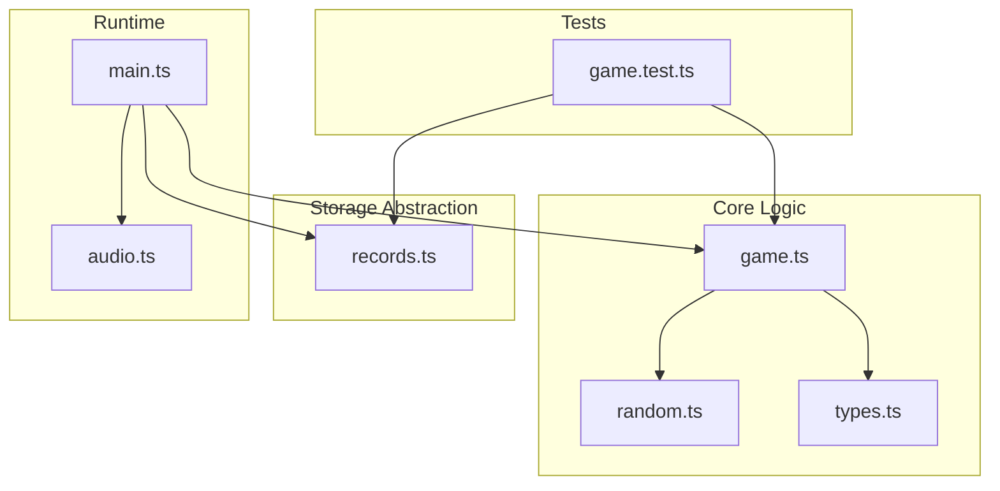
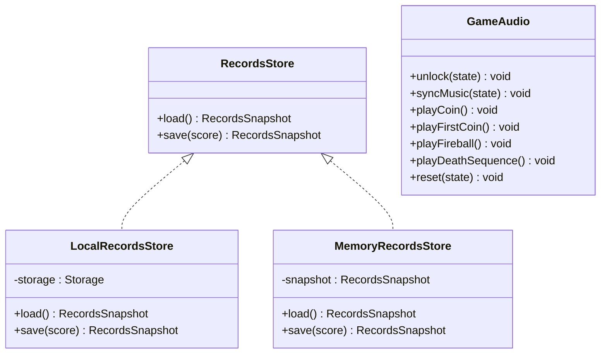
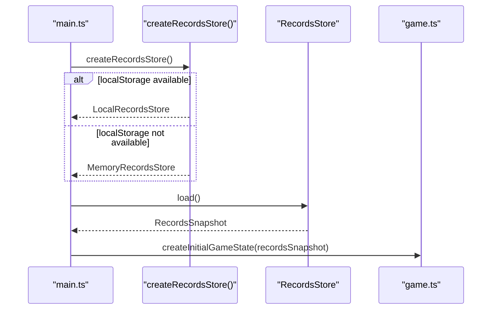
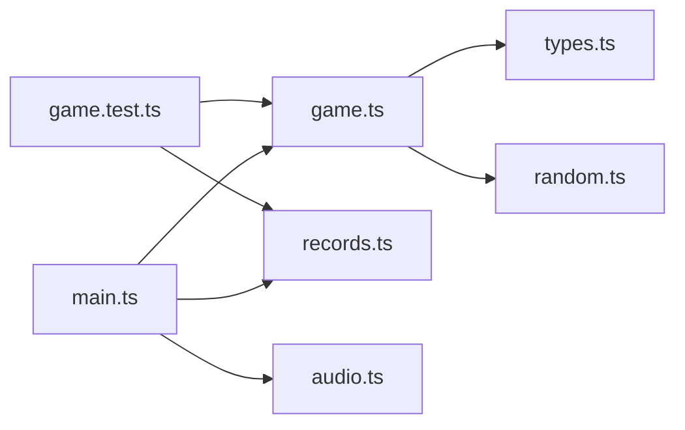

# Mocking and Test Utilities

<cite>
**Referenced Files in This Document**
- [game.test.ts](file://src/game.test.ts)
- [records.ts](file://src/records.ts)
- [types.ts](file://src/types.ts)
- [game.ts](file://src/game.ts)
- [main.ts](file://src/main.ts)
- [audio.ts](file://src/audio.ts)
- [random.ts](file://src/random.ts)
</cite>

## Table of Contents
1. [Introduction](#introduction)
2. [Project Structure](#project-structure)
3. [Core Components](#core-components)
4. [Architecture Overview](#architecture-overview)
5. [Detailed Component Analysis](#detailed-component-analysis)
6. [Dependency Analysis](#dependency-analysis)
7. [Performance Considerations](#performance-considerations)
8. [Troubleshooting Guide](#troubleshooting-guide)
9. [Conclusion](#conclusion)

## Introduction
This document explains the mocking strategies and test utilities used across the test suite, focusing on how persistent storage is replaced for testing, how dependency injection patterns enable different backends, and how to mock external dependencies such as file system access and Web Audio API. It also covers approaches for testing asynchronous operations and browser-specific APIs, along with best practices for isolated test environments and managing test data lifecycle.

## Project Structure
The project separates pure game logic from platform-specific concerns (storage, audio, rendering). Tests exercise the pure logic by injecting deterministic inputs and using in-memory implementations for side-effectful components.

**Diagram sources**
- [game.test.ts:1-30](file://src/game.test.ts#L1-L30)
- [game.ts:1-50](file://src/game.ts#L1-L50)
- [records.ts:1-20](file://src/records.ts#L1-L20)
- [main.ts:1-20](file://src/main.ts#L1-L20)
- [audio.ts:1-20](file://src/audio.ts#L1-L20)
- [random.ts:1-10](file://src/random.ts#L1-L10)
- [types.ts:1-20](file://src/types.ts#L1-L20)

**Section sources**
- [game.test.ts:1-30](file://src/game.test.ts#L1-L30)
- [main.ts:1-20](file://src/main.ts#L1-L20)

## Core Components
- Records interface pattern: A small, focused interface defines load and save behavior for score records. Two implementations exist:
  - LocalRecordsStore: persists to browser localStorage.
  - MemoryRecordsStore: an in-memory snapshot used in tests and as a fallback when localStorage is unavailable.
- Deterministic randomness: The game accepts a RandomSource function, enabling fully reproducible scenarios in tests.
- Pure game functions: Game state transitions are implemented as pure functions that take state and inputs and return new state, making them straightforward to test without side effects.

Key responsibilities:
- Storage abstraction: Encapsulates persistence details behind a simple interface.
- Determinism: Injected random source ensures repeatable outcomes.
- Testability: Tests construct initial states and drive updates deterministically.

**Section sources**
- [types.ts:45-54](file://src/types.ts#L45-L54)
- [records.ts:11-52](file://src/records.ts#L11-L52)
- [game.ts:29-48](file://src/game.ts#L29-L48)
- [random.ts:1-18](file://src/random.ts#L1-L18)

## Architecture Overview
The application uses dependency injection at two key points:
- Randomness: Functions accept a RandomSource parameter to control stochastic behavior.
- Persistence: The runtime chooses between LocalRecordsStore and MemoryRecordsStore based on environment availability.

**Diagram sources**
- [types.ts:45-54](file://src/types.ts#L45-L54)
- [records.ts:11-52](file://src/records.ts#L11-L52)
- [audio.ts:37-133](file://src/audio.ts#L37-L133)

## Detailed Component Analysis

### Records Interface Pattern and Dependency Injection
The RecordsStore interface abstracts persistence. Implementations can be swapped without changing game logic. The runtime selects the appropriate implementation via a factory function.

**Diagram sources**
- [main.ts:152-159](file://src/main.ts#L152-L159)
- [records.ts:11-30](file://src/records.ts#L11-L30)
- [records.ts:32-52](file://src/records.ts#L32-L52)
- [game.ts:29-48](file://src/game.ts#L29-L48)

**Section sources**
- [types.ts:45-54](file://src/types.ts#L45-L54)
- [records.ts:11-52](file://src/records.ts#L11-L52)
- [main.ts:152-159](file://src/main.ts#L152-L159)
- [game.ts:29-48](file://src/game.ts#L29-L48)

### MemoryRecordsStore as a Mock for Persistent Storage
MemoryRecordsStore replaces local storage during tests by keeping a snapshot in memory. It mirrors the same semantics as LocalRecordsStore:
- load returns a copy of the current snapshot.
- save computes updated bestScore and worldRecord and returns the new snapshot.

Benefits:
- No I/O or browser APIs required.
- Fully deterministic and fast.
- Ideal for unit tests that assert persistence behavior.

Usage in tests:
- Construct with an initial snapshot.
- Call save and load to verify record updates.

**Section sources**
- [records.ts:32-52](file://src/records.ts#L32-L52)
- [game.test.ts:364-372](file://src/game.test.ts#L364-L372)

### Deterministic Randomness for Reproducible Tests
The game functions accept a RandomSource function, allowing tests to supply fixed or sequenced values. This eliminates nondeterminism in coin placement, fireball spawning, and bending behavior.

Patterns used in tests:
- Fixed random: always returns the same value.
- Sequence random: returns a predetermined sequence of values.

These helpers ensure that every test scenario is repeatable and verifiable.

**Section sources**
- [random.ts:1-18](file://src/random.ts#L1-L18)
- [game.test.ts:29-41](file://src/game.test.ts#L29-L41)
- [game.ts:103-111](file://src/game.ts#L103-L111)
- [game.ts:113-166](file://src/game.ts#L113-L166)

### Testing Asynchronous Operations and Browser-Specific APIs
Asynchronous behaviors appear in audio loading and playback. For robust tests:
- Avoid real network calls and decoding; instead, provide a stubbed or mocked audio layer if you need to validate orchestration.
- If testing only pure game logic, avoid invoking audio entirely by controlling flow through state and input.

For mocking Web Audio API:
- Provide a minimal mock of AudioContext and related objects if your tests must interact with audio code paths.
- Ensure mocks implement the necessary methods (e.g., createBufferSource, createGain, resume) and resolve promises consistently.

Best practices:
- Keep audio-related assertions separate from core gameplay assertions.
- Use controlled seeds and deterministic inputs to isolate timing-sensitive behavior.

[No sources needed since this section provides general guidance]

### Best Practices for Isolated Test Environments and Data Lifecycle
- Create fresh instances per test:
  - Instantiate MemoryRecordsStore with a clean initial snapshot for each test case.
  - Rebuild GameState using createInitialGameState with deterministic inputs.
- Avoid shared mutable state:
  - Do not reuse store instances across unrelated tests unless explicitly modeling persistence across sessions.
- Control randomness:
  - Always pass explicit RandomSource to functions that depend on it.
- Validate boundaries and edge cases:
  - Use sequenceRandom to simulate specific sequences of events (e.g., bending fireball triggers).
- Keep tests focused:
  - Separate tests for movement, scoring, collision, and persistence behavior.

**Section sources**
- [game.test.ts:43-45](file://src/game.test.ts#L43-L45)
- [game.test.ts:29-41](file://src/game.test.ts#L29-L41)
- [game.test.ts:364-372](file://src/game.test.ts#L364-L372)

## Dependency Analysis
The following diagram shows how tests depend on core modules and how the runtime wires storage.

**Diagram sources**
- [game.test.ts:1-30](file://src/game.test.ts#L1-L30)
- [game.ts:1-50](file://src/game.ts#L1-L50)
- [records.ts:1-20](file://src/records.ts#L1-L20)
- [main.ts:1-20](file://src/main.ts#L1-L20)
- [audio.ts:1-20](file://src/audio.ts#L1-L20)
- [random.ts:1-10](file://src/random.ts#L1-L10)
- [types.ts:1-20](file://src/types.ts#L1-L20)

**Section sources**
- [game.test.ts:1-30](file://src/game.test.ts#L1-L30)
- [main.ts:1-20](file://src/main.ts#L1-L20)

## Performance Considerations
- In-memory storage is extremely fast and avoids I/O overhead in tests.
- Deterministic randomness prevents flakiness and reduces retries.
- Keeping tests focused on pure functions minimizes setup/teardown costs.

[No sources needed since this section provides general guidance]

## Troubleshooting Guide
Common issues and resolutions:
- Flaky tests due to randomness:
  - Ensure all functions that use randomness receive a deterministic RandomSource.
- Unexpected persistence behavior:
  - Verify that tests use a fresh MemoryRecordsStore instance and do not share snapshots unintentionally.
- Audio-related failures in non-browser environments:
  - Avoid calling audio methods in tests that do not require them; if needed, provide a minimal mock of AudioContext.

**Section sources**
- [game.test.ts:29-41](file://src/game.test.ts#L29-L41)
- [records.ts:32-52](file://src/records.ts#L32-L52)
- [audio.ts:37-133](file://src/audio.ts#L37-L133)

## Conclusion
By adopting a small RecordsStore interface, providing both LocalRecordsStore and MemoryRecordsStore, and injecting a deterministic RandomSource, the codebase achieves high testability. Tests remain fast, isolated, and reliable by avoiding real I/O and browser APIs where possible. When interacting with asynchronous or browser-specific features like audio, prefer isolation and minimal mocks to keep tests predictable and maintainable.