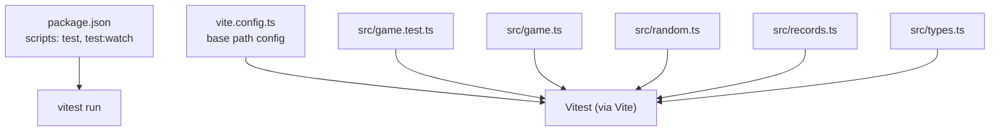
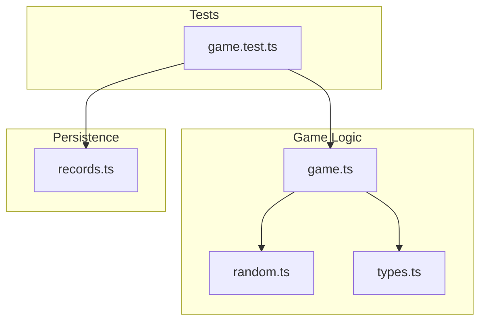
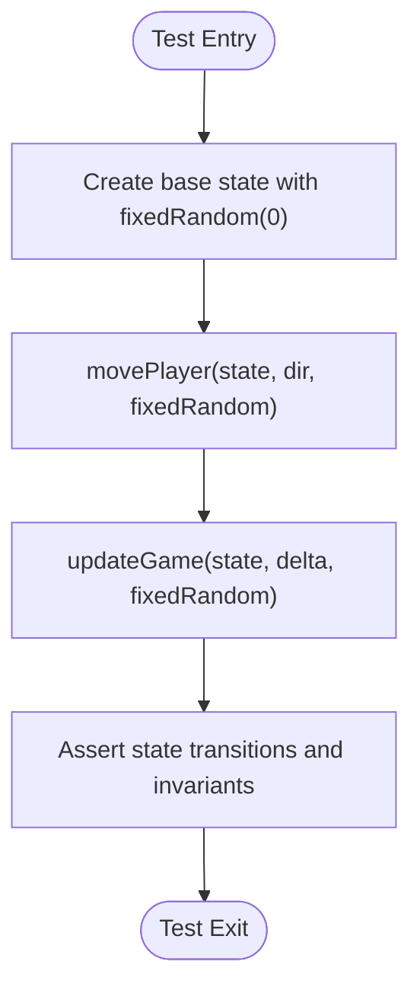
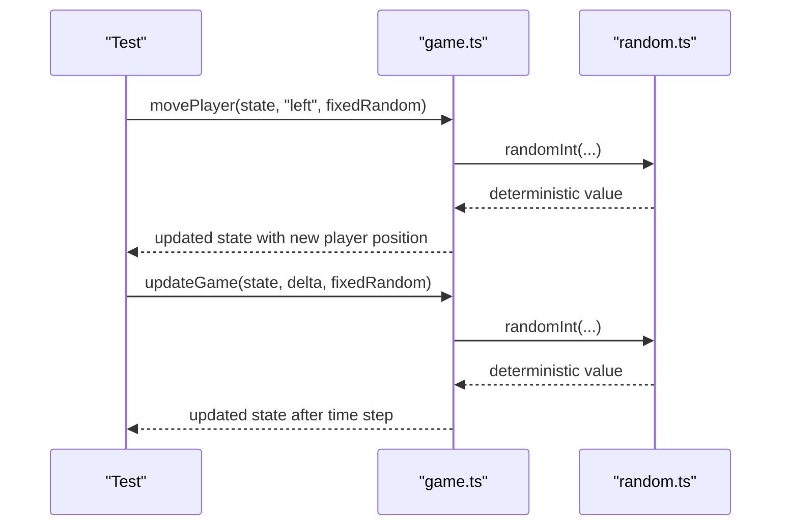
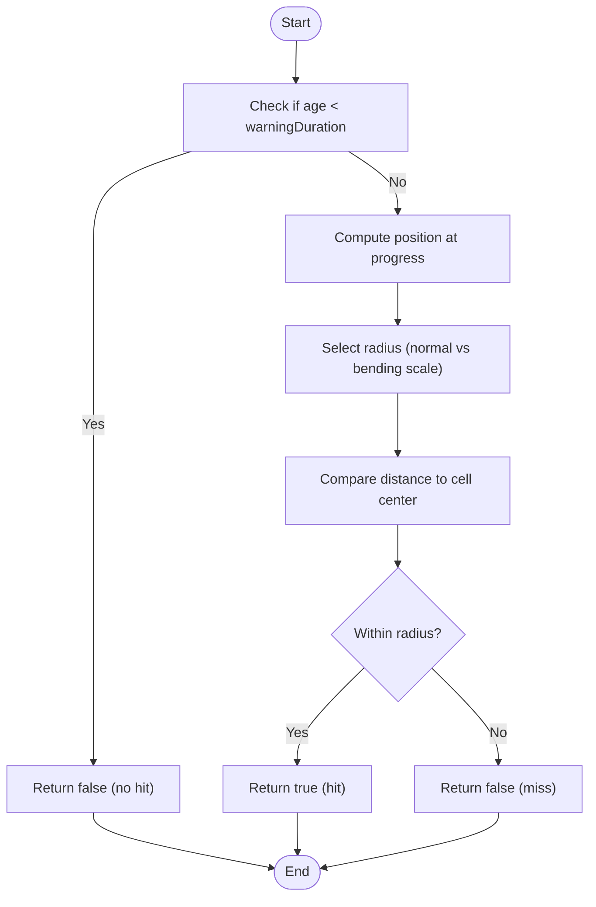
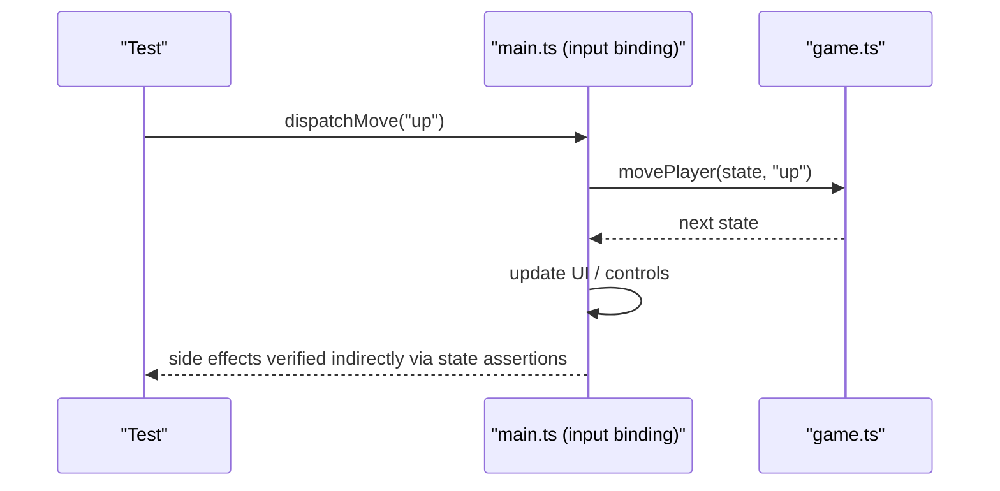
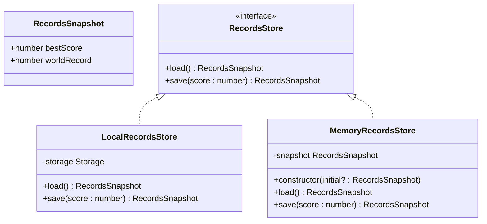
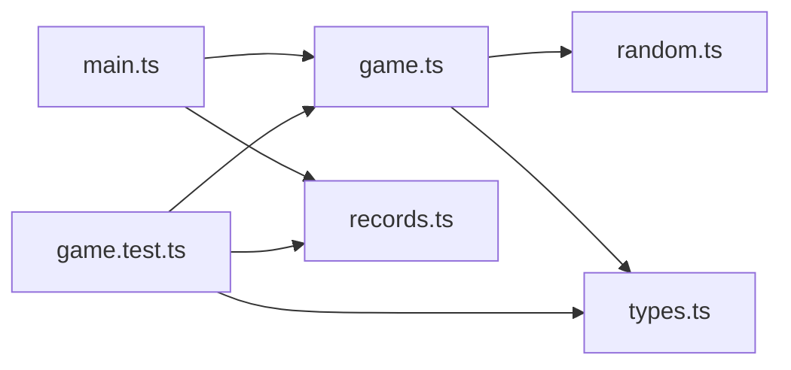

# Testing Strategy

<cite>
**Referenced Files in This Document**
- [package.json](file://package.json)
- [vite.config.ts](file://vite.config.ts)
- [src/game.test.ts](file://src/game.test.ts)
- [src/game.ts](file://src/game.ts)
- [src/random.ts](file://src/random.ts)
- [src/records.ts](file://src/records.ts)
- [src/types.ts](file://src/types.ts)
- [src/main.ts](file://src/main.ts)
</cite>

## Table of Contents
1. [Introduction](#introduction)
2. [Project Structure](#project-structure)
3. [Core Components](#core-components)
4. [Architecture Overview](#architecture-overview)
5. [Detailed Component Analysis](#detailed-component-analysis)
6. [Dependency Analysis](#dependency-analysis)
7. [Performance Considerations](#performance-considerations)
8. [Troubleshooting Guide](#troubleshooting-guide)
9. [Conclusion](#conclusion)
10. [Appendices](#appendices)

## Introduction
This document explains the testing strategy for the project, focusing on deterministic unit tests using Vitest. The game logic is intentionally designed to be pure and testable by accepting a RandomSource function parameter, enabling reproducible outcomes without external dependencies. Tests cover state transitions, collision detection, input-driven movement, scheduling behavior, and persistence via an in-memory store.

## Project Structure
The testing setup is minimal and relies on Vite’s native support for Vitest. The test runner is configured through npm scripts and uses the default Vitest configuration with no additional browser polyfills or mocking frameworks.

**Diagram sources**
- [package.json:6-11](file://package.json#L6-L11)
- [vite.config.ts:1-6](file://vite.config.ts#L1-L6)
- [src/game.test.ts:1-25](file://src/game.test.ts#L1-L25)
- [src/game.ts:1-16](file://src/game.ts#L1-L16)
- [src/random.ts:1-18](file://src/random.ts#L1-L18)
- [src/records.ts:1-52](file://src/records.ts#L1-L52)
- [src/types.ts:1-54](file://src/types.ts#L1-L54)

**Section sources**
- [package.json:6-11](file://package.json#L6-L11)
- [vite.config.ts:1-6](file://vite.config.ts#L1-L6)

## Core Components
- Test framework: Vitest with TypeScript support.
- Deterministic randomness: A typed RandomSource interface and helper utilities enable fully controlled random sequences in tests.
- Pure game logic: Game functions accept explicit RandomSource parameters, avoiding global Math.random usage during tests.
- In-memory persistence: MemoryRecordsStore provides a lightweight, test-friendly implementation of RecordsStore.

Key behaviors validated by tests include:
- Initial state creation and record propagation.
- Player movement clamping and direction persistence.
- Coin collection, score increment, and coin respawn rules.
- Fireball spawning schedule based on score thresholds.
- Bending fireball behavior, including speed ratio, angle limits, cooldowns, and forced normal spawns.
- Collision detection accuracy and warning phase behavior.
- Persistence semantics for best score and world record.

**Section sources**
- [src/game.test.ts:1-45](file://src/game.test.ts#L1-L45)
- [src/game.ts:29-48](file://src/game.ts#L29-L48)
- [src/random.ts:1-18](file://src/random.ts#L1-L18)
- [src/records.ts:32-51](file://src/records.ts#L32-L51)

## Architecture Overview
The test suite exercises core game modules directly. There are no mocks for file system or Web APIs in the current tests; instead, the code under test avoids those dependencies by design.

**Diagram sources**
- [src/game.test.ts:1-25](file://src/game.test.ts#L1-L25)
- [src/game.ts:1-16](file://src/game.ts#L1-L16)
- [src/random.ts:1-18](file://src/random.ts#L1-L18)
- [src/types.ts:1-54](file://src/types.ts#L1-L54)
- [src/records.ts:1-52](file://src/records.ts#L1-L52)

## Detailed Component Analysis

### Unit Test Architecture and Deterministic Randomness
- The test suite imports only the necessary game functions and types from the source modules.
- Deterministic randomness is achieved by supplying a custom RandomSource to every function that requires randomness. Two helpers are used:
  - fixedRandom: returns a constant value for all calls.
  - sequenceRandom: returns values from a predefined array in order.
- These helpers ensure that edge selection, lane choice, bending decisions, and coin placement are fully predictable.

**Diagram sources**
- [src/game.test.ts:29-45](file://src/game.test.ts#L29-L45)
- [src/game.ts:58-81](file://src/game.ts#L58-L81)
- [src/game.ts:83-101](file://src/game.ts#L83-L101)

**Section sources**
- [src/game.test.ts:29-45](file://src/game.test.ts#L29-L45)
- [src/game.ts:29-48](file://src/game.ts#L29-L48)

### Test Fixtures and Helper Functions
- Base state factory: baseState constructs a GameState using createInitialGameState with a deterministic RandomSource.
- Fireball fixture: fireballFixture builds a realistic Fireball with sensible defaults and allows overrides for specific scenarios.
- Sequence control: sequenceRandom enables precise control over multiple random calls within a single operation (e.g., choosing edge then lane).

These fixtures reduce duplication and make intent clear in each test case.

**Section sources**
- [src/game.test.ts:43-63](file://src/game.test.ts#L43-L63)

### Mocking Strategies for External Dependencies
- Current tests do not mock file system access or Web Audio API. Instead, they avoid these dependencies by:
  - Passing explicit RandomSource to all stochastic operations.
  - Using MemoryRecordsStore for persistence, which operates purely in memory.
- If future features require mocking, recommended approaches include:
  - File system: Use vitest-mock-fs or replace file-based stores with an interface and inject a MemoryRecordsStore-like implementation.
  - Web Audio API: Provide a stubbed audio module or isolate audio calls behind an interface and supply a no-op implementation in tests.

[No sources needed since this section provides general guidance]

### Testing Game Logic State Transitions
- Movement and clamping: Tests verify that player moves one cell per input and remains within grid bounds.
- Direction persistence: Tests assert that playerFacing updates and persists across updateGame ticks.
- Coin mechanics: Tests confirm score increments, previousCoin tracking, and immediate coin respawn away from the player.

**Diagram sources**
- [src/game.test.ts:84-125](file://src/game.test.ts#L84-L125)
- [src/game.ts:58-81](file://src/game.ts#L58-L81)
- [src/game.ts:83-101](file://src/game.ts#L83-L101)
- [src/random.ts:3-5](file://src/random.ts#L3-L5)

**Section sources**
- [src/game.test.ts:84-125](file://src/game.test.ts#L84-L125)
- [src/game.ts:58-81](file://src/game.ts#L58-L81)
- [src/game.ts:83-101](file://src/game.ts#L83-L101)

### Collision Detection Accuracy
- Warning phase: Tests assert that fireballs outside the grid during the warning period do not collide.
- Hitbox size: Tests validate that bending fireballs use a smaller effective radius.
- Travel and hit: Tests simulate travel duration and confirm collision when the fireball overlaps the player cell.

**Diagram sources**
- [src/game.ts:210-223](file://src/game.ts#L210-L223)
- [src/game.ts:168-176](file://src/game.ts#L168-L176)
- [src/game.ts:187-190](file://src/game.ts#L187-L190)

**Section sources**
- [src/game.test.ts:285-338](file://src/game.test.ts#L285-L338)
- [src/game.ts:210-223](file://src/game.ts#L210-L223)

### Input Handling Edge Cases
- Movement is gated by game status; tests exercise transitions around first coin collection and subsequent gameplay.
- Direction changes are validated immediately after movePlayer and persist across updateGame calls.

**Diagram sources**
- [src/main.ts:69-87](file://src/main.ts#L69-L87)
- [src/game.ts:58-81](file://src/game.ts#L58-L81)

**Section sources**
- [src/game.test.ts:98-109](file://src/game.test.ts#L98-L109)
- [src/main.ts:69-87](file://src/main.ts#L69-L87)

### Asynchronous Operations and Browser APIs
- The current tests are synchronous and do not rely on timers, requestAnimationFrame, or Web APIs.
- For asynchronous features (e.g., timers, animations), recommended strategies include:
  - Advance time explicitly via updateGame with controlled deltaSeconds.
  - Use vitest fake timers if real-time behavior must be simulated.
  - Stub browser APIs behind interfaces and inject test doubles.

[No sources needed since this section provides general guidance]

### Records and Persistence
- Tests validate that bestScore and worldRecord are persisted correctly using MemoryRecordsStore.
- The store computes max(bestScore, score) and max(worldRecord, score) consistently.

**Diagram sources**
- [src/types.ts:45-53](file://src/types.ts#L45-L53)
- [src/records.ts:11-30](file://src/records.ts#L11-L30)
- [src/records.ts:32-51](file://src/records.ts#L32-L51)

**Section sources**
- [src/game.test.ts:364-372](file://src/game.test.ts#L364-L372)
- [src/records.ts:32-51](file://src/records.ts#L32-L51)

## Dependency Analysis
The test suite depends on the following modules:
- game.test.ts imports from game.ts, records.ts, and types.ts.
- game.ts depends on random.ts and types.ts.
- main.ts integrates game logic, records, audio, and rendering but is not exercised by unit tests.

**Diagram sources**
- [src/game.test.ts:1-25](file://src/game.test.ts#L1-L25)
- [src/game.ts:1-16](file://src/game.ts#L1-L16)
- [src/random.ts:1-18](file://src/random.ts#L1-L18)
- [src/records.ts:1-52](file://src/records.ts#L1-L52)
- [src/types.ts:1-54](file://src/types.ts#L1-L54)
- [src/main.ts:1-10](file://src/main.ts#L1-L10)

**Section sources**
- [src/game.test.ts:1-25](file://src/game.test.ts#L1-L25)
- [src/game.ts:1-16](file://src/game.ts#L1-L16)
- [src/main.ts:1-10](file://src/main.ts#L1-L10)

## Performance Considerations
- Tests are fast and deterministic due to:
  - No I/O or network calls.
  - Fixed random sequences.
  - Minimal object allocations via fixtures.
- For larger suites, consider:
  - Grouping related tests into describe blocks for faster discovery.
  - Avoiding heavy computations inside beforeEach/afterEach.
  - Reusing fixtures where safe.

[No sources needed since this section provides general guidance]

## Troubleshooting Guide
Common issues and resolutions:
- Flaky tests due to randomness: Ensure all stochastic calls receive a deterministic RandomSource. Prefer fixedRandom or sequenceRandom helpers.
- Unexpected collisions: Verify warningDuration and travelDuration calculations; check that getFireballPosition and fireballHitsCell are used consistently.
- Incorrect spawn timing: Confirm that advanceFireballSpawner loop conditions and nextFireballDelay updates align with expected thresholds.
- Persistence mismatches: Validate that MemoryRecordsStore is initialized with correct initial snapshots and that save computes max values properly.

**Section sources**
- [src/game.test.ts:127-283](file://src/game.test.ts#L127-L283)
- [src/game.ts:249-279](file://src/game.ts#L249-L279)
- [src/records.ts:32-51](file://src/records.ts#L32-L51)

## Conclusion
The testing strategy leverages deterministic randomness and pure functions to produce reliable, maintainable unit tests. By injecting RandomSource and using in-memory persistence, the suite avoids external dependencies and focuses on verifying core game mechanics. Future extensions should continue this pattern by isolating side effects behind interfaces and providing test doubles where necessary.

## Appendices

### Running Tests
- Execute tests: npm test
- Watch mode: npm run test:watch

**Section sources**
- [package.json:6-11](file://package.json#L6-L11)