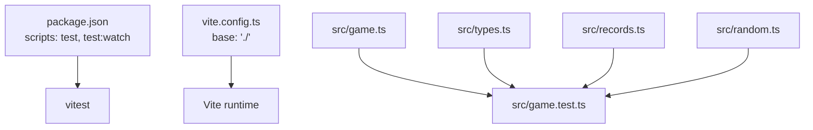
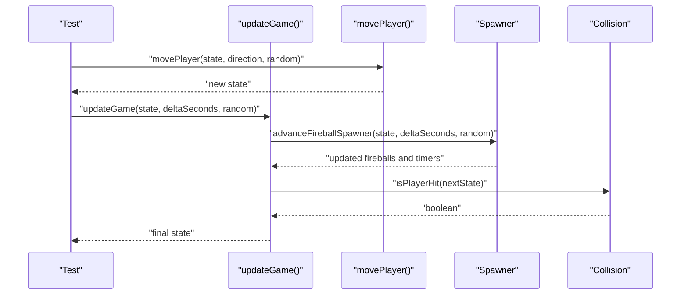
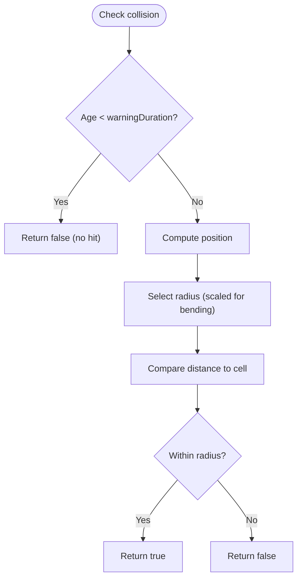
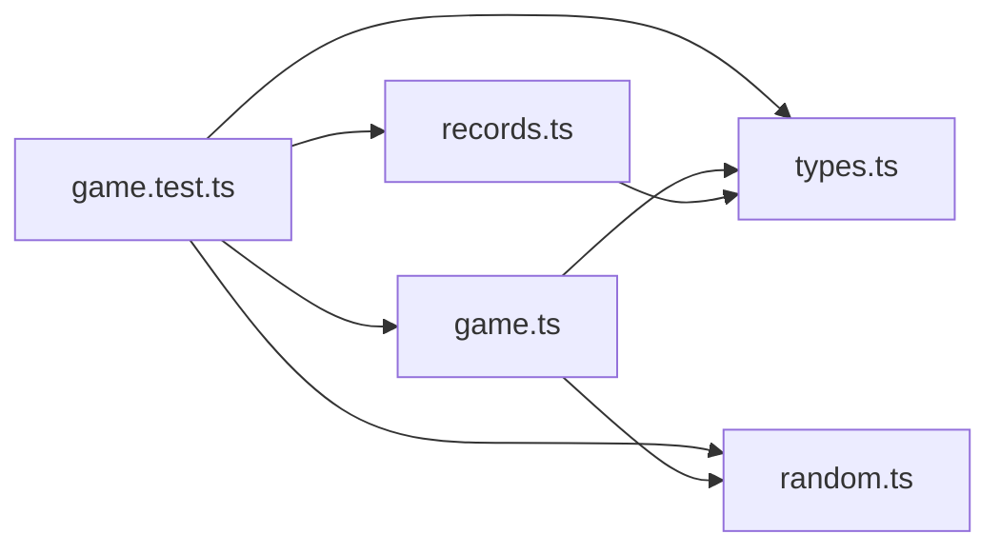

# Unit Testing Framework

<cite>
**Referenced Files in This Document**
- [game.test.ts](file://src/game.test.ts)
- [game.ts](file://src/game.ts)
- [types.ts](file://src/types.ts)
- [records.ts](file://src/records.ts)
- [random.ts](file://src/random.ts)
- [package.json](file://package.json)
- [vite.config.ts](file://vite.config.ts)
</cite>

## Table of Contents
1. [Introduction](#introduction)
2. [Project Structure](#project-structure)
3. [Core Components](#core-components)
4. [Architecture Overview](#architecture-overview)
5. [Detailed Component Analysis](#detailed-component-analysis)
6. [Dependency Analysis](#dependency-analysis)
7. [Performance Considerations](#performance-considerations)
8. [Troubleshooting Guide](#troubleshooting-guide)
9. [Conclusion](#conclusion)

## Introduction
This document explains the unit testing framework implementation using Vitest for the game codebase. It focuses on test structure and organization patterns, fixtures such as baseState(), fireballFixture(), and helper functions like fixedRandom() and sequenceRandom(). It also provides guidance on writing effective tests for game state transitions, player movement validation, coin collection mechanics, fireball behavior, collision detection accuracy, boundary conditions, edge cases, asynchronous operations, browser API interactions, naming conventions, assertion patterns, and debugging strategies.

## Project Structure
The project uses a minimal structure with TypeScript and Vite. Tests are colocated next to source files using the .test.ts suffix and run via Vitest. The configuration is straightforward: Vite config sets the base path, and package scripts define how to run tests.

**Diagram sources**
- [package.json:6-11](file://package.json#L6-L11)
- [vite.config.ts:1-6](file://vite.config.ts#L1-L6)
- [game.test.ts:1-25](file://src/game.test.ts#L1-L25)
- [game.ts:1-20](file://src/game.ts#L1-L20)
- [types.ts:1-10](file://src/types.ts#L1-L10)
- [records.ts:1-10](file://src/records.ts#L1-L10)
- [random.ts:1-6](file://src/random.ts#L1-L6)

**Section sources**
- [package.json:6-11](file://package.json#L6-L11)
- [vite.config.ts:1-6](file://vite.config.ts#L1-L6)

## Core Components
This section summarizes the key modules under test and their responsibilities.

- Game logic (state transitions, movement, collisions, fireball spawning and travel):
  - Exposes pure functions for creating initial state, moving the player, updating time-based systems, and querying fireball positions and rotations.
  - Uses deterministic helpers for random number generation via an injected RandomSource function.

- Types:
  - Defines grid constants, cell coordinates, directions, edges, game status, and core interfaces for Fireball and GameState.

- Records persistence:
  - Provides an interface and two implementations: one backed by localStorage and an in-memory store used in tests.

- Random utilities:
  - Supplies a typed RandomSource and a seeded PRNG generator for reproducible randomness.

Key testing utilities defined in the test file:
- baseState(): Creates a deterministic initial GameState using a fixed random source.
- fireballFixture(overrides?): Builds a default Fireball object with sensible defaults and allows partial overrides.
- fixedRandom(value): Returns a RandomSource that always returns the same value.
- sequenceRandom(values): Returns a RandomSource that yields values from a provided sequence until exhaustion.

These utilities enable precise control over randomness and state, making tests deterministic and easy to reason about.

**Section sources**
- [game.ts:29-48](file://src/game.ts#L29-L48)
- [game.ts:58-81](file://src/game.ts#L58-L81)
- [game.ts:83-101](file://src/game.ts#L83-L101)
- [game.ts:113-166](file://src/game.ts#L113-L166)
- [game.ts:168-185](file://src/game.ts#L168-L185)
- [game.ts:210-223](file://src/game.ts#L210-L223)
- [game.ts:225-247](file://src/game.ts#L225-L247)
- [game.ts:249-279](file://src/game.ts#L249-L279)
- [types.ts:1-54](file://src/types.ts#L1-L54)
- [records.ts:32-51](file://src/records.ts#L32-L51)
- [random.ts:1-18](file://src/random.ts#L1-L18)
- [game.test.ts:29-63](file://src/game.test.ts#L29-L63)

## Architecture Overview
The testing architecture centers around deterministic inputs and pure functions. Tests construct state using fixtures, drive transitions through movePlayer() and updateGame(), and assert outcomes using Vitest’s expect assertions.

**Diagram sources**
- [game.test.ts:84-125](file://src/game.test.ts#L84-L125)
- [game.test.ts:127-362](file://src/game.test.ts#L127-L362)
- [game.ts:58-81](file://src/game.ts#L58-L81)
- [game.ts:83-101](file://src/game.ts#L83-L101)
- [game.ts:249-279](file://src/game.ts#L249-L279)
- [game.ts:221-223](file://src/game.ts#L221-L223)

## Detailed Component Analysis

### Test Organization and Patterns
- Grouping: Tests are grouped by feature using describe blocks (e.g., “game setup”, “coins and movement”, “fireballs”, “records”).
- Deterministic randomness: All randomness is injected via a RandomSource parameter. Tests use fixedRandom() and sequenceRandom() to control outcomes precisely.
- Fixtures:
  - baseState(): Initializes a clean GameState with predictable randomness.
  - fireballFixture(): Produces a valid Fireball with defaults; overrides can be applied per test.
- Assertions: Use Vitest’s expect with matchers like toBe, toEqual, toHaveLength, toBeCloseTo, and toBeLessThan/toBeGreaterThan for numeric comparisons.

Practical tips:
- Prefer small, focused it() blocks that exercise one behavior at a time.
- Compose complex scenarios by chaining calls to movePlayer() and updateGame() while asserting intermediate states when needed.
- For timing-sensitive behaviors, pass explicit deltaSeconds to updateGame() to simulate elapsed time deterministically.

**Section sources**
- [game.test.ts:65-82](file://src/game.test.ts#L65-L82)
- [game.test.ts:84-125](file://src/game.test.ts#L84-L125)
- [game.test.ts:127-362](file://src/game.test.ts#L127-L362)
- [game.test.ts:29-41](file://src/game.test.ts#L29-L41)
- [game.test.ts:43-63](file://src/game.test.ts#L43-L63)

### Player Movement Validation
- One-cell movement and clamping:
  - Verify that repeated moves in a direction reach expected boundaries without exceeding grid limits.
- Direction persistence:
  - Ensure playerFacing updates to the last movement direction and persists across updateGame() ticks.
- Edge cases:
  - Moving off-grid should clamp to the nearest valid cell.
  - No movement occurs when gameStatus is “gameOver”.

Recommended test patterns:
- Chain multiple movePlayer() calls to simulate sequences.
- Assert both position and facing direction after each step.
- Validate that subsequent updateGame() calls do not alter playerFacing unexpectedly.

**Section sources**
- [game.test.ts:85-109](file://src/game.test.ts#L85-L109)
- [game.ts:58-81](file://src/game.ts#L58-L81)
- [types.ts:1-11](file://src/types.ts#L1-L11)

### Coin Collection Mechanics
- Immediate spawn:
  - When the player lands on the coin, score increments, previousCoin is set, and a new coin spawns at a different location.
- Non-overlap guarantees:
  - New coin placement avoids the current player position and the previous coin position when possible.
- Determinism:
  - Use fixedRandom() to ensure consistent coin placement across runs.

Testing approach:
- Construct a state where the player is adjacent to the coin.
- Move into the coin and assert score, player position, previousCoin, and that the new coin does not overlap the player.

**Section sources**
- [game.test.ts:111-125](file://src/game.test.ts#L111-L125)
- [game.ts:103-111](file://src/game.ts#L103-L111)
- [game.ts:58-81](file://src/game.ts#L58-L81)

### Fireball Behavior
- Spawning rules:
  - No fireballs before the first coin is collected.
  - After collecting the first coin, fireballs begin spawning after a delay that decreases with score milestones.
- Bending fireballs:
  - Rare bending fireballs curve toward the player’s lane within a maximum angle constraint and have reduced speed and hitbox.
  - After a bending fireball spawns, a cooldown forces the next several fireballs to be normal and spaced apart.
- Travel and lifecycle:
  - Fireballs warn outside the grid before becoming dangerous.
  - They travel along lanes and disappear after crossing to the opposite side.
- Collision:
  - Hit detection uses a radius; bending fireballs use a scaled-down radius.

Testing approach:
- Use scheduleFireballDelay() and scheduleFireballTravelDuration() to verify timing thresholds.
- Create fireballs via createFireball() or createSpawnedFireball() with controlled randomness.
- Advance time with updateGame() and assert counts, ages, velocities, rotation, and positions.
- Validate that bending fireballs respect max angle and turn rate constraints.

**Section sources**
- [game.test.ts:127-362](file://src/game.test.ts#L127-L362)
- [game.ts:113-166](file://src/game.ts#L113-L166)
- [game.ts:168-185](file://src/game.ts#L168-L185)
- [game.ts:225-247](file://src/game.ts#L225-L247)
- [game.ts:249-279](file://src/game.ts#L249-L279)

### Collision Detection Accuracy
- Warning phase:
  - During warning duration, fireballs must not collide with any cell.
- In-bounds travel:
  - Once past the warning phase, fireballs should collide based on proximity to the player’s cell using the configured radius.
- Bending fireball hitbox:
  - Bending fireballs use a smaller effective radius.

Testing approach:
- Position a fireball near a target cell and assert fireballHitsCell() results.
- Confirm getFireballPosition() reports isWarning correctly during the warning phase.
- Validate that collision triggers game over when overlapping the player.

**Diagram sources**
- [game.ts:210-219](file://src/game.ts#L210-L219)
- [game.ts:168-176](file://src/game.ts#L168-L176)

**Section sources**
- [game.test.ts:285-317](file://src/game.test.ts#L285-L317)
- [game.ts:210-223](file://src/game.ts#L210-L223)
- [game.ts:168-176](file://src/game.ts#L168-L176)

### Boundary Conditions and Edge Cases
- Grid clamping:
  - Moves beyond grid boundaries should clamp to the nearest valid cell.
- Off-screen travel:
  - Fireballs start off-screen and disappear after crossing the board.
- First coin gating:
  - Fireball spawner remains idle until the first coin is collected.
- Score thresholds:
  - Spawning intervals change at specific score milestones.

Testing approach:
- Drive the player to corners and edges to validate clamping.
- Advance time to trigger fireball disappearance and confirm removal from the array.
- Simulate pre-first-coin gameplay to ensure no fireballs appear.
- Step through score thresholds and assert delays returned by scheduleFireballDelay().

**Section sources**
- [game.test.ts:85-96](file://src/game.test.ts#L85-96)
- [game.test.ts:127-177](file://src/game.test.ts#L127-L177)
- [game.test.ts:340-361](file://src/game.test.ts#L340-L361)
- [game.ts:306-311](file://src/game.ts#L306-L311)
- [game.ts:225-247](file://src/game.ts#L225-L247)

### Asynchronous Operations and Browser API Interactions
- Asynchronous operations:
  - The tested functions are synchronous and driven by explicit deltaSeconds parameters. There is no reliance on timers or async APIs in the core logic.
- Browser APIs:
  - Local storage-backed records are abstracted behind an interface. Tests use MemoryRecordsStore to avoid browser dependencies.

Testing approach:
- Replace real storage with MemoryRecordsStore to assert persistence semantics deterministically.
- Avoid setTimeout or requestAnimationFrame in tests; instead, pass deltaSeconds to updateGame() to simulate time progression.

**Section sources**
- [records.ts:32-51](file://src/records.ts#L32-L51)
- [game.test.ts:364-372](file://src/game.test.ts#L364-L372)
- [game.ts:83-101](file://src/game.ts#L83-L101)

### Test Naming Conventions and Assertion Patterns
- Naming:
  - Use descriptive it() titles that state the expected behavior (e.g., “moves one cell at a time and clamps to the board”).
- Assertions:
  - Equality: toBe, toEqual for primitives and objects.
  - Collections: toHaveLength for arrays.
  - Numeric comparisons: toBeCloseTo for floating-point values; toBeLessThan/toBeGreaterThan for bounds.
- State snapshots:
  - Prefer explicit assertions over snapshotting for small, stable structures like Cell and Fireball.

**Section sources**
- [game.test.ts:65-82](file://src/game.test.ts#L65-L82)
- [game.test.ts:84-125](file://src/game.test.ts#L84-L125)
- [game.test.ts:127-362](file://src/game.test.ts#L127-L362)

### Debugging Strategies for Test Failures
- Isolate failures:
  - Reduce failing tests to minimal reproduction steps by constructing state directly with baseState() and fireballFixture().
- Inspect intermediate state:
  - Log or assert intermediate values (e.g., velocity magnitude, rotation, progress) to pinpoint discrepancies.
- Deterministic randomness:
  - Use sequenceRandom() to reproduce exact branching paths caused by random decisions.
- Time-driven logic:
  - Break large deltas into smaller steps to observe incremental changes in fireball age and position.

**Section sources**
- [game.test.ts:29-41](file://src/game.test.ts#L29-L41)
- [game.test.ts:188-221](file://src/game.test.ts#L188-L221)
- [game.test.ts:223-263](file://src/game.test.ts#L223-L263)

## Dependency Analysis
The test suite depends on exported functions and types from the game module, types definitions, and the in-memory records store. Randomness is injected to eliminate external dependencies.

**Diagram sources**
- [game.test.ts:1-25](file://src/game.test.ts#L1-L25)
- [game.ts:1-3](file://src/game.ts#L1-L3)
- [random.ts:1-6](file://src/random.ts#L1-L6)
- [records.ts:1-2](file://src/records.ts#L1-L2)
- [types.ts:1-10](file://src/types.ts#L1-L10)

**Section sources**
- [game.test.ts:1-25](file://src/game.test.ts#L1-L25)
- [game.ts:1-3](file://src/game.ts#L1-L3)
- [random.ts:1-6](file://src/random.ts#L1-L6)
- [records.ts:1-2](file://src/records.ts#L1-L2)
- [types.ts:1-10](file://src/types.ts#L1-L10)

## Performance Considerations
- Keep tests fast by avoiding heavy computations; the game logic operates on small grids and short arrays.
- Use deterministic random sources to prevent flakiness and reduce retries.
- Batch related assertions in a single test to minimize state setup overhead.

[No sources needed since this section provides general guidance]

## Troubleshooting Guide
Common issues and resolutions:
- Flaky tests due to randomness:
  - Replace Math.random with fixedRandom() or sequenceRandom() to stabilize outcomes.
- Timing-related failures:
  - Adjust deltaSeconds passed to updateGame() to align with warningDuration and travelDuration thresholds.
- Collision misalignment:
  - Verify getFireballPosition() and radius calculations; consider using toBeCloseTo for floating-point comparisons.
- Records persistence confusion:
  - Use MemoryRecordsStore in tests to isolate persistence logic from browser storage.

**Section sources**
- [game.test.ts:29-41](file://src/game.test.ts#L29-L41)
- [game.test.ts:127-177](file://src/game.test.ts#L127-L177)
- [game.test.ts:285-317](file://src/game.test.ts#L285-L317)
- [records.ts:32-51](file://src/records.ts#L32-L51)

## Conclusion
The test suite leverages Vitest with deterministic fixtures and injected randomness to thoroughly validate game mechanics. By focusing on pure functions, explicit time stepping, and clear fixtures, tests remain readable, reliable, and maintainable. Following the patterns outlined here will help you write effective tests for additional features and edge cases.