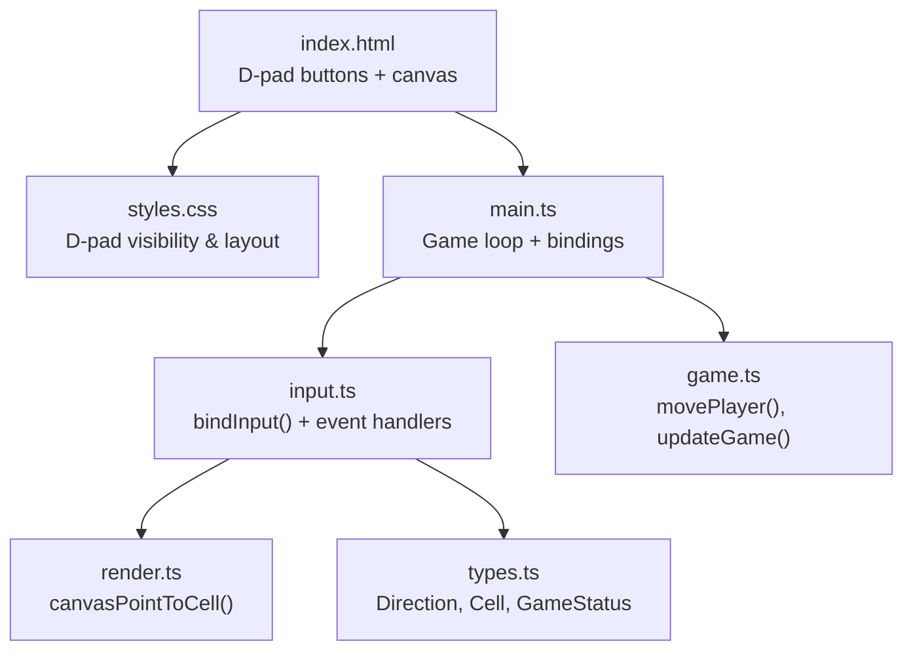
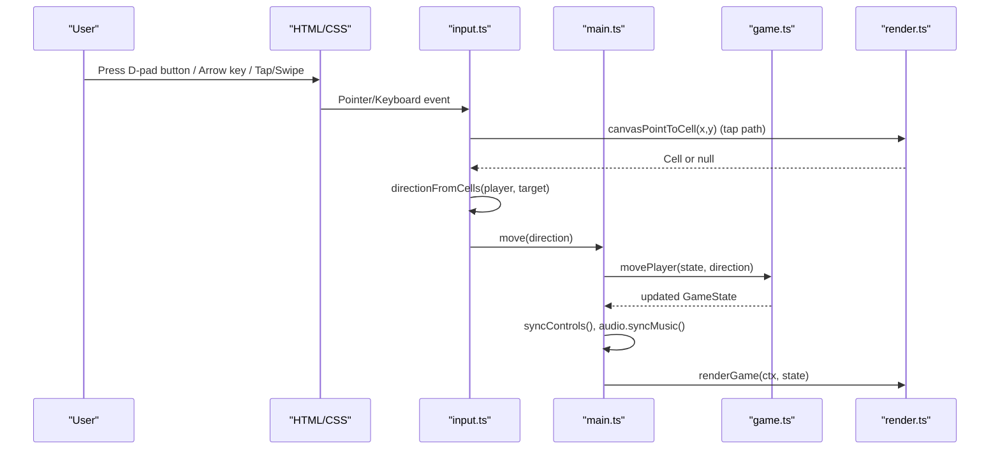
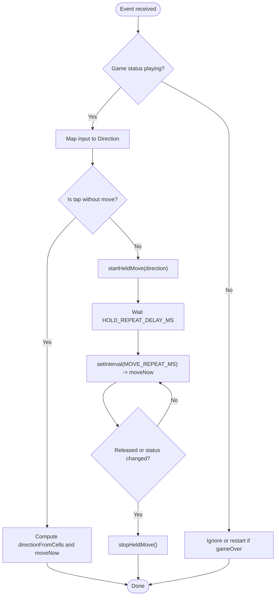
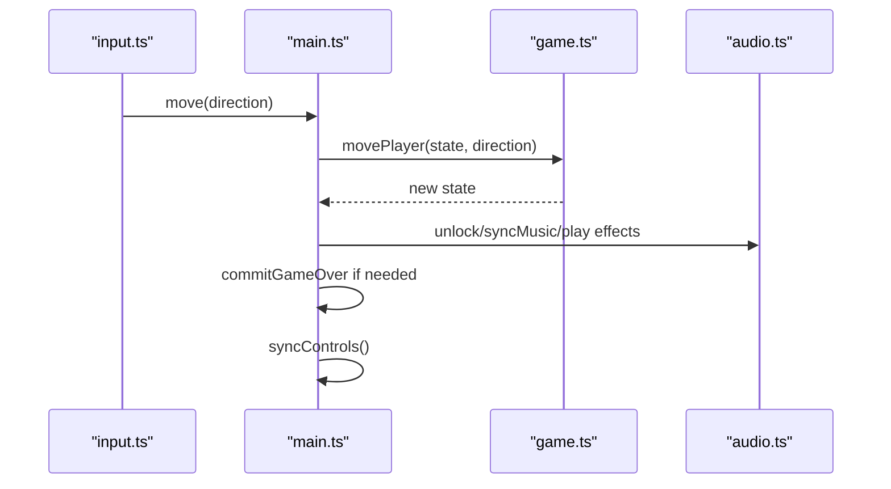
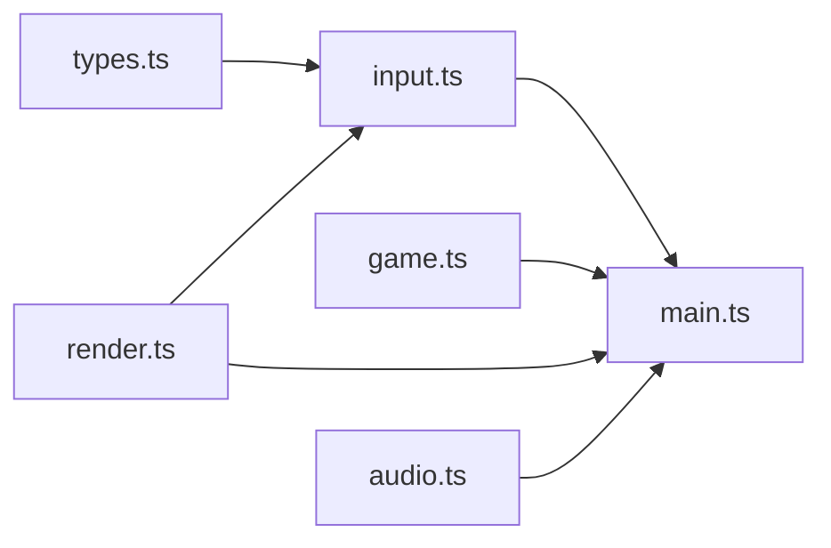

# D-Pad Controls

<cite>
**Referenced Files in This Document**
- [input.ts](file://src/input.ts)
- [game.ts](file://src/game.ts)
- [main.ts](file://src/main.ts)
- [render.ts](file://src/render.ts)
- [types.ts](file://src/types.ts)
- [index.html](file://index.html)
- [styles.css](file://src/styles.css)
</cite>

## Table of Contents
1. [Introduction](#introduction)
2. [Project Structure](#project-structure)
3. [Core Components](#core-components)
4. [Architecture Overview](#architecture-overview)
5. [Detailed Component Analysis](#detailed-component-analysis)
6. [Dependency Analysis](#dependency-analysis)
7. [Performance Considerations](#performance-considerations)
8. [Troubleshooting Guide](#troubleshooting-guide)
9. [Conclusion](#conclusion)

## Introduction
This document explains the D-Pad controls system for the game, focusing on how user input is captured and translated into directional movement. It covers keyboard, pointer (touch/mouse), and on-screen D-pad button interactions, including held-input repeat behavior, swipe gestures, and tap-to-move logic. The design integrates with the game loop to update player position and interact with game state transitions such as pause and restart.

## Project Structure
The D-Pad control flow spans several modules:
- HTML defines the canvas and D-pad buttons.
- CSS styles the D-pad and shows it on touch devices.
- Input module binds events and normalizes them into directional moves.
- Main module wires input callbacks to game actions and audio.
- Game module updates player position and collision.
- Render module provides coordinate conversion utilities used by input.

**Diagram sources**
- [index.html:10-25](file://index.html#L10-L25)
- [styles.css:133-281](file://src/styles.css#L133-L281)
- [main.ts:89-95](file://src/main.ts#L89-L95)
- [input.ts:35-281](file://src/input.ts#L35-L281)
- [render.ts:187-203](file://src/render.ts#L187-L203)
- [types.ts:1-54](file://src/types.ts#L1-L54)
- [game.ts:58-81](file://src/game.ts#L58-L81)

**Section sources**
- [index.html:10-25](file://index.html#L10-L25)
- [styles.css:133-281](file://src/styles.css#L133-L281)
- [main.ts:89-95](file://src/main.ts#L89-L95)
- [input.ts:35-281](file://src/input.ts#L35-L281)
- [render.ts:187-203](file://src/render.ts#L187-L203)
- [types.ts:1-54](file://src/types.ts#L1-L54)
- [game.ts:58-81](file://src/game.ts#L58-L81)

## Core Components
- Input binding: Centralizes keyboard, pointer, and D-pad button handling; exposes a simple callback interface to the rest of the app.
- Direction mapping: Maps keys and pointer deltas to normalized directions.
- Held-input repeat: Implements initial delay and periodic repeats while holding a direction.
- Swipe and tap: Supports swiping across the canvas and tapping a cell to move toward it.
- On-screen D-pad: Uses data attributes to map buttons to directions and visual press states.

Key responsibilities:
- Normalize all inputs to a single Direction type.
- Respect game status (playing/paused/gameOver) to gate actions.
- Provide clean cleanup when unmounted.

**Section sources**
- [input.ts:1-322](file://src/input.ts#L1-L322)
- [types.ts:1-54](file://src/types.ts#L1-L54)

## Architecture Overview
The D-Pad controls are implemented as an event-binding layer that translates raw input into game actions via callbacks. The main module sets up the game loop and passes these callbacks to the input binder.

**Diagram sources**
- [input.ts:130-199](file://src/input.ts#L130-L199)
- [input.ts:205-260](file://src/input.ts#L205-L260)
- [input.ts:98-128](file://src/input.ts#L98-L128)
- [render.ts:187-203](file://src/render.ts#L187-L203)
- [main.ts:69-87](file://src/main.ts#L69-L87)
- [game.ts:58-81](file://src/game.ts#L58-L81)
- [main.ts:134-136](file://src/main.ts#L134-L136)

## Detailed Component Analysis

### Input Binding and Event Handling
- Keyboard:
  - Arrow keys and WASD map to directions.
  - Pause toggled by a dedicated key; restart supported during game over.
  - Prevents default browser scrolling and handles repeat keys appropriately.
- Pointer (canvas):
  - Captures primary pointer to track start point and movement.
  - Converts client coordinates to canvas grid coordinates using a utility from render.
  - Determines direction either by comparing player and tapped cell or by swipe delta.
  - Supports both swipe-to-move and tap-to-target behaviors.
- D-pad buttons:
  - Buttons use data-direction attributes to map to directions.
  - Visual feedback via pressed class; pointer capture ensures consistent release behavior.
  - Restart allowed during game over; otherwise triggers held movement.

Held-input repeat:
- Initial delay before repeating movement.
- Periodic repeat interval while holding.
- Stops immediately on keyup, pointerup, or when game status changes.

Cleanup:
- Returns a function to remove all listeners and clear timers.

**Diagram sources**
- [input.ts:59-88](file://src/input.ts#L59-L88)
- [input.ts:98-128](file://src/input.ts#L98-L128)
- [input.ts:130-199](file://src/input.ts#L130-L199)
- [input.ts:205-260](file://src/input.ts#L205-L260)

**Section sources**
- [input.ts:1-322](file://src/input.ts#L1-L322)

### Coordinate Conversion and Direction Resolution
- Canvas to cell:
  - Converts pixel coordinates to grid cells based on grid offsets and stride.
- Direction from cells:
  - Computes relative row/col differences and chooses horizontal or vertical direction based on larger delta.
- Direction from delta:
  - Chooses left/right if horizontal delta dominates; otherwise up/down.

These helpers ensure consistent movement regardless of input source.

**Section sources**
- [render.ts:187-203](file://src/render.ts#L187-L203)
- [input.ts:300-321](file://src/input.ts#L300-L321)

### Game Integration
- Main module:
  - Wires input.move to dispatchMove which calls movePlayer and updates audio/state.
  - Handles pause/restart through togglePause and restart functions.
  - Runs fixed-step game loop and renders each frame.
- Game module:
  - movePlayer updates player position, coin collection, and collision checks.
  - updateGame advances fireballs and time-based systems.

**Diagram sources**
- [main.ts:69-87](file://src/main.ts#L69-L87)
- [game.ts:58-81](file://src/game.ts#L58-L81)
- [main.ts:138-144](file://src/main.ts#L138-L144)

**Section sources**
- [main.ts:1-160](file://src/main.ts#L1-L160)
- [game.ts:58-81](file://src/game.ts#L58-L81)

### D-Pad Button Behavior
- Discovery:
  - Queries child buttons with a specific class within the canvas parent.
- Interaction:
  - Pointerdown captures pointer and adds pressed style; triggers held movement.
  - Pointerup releases pointer and stops held movement.
  - Pointercancel cleans up pressed state and held movement.
  - Context menu prevented to avoid mobile menus interfering.
- Accessibility:
  - Buttons include aria-labels and role grouping for assistive technologies.

**Section sources**
- [input.ts:205-260](file://src/input.ts#L205-L260)
- [index.html:18-24](file://index.html#L18-L24)
- [styles.css:133-281](file://src/styles.css#L133-L281)

### Types and Constants
- Direction and Edge types unify input and game logic.
- Grid constants define size and center cell used by rendering and input mapping.
- Game status gates input behavior (e.g., no movement while paused).

**Section sources**
- [types.ts:1-54](file://src/types.ts#L1-L54)

## Dependency Analysis
- input.ts depends on:
  - types.ts for Direction, Cell, GameStatus.
  - render.ts for canvasPointToCell and canvas dimensions.
- main.ts depends on:
  - input.ts for bindInput.
  - game.ts for movePlayer and updateGame.
  - render.ts for CANVAS_WIDTH/HEIGHT and renderGame.
  - audio.ts for sound management.
- game.ts depends on:
  - types.ts for shared types and constants.
  - random.ts for randomness (not analyzed here).

**Diagram sources**
- [input.ts:1-3](file://src/input.ts#L1-L3)
- [main.ts:1-9](file://src/main.ts#L1-L9)
- [game.ts:1-2](file://src/game.ts#L1-L2)

**Section sources**
- [input.ts:1-3](file://src/input.ts#L1-L3)
- [main.ts:1-9](file://src/main.ts#L1-L9)
- [game.ts:1-2](file://src/game.ts#L1-L2)

## Performance Considerations
- Fixed timestep:
  - Game loop uses a fixed step to keep physics deterministic and smooth.
- Input throttling:
  - Held movement uses delays and intervals to avoid excessive updates.
- Pointer capture:
  - Reduces missed events and improves reliability on touch devices.
- Rendering:
  - Canvas operations are decoupled from input; only state changes trigger re-renders.

[No sources needed since this section provides general guidance]

## Troubleshooting Guide
Common issues and resolutions:
- No response on touch:
  - Ensure D-pad is visible on small screens; check media query conditions.
  - Verify pointer capture is not blocked by other elements.
- Movement does not stop when releasing:
  - Confirm stopHeldMove clears timers and resets heldDirection.
  - Check that pointerup/pointercancel handlers call stopHeldMove.
- Swipe not recognized:
  - Validate SWIPE_THRESHOLD and that deltaX/deltaY exceed it.
  - Ensure canvasPointToCell returns null for taps outside the grid.
- Game does not restart after game over:
  - Verify restart keys and D-pad press handle gameOver state.
- Pause not working:
  - Ensure pause key handler prevents default and toggles status.

**Section sources**
- [input.ts:59-88](file://src/input.ts#L59-L88)
- [input.ts:130-199](file://src/input.ts#L130-L199)
- [input.ts:205-260](file://src/input.ts#L205-L260)
- [styles.css:265-281](file://src/styles.css#L265-L281)

## Conclusion
The D-Pad controls provide a robust, multi-modal input system supporting keyboard, pointer, and on-screen buttons. By normalizing inputs to a common Direction type and integrating tightly with the game loop, the system delivers responsive and accessible gameplay across devices. Held-input repeat, swipe gestures, and tap-to-target behaviors enhance usability, while careful event lifecycle management ensures stability and performance.